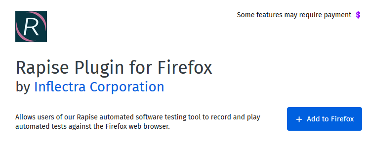
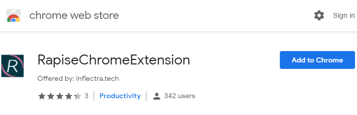

# Setting Up Web Browsers

Before you can use Rapise with certain web browsers to do web testing, you will need to install plugins so that Rapise can communicate with them.

## Internet Explorer

Unlike the other web browsers, there are actually no steps needed to configure IE. Once Rapise is installed, it is ready to connect to IE for recording, playback and learning without any configuration steps.

## Firefox

In order to test web applications using the Firefox web browser, you will need to install an extension for Firefox that allows Rapise to
interact with it:

1. Click the following URL to open the extension page in a new tab: <a href="https://addons.mozilla.org/en-US/firefox/addon/rapisefirefox/" target="_blank">https://addons.mozilla.org/en-US/firefox/addon/rapisefirefox/</a>

2. Click on the `Add to Firefox` button to install the Add-On into your instance of Firefox.

    

3. When installation is complete restart Firefox.

4. Firefox is ready to be used with Rapise for automated testing.

***Note:*** Rapise requires localhost port 4247 to be accessible for correct operation. Please, make sure that this port is unblocked in
your Firewall.

## Firefox For Rapise 6.5

Rapise 6.5 and higher requires you to update RapiseFirefox extension. Simply click the link below and update extension to the latest version.

<a href="https://addons.mozilla.org/en-US/firefox/addon/rapisefirefox/" target="_blank">https://addons.mozilla.org/en-US/firefox/addon/rapisefirefox/</a>

## Chrome

!!! important
    Chrome extension and `Chrome HTML` browser profile have been deprecated. The reason is that [Google is going to remove MV2 extensions from the store <sup>:fontawesome-solid-external-link-alt:{.small-icon}</sup>](https://developer.chrome.com/docs/extensions/mv3/mv2-sunset/){target="_blank"}. At Inflectra we decided not to migrate to MV3 extension format because it is unlikely possible due to security changes (primary reason of appearance of MV3). To make Chrome based testing possible we implemented [Selenium Based Recorder <sup>:fontawesome-solid-external-link-alt:{.small-icon}</sup>](https://www.inflectra.com/Ideas/Entry/spotlight-rapise-selenium-based-recording-chrome-1348.aspx){target="_blank"}. So please consider switching to [Selenium - Chrome](/Guide/selenium_webdriver/#recording-using-selenium) browser profile.

In order to test web applications using the Google Chrome browser, you will need to install an extension for Chrome that allows Rapise to
interact with it:

1. Click the following URL to open the extension page in a new tab: <a href="https://chrome.google.com/webstore/detail/rapisechromeextension/ibngcigigdlhaekbaknfbpcbgilmhahc" target="_blank">https://chrome.google.com/webstore/detail/rapisechromeextension/ibngcigigdlhaekbaknfbpcbgilmhahc</a>

    

2. Click on the ‘Add to Chrome’ button to install the Add-On into your instance of Chrome.

3. It is recommended to set the **Allow access to file URLs** and **Allow in incognito** checkboxes so that web pages opened from the local folder (using the file:// protocol) and in incognito Chrome windows can be also accessed by Rapise when running automated browser tests. To do this right click this link <a href="chrome://extensions/?id=ibngcigigdlhaekbaknfbpcbgilmhahc" target="_blank">chrome://extensions/?id=ibngcigigdlhaekbaknfbpcbgilmhahc</a> and choose `Copy link address`, then paste the value to a new tab in Chrome:
  
    

4. When installation is complete restart Chrome.

## Chrome For Rapise 6.5

Rapise 6.5 and higher requires you to update RapiseChrome extension. Simply click the link below and update extension to the latest version.

<a href="https://chrome.google.com/webstore/detail/rapisechromeextension/ibngcigigdlhaekbaknfbpcbgilmhahc" target="_blank">https://chrome.google.com/webstore/detail/rapisechromeextension/ibngcigigdlhaekbaknfbpcbgilmhahc</a>

## Chromium Applications

The Rapise extension installation procedure differs in the case of testing Chromium applications. Below are the recommended steps to enable automation for such applications:

1. Refer this [http://www.chromium.org/administrators/pre-installed-extensions](http://www.chromium.org/administrators/pre-installed-extensions) to install an extension for a Chromium application. Getting the ID of current version of the Chrome Extension is easy. Install it into a regular Chrome browser following the instructions above, and then check the information in Chrome by following this URL: [chrome://settings/extensionSettings](chrome://settings/extensionSettings)

2. Choose the **Chrome HTML** library in the **Select an Application for Record** dialog in Rapise when recording tests rather than **Auto**. The Rapise library auto-detection logic may fail because the executable name is not `chrome.exe`.

3. After following the steps below to modify the Windows registry, Rapise should be able to record and learn the application correctly.

    HKEY_LOCAL_MACHINE\SOFTWARE\Google\Chrome\Extensions\malnpehoofemabajdignefgdoppndaeb\path\
    
    TYPE: REG_SZ
    
    VALUE: "C:\path\to\your\RapiseChrome.crx"

    HKEY_LOCAL_MACHINE\SOFTWARE\Google\Chrome\Extensions\malnpehoofemabajdignefgdoppndaeb\version\
    
    TYPE: REG_SZ
    
    VALUE: "1.6.0"

4. For the playback to execute correctly you need to set the following line in the beginning of your `User.js` file:

```javascript
    g_browserExecutablePath='C:\\the\\path\\to\\chromium-based\\app.exe';
```

With that change in place, the recorded test should be able to play.

## Chrome Frame Applications

The following configuration enables testing of Chrome Frame applications by Rapise:

1. A ‘packed’ copy of the RapiseChrome.crx extension is provided with the Rapise installation. It can be located in the 
   
    `C:\\Program Files (x86)\\Inflectra\\Rapise\\Extensions\\Chrome`

    folder of your installation.

1. Enter the following data to the Windows registry:

    [HKEY_CURRENT_USER\Software\Google\ChromeFrame]

    "EnableGCFProtocol"=dword:00000001

    "IsDefaultRenderer"=dword:00000001

    "AllowUnsafeURLs"=dword:00000001

    [HKEY_LOCAL_MACHINE\SOFTWARE\Google\Chrome\Extensions\malnpehoofemabajdignefgdoppndaeb]

    "path"="c:\\\\path\\\\to\\\\RapiseChrome.crx"

    "version"="1.6.0"

2. In the Rapise **Select Application to Record** dialog box, explicitly choose the **Chrome HTML** library rather than using **Auto**.

3. Record the test script as you would normally. Note that there should be no Chrome browser or any Chrome applications running when IE with Chrome Frame is started and recording is being performed.

You will need to make some changes to the recorded test to ensure that it plays correctly. Insert this line in the beginning of the `User.js` file:

```javascript
g_browserExecutablePath="iexplore.exe";
```

Check to make sure you have Internet Explorer browser executable available at the specified path on your PC and correct it if necessary.

## Edge

In order to test web applications using the Microsoft Edge browser, you will need to install an extension for Edge that allows Rapise to
interact with it:

1. Right click the following URL and choose `Open link in new tab` to open the extension page: <a href="https://microsoftedge.microsoft.com/addons/detail/rapisemsedgeextension/ohghmiancfhdndeciiojhgalcfhllblh" target="_blank">https://microsoftedge.microsoft.com/addons/detail/rapisemsedgeextension/ohghmiancfhdndeciiojhgalcfhllblh</a>

2. Click on the ‘Get’ button to install the Add-On into your instance of Edge.

3. It is recommended to set the **Allow in InPrivate** and **Allow access to file URLs** checkboxes so that web pages opened from the local folder (using the file:// protocol) and in InPrivate Edge windows can be also accessed by Rapise when running automated browser tests. To do this right click this link <a href="edge://extensions/?id=ohghmiancfhdndeciiojhgalcfhllblh" target="_blank">edge://extensions/?id=ohghmiancfhdndeciiojhgalcfhllblh</a> and choose `Copy link`, then paste the value to a new tab in Edge.

4. When installation is complete restart Edge.

## Using Other Browsers with Rapise

If you would like to test your applications using **other web browsers (Safari or Opera)** you can use the [Selenium WebDriver](selenium_webdriver.md) libraries that are provided with Rapise. To [setup the Selenium web browser libraries](setting_up_selenium.md), please refer to [this topic](setting_up_selenium.md).
