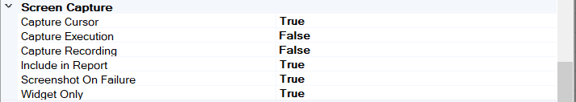

# Test Settings View

## Purpose

Use the Settings Dialog to change test-specific settings.

## How to Open

Use the `Test > Test Settings` [menu](menu_and_toolbars.md#Test) item to open the settings dialog window.

Another way is to choose the root node in the [file view](test_files_dialog.md) to see test settings in the [property](properties.md) view.

## Advanced

* **CommandLine** is a free-form text box. Use it to specify values for global variables (beginning with **g_**) that are passed to the [recorder](recording.md) and [player](playback.md). You can view which global variables are available in the source files (such as **Player.js**, **SeSCommon.js**, etc.).

* **EntryPoint** The JavaScript function name (`g_entryPointName` variable) used as a test entry point. Normally `Test`; however, it can be changed to execute a single scenario, for example: `MyScenario`.

* **WorkDir** Defines the test root directory (`%WORKDIR%` environment variable) relative to the test's folder.
  
    Usually, it is equal to `.` (the root test). For a sub-test, it is `../.`; for a sub-sub-test, it is `../../.`. This way, if you have a common scenario used across tests that refers to a data file using `%WORKDIR%\Data.xlsx`, then all sub-tests will be able to find it. This feature, together with the concept of [sub-tests](tests_and_sub_tests.md), helps to build test [frameworks](https://www.inflectra.com/support/knowledgebase/kb371.aspx).

* **CommandLine** is a free-form text box. Use it to specify values for global variables (beginning with **g_**) that are passed to the [recorder](recording.md) and [player](playback.md). You can view which global variables are available in the source files (such as **Player.js**, **SeSCommon.js**, etc.).

## TestParams

The TestParams section includes various custom test parameters:

Click to open the [TestParams Collection Editor Dialog](namevalue_collection_editor_di.md).

There is a built-in set of test parameters for [cross-browser testing](cross_browser_testing.md). When you open a test that uses one of the HTML libraries, it will display the following built-in test parameter that you can use to change the **playback browser**:

## Execution

* **CacheObjects**: Remembers object locations and attempts to reuse them for improved speed. This is helpful for dialog-based applications.
* **CommandInterval**: The time interval (in milliseconds) between script commands during script execution.
* **
* **IterationsCount**: Your test script will be executed this many times consecutively during [playback](playback.md).
* **JS Engine**: One of **Default**, **Node**, or **WScript**. **Default** means using the **JSEngineType** defined in the [Global Options](options_dialog.md#execution). Otherwise, use the [Node.js](jscript_language_reference.md) or [JScript/WScript](jscript_language_reference.md) engine, respectively.
* **ObjectLookupAttemptInterval**: The time Rapise will wait between attempts to locate an object.
* **ObjectLookupAttempts**: The number of times Rapise will attempt to locate an object.
* **Show Report**: Displays the report after execution. Default is **True**.
* **StopOnError**: Terminates script execution after the first error, so failing test cases fail more quickly. Default is **True**.

## Recording

* **BeautifySavedObjects**: Affects how the [Script Recorder](recording.md) writes object information to your test script.
  
    If **False**, the object definition will be written as a single line. If **True**, the object definition will be written in a manner that takes more space but is easier to read and modify.
    Objects learned in previous recordings are affected by the value of **BeautifySavedObjects**.

## Screen Capture

{width="570px"}

* **Capture Cursor**: Set this to **True** to include a cursor position marker on the captured screenshot.
* **Capture Execution**: Set this to **True** to save screen images after each `Do<Action>` during playback.
* **Capture Recording**: Set this to **True** to save screen images after each recorded action during recording.
* **Include in Report**: Set this to **True** to include saved images in the execution report during playback.
* **Screenshot on Failure**: Captures a desktop image if a test has just failed.
* **Widget Only**: Set this to **True** to save only the widget area in the screenshot, as opposed to the entire window.

## Settings

<!-- /* cSpell:disable */ -->
* **UserFunctionsPath**: The path (relative to the test directory) to the file containing user-defined functions used in this test. Normally, this file is named `User.js`.
* **ObjectsPath**: The path (relative to the test directory) to the file containing object tree information. This file contains the `saved_script_objects` structure with all object locators gathered during recording and learning. Normally, this file is named `Objects.js`.
* **ReportPath**: The path (relative to the test directory) to the test's report file. Normally, this file has the extension `.trp`, which stands for **T**est **R**eport.
* **ScriptPath**: The path (relative to the test directory) to the test script.
* **TestPath**: The path to the test definition file (`*.sstest`).
<!-- /* cSpell:enable */ -->