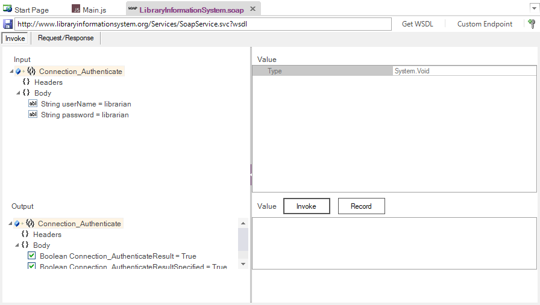

# SOAP Definition Editor

## Screenshot

## Purpose

The **SOAP Definition Editor** allows you to edit [SOAP web service](soap_web_services.md) definition files (`.soap`) that contain data downloaded from SOAP Web Service Definition Language (WSDL) URLs.

## How to Open

Use the [Add Web Service Dialog](dialog_add_web_service.md) to create a new SOAP definition (`.soap`) file.  The definition file will be opened in a **SOAP Editor** in the [Content View](content_view.md).

Or, you can double-click on an existing .soap file in the [Test Files View](test_files_dialog.md) explorer window.  The definition file will be opened in a **SOAP Editor** in the [Content View](content_view.md).  The [SOAP Toolbar](toolbar_soap.md) will also open.

## Invoke

The invoke tab lets you visually choose a specific SOAP operation and execute it. It has the following sections:

*   **Input** - You can expand the various SOAP operations and see the input headers and body parameters that need to be sent to the function. You can click on each parameter and supply a value on the right-hand pane.

*   **Output** - You can expand the various SOAP operations and see the output headers and result that should be returned from the operation (if successful). You can click on each header or the body and see the type of data returned.

*   `Invoke` - Once you have supplied the appropriate values, click the Invoke button send the SOAP request and get the data back from the request.

*   `Record` - Clicking this button after a successful invoke of the operation will add it to the list of recorded test scripts shown in the [SOAP Script Steps](#soap-script-steps) output tab.        

*   `Verify` - Clicking this button after the Record will add a `Tester.Assert(...)` [verification checkpoint](checkpoints.md) to the recorded test script. This will make Rapise automatically verify all of the returned values.

## Request / Response

This tab displays the raw SOAP XML request and response. When a SOAP operation fails, this is useful when debugging since it lets you see the raw data being sent to the web service:

Typically you will want to view this information in either **Raw** or **XML** modes since SOAP doesn't support JSON as a serialization format.

## Response

The HTTP Response in SOAP XML format is formatted and displayed in the bottom section:

This displays the output from the last web service request. It has several tabs:

*   **Response Header**
*   **Response Body**
*   **SOAP Script Steps**

### Response Header

Displays a list of the HTTP response headers (name and value). If the request received a 200 OK code back, it's displayed in green, if it receives an error code back, it's displayed in red.

###  Response Body

*   **Raw** - Displays the raw text of the HTTP response body received from the server.

*   **XML** - If the received body content is identified as XML, this tab displays nicely formatted XML that is easier to read than the raw response body.

### SOAP Script Steps 

The Script Steps tab lets you see the list of recorded SOAP operations and use them to create your [test script](scripting.md) in the main test file.

* **Create Script** - This takes all of the recorded steps and automatically creates the matching JavaScript code in your test script.

* **Remove Step** - This removes the recorded step from the script box

* **Clean** - This removes all of the recorded steps from the script box.

Each of the steps displayed in the script box will contain the name of the SOAP operation along with the specified parameters in JSON format. Steps displayed in **bold** with an asterisk also have a [verification point recorded](checkpoints.md). That means when the script is generated, it will include `Tester.Assert` functions to verify the results.

## Operation Explorer

This section lets you see all of the SOAP web service endpoints in the current WSDL file and view the individual operations.

## See Also

*   For more info on SOAP Web Services, see [SOAP Web Services](soap_web_services.md).

*   For a tutorial on creating a SOAP web service test, see the [Web Services SOAP Tutorial](tutorial_soap_web_services.md).

