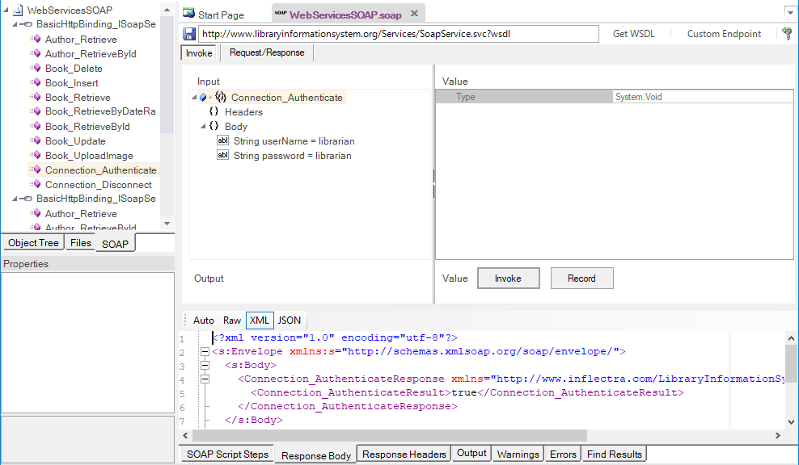
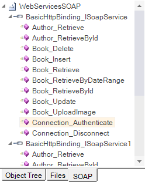
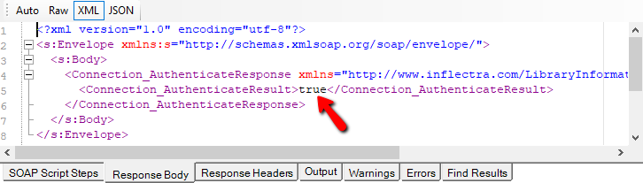
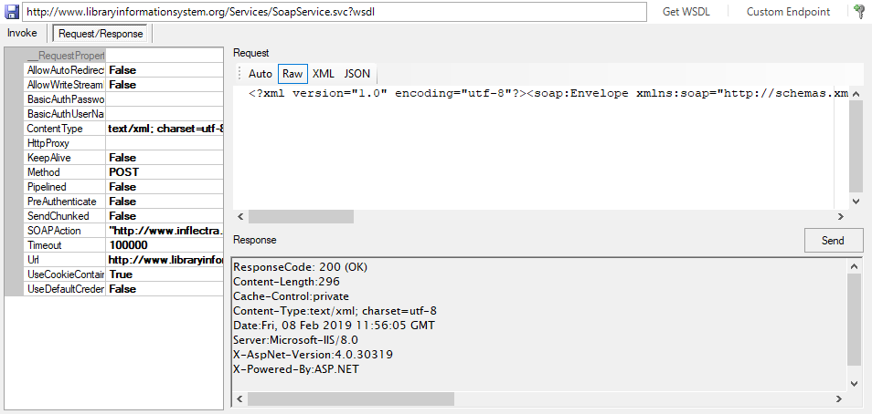
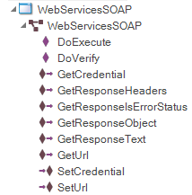
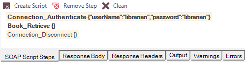

# Testing SOAP Web Services
<!-- /* cSpell:disable */ -->

## What is SOAP and what is a SOAP web service?

> SOAP is the **S**imple **O**bject **A**ccess **P**rotocol, and allows you to make API calls over HTTP/HTTPS using specially formatted XML. SOAP web services use the Web Service Definition Language (WSDL) and communicate using HTTP POST requests. They are essentially a serialization of RPC object calls into XML for transmission to the web service. The XML passed to the SOAP web service must match the format specified in the WSDL.
<!-- /* cSpell:enable */ -->
> SOAP web services are fully self-descriptive, so most clients do not directly interact with the raw SOAP XML, but instead use a client-side proxy generator that creates client-side object representations of the web service (e.g., Java, .NET objects). Web service consumers interact with these language-specific representations of the SOAP web service. However, when these SOAP calls fail, you need a way to test them that allows you to inspect the raw SOAP XML that was actually sent.

## How does Rapise test SOAP web services?

Creating a SOAP web service test in Rapise consists of the following steps:

1.  Using the [SOAP test studio](soap_definition_editor.md) to create the necessary SOAP web service test actions and verify that they return data in the expected format.

2.  Saving each of these SOAP API functions as Rapise-learned objects.

3.  Generating the [test script](scripting.md) in JavaScript that uses the Rapise-learned web service objects.

## Rapise SOAP Testing Studio

When you add a SOAP web service to your Rapise test project, you get a new SOAP definition file (`.soap`) that stores all test invocations for a specific SOAP web service:



The SOAP test studio (illustrated above) connects to the WSDL location specified in the **Endpoint** section of the [Toolbar](toolbar_soap.md):


When you enter the URL of your SOAP web service's WSDL file and click `Get WSDL`, Rapise downloads the WSDL file and displays the list of available methods in the SOAP explorer:



Clicking one of the available methods (e.g., **"Connection_Authenticate"**) displays that method in the main SOAP editor. Typically, you start by using the **Invoke** tab of the SOAP editor:


This is where you can tell Rapise to invoke the method, pass any required parameters, and view the response from the service.

If the SOAP method requires input parameters, they are displayed in the "Body" section of the Input as a tree view. You can expand the tree and enter the various values. In the example above, the login and password are passed as parameters.


When you click the `Invoke` button, Rapise sends the SOAP request to the API and displays the returned output in the Output section. In this case, the value "True" is returned, indicating successful authentication.



You can also click the **Request/Response** tab to view the raw SOAP XML that was sent to and from the server. This is very useful when debugging a service that is not working as expected.



## Web Service Object Recognition

Unlike the REST web service testing editor, each SOAP endpoint generates a single Rapise SOAP object in the object tree:


The `WebServicesSOAP` object maps to a corresponding `.soap` file in the Rapise project. Such an object can be used for all web service requests in that file:

```javascript
var WebServicesSOAP=SeS('WebServicesSOAP');
WebServicesSOAP.DoExecute('Connection_Authenticate', { "userName": "librarian", "password": "librarian"}, {} );
WebServicesSOAP.DoExecute('Book_Retrieve');
WebServicesSOAP.DoVerify('"Body.result.length" Response', "Body.result.length", 14);
WebServicesSOAP.DoExecute('Book_Insert', { "book": {   "Author": {"Name": ""}, "AuthorId": 2, "AuthorIdSpecified": true, "DateAddedIso": "2016-10-02T20:00:00", "Genre": {"Name": "" }, "GenreId": 3, "GenreIdSpecified": true,   "Id": 0,   "IdSpecified": false,   "IsOutOfPrint": false,   "IsOutOfPrintSpecified": false,   "Name": "A Christmas Carol" }} );
Log("Resp: "+WebServicesSOAP.RequestProperties.requestPayLoad);
```

In the example above, the `WebServicesSOAP` object is used with `DoExecute` and different SOAP methods passed as the first parameter (**"Connection_Authenticate"**, **"Book_Retrieve"**, **"Book_Insert"**).

## Generating Rapise SOAP Test Scripts

To save time, Rapise can generate the test script code automatically, eliminating the need for manual scripting. To do so, after verifying that a particular method works as expected, click the **Invoke** command. Then, click the `Record` button to record the step. If you want to verify the returned data, also click the `Verify` button. This generates the following:



The recorded steps are in **bold** type if they include a verification step, and are in normal type if they are simply invoked without verification. When you click the `Create Script` button, the following is generated:

```javascript
WebServicesSOAP.DoExecute('Connection_Authenticate', {"userName":"librarian","password":"librarian"});
Tester.Assert('Connection_Authenticate Response', WebServicesSOAP.GetResponseObject(), {"Body":{"Connection_AuthenticateResult":true,"Connection_AuthenticateResultSpecified":true},"Headers":{}});
WebServicesSOAP.DoExecute('Book\_Retrieve', {});
Tester.Assert('Book_Retrieve Response', WebServicesSOAP.GetResponseObject(), { ... });
WebServicesSOAP.DoExecute('Connection_Disconnect', {});
```

The script is always generated within the `Test()` function of the current `Main.js` file. The term *current* refers to the `Main.js` file of the test, test case, or Page Object/Module to which this `.soap` definition is associated.

In the case of a Page Object, you must cut the generated code from `Test()` and paste it into the corresponding `<PageObject>_DoAction` function.

## Playback of SOAP Tests

Once you create your SOAP web service tests, you can use the standard [Playback](playback.md) functionality in Rapise to execute your tests and display the report:
