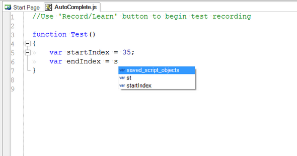

# Source Editor



## Purpose

To display and edit javascript files.  The editor supports [Syntax Highlighting](syntax_highlighting.md), [Syntax Checking](syntax_checking.md), [Code Folding](code_folding.md) and [Code Completion](code_helper.md).

## How to Open

Use the [Test Files View](test_files_dialog.md) to open a javascript file.  The javascript file will be opened in a **Source Editor**, in the [Content View](content_view.md).  The [Edit Popup](menu_and_toolbars.md) of the Main Menu will also be populated with text editor-specific options.

## Code Formatting

Since Rapise 8.1 it is possible to automatically format a JavaScript document:

1. Make the document active.
2. Use menu `Edit > Format Document`.

The formatting is performed via [js-beaitify](https://beautifier.io/). The default configuration is taken from the built-in file `C:\Program Files (x86)\Inflectra\Rapise\Engine\InstrumentJS\jsbeautify.config.json`.

You can apply custom formatting rules by saving a configuration into a file `jsbeautify.config.json`. To override formatting rules, you can either store jsbeautify.config.json in the root folder of your testing framework and save it together with your framework, or save it as `c:\Users\Public\Documents\Rapise\jsbeautify.config.json`. If you save it in this location, it will be applied for any formatted document (except those that have per-framework configuration).

## OnTextSaved.cmd

This feature enables post-processing of the saved text files. This may be achieved by defining a file `OnTextSaved.cmd`.

This file may be stored either common folder:

`c:\Users\Public\Documents\Rapise\OnTextSaved.cmd`

Or in the root of current [test framework](../Intro/framework.md).

The cmd file receives the following inputs

* `%1` - file path (c:\Path\To\Test\File.js)
* `%2` - test working directory (c:\Path\To\Test)

Also Rapise sets two environment variables:

* `%SHIFT_PRESSED%` is `yes` when user presses **Shift** key
* `%CONTROL_PRESSED%` is `yes` when user presses **Ctrl** key

You may find an example of configured `OnTextSaved.cmd` used to beautify a **JavaScript** file. 

If `.cmd` modifies the file, Rapise editor would immediately reload it.

If `.cmd` produces any output, it would be reflected in the Rapise [output view](output_view.md).

If `.cmd` file produces any errors, these are reflected in the [warnings view](warning_view.md).

You may find real live example of `OnTextSaved.cmd` at https://github.com/Inflectra/rapise-powerpack/tree/master/JSBeautify.

```cmd
if "%SHIFT_PRESSED%"=="yes" (
    if "%~x1"==".js" (
        @call "%~dp0node_modules\.bin\js-beautify.cmd" -r --config "%~dp0jsbeautify.config.json" %1 >OnTextSaved.log 2>&1
    )
)
```

## OnSave.cmd

This file enables additional post-processing of the saved text files. It follows same rules as `OnTextSaved.cmd`. For example, you may use it to add new files to Git and commit changes on save:

```
git add * >>gitadd.log
git commit -a -m "Autosave" >>gitcommit.log
```
