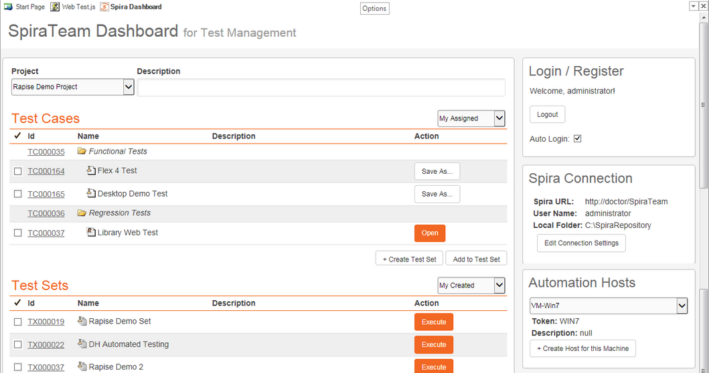
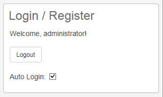
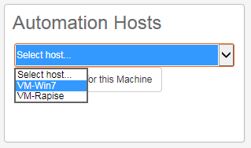
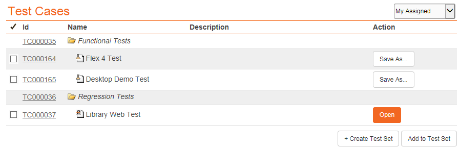
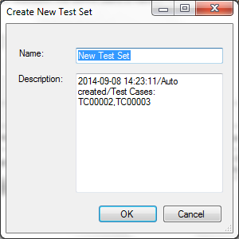
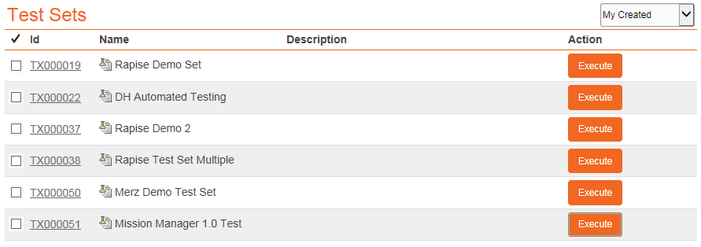

# Spira Dashboard

!!! important
	In Rapise 7 we've updated the dashboard. It now has all new look and features. [Learn more](spira_dashboard_2.md).

## Purpose

This page displays information from the SpiraTest or SpiraTeam server that this instance of Rapise is connected to. More details on using Rapise with either SpiraTest or SpiraTeam can be found in the separate **Using Rapise with SpiraTest Guide**. A copy of this guide should be in the `Start > Programs` menu created by the Rapise installer.

The dashboard displays information about the current Spira project, including the associated test cases, test sets and automation hosts:

A typical Spira dashboard will look like the following:

Each of the sections is explained separately below:

## Spira Login/Sign-Up

This section will display the name of the currently configured Spira user (if there is one) together with the option to either login to an existing Spira instance or to sign-up for a new one:

- **Login**: this will log you into the instance of Spira listed in the **Connection Info** section
- **Sign Up**: this link will take you to the Inflectra website where you can sign up for a Spira account.
- **Auto Login**: if you select this option, Rapise will automatically login to Spira when it first starts up.

Once you login to the instance of Spira, the widget will change to the following:

- **Logout**: this will log you out of the instance of Spira listed in the **Connection Info** section

## Connection Info

This section will display the URL, login and corresponding local repository folder for the current Spira instance (if one has been set).

To change the current connection (or to set one up if this is a new installation of Rapise), click on the **\[Edit Connection Settings\]** button. That will display the [Connection Settings](spiratest_integration.md) dialog box:

You can then change the current Spira connection using this dialog box. See the topic on [Spira Integration](spiratest_integration.md) for more details.

## Automation Hosts

This section will display a list of the **automation hosts** available in the currently selected Spira project:

An **automation host** is a notional computer that Spira uses to assign specific **test sets** to specific computers running Rapise. This allows you to schedule tests to run on different computers remotely. When you first connect to Spira, it will not know which automation host the current machine matches.

Using the dropdown list you can select one of the displayed automation hosts:

That will tell Rapise that this local computer is in fact this Spira automation host. Any test sets scheduled in Spira for this automation host will now be executed on this computer running Rapise.

If you don't see the current automation host listed, you can click on the **Create Host for this Machine** button to create a new automation host entry for the current computer:

This screen lets you enter a display name (Name), system name (Token) and long description for a new automation host that Rapise will create in the current Spira project. Click **\[OK\]** to confirm the new automation host.

## Test Cases

This section displays a list of **test cases** that are either created by the current Spira user or are assigned to the current Spira user:

Each test cases will be displayed with the ID, name and long description of the test case together with an icon that indicates the type of test case:

1.  - Manual test case that has no automation script attached.
2.  - Test case that has an existing Rapise test attached.
3.  - Test case that has a non-Rapise automation script attached.

Clicking on the hyperlink ID will open up the test case inside Spira in your web browser. For test cases that have a linked Rapise test, there will be an **Open** button available. Clicking on this button will open the test in Rapise. For test cases that do not have a linked Rapise test, there is the **Save As...** option that lets you save the current Rapise script against the test case.

In addition there are two other options available:

- **Create Test Set:** Clicking on this button will allow you to create a new **test set** inside Spira. It will display the following dialog box when you select at least one test case and click the button:

    

    Enter in the name of the test set you want to create and click \[OK\].

- **Add to Test Set:** When you select *at least one test case* and *one test set*, then click this button it will add the selected test cases to a specific test set.

## Test Sets

This section displays a list of **test set** that are either created by the current Spira user, are assigned to the current Spira user, or are assigned to the automation host that this instance of Rapise is installed on:

Each test set will be displayed with the ID, name and long description of the test set.
Clicking on the hyperlink ID will open up the test set inside Spira in your web browser. For test sets that are marked as **automated**, there will be an **Execute** button available. Clicking on this button will execute the test in **RapiseLauncher**. This is described in more detail in the [SpiraTest Integration](spiratest_integration.md) topic.
