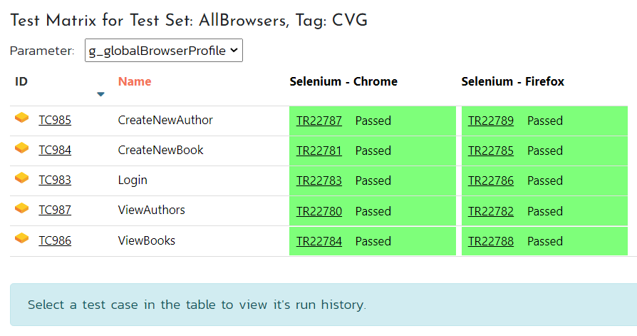
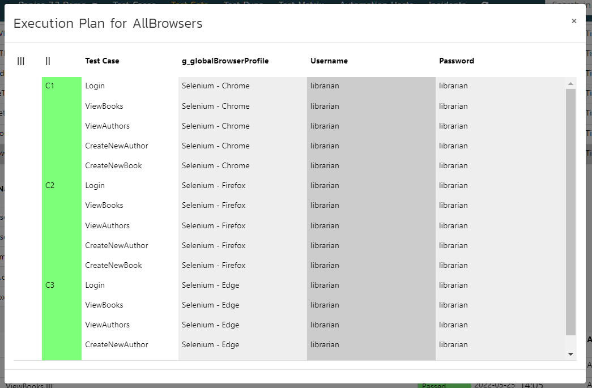
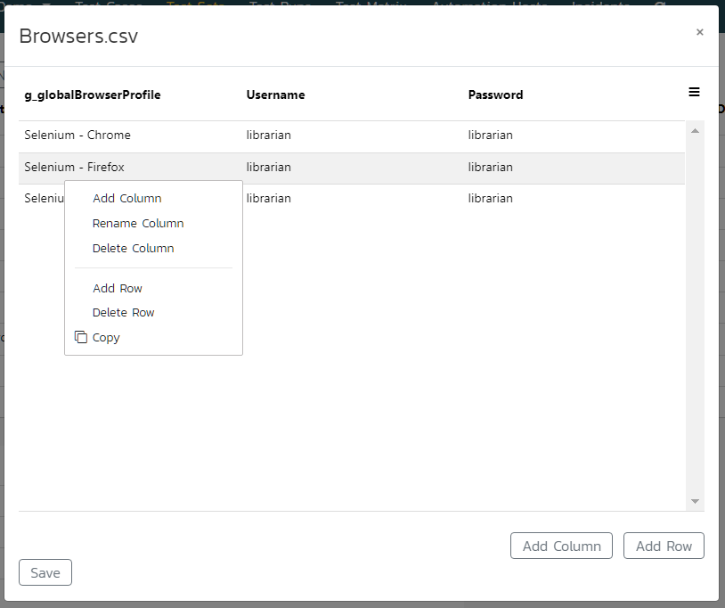
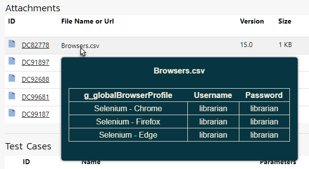
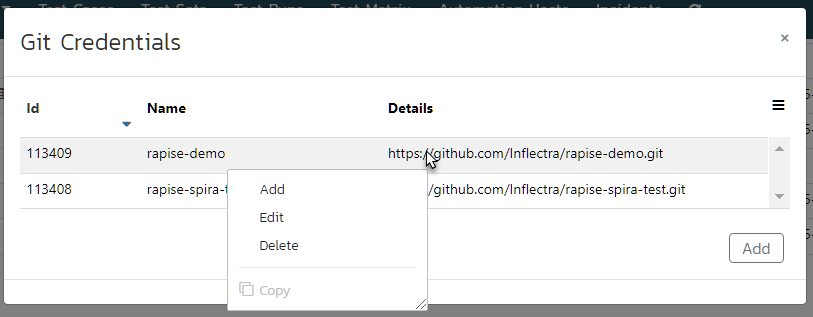
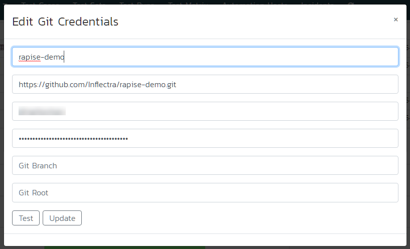
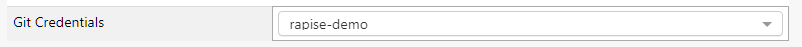
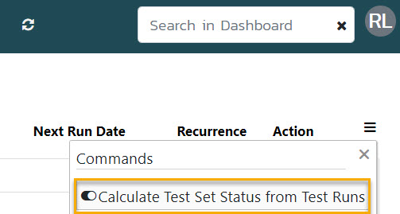

# Spira Dashboard

In Rapise 7 we completely reworked the Spira Dashboard. It has all new look and features. New dashboard reduces the need to open Spira in a browser window and also adds support for Flaky test handling, Rerun features and ability to run a test case/whole test set/or just failed test cases on a selected automation host.


## New Features

If you are not familiar with the dashboard and it's basic features it is recommended to review [Navigation](#navigation) and [Tasks](#tasks) sections first.

### Flaky Tests

!!! important
	To enable this feature setup custom properties as described [below](#setup-custom-properties).

If you see that some test may pass or fail randomly there is a way to mark it as Flaky. Simply find it in [Test Cases View](#test-cases-view) and use [Actions menu](#actions) to set the flag. Flaky test case is decorated with an icon (red flag):

 

When a test case marked as Flaky is executed - it's test run is marked as Flaky too.


!!! note
	Flaky flag makes it easier to distinguish random and important test run failures.

### Automatic Rerun

!!! important
	To enable this feature setup custom properties as described [below](#setup-custom-properties).

To instruct RapiseLauncher to rerun a failed test case use `Max rerun attempts` test set custom property. If a test case keeps failing it will be additionally executed specified number of times (by default it is zero). To stop rerunning tests if many of them finally failed use `Do not rerun if N tests failed` property. By default this property is zero and it means rerun all the tests in a test set if `Max rerun attempts` is set.


 
Test runs that correspond to reruns are decorated with icons. Number in a circle designates rerun attempt. 


### Parallel Execution

!!! important
	To enable this feature setup custom properties as described [below](#setup-custom-properties).

Since Rapise 7.1 - RapiseLauncher is able to perform parallel run for these types of tests:

1. Web tests configured to run with Selenium WebDriver,
2. Mobile tests,
3. REST/SOAP API tests.

In order to mark a test case ready for parallel run set the custom property `Ready for parallel run` in test case details.


If all test cases included into a test set have this property, the test set is configured for parallel run - RapiseLauncher will execute the test cases in parallel.

To configure the test set use the custom properties `Run tests in parallel` and `Max parallel tests` (0 - no limit).

Since Rapise 7.2 - RapiseLauncher can run configurations (see Input Data Table section below) in parallel. This feature is controlled via `Unroll input data for parallel execution` custom property of a test set. See the [Parallel Execution Webinar](https://youtu.be/bNoWZjOE3hQ) for more details.

### Input Data Table

!!! important
	To enable this feature setup custom properties as described [below](#setup-custom-properties).

Since Rapise 7.1 you may define a table with parameter values to automatically run same test set with different input data. It is an alternative to [test configurations](https://www.inflectra.com/ideas/Entry/spotlight-on-spiratest-53--data-driven-testing-wit-495.aspx).

1. Create a CSV or TXT file with parameter names and values. You may do it right from the dashboard (navigate to test set details and use Create New popup menu in the Attachments section). Example of the data file:

	```
	UserName,Password
	librarian,librarian
	borrower,borrower
	```

2. Choose this attachment in the `Input data` custom property.

RapiseLauncher will run the test set same number of times as data rows in the input file. Every column name will become a global parameter passed to a test case.

!!! note
    Besides attachments there is an option to use a file stored in the same Git repository as the testing framework. You may type a path to it in the `Input data` custom property. The path should contain `%GITROOT%` placeholder, e.g.:

    ```
    %GITROOT%\Data\Logins.xlsx
    ```

### Test Matrix

If a Test Set is configured to run same Test Cases several times (each time with different input parameters) then one may view the Test Matrix based on produced Test Runs. Let's look at the example. Assume that we have a test set of 5 test cases that we want to run on 2 different browsers. Browser type is specified via an input parameter (see Input Data Table section above for more details). Execution of the test set produces 4 x 2 = 10 test runs. After execution we find one of these test runs on the Test Runs page, right click it and choose `Test Matrix` menu item. Then we see the matrix:



If there are more than one input parameter - it is possible to select the one you need from the dropdown. Clicking on a test case reveals the history of test runs for it (clickable).

### Test Set Execution Plan

Since Rapise 7.3 you may view an execution plan for any test set. Navigate to Test Sets page in the dashboard, find the test set you need, expand Action menu for it (last column) and choose `Show Execution Plan...` menu item. Rapise will open a dialog with the execution plan for selected test set. In the execution plan you may see:

- Sequence of execution of test cases included into the test set
- Parameter values that will be passed to a test case by RapiseLauncher (all columns to the right of `Test Case` column)
- [Parallelism](#parallel-execution) level:
    - Sequential - all test cases are executed sequentially, all [configurations](#input-data-table) are executed sequentially too.
    - Parallel - all test cases are executed in parallel for each configuration, [configurations](#input-data-table) are executed sequentially. In this case second column || is colored with green.
    - Parallel configurations - all test cases and [configurations](#input-data-table) are executed in parallel. In this case first column ||| is colored with green.



### CSV Editor

Since Rapise 7.3 you may use convenient CSV editor to create and change Test Set attachments, especially those used as [Input Data Table](#input-data-table).



To view a CSV attachment there is no need to open it, just place mouse pointer over the attachment name:



### Git Credentials Storage

Since Rapise 7.3 it is possible to share Git credentials between test sets. If you used Rapise, SpiraTest and Git together then you know that it was necessary to provide Git credentials for each test set. Now you can create Git credentials records via the dashboard and reference them in test sets.

On the main dashboard page find `Git Credentials` button at the bottom and click on it. You will see the dialog with configured Git credentials. If you are doing it for the first time - the dialog will be empty.



In the dialog one can add, edit and remove credentials. A set of credentials looks like this:



When credentials are tested and saved it is time to navigate to a test set and choose the credentials in the `Git Credentials` dropdown.



## How to Open

To open the dashboard use [main menu](/Guide/menu_and_toolbars/#view) View > Spira Dashboard. If you wish Rapise to open the dashboard automatically on startup - open the [Rapise Settings](/Guide/options_dialog/#settings) dialog and set `ShowDashboardOnStartup` flag to `true`.

## Navigation

The dashboard contains top level menu to switch between views and a dropdown to switch between products/projects. There is also a button to refresh data and search field to filter data in the current view. Filtering is applied to a column with orange caption (usually `Name`).


### Data Tables

In many cases first column of a data table contains ID of an item in Spira. You may click an ID to open the corresponding item in a browser window.


Each data table has a menu opener (hamburger) located in the top right corner. The menu contains some predefined filters and also allows to reveal filter row and choose what columns to show (since Rapise 7.2 the list of columns to show is stored in the dashboard settings). Clicking a column caption turns on sorting.

### Hierarchical Tables

Plus icon in a table row means that it can be expanded. Click the icon to reveal row details. It may contain more data tables.


!!! note
	Since Rapise 7.1 you may use double click to expand/collapse row details. Double click anywhere on the row you want to expand/collapse.

### Tree View

Test cases and test sets may be placed into folders in Spira. The dashboard loads folder hierarchy. To navigate it click on folder icons.


!!! note
	Since Rapise 7.1 you may use double click to expand/collapse folders. Double click anywhere on the row with folder you want to expand/collapse.


### Actions

Some tables include `Action` column. It allows the user to perform certain actions on an item displayed in the row where `Action` menu is expanded.


## Tasks

Here is the list of tasks you may accomplish with the dashboard.

### Connect To Spira

If you did not connect Rapise to Spira yet, you will be prompted to enter the connection info.


To get your API Key follow [these steps](https://spiradoc.inflectra.com/HowTo-Guides/Users-profile-management/#how-to-get-or-make-your-rss-token-or-api-key).

### Assign Automation Host Token

If you did not assign an automation host token to the machine where Rapise is running you may do it in Automation Hosts view. You may even create a new host there.


### Dashboard View

#### Browse Framework Tests

The dashboard view shows tests included in the currently opened test framework (parent test and it's sub-tests).

!!! note
	Since Rapise 7.1 you may double click a test in this table to open it in Rapise.

!!! note
	Since Rapise 7.2 you may select tests using checkboxes in the first column and perform additional actions: 
	
	- create a test set from selected test cases, 
	- append selected test cases to existing test set
	- execute selected test cases on the local host
	- execute selected test cases on another automation host

	A test has a checkbox near it if it is linked to a test cases belonging to selected project.

#### View Test Set Status Graph

Requires Rapise 7.2. The Test Set Status graph shows the aggregated count of test cases in each execution status for each test set in the product. If you have the same test cases in multiple test sets they are all counted separately to make sure you can tell that tests have passed successfully across test sets. This is helpful when testing across different environments.

#### Setup Custom Properties

Some features of the dashboard require additional custom properties to exist in Test Cases, Test Sets and Test Runs. Click `Create Custom Properties for Rapise` button to add the following custom properties in the selected project:

- Test Cases
	- Flaky (boolean, default is false)
	- Ready for parallel run (boolean, default is false, requires Rapise 7.1+)
- Test Runs
	- Flaky (boolean, default is false)
	- Run attempt (integer, default is 1)
	- Tag (string, empty by default, requires Rapise 7.1+)
- Test Sets
	- Max rerun attempts (integer, default is 0)
	- Do not rerun if N tests failed (integer, default is 0)
	- Rerun test set if failed (boolean, default is false, requires Rapise 7.1+)
	- Run tests in parallel (boolean, default is false, requires Rapise 7.1+)
	- Max parallel tests (integer, default is 0 (no limit), requires Rapise 7.1+)
	- Unroll input data for parallel execution (boolean, default is false, requires Rapise 7.2+)
	- Input data (string, empty by default, requires Rapise 7.1+)
	- Record videos (boolean, default is false)
	- Verbose level (integer, default is 1)
	- [GitUrl, GitUser, GitPassword, GitBranch, GitRoot](/Guide/git_integration/#using-spira-custom-properties) (string, empty by default)
	- [Git Credentials](#git-credentials-storage) (dropdown value choice, requires Rapise 7.3)

Clicking the button more than once is safe. If a custom property exists - Rapise won't create a duplicate. To create the custom properties you will need to enter administrator credentials (user name and API Key).

#### Perform Test Actions

Action menu for a test allows to

1. Open the test in Rapise
2. Link the test to a test case in Spira
3. Execute the test (if linked to a test case) via RapiseLauncher on the local machine or a selected automation host. Requires Rapise 7.1+.

### Test Cases View

#### Browse Test Cases

In the test cases view one may see the tree of test cases for a project, discover when a test case was last executed and status of execution.

Since Rapise 7.2 one may change global Test Case filter from `All` to `My Assigned`.

#### View Test Case Details

Expanding a test case reveals last 10 runs of it. The details pane also shows test case parameters (editable, requires Rapise 7.1+) and custom properties (editable).

#### Perform Test Case Actions

Action menu for a test case allows to

1. Immediately `Execute` the test case on the local host.
2. `Execute` the test case on a selected Automation Host. It will run as soon as RapiseLauncher on that host is ready.
3. Mark the test case as `Flaky` or remove the flag. 
4. Add default parameters to the test case. The list of default parameters includes:
	- g_verboseLevel = 1
	- g_enableVideoRecording = false
5. `Open This Test` in Rapise. It is a shortcut for [Open a test from SpiraTest](/Guide/spiratest_integration/#opening-a-test-from-spiratest).

!!! note
	For execution of a test case on a selected automation host (#2) - Rapise will use a special test set with the name of the automation host.
	
#### Create New Test Case

If you want to create a test case in a specific folder - select corresponding row in the table, otherwise the test case will be created in the root folder. Click the `New Test Case` button at the bottom of the view and provide necessary details in the opened modal dialog.

### Test Sets View

#### Browse Test Sets

In the test sets view one may see the tree of test sets for a project, discover when a test set was last executed and status of execution.

Since Rapise 7.2 one may change global Test Set filter from `All` to `My Assigned`.

Since Rapise 7.3 it is possible to change the way of calculating test set execution status. If you are using [rerun](#automatic-rerun) features or include same test case multiple times into the same test set then it is recommended to set `Calculate Test Set Status from Test Runs` option:



If this option is not set then test set status is calculated based on the latest run for each included test case.

#### View Test Set Details

Expanding a test set reveals the list of included test cases. The details pane also shows test set parameters (editable, requires Rapise 7.1+) and custom properties (editable).

##### Add Test Cases

Press `Add Test Cases` to open the test cases tree, select test cases and append them to the test set.

##### Reorder Test Cases

Using hamburger icon next to a test case ID one may reorder test cases in a test set.

##### Test Case Actions

Use Action menu to 

1. Remove a test case from the test
2. Open a dialog to edit `Test Set Test Case` parameters (requires Rapise 7.1+)

#### Perform Test Set Actions

Action menu for a test set allows to

1. Immediately `Execute` the test set on the local host.
2. `Execute` the test set on a selected Automation Host. It will run as soon as RapiseLauncher on that host is ready.
3. `Rerun` just failed test cases on a selected Automation Host.
4. [Show Execution Plan](#test-set-execution-plan) for the test set.

!!! note
	For execution of a test set on a selected automation host (#2,#3) Rapise will use a special test set with the name of the automation host.

#### Create New Test Set

If you want to create a test set in a specific folder - select corresponding row in the table, otherwise the test set will be created in the root folder. Click the `New Test Set` button at the bottom of the view and provide necessary details in the opened modal dialog.

### Test Runs View

#### Browse Test Runs

This view shows most recent test run reports. One may see test run status and execution time and duration. If a test run is failed - Details column displays the first error message.

Since Rapise 7.1 to view just test runs of a specific test set run use `Tag` column popup menu `Filter by Tag`. If you run the test set with different configurations then configuration number is reflected in the tag name, e.g. QZH_`Config3`. If a test run corresponds to automatic rerun of a failed test set it has suffix `Rerun`, e.g. DCB_`Rerun`. First three letters of the tag name is a random string. generated for test set run by RapiseLauncher.

!!! important
	To enable `Filter by Tag` feature setup custom properties as described [below](#setup-custom-properties).


#### View Test Run Details

Expanding a test run reveals the report with execution status for every test step. The details pane also contains links to download test run attachments and execution log.

### Test Matrix View

Direct navigation to this page produces empty result. To see the Test Matrix navigate to the Test Runs view, right click Test Run tag and choose `Test Matrix` from popup menu.

### Automation Hosts View

This view displays automation hosts configured in selected project. You may create a new one using the form on this page.

### Incidents View

This view displays last 500 incidents and allows to create new ones.
