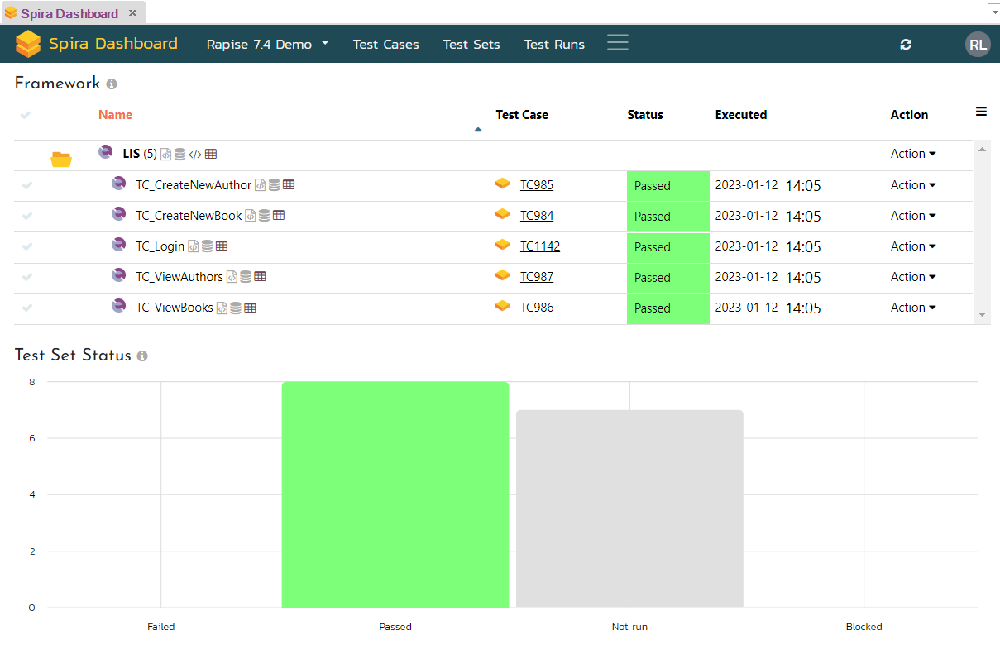

# Spira Dashboard

In Rapise 7, we completely reworked the Spira Dashboard. It features a completely new look and new features. The new dashboard reduces the need to open Spira in a browser window and also adds support for Flaky test handling, Rerun features, and the ability to run a test case, an entire test set, or only failed test cases on a selected automation host.

{width="967px"}

In Rapise 8, we added the [Framework mode](./Frameworks/frameworks.md) that has a different set of pages in the dashboard:

{width="1088px"}

## Features

If you are not familiar with the dashboard and its basic features, we recommend reviewing the [Navigation](#navigation) and [Tasks](#tasks) sections.

### Flaky Tests

!!! important
	To enable this feature, set up custom properties as described [below](#setup-custom-properties).

If you notice that a test passes or fails randomly, there is a way to mark it as Flaky. Simply find it in the [Test Cases View](#test-cases-view) and use the [Actions menu](#actions) to set the flag. A Flaky test case is decorated with an icon (red flag):

 

When a test case marked as Flaky is executed, its test run is also marked as Flaky.


!!! note
	The Flaky flag makes it easier to distinguish between random and important test run failures.

### Automatic Rerun

!!! important
	To enable this feature, set up custom properties as described [below](#setup-custom-properties).

To instruct RapiseLauncher to rerun a failed test case, use the {++Max rerun attempts++} test set custom property. If a test case continues to fail, it will be executed an additional specified number of times (by default, this is zero). To prevent rerunning tests if many of them eventually fail, use the {++Do not rerun if N tests failed++} property. By default, this property is zero, meaning that all tests in a test set will be rerun if {++Max rerun attempts++} is set.


 
Test runs that correspond to reruns are decorated with icons. The number in a circle designates the rerun attempt. 


### Parallel Execution

!!! important
	To enable this feature, set up custom properties as described [below](#setup-custom-properties).

Since Rapise 7.1, RapiseLauncher is able to perform parallel runs for these types of tests:

1. Web tests configured to run with Selenium WebDriver,
2. Mobile tests,
3. REST/SOAP API tests.

To mark a test case as ready for parallel execution, set the custom property {++Ready for parallel run++} in the test case details.


If all test cases included in a test set have this property, and the test set is configured for parallel execution, RapiseLauncher will execute the test cases in parallel.

To configure the test set, use the custom properties {++Run tests in parallel++} and {++Max parallel tests++} (where 0 means no limit).

Since Rapise 7.2, RapiseLauncher can run configurations (see the Input Data Table section below) in parallel. This feature is controlled via the {++Unroll input data for parallel execution++} custom property of a test set. See the [Parallel Execution Webinar](https://youtu.be/bNoWZjOE3hQ) for more details.

### Input Data Table

!!! important
	To enable this feature, set up custom properties as described [below](#setup-custom-properties).

Since Rapise 7.1, you may define a table with parameter values to automatically run the same test set with different input data. It is an alternative to [test configurations](https://www.inflectra.com/ideas/Entry/spotlight-on-spiratest-53--data-driven-testing-wit-495.aspx).

1. Create a CSV or TXT file with parameter names and values. You may do this directly from the dashboard (navigate to test set details and use the "Create New" popup menu in the Attachments section). Example of the data file:

	```title="Data.csv"
	UserName,Password
	librarian,librarian
	borrower,borrower
	```

2. Choose this attachment in the {++Input data++} custom property.

RapiseLauncher will run the test set the same number of times as there are data rows in the input file. Every column name will become a global parameter passed to the test case.

!!! note
    Besides attachments, there is an option to use a file stored in the same Git repository as the testing framework. You may type a path to it in the `Input data` custom property. The path should contain the `%GITROOT%` placeholder, for example:

    ```
    %GITROOT%\Data\Logins.xlsx
    ```

### Test Matrix

If a Test Set is configured to run the same Test Cases several times (each time with different input parameters), then you may view the Test Matrix based on the generated Test Runs. Let's look at an example. Assume that we have a test set of 5 test cases that we want to run on 2 different browsers. The browser type is specified via an input parameter (see the Input Data Table section above for more details). Execution of the test set produces 4 x 2 = 10 test runs. After execution, find one of these test runs on the Test Runs page, right-click it, and choose the `Test Matrix` menu item. Then we see the matrix:


If there is more than one input parameter, it is possible to select the one you need from the dropdown list. Clicking on a test case reveals its history of test runs (clickable).

### Test Set Execution Plan

Since Rapise 7.3, you may view an execution plan for any test set. Navigate to the Test Sets page in the dashboard, find the test set you need, expand the Action menu for it (in the last column), and choose the `Show Execution Plan...` menu item. Rapise will open a dialog with the execution plan for the selected test set. In the execution plan, you may see:

- The sequence of execution of test cases included in the test set
- Parameter values that will be passed to a test case by RapiseLauncher (all columns to the right of the `Test Case` column)
- The parallelism level:
    - Sequential - all test cases are executed sequentially, and all [configurations](#input-data-table) are also executed sequentially.
    - Parallel - all test cases are executed in parallel for each configuration, while [configurations](#input-data-table) are executed sequentially. In this case, the second column `||` is colored green.
    - Parallel configurations - all test cases and [configurations](#input-data-table) are executed in parallel. In this case, the first column `|||` is colored green.


### Test Set Scheduling

Since Rapise 7.4, you may schedule a test set directly from the dashboard. Navigate to the Test Sets page in the dashboard, find the test set you need, expand the Action menu for it (in the last column), and choose the `Schedule...` menu item. Rapise will open a dialog with scheduling options for the selected test set. In the dialog, you may specify:

- Date/time of execution
- Recurrence (One-Time, Daily, etc.)
- Automation Host


### Dynamic Test Sets

In Rapise 8.4, we added support for [Dynamic Test Sets](dynamic_test_sets.md), a powerful feature that lets you execute targeted tests based on specific criteria. Instead of manually selecting individual test cases, you can now define a test set using properties like name, tags, and parameters, similar to filtering in tools like Microsoft VSTest. This allows you to focus your testing efforts on particular scenarios, such as smoke tests or regression tests for a specific bug fix.

### CSV Editor

Since Rapise 7.3, you may use a convenient CSV editor to create and change Test Set attachments, especially those used as an [Input Data Table](#input-data-table).


To view a CSV attachment, there is no need to open it; just place your mouse pointer over the attachment name:


### Git Credentials Storage

Since Rapise 7.3, it is possible to share Git credentials between test sets. If you have used Rapise, SpiraTest, and Git together, then you know it was previously necessary to provide Git credentials for each test set. Now, you can create Git credentials records via the dashboard and reference them in test sets.

On the `Test Sets` page, find the `Git Credentials` button at the top and click on it.

!!! note
	In Rapise versions lower than 8.0, find the `Git Credentials` button at the bottom of the main dashboard page. 

You will see the dialog with configured Git credentials. If you are doing this for the first time, the dialog will be empty.


In the dialog, one can add, edit, and remove credentials. A set of credentials looks like this:


Once credentials are tested and saved, it is time to navigate to a test set and choose the credentials from the {++Git Credentials++} dropdown.


## How to Open

To open the dashboard, use the [main menu](menu_and_toolbars.md#view): View > Spira Dashboard. If you wish Rapise to open the dashboard automatically on startup, open the [Rapise Settings](options_dialog.md#settings) dialog and set the `ShowDashboardOnStartup` flag to `true`.

## Navigation

The dashboard contains a top-level menu to switch between views and a dropdown to switch between products/projects. There is also a button to refresh data and a search field to filter data in the current view. Filtering is applied to a column with an orange caption (usually `Name`).


### Data Tables

In many cases, the first column of a data table contains the ID of an item in Spira. You may click an ID to expand the corresponding item.

!!! note
	In Rapise 7.3 and older, clicking on an ID opens the corresponding item in a browser. To open an item in Rapise 7.4+, use the Action column menu (Open in Spira).  


Each data table has a menu opener (hamburger) located in the top-right corner. The menu contains some predefined filters and also allows you to reveal the filter row and choose which columns to show (since Rapise 7.2, the list of columns to show is stored in the dashboard settings). Clicking a column caption turns on sorting.

### Hierarchical Tables

Many tables in the dashboard are hierarchical; clicking on an item icon or item ID expands the corresponding row and reveals nested items or item details.

!!! note
	If you have Rapise 7.3 or older, use the `plus`/`minus` icons to expand/collapse.


!!! note
	Since Rapise 7.1, you may use a double-click to expand/collapse row details. Double-click anywhere on the row you want to expand/collapse.

### Tree View

Test cases and test sets may be placed into folders in Spira. The dashboard loads the folder hierarchy. To navigate it, click on the folder icons.


!!! note
	Since Rapise 7.1, you may use a double-click to expand/collapse folders. Double-click anywhere on the row with the folder you want to expand/collapse.

### Actions

Some tables include an `Action` column. It allows the user to perform certain actions on an item displayed in the row where the `Action` menu is expanded.


## Tasks

Here is a list of tasks you may accomplish with the dashboard.

### Connect To Spira

If you have not connected Rapise to Spira yet, you will be prompted to enter the connection information.


To get your API Key, follow [these steps](https://spiradoc.inflectra.com/HowTo-Guides/Users-profile-management/#how-to-get-or-make-your-rss-token-or-api-key).

### Assign Automation Host Token

If you have not assigned an automation host token to the machine where Rapise is running, you may do so in the Automation Hosts view. You may even create a new host there.


### Framework View (Rapise 8.0+)

The [Framework mode](./Frameworks/frameworks.md) was introduced in Rapise 8.0 to simplify test case and test set management, as well as the management of parameters, page objects/modules, object repositories, and shared code. The legacy [Single Test mode](../Intro/framework.md) required dealing with `Sub-Tests` and linking tests to `SpiraTest` on a per-test-case basis, whereas in the `Framework mode`, there is a single button labeled {==Sync with Spira==} that handles everything. When this button is pressed, test cases and test sets are automatically synchronized with `SpiraTest`, and files are uploaded/downloaded.

{width="1350px"}

#### Manage Test Sets

The `Framework view` has a dropdown with test sets defined in the current framework.

{width="494px"}

Use the `New Test Set` button (highlighted above) to create a new test set. Below the test set dropdown, find the controls related to the active/selected test set.


- 1 - dropdown with the names of [defined test set configurations](./Frameworks//parameters.md#configurations),
- 2 - test set description,
- 3 - `Action` menu,
- 4 - ID of the corresponding test set in `SpiraTest`.

The `Action` dropdown allows you to

{width="176px"}

- Immediately `Execute` the test set on the local machine via [RapiseLauncher](./spiratest_integration.md#using-rapiselauncher).
- `Schedule` the test set for later execution (one-time or recurrent).
- `Rename` the test set.
- `Delete` the test set.
- `Open` the test set `in Spira` (in the default browser).

#### Manage Test Cases

Below the test set controls, find the list of test cases in the current framework. You may switch between viewing all test cases

{width="739px"}

 or just those included in the active test set.

{width="737px"}

In the `All Test Cases` view, use checkboxes to include or remove a test case. In the `Included Test Cases` view, use hamburger icons to reorder test cases.

For every test case, there is also an `Action` dropdown that allows you to `Open in Spira` the corresponding test case. The IDs on the right side of the test cases table are the IDs of corresponding test cases in `SpiraTest`.

#### Sync with Spira

When making changes such as creating, renaming, or deleting a test set, including or removing test cases, or reordering test cases, these actions are performed locally; to update `SpiraTest`, use the `Sync with Spira` button.

{width="350px"}

Additionally, ensure you use this button after creating a new test case in the framework to make it available for inclusion in a test set.

!!! important
	The `Sync with Spira` button is a powerful tool that manages various tasks, including creating test cases and test sets in SpiraTest, establishing links to Rapise tests, and facilitating file upload and download operations.

	Explore these knowledge base topics to discover common usage scenarios:

	- [Rapise 8.0: development flow for Test Automation Framework in Single User Mode](https://www.inflectra.com/Support/KnowledgeBase/KB755.aspx)
	- [Rapise 8.0: development flow for Test Automation Framework in Team Mode](https://www.inflectra.com/Support/KnowledgeBase/KB756.aspx)
	- [Rapise 8.0: how to make a copy of a test automation framework](https://www.inflectra.com/Support/KnowledgeBase/KB753.aspx)

#### Execute Active Test Set

Use the `Execute` button to launch the selected test set on a local machine via [RapiseLauncher](./spiratest_integration.md#using-rapiselauncher).

{width="348px"}

### Parameters View (Rapise 8.0+)

Just like the [Framework View](#framework-view-rapise-80), this view is available in [new frameworks](./Frameworks/frameworks.md) created with Rapise 8.0+. It is used to manage framework parameters and configurations and is described [here](./Frameworks/parameters.md).

{width="802px"}

### Dashboard View (legacy)

!!! important
	This view is enabled for [legacy tests and frameworks](../Intro/framework.md) and is not available in the new [Framework mode](./Frameworks/frameworks.md). If you are dealing with a new framework created with Rapise 8.0+, a [Framework View](#framework-view-rapise-80) is displayed.

#### Browse Framework Tests

The dashboard view shows tests included in the currently opened test framework (parent test and its sub-tests).

!!! note
	Since Rapise 7.1, you may double-click a test in this table to open it in Rapise.

!!! note
	Since Rapise 7.2, you may select tests using checkboxes in the first column and perform additional actions: 
	
	- create a test set from the selected test cases, 
	- append selected test cases to an existing test set
	- execute selected test cases on the local host
	- execute selected test cases on another automation host

	A test has a checkbox near it if it is linked to test cases belonging to the selected project.

#### View Test Set Status Graph

Requires Rapise 7.2. The Test Set Status graph shows the aggregated count of test cases in each execution status for each test set in the product. If you have the same test cases in multiple test sets, they are all counted separately to ensure that tests have passed successfully across test sets. This is helpful when testing across different environments.

#### Setup Custom Properties

!!! important
	Since Rapise 8.0, custom properties are created from the [Test Runs view](#test-runs-view), because Rapise needs to create the properties for Test Runs only. Test Cases and Test Sets, since Rapise 8.0, store the properties in their description.

Click the `Create Custom Properties for Rapise` button to add the following custom properties to the selected project:

- Test Runs
	- Flaky (boolean, default is false)
	- Run attempt (integer, default is 1)
	- Tag (string, empty by default, requires Rapise 7.1+)
- Test Cases
	- Flaky (boolean, default is false)
	- Ready for parallel run (boolean, default is false, requires Rapise 7.1+)
- Test Sets
	- Max rerun attempts (integer, default is 0)
	- Do not rerun if N tests failed (integer, default is 0)
	- Rerun test set if failed (boolean, default is false, requires Rapise 7.1+)
	- Run tests in parallel (boolean, default is false, requires Rapise 7.1+)
	- Max parallel tests (integer, default is 0 (no limit), requires Rapise 7.1+)
	- Unroll input data for parallel execution (boolean, default is false, requires Rapise 7.2+)
	- Input data (string, empty by default, requires Rapise 7.1+)
	- Record videos (boolean, default is false)
	- Verbose level (integer, default is 1)
	- [GitUrl, GitUser, GitPassword, GitBranch, GitRoot](git_integration.md#using-spira-custom-properties) (string, empty by default)
	- [Git Credentials](#git-credentials-storage) (dropdown value choice, requires Rapise 7.3)

Clicking the button more than once is safe. If a custom property exists, Rapise won't create a duplicate. To create the custom properties, you will need to enter administrator credentials (username and API Key).

#### Perform Test Actions

The Action menu for a test allows you to

1. Open the test in Rapise
2. Link the test to a test case in Spira
3. Unlink the test from a test case in Spira 
4. Execute the test (if linked to a test case) via RapiseLauncher on the local machine or a selected automation host. Requires Rapise 7.1+.

### Test Cases View

#### Browse Test Cases

In the Test Cases view, you may see the tree of test cases for a project, discover when a test case was last executed, and its execution status.

Since Rapise 7.2, you may change the global Test Case filter from `All` to `My Assigned`. Rapise 8.0 adds one more filter: `Framework`.

#### View Test Case Details

Expanding a test case reveals its last 10 runs. The details pane also shows test case parameters (editable, requires Rapise 7.1+) and custom properties (editable).

#### Perform Test Case Actions

The Action menu for a test case allows you to

1. Immediately `Execute` the test case on the local host.
2. `Execute` the test case on a selected Automation Host. It will run as soon as RapiseLauncher on that host is ready.
3. Mark the test case as `Flaky` or remove the flag. 
4. Add default parameters to the test case (legacy; use Test Set level custom properties to control verbose and video recording). The list of default parameters includes:
	- g_verboseLevel = 1
	- g_enableVideoRecording = false
5. `Open This Test` in Rapise. It is a shortcut for [Open a test from SpiraTest](spiratest_integration.md/#opening-a-test-from-spiratest).
6. `Rename` a test case or a test case folder.
7. `Delete` a test case.
8. `Open in Spira` - opens the current item in a browser window.

!!! note
	For execution of a test case on a selected automation host (#2), Rapise will use a special test set with the name of the automation host.
	
#### Create New Test Case

If you want to create a test case in a specific folder, select the corresponding row in the table; otherwise, the test case will be created in the root folder. Click the `New Test Case` button at the bottom of the view and provide the necessary details in the opened modal dialog.

### Test Sets View

#### Browse Test Sets

In the Test Sets view, you may see the tree of test sets for a project, discover when a test set was last executed, and its execution status.

Since Rapise 7.2, you may change the global Test Set filter from `All` to `My Assigned`. Rapise 8.0 adds one more filter: `Framework`.

Since Rapise 7.3, it is possible to change the way test set execution status is calculated. If you are using [rerun](#automatic-rerun) features or include the same test case multiple times in the same test set, then it is recommended to set the `Calculate Test Set Status from Test Runs` option:

{width="335px"}

If this option is not set, then the test set status is calculated based on the latest run for each included test case.

#### View Test Set Details

Expanding a test set reveals the list of included test cases. The details pane also shows test set parameters (editable, requires Rapise 7.1+) and custom properties (editable).

##### Add Test Cases

Press `Add Test Cases` to open the test cases tree, select test cases, and append them to the test set.

##### Reorder Test Cases

Using the hamburger icon next to a test case ID, you may reorder test cases in a test set.

##### Test Case Actions

Use the Action menu to 

1. Remove a test case from the test set
2. Open a dialog to edit `Test Set Test Case` parameters (requires Rapise 7.1+)

#### Perform Test Set Actions

The Action menu for a test set allows you to

1. Immediately `Execute` the test set on the local host.
2. `Execute` the test set on a selected Automation Host. It will run as soon as RapiseLauncher on that host is ready.
3. `Rerun` just the failed test cases on a selected Automation Host.
4. [Schedule](#test-set-scheduling) the test set.
5. [Show Execution Plan](#test-set-execution-plan) for the test set.
6. `Rename` a test case or a test case folder.
7. `Delete` a test case.
8. `Open in Spira` - opens the current item in a browser window.

!!! note
	For execution of a test set on a selected automation host (#2, #3), Rapise will use a special test set with the name of the automation host. Since Rapise 8.1, there is a checkbox to allow execution of the original test set.

#### Create New Test Set

If you want to create a test set in a specific folder, select the corresponding row in the table; otherwise, the test set will be created in the root folder. Click the `New Test Set` button at the bottom of the view and provide the necessary details in the opened modal dialog.

### Test Runs View

#### Browse Test Runs

This view shows the most recent test run reports. You may see test run status, execution time, and duration. If a test run fails, the Details column displays the first error message.

Since Rapise 7.1, to view just test runs of a specific test set run, use the `Tag` column popup menu `Filter by Tag`. If you run the test set with different configurations, then the configuration number is reflected in the tag name, e.g., QZH_`Config3`. If a test run corresponds to an automatic rerun of a failed test set, it has the suffix `Rerun`, e.g., DCB_`Rerun`. The first three letters of the tag name are a random string generated for the test set run by RapiseLauncher.

!!! important
	To enable `Filter by Tag` feature, set up custom properties as described [below](#setup-custom-properties).

#### View Test Run Details

Expanding a test run reveals the report with execution status for every test step. The details pane also contains links to download test run attachments and the execution log.

### Test Matrix View

Direct navigation to this page produces an empty result. To see the Test Matrix, navigate to the Test Runs view, right-click a Test Run tag, and choose `Test Matrix` from the popup menu.

### Automation Hosts View

This view displays automation hosts configured in the selected project. You may create a new one using the form on this page.

### Incidents View

This view displays the last 500 incidents and allows you to create new ones.