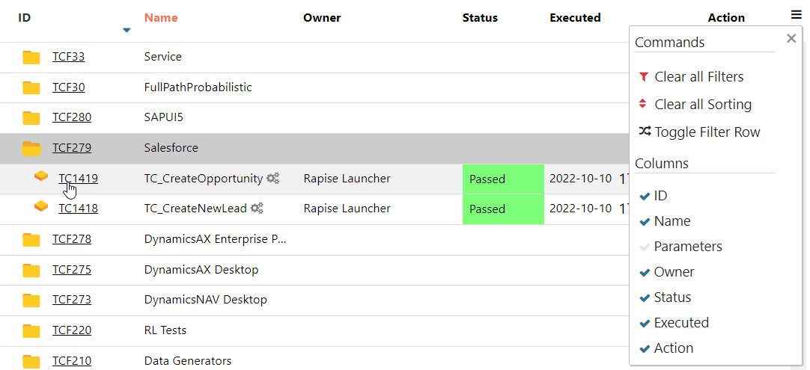

# Spira Dashboard

In Rapise 7 we completely reworked the Spira Dashboard. It has all new look and features. New dashboard reduces the need to open Spira in a browser window and also adds support for Flaky test handling, Rerun features and ability to run a test case/whole test set/or just failed test cases on a selected automation host.

## New Features

If you are not familiar with the dashboard and it's basic features it is recommended to review [Navigation](#navigation) and [Tasks](#tasks) sections first.

### Flaky Tests

If you see that some test may pass or fail randomly there is a way to mark it as Flaky. Simply find it in [Test Cases View](#test-cases-view) and use [Actions menu](#actions) to set the flag. Flaky test case is decorated with an icon (red flag):

 

When a test case marked as Flaky is executed - it's test run is marked as Flaky too.

!!! note
	Flaky flag makes it easier to distinguish random and important test run failures.

### Automatic Rerun

To instruct RapiseLauncher to rerun a failed test case use `Max rerun attempts` test set custom property. If a test case keeps failing it will be additionally executed specified number of times (by default it is zero). To stop rerunning tests if many of them finally failed use `Do not rerun if N tests failed` property. By default this property is zero and it means rerun all the tests in a test set if `Max rerun attempts` is set.

 
Test runs that correspond to reruns are decorated with icons. Number in a circle designates rerun attempt. 

## How to Open

To open the dashboard use [main menu](/Guide/menu_and_toolbars/#view) View > Spira Dashboard. If you wish Rapise to open the dashboard automatically on startup - open the [Rapise Settings](/Guide/options_dialog/#settings) dialog and set `ShowDashboardOnStartup` flag to `true`.

## Navigation

The dashboard contains top level menu to switch between views and a dropdown to switch between products/projects. There is also a button to refresh data and search field to filter data in the current view. Filtering is applied to a column with orange caption (usually `Name`).

### Data Tables

In many cases first column of a data table contains ID of an item in Spira. You may click an ID to open the corresponding item in a browser window.

Each data table has a menu opener (hamburger) located in the top right corner. The menu contains some predefined filters and also allows to reveal filter row and choose what columns to show. Clicking a column caption turns on sorting.

### Hierarchical Tables

Plus icon in a table row means that it can be expanded. Click the icon to reveal row details. It may contain more data tables.

### Tree View

Test cases and test sets may be placed into folders in Spira. The dashboard loads folder hierarchy. To navigate it click on folder icons.

### Actions

Some tables include `Action` column. It allows the user to perform certain actions on an item displayed in the row where `Action` menu is expanded.

## Tasks

Here is the list of tasks you may accomplish with the dashboard.

### Connect To Spira

If you did not connect Rapise to Spira yet, you will be prompted to enter the connection info.

To get your API Key follow [these steps](https://spiradoc.inflectra.com/HowTo-Guides/Users-profile-management/#how-to-get-or-make-your-rss-token-or-api-key).

### Assign Automation Host Token

If you did not assign an automation host token to the machine where Rapise is running you may do it in Automation Hosts view. You may even create a new host there.

### Dashboard View

#### Browse Framework Tests

The dashboard view shows tests included in the currently opened test framework (parent test and it's sub-tests).

#### View Test Runs in Progress

View test runs that are in progress right now.

#### View Pending Test Runs for This Host

View tests that are scheduled to run on the local host for the next 24 hours.

#### Setup Custom Properties

Some features of the dashboard require additional custom properties to exist in Test Cases, Test Sets and Test Runs. Click `Create Custom Properties for Rapise` button to add the following custom properties in the selected project:

- Test Cases
	- Flaky (boolean, default is false)
- Test Runs
	- Flaky (boolean, default is false)
	- Run attempt (integer, default is 1)
- Test Sets
	- Max rerun attempts (integer, default is 0)
	- Do not rerun if N tests failed (integer, default is 0)
	- Record videos (boolean, default is false)
	- Verbose level (integer, default is 1)
	- [GitUrl, GitUser, GitPassword](/Guide/git_integration/#using-spira-custom-properties) (string, empty by default)

Clicking the button more than once is safe. If a custom property exists - Rapise won't create a duplicate. To create the custom properties you will need to enter administrator credentials (user name and API Key).

#### Perform Test Actions

Action menu for a test allows to

1. Open the test in Rapise
2. Link the test to a test case in Spira

### Pending Test Runs View

This view displays scheduled test runs that must be executed within next 24 hours.

### Test Cases View

#### Browse Test Cases

In the test cases view one may see the tree of test cases for a project, discover when a test case was last executed and status of execution.

#### View Test Case Details

Expanding a test case reveals last 10 runs of it. The details pane also shows test case parameters and custom properties (editable).

#### Perform Test Case Actions

Action menu for a test case allows to

1. Immediately `Execute` the test case on the local host.
2. `Execute` the test case on a selected Automation Host. It will run as soon as RapiseLauncher on that host is ready.
3. Mark the test case as `Flaky` or remove the flag. 
4. Add default parameters to the test case. The list of default parameters includes:
	- g_verboseLevel = 1
	- g_enableVideoRecording = false

!!! note
	For execution of a test case on a selected automation host (#2) - Rapise will use a special test set with the name of the automation host.
	
#### Create New Test Case

If you want to create a test case in a specific folder - select corresponding row in the table, otherwise the test case will be created in the root folder. Click the `New Test Case` button at the bottom of the view and provide necessary details in the opened modal dialog.

### Test Sets View

#### Browse Test Sets

In the test sets view one may see the tree of test sets for a project, discover when a test set was last executed and status of execution.

#### View Test Set Details

Expanding a test set reveals the list of included test cases. The details pane also shows test set parameters and custom properties (editable).

##### Add Test Cases

Press `Add Test Cases` to open the test cases tree, select test cases and append them to the test set.

##### Reorder Test Cases

Using hamburger icon next to a test case ID one may reorder test cases in a test set.

#### Perform Test Set Actions

Action menu for a test set allows to

1. Immediately `Execute` the test set on the local host.
2. `Execute` the test set on a selected Automation Host. It will run as soon as RapiseLauncher on that host is ready.
3. `Rerun` just failed test cases on a selected Automation Host.

!!! note
	For execution of a test set on a selected automation host (#2,#3) Rapise will use a special test set with the name of the automation host.

#### Create New Test Set

If you want to create a test set in a specific folder - select corresponding row in the table, otherwise the test set will be created in the root folder. Click the `New Test Set` button at the bottom of the view and provide necessary details in the opened modal dialog.

### Test Runs View

#### Browse Test Runs

This view shows most recent test run reports. One may see test run status and execution time and duration. If a test run is failed - Details column displays the first error message.

#### View Test Run Details

Expanding a test run reveals the report with execution status for every test step. The details pane also contains links to download test run attachments and execution log.

### Incidents View

This view displays last 500 incidents and allows to create new ones.
