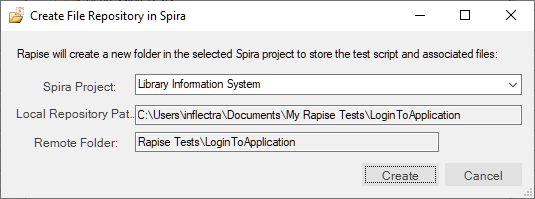
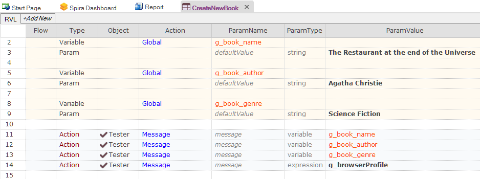
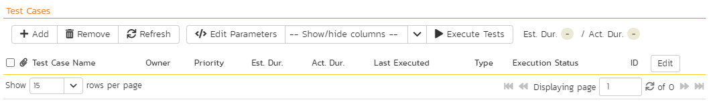
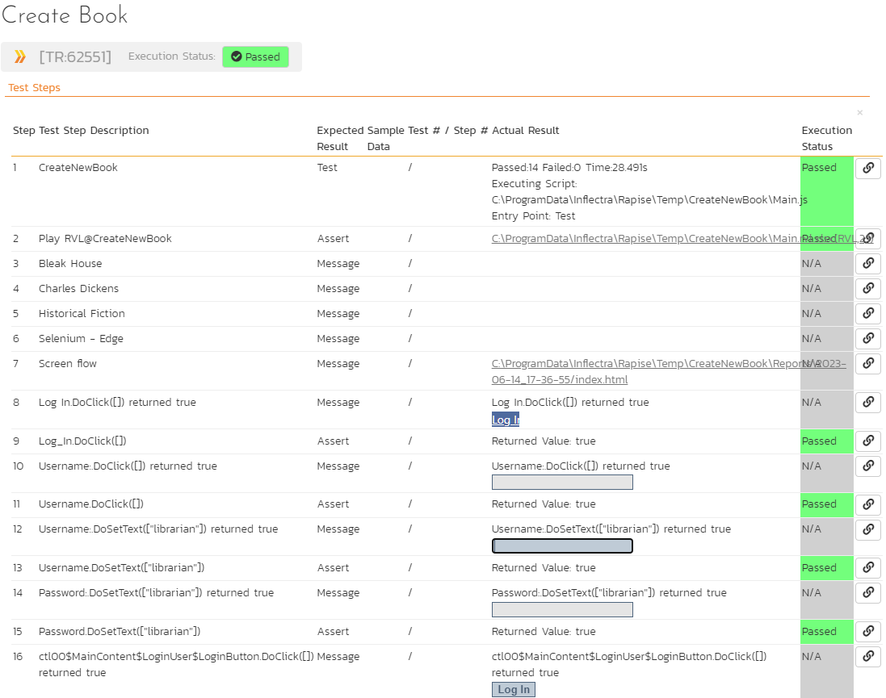
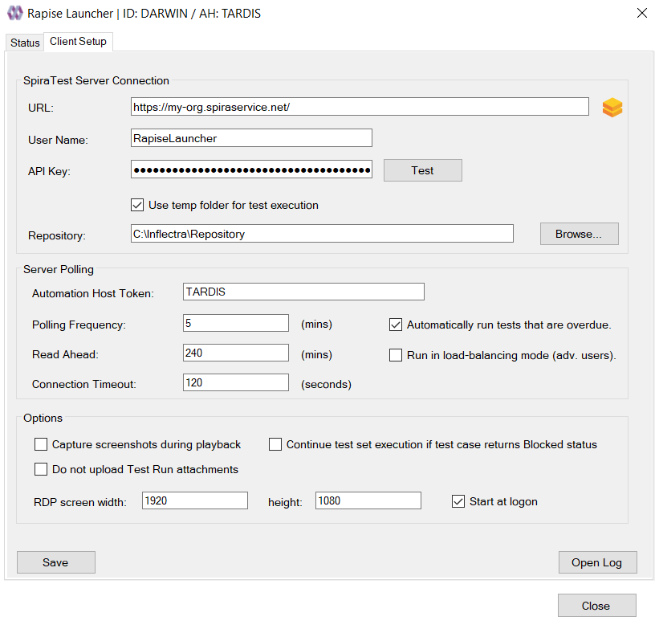

# SpiraTest Integration

!!! important
    The minimum supported version of Spira is 6.15.1.0.

## Overview

[SpiraTest](https://www.inflectra.com/SpiraTest/) is a web-based quality assurance and **test management system** with integrated release scheduling and defect tracking. It supports manual, exploratory, and automated tests, allowing you to record results and log any associated defects.

When you use SpiraTest with Rapise, you can store your Rapise automated tests within the central SpiraTest document repository with full version control and test scheduling capabilities:


You can record and create your test cases using Rapise, upload them to SpiraTest, and then schedule them for execution on multiple remote computers, either immediately or according to a predefined schedule. The results are then reported back to SpiraTest, where they are archived as part of the project. The test results can also be used to update requirements' **test coverage** and other key metrics in real-time.

Additionally, you can create exploratory manual tests, save them to SpiraTest, and then execute them from within Rapise. This gives you access to more powerful screen capture and annotation functionality than is available solely within SpiraTest.

!!! note
    [SpiraTeam](https://www.inflectra.com/SpiraTeam/) and [SpiraPlan](https://www.inflectra.com/SpiraPlan/) include **SpiraTest** as part of their functionality. Therefore, wherever **SpiraTest** is referenced in this section, it applies equally to **SpiraTeam** and **SpiraPlan**.

## Configuring SpiraTest

Before you can use SpiraTest to manage your Rapise automated tests, you must perform some initial configuration. This section assumes that you already have a working installation of SpiraTest or SpiraTeam v4.2 or later. If not, please refer to the [SpiraTest Installation and Administration Guide](https://spiradoc.inflectra.com/Spira-Administration-Guide/Installing-SpiraPlan/) for details about installing SpiraTest.

## Configuring the Rapise Automation Engine

Log in to SpiraTest as a system administrator, navigate to the SpiraTest main Administration page


and click the `Test Automation` link under **Integration**.


!!! important
    Depending on when you first installed SpiraTest, you may already have an entry for Rapise, as versions 3.2 and later of SpiraTest automatically include a default entry for Rapise.

If **Rapise** is missing from the list of automation engines, click the `Add` button to open the new test automation engine details page. The required fields are as follows:


- **Name**: This is the short display name of the automation engine. It can be anything that is meaningful to your users.
- **Description**: This is the long description of the automation engine. It can be anything that is meaningful to your users. (Optional)
- **Active**: If checked, the engine is active and available for use in any project.
- **Token**: This must be the unique token assigned to the automation engine and is used to specify which engine SpiraTest should use for a given test case. For Rapise, this should always be set to **Rapise**.

Once complete, click the `Insert` button, and you will be returned to the Automation Engine list page, with Rapise listed as an available automation engine:


## Connecting to SpiraTest

!!! important
    SpiraTest connection settings are shared between Rapise and [RapiseLauncher](#client-configuration).

First, you need to configure the connection to SpiraTest. Click the `Settings > SpiraTest` menu item:


This brings up the dialog box that allows you to configure the connection to SpiraTest:


### Credentials

Enter the following details:

- SpiraTest **URL**, e.g. https://my-company.spiraservice.net/
- **User Name**, the login name you use to access SpiraTest, or a dedicated account for running Rapise tests.
- **[API Key](https://spiradoc.inflectra.com/HowTo-Guides/Users-profile-management/#how-to-get-or-make-your-rss-token-or-api-key)**

and then click the `Test` button to verify that the connection information is correct.

!!! note
    If you are using Rapise 6 or older, use a password instead of the API key.

### Repository and Token

Additionally, enter the:

- **Default Repository Path**, the folder to use for local copies of SpiraTest repositories.

- **Token**, the identifier of the current machine on which Rapise is installed. It must match the `Token` name of the corresponding [Automation Host](https://spiradoc.inflectra.com/Spira-User-Manual/Automation-Host-Management/) in SpiraTest.

!!! note
    You must be running SpiraTest / SpiraTeam v4.0 or later to use the integration with Rapise.

### Artifact Permissions

To fully leverage Rapise & Spira integration, the user account requires the following [artifact permissions](https://spiradoc.inflectra.com/Spira-Administration-Guide/System-Users/#artifact-specific-permissions) in Spira:


If you want to use an existing product role, the Manager role is a good option. You can also create and customize [your own role](https://spiradoc.inflectra.com/Spira-Administration-Guide/System-Users/#view-edit-product-roles) if needed.

## Using the Spira Dashboard

!!! important
    If you are reading this guide for the first time, we recommend proceeding to the [next section](#creating-a-rapise-test-from-a-spiratest-test-case) and returning here after learning the basics. This section is most relevant when you plan to create a large set of tests for your application.

You can interact with SpiraTest using the [Spira Dashboard](spira_dashboard_2.md), available from the `View > Spira Dashboard` menu. This provides a convenient way of working with SpiraTest, allowing you to quickly create, save, and open test cases from SpiraTest.

### Frameworks

If you are just starting your test automation project and have Rapise 8.0+, we highly recommend using the new [Framework mode](./Frameworks/frameworks.md) and the new {==Sync with Spira==} [button](./spira_dashboard_2.md#framework-view-rapise-80) that handles everything: creation of test sets and test cases, as well as file uploading/downloading. The framework mode also has a simplified way of [handling parameters and configurations](./Frameworks/parameters.md).

## Creating a Rapise Test From a SpiraTest Test Case

!!! important
    In this section, we describe a simplified process to provide a basic understanding of SpiraTest integration. Once you are ready to start implementing a set of tests for your application, we recommend reviewing the [Frameworks section](#frameworks).

To create a new Rapise test linked to a SpiraTest test case, go to `File > Create New > New Test`. This will bring up the following dialog box:


1. Select the project that contains the test case. The list of test case folders will be displayed.

2. You can create a new folder by clicking the `New Folder` button

3. Expand the folders until you can see the desired test case:

    

Now, either create a new test case by using the `New Test Case` button or simply click a test case that you previously created in SpiraTest.


Once you are satisfied that this is the correct test case, choose the desired **methodology** (Basic, Manual-only, Mobile, or Web), choose a browser profile if it is a Web test, and choose a scripting mode (RVL or JavaScript). Rapise will now create a local test folder and files inside the [Default Repository Path](#repository-and-token) based on this Spira test case.

!!! important
    At this point, the new test is stored locally only. To put its files into SpiraTest, you must save it. See the next section.

## Saving a Test to SpiraTest

!!! important
    In this section, we describe a simplified process to provide a basic understanding of SpiraTest integration. Once you are ready to start implementing a set of tests for your application, we recommend reviewing the [Frameworks section](./Frameworks/frameworks.md) first.

You may need to save a test to SpiraTest in three cases:

1. You just created the test as described in the previous section.
2. You made changes to the test you saved to SpiraTest earlier.
3. You want to link an existing Rapise test (not yet saved to SpiraTest and not linked to a SpiraTest test case) to a test case in SpiraTest.

To save a Rapise test to SpiraTest, you must first ensure that the following has been set up:

1. You have a project created in SpiraTest in which to store the Rapise tests. The Rapise tests will be stored in a repository located within the **Planning > Documents** section of the project.
2. The user account you will be connecting to SpiraTest with has permissions to **create new document folders**.
3. You have created the Test Case in SpiraTest with which the Rapise test will be associated. This is important because without being associated with a SpiraTest Test Case, you will not be able to schedule and execute the tests using SpiraTest and [RapiseLauncher](#using-rapiselauncher).
4. You have [created an AutomationEngine in SpiraTest](#configuring-the-rapise-automation-engine) with the token name **Rapise**. This will be used to identify Rapise automation scripts within SpiraTest.

Once you have set up SpiraTest accordingly, click `File > Sync with Spira`.

If the test is not linked to a SpiraTest Test Case, it will bring up the `Save Test to Spira` dialog box:


First, choose the SpiraTest project from the dropdown list. This will update the list of test case folders displayed in the top pane of the dialog box.

Once you have chosen the desired project, expand the test case folders in SpiraTest and choose the existing Test Case to which you want to attach the Rapise test:


You can also create a new folder by clicking the `New Folder` button.

When you expand the folders to display the list of contained test cases, it will display the Name and ID of each test case together with an icon that indicates the type of test case:

1.  - Manual test case that has no automation script attached. (Repository Path will also be blank)
2.  - Test case that has an existing Rapise test attached.
3.  - Test case that has a non-Rapise automation script attached.

You can create a new test case by using the `New Test Case` button or simply click a test case that you previously created in Spira. Choose a test case that has icon type (1) and does not have an associated Repository Path.

!!! note
    Test cases with icon type (3) cannot be used with Rapise for adding or updating scripts.

Once you have chosen the appropriate test case, click the `Save` button. This will bring up the **Create File Repository in Spira** dialog box:



This dialog box will inform you where the Rapise script will be stored in SpiraTest and the location of the local repository directory used to store the `working copy` of the Rapise test. Click `Create` to confirm.


A dialog box will be displayed that lists all files in the local working directory and shows which will be checked in to SpiraTest. The system will filter out result and report files that should not be uploaded. You can change which files are filtered out, and also selectively include or exclude files. Once you are happy with the list of files being checked in, click the `OK` button:

Rapise will display a progress dialog while the files are being uploaded to the server:


If an error occurs during the save, a message box will be displayed; otherwise, the dialog box will simply close and a confirmation will appear.


## Loading a Test from SpiraTest

!!! important
    In this section, we describe a simplified process to provide a basic understanding of SpiraTest integration. Once you are ready to start implementing a set of tests for your application, we recommend reviewing the [Frameworks section](./Frameworks/frameworks.md) first.

!!! important
    If you have already loaded the test from SpiraTest and wish to update the local copy with changes saved to SpiraTest by a team member, then proceed to the [Synchronizing](#synchronizing) section.

To load a Rapise test from SpiraTest, you must first ensure that the following has been set up:

1. You have already configured the [connection to the SpiraTest service](#connecting-to-spiratest).
2. The user account you will be connecting to SpiraTest with has permission to view the project where the tests are stored.

Once you have set up SpiraTest accordingly, click the `File > Load from Spira` menu item.

This will bring up the `Load Test from Spira` dialog box:


First, choose the SpiraTest project from the dropdown list. Once selected, the system will display the list of test case folders in this project.

Once you have chosen the project, expand the test case folders in SpiraTest and choose the existing Test Case that you want to load:


When you expand the folders to display the list of contained test cases, it will display the Name, ID, and Repository Path for each test case that has an associated Rapise test.

!!! note
    Only test cases that have an attached/linked Rapise test script will be displayed in this view.

Note the `To Folder` edit field. By default, a test is loaded into the [Default Repository Path](#repository-and-token), but you can load a test into any folder (requires Rapise 8.0+).

Once you have chosen the appropriate test case, click the `Load` button to load the test case:


A dialog box will be displayed that lists all files on the server that will be downloaded from SpiraTest. You can change which files are to be downloaded. Once you are happy with the list of files being checked out, click the `OK` button:

The system will display a progress dialog while the files are being downloaded from the server.


If an error occurs during the download, a message box will be displayed; otherwise, the dialog box will simply close, and Rapise will open the loaded test.

### Loading a Clean Copy

If you have already loaded the test case on the machine, made modifications to the files, and want to re-download all files while discarding your local changes, simply check the `Get Clean Copy` checkbox before clicking the `OK` button. Requires Rapise 8.3+.

## Synchronizing

!!! important
    In this section, we describe a simplified process to provide a basic understanding of SpiraTest integration. Once you are ready to start implementing a set of tests for your application, we recommend reviewing the [Frameworks section](./Frameworks/frameworks.md) first.

When you have a Rapise test previously loaded from SpiraTest or saved to SpiraTest, continue to use `File > Sync with Spira` to upload local changes and/or download changes made by other team members. For example, suppose you have files modified locally and want to update them in the SpiraTest repository. When you initiate `Sync with Spira`, Rapise will show you which files have been modified locally and which have been modified in the SpiraTest repository. The synchronization dialog allows you to choose a desired action for each file: upload, download, or keep the local version intact (uncheck the file).


Since Rapise 8.0, it is possible to view differences between server and local file versions; note the `Diff...` buttons.

## Viewing the SpiraTest Properties of a Test

To see which SpiraTest **project** and **test case** the current Rapise test is associated with, choose `Test > Spira Properties` menu item. This will bring up the Spira Properties dialog box:


This will display the name of the current Rapise test together with the name of the SpiraTest project, test folder, and test case that this test is associated with.

If you would like to save the current Rapise test to a new SpiraTest project or save it against a new test case in the same project, you must first unlink the test. To do this, click the `Unlink from Test Case` button. This will instruct Rapise to remove the stored SpiraTest information from the `.sstest` file so that it can be associated with a new project and/or test case in SpiraTest.

!!! warning
    This operation cannot be undone, so please ensure you genuinely want to unlink the current test.

## Viewing the SpiraTest Repository

If you open the project in SpiraTest and click the `Planning > Documents` link, you will be directed to the central document repository that now includes your new Rapise test folders. Rapise tests are saved to `Root Folder > Rapise Tests`.


To see the different revisions of a file, simply click the hyperlink for a repository item, and a preview of the file is displayed:


If you click the `Versions` tab, the list of previous revisions will be displayed:


If you click the `Testing > Test Cases` tab and then click the test case that was previously created, you will see that its Automation information has been populated:


This shows you that the `Login to Application` test case is linked to the corresponding Rapise test stored in the SpiraTest document repository (in the `LoginToApplication` folder). You can click the `LoginToApplication.sstest` hyperlink, and it will automatically direct you to the corresponding `.sstest` file in the SpiraTest document repository:


## Using Parameterized Test Cases

!!! important
    This is a legacy approach to passing parameters. If you are just starting with Rapise, please follow this [guide](./Frameworks/parameters.md).

Often, you will have an automated test script that you want to run several times, using:

- Different browsers (e.g., Chrome, Edge, and Safari)
- Different test data

You can define the various test parameters for both these scenarios and have SpiraTest pass the values to the Rapise automated test. For example, in the Automation (or Test Steps) section of a test case (you can learn how to create one from this [tutorial](./tutorial_record_and_playback.md)), click the `Edit Parameters` link


and enter the following information:


We have defined four input parameters for this test case:

- **g_book_author** - the name of the author for the new book being created.
- **g_book_genre** - the name of the genre for the new book being created.
- **g_book_name** - the title/name of the new book being created.
- **g_browserLibrary** - the name of the [browser profile](./selenium_settings_dialog.md) to use to run the test. The name of this parameter is reserved, whereas the first three can be customized.

For these parameters to affect the Rapise test, you must ensure that the Rapise test is expecting these variables and knows how to handle them. Conventionally, in Rapise, all **global variables** are prefixed with `g_`, which is why we have similarly named the SpiraTest parameters.

If your test is implemented in RVL, you may define these variables directly in the RVL sheet using [Global Variables](../RVL/Variables.md#assigning). There is no need to define `g_browserLibrary` because it is built-in. Note that to print this parameter value, we use `g_browserProfile`.



In JavaScript mode, declare parameters in `Main.js` as follows:

```javascript
function TestInit()
{
	// Input variables - allows to configure parameters in SpiraTest.
	// Provide backup values if not defined.
	if ('undefined' == typeof(g_book_name))
	{
		g_book_name = 'The Restaurant at the end of the Universe';
	}
	
	if ('undefined' == typeof(g_book_author))
	{
		g_book_author = 'Agatha Christie';
	}
	
	if ('undefined' == typeof(g_book_genre))
	{
		g_book_genre = 'Science Fiction';
	}
}

function Test(params)
{
	Tester.Message(g_book_name);
	Tester.Message(g_book_author);
	Tester.Message(g_book_genre);
	Tester.Message(g_browserProfile);
	
	// test steps
}

g_load_libraries=["Web"]
```

This code will check if the variables are provided by SpiraTest, and if not, it will use default values. This is useful when you want to run the test directly from Rapise and from SpiraTest without having to make changes to the test script.

These global variables (`g_book_name`, `g_book_author`, `g_book_genre`) can now be used in the Rapise test script at the appropriate points in the playback.

!!! note
    Parameters in Rapise and SpiraTest are case-sensitive, so make sure that your parameter names in SpiraTest match those in Rapise exactly, including case sensitivity.

## Scheduling the Tests

Now that we have our Rapise automated test uploaded to SpiraTest and associated with a test case, we can schedule the test for execution. First, we need to set up the list of automation hosts.

### Configuring the Automation Hosts

When you execute Rapise automated tests from SpiraTest, you can specify the computer(s) on which they will be executed. We refer to these computers as **automation hosts**. Each automation host must have a copy of Rapise installed.

Go to `Testing > Automation Hosts` in SpiraTest to display the list of automation hosts:


Make sure that you have created an Automation Host for each computer that will run an automated test case. The name and description can be set to anything meaningful, but the Token field must be set to a [unique name for each computer](#repository-and-token).

Once you have at least one Automation Host configured, we next need to create the test sets that will be scheduled for execution on these hosts.

### Creating and Scheduling the Test Sets

Inside SpiraTest, click `Testing > Test Sets` to display the list of existing test sets:


Now, click **New Test Set** to create a new test set that will contain our automated test case:


!!! note
    Unlike manual test cases, automated test cases must be executed within a test set; they cannot be executed directly from the test case.

Now, click the hyperlink of our new test set to display the test set details page:


Scroll down to the **Test Cases** section:



First, click the `Add` button in the **Test Cases** tab to bring up the dialog box that allows us to add new test cases to the set:


Click `Root` to expand the tree of folders and choose a folder:


Choose [the parameterized test case](#using-parameterized-test-cases) and click the `Save` button.


The test case will now be added to the set. Perform the same action again to have separate instances of our parameterized test case:


Since this example includes parameterized test cases within the automated test set, we need to set their values by right-clicking each test case in turn and choosing `Edit Parameters`:


Enter the parameter values and click `Save` to commit the change. This allows you to have the same test case in the test set multiple times with different data for each instance of the test case.


Now that we have the test case added to the set, we need to schedule the test set for execution by filling in the following fields:


- **Automation Host** - the name of the automation host that will be running the automated test set.
- **Planned Date** - the date and time that you want the scenario to begin. Note that multiple test sets scheduled at the exact same time will be executed according to Test Set ID order.
- **Status** - this must be set to **Not Started** for RapiseLauncher to pick up the scheduled test set. When you change the Planned Date, the status automatically switches back to **Not Started**.
- **Type** - this must be set to **Automated** for automated testing.

### Executing the Test Sets

Once you have set the various test set fields (as described above), the RapiseLauncher instance running on the assigned automation host will periodically poll SpiraTest for new test sets. Once it retrieves the new test set, it will add it to its list of test sets to be executed. Once execution begins, it will change the status of the test set to **In Progress**, and once test execution is complete, the status of the test set will change to either **Completed** (the automation engine has been launched and the test has completed); or **Blocked** (RapiseLauncher was not able to execute the automated test).

If you want to immediately execute the test case on your local computer, instead of setting the **Automation Host**, **Status**, and **Planned Date** fields, you can click the `Execute` icon for the test set itself. This will cause RapiseLauncher on the local computer to immediately start executing the current test set.

In either case, once all test cases in the test set have been completed, the status of the test set will switch to **Completed**, and the individual test cases in the set will display a status based on the results of the Rapise test:

- **Passed** - the Rapise automated test ran successfully, and all test conditions in the test script passed.
- **Failed** - the Rapise automated test ran successfully, but at least one test condition in the test script failed.
- **Blocked** - the Rapise automated test did not run successfully.

If you receive the **Blocked** status for either the test set or the test cases, you should examine the [test run](https://spiradoc.inflectra.com/Spira-User-Manual/Test-Run-Management/) details in SpiraTest to determine the reason.

!!! note
    While the tests are executing, you may see browser or application windows launch as Rapise executes the appropriate tests.

Once the tests have completed, you can log back in to SpiraTest and see the execution status of your test sets:


If you click a Test Run in that test set, you will see the following information:


If you have configured RapiseLauncher to capture screenshots during execution, they will be embedded in the report:



So, you now have a complete record of the automated test execution in SpiraTest, with the execution status of the appropriate test case and test steps updated, and a complete log of the testing activities.

The Attachments tab of a test run contains all screenshots, the original report, and log files:


#### Block Execution

!!! note
    This feature requires Rapise 6.6+.

If you have a test set that contains several test cases, and if the failure of one test case makes further execution of the test set undesirable, you can achieve this by returning exit code `-99` from the failed test. This can be done via the `WScript.Quit(-99)` statement.

## Using RapiseLauncher

**RapiseLauncher** is a separate application that installs with Rapise. It allows you to remotely schedule automated tests in SpiraTest, and allows RapiseLauncher to automatically invoke the tests according to the schedule.

### Configuring RapiseLauncher

RapiseLauncher is installed alongside the main Rapise application. You can launch it from Rapise using the [main menu](./menu_and_toolbars.md#tools) `Tools > Rapise Launcher`.

It can also be found in the `Start > Programs > Inflectra` program folder:


### Basic Unattended Operation

When launched, the program will start minimized to the system tray and begin polling the server. Polling will occur every 'x' minutes (5 minutes by default) for any automated test sets that are scheduled for execution. When it is time for a test to be launched, it will start Rapise to execute the test. Rapise will then perform the test activities and report the results back to SpiraTest.

At the end of the test, the program will return to scanning for tests that need execution. Typically (unless there is a bug in the test or the application being tested), no user input is ever needed from the application itself.

### Client Configuration

!!! important
    SpiraTest connection settings are shared between [Rapise](#connecting-to-spiratest) and RapiseLauncher.

By right-clicking the system tray icon and selecting `Configuration`, the application's window will open to the configuration panel.

{width="658px"}

The panel has the following options:

#### SpiraTest Server Connection

- **URL** - the URL of the SpiraTest installation. Do not include `/Login.aspx` or any other page in the string; this should be just the root URL of the application's installation.
- **User Name** - the SpiraTest login ID of the user under whom you want the test results reported. Note that while the application is polling and updating test results, if the user is logged in to a web browser session, they will be logged out.
- **API Key**- the [API Key](https://spiradoc.inflectra.com/HowTo-Guides/Users-profile-management/?_ga=2.209824854.2141741329.1643112840-308801923.1641378277#how-to-get-or-make-your-rss-token-or-api-key) for the User Name above.
- **Test** - Clicking this will test the login to ensure the application can connect to the server properly.
- **Repository** - This is the Windows folder for storing local copies of tests to execute. It is applicable when the subsequent option is unchecked.
- **Use Temp Folder for Test Execution** - This is the default and recommended option. The Temp folder is located in `C:\ProgramData\Inflectra\Rapise\Temp`.

#### Server Polling

- **Automation Host Token** - This field is required and uniquely identifies the local testing machine. Any scheduled tests assigned to the Automation Host in SpiraTest will be polled for by this machine. Except in special circumstances, this ID must be unique among all testing machines.

    !!! important
		This field must match the string that is entered in the Automation Host Details screen in the **Token** field, or scheduled tests will not be recognized.

- **Polling Frequency** - The frequency in minutes at which the application will poll the SpiraTest server for updates to the automation host's schedule. The default is 5 minutes and should be sufficient for most installations. Note that tests will still be executed at their scheduled time; this simply determines how often the program communicates with the SpiraTest server to detect schedule changes. Updating the polling frequency will reset the currently running timers.
- **Read Ahead** - How far in advance (in minutes) the program should read the schedule for the Automation host. Tests that are scheduled further in advance will not appear as a pending test on the status screen.
- **Connection Timeout** - A request to Spira is considered failed after the specified time. Requires Rapise 8.1+. <a class="headerlink" href="#connection-timeout" title="Permanent link">¶</a>
- **Automatically run tests that are overdue** - When this is checked, any tests pulled from the SpiraTest server that have a scheduled date in the past will be marked as Overdue. Normally, overdue tests will not be executed. With this option enabled, they will be executed as soon as the poll is complete.
- **Run in load-balancing mode (adv. users)** - When this is checked, test sets are executed in [load balancing mode](#load-balancing-mode).

#### Options

- **Capture screenshots during playback** - Selecting this option instructs RapiseLauncher to capture screenshots of the objects being recognized during testing and upload them to SpiraTest upon completion of the execution. The screenshots will then be linked to the test run within SpiraTest.
- **Continue test set execution if test case returns Blocked status** - By default, a Blocked test case stops the execution of a test set. Check this option to run all test cases regardless of status. This option requires Rapise 7.3+
- **Do not upload Test Run attachments** - If this option is set, RapiseLauncher does not upload screenshots and log files to SpiraTest to conserve database space. Use this option in exceptional cases, such as when your SpiraTest instance is running out of space. Requires Rapise 8.0+.
- **RDP screen width & height** - When an RDP session is disconnected via the [RapiseLauncher tray icon menu](#tray-icon-menu), the screen resolution is set to the specified width and height.
- **Start at logon** -- Check this option to have Windows automatically launch RapiseLauncher at user logon. This is useful when your server is rebooted regularly. This option requires Rapise 6.3+

Since Rapise 7.2, you can use the `Open Log` button to quickly open the RapiseLauncher log in the default text viewer.

### Status Screen

The status screen is usually hidden but can be brought up for display by double-clicking the system tray icon:


The top of the screen shows the current status, indicating whether it's running a test or waiting to poll the server for an update. It will also show any errors present in the application, such as a registration error or configuration issue. Below the status bar is a list of any pending or executing tests that are scheduled for this testing machine. The list is cleared at every poll, so tests that have executed since the previous poll will still be on the list and show their execution status:

- **Green Arrow** - A green arrow indicates that the test is still running, or RapiseLauncher is waiting for a reply from Rapise.
- **Blue Checkbox** - A blue checkbox indicates that the test is completed, regardless of the status of the individual test steps in the scheduled test set.
- **Red Error** - A red error indicator indicates that Rapise encountered an issue (outside of test results). In this case, any further tests will be marked as blocked, as the issue must be corrected within Rapise or the Rapise test script.
- **No Indication** - No indication means that the test is currently awaiting its scheduled start date. Note that only one test will be launched at a time, so if two tests are scheduled at the same time, the one with the lower TestSet ID will be executed first, and as soon as it is finished, the second scheduled test will be run.

#### Buttons

By highlighting a test that has not been executed yet, you can click the `Force Execute` button. This will cause the selected test to have its scheduled date set to the current time, leading to its immediate execution (or, if another test is already running, placing it next in line for execution).

At any time, the `Force Poll` button can be clicked, causing RapiseLauncher to initiate an immediate poll of the SpiraTest server to check for pending runs. The timers for the next server poll will be reset when the button is clicked.

To stop the execution of a running Test Set, select it in the list and click the `Cancel Execution` button.

### Tray Icon Menu

Instead of operating from the application window, all functions are available from the tray icon menu, along with some additional commands:


- **Pause / Resume** - The Pause/Resume option pauses or resumes the timers for polling and executing tests. If a test or server poll is already in progress, it will not cancel these. However, after they are finished, no further polls or tests will be executed.
- **Poll Now** - This forces a server poll for upcoming tests and resets the poll timer.
- **Disconnect RDP Session** - This disconnects the current RDP session and leaves the system in a state ready for execution of UI tests. After disconnection, RapiseLauncher will set the screen resolution according to the [configuration](#client-configuration) (width/height options). This feature is a convenient way to perform the steps described in [KB325](https://www.inflectra.com/Support/KnowledgeBase/KB325.aspx).
- **Configuration** - Opens the main window to the Configuration page.
- **Help > About** - Opens the About window, which displays information about RapiseLauncher.
- **Help > View Help** - Opens this help page.
- **Exit** - Completely exits the program. This will cancel any tests currently running and shut down the program. Any tests that were waiting to be executed will not execute until the program is restarted and polling is resumed.

You can double-click the tray icon to bring up the main window on the Status page.

### Running RapiseLauncher from a Build Script

Normally, you schedule tests in SpiraTest using the **Planned Date** field of the test sets, allowing the various instances of RapiseLauncher to poll SpiraTest for upcoming tests. Additionally (as described in the *SpiraTest User Manual*), you can execute a test set on the local machine immediately by clicking the **Execute** button within SpiraTeam.

However, there are situations where you want to launch an automated Rapise test script from an external batch file or build script (e.g., as part of a continuous integration environment) and have those tests report their results back to SpiraTest. You can achieve this by using the special command-line argument `--testset`, which is passed to RapiseLauncher. For more details on this parameter, see the next section.

### Command line arguments

For debugging and additional options when running the program, the following command-line arguments are available:

- **-config:[Path to RepositoryConnection.xml]** allows defining the path to a custom RapiseLauncher configuration. It can be used when RapiseLauncher is executed in a remote pipeline. You can create `RepositoryConnection.xml` on your dev host (by setting the configuration using the standard settings dialog), and then copy the configured file from `C:\ProgramData\Inflectra\Rapise\RepositoryConnection.xml` to your source tree and pass it using this parameter.
- **-minimized** Starts the application in minimized mode. The normal action is to show the list of pending runs.
- **-paused** Starts the application with timers paused instead of active.
- **-param:[name]=[value]** sets a global variable for every executed test. For example:

	```
	-param:g_enableVideoRecording=true
	```

	The `-param` argument can be used multiple times:

	```
	-param:g_verboseLevel=3 -param:g_enableVideoRecording=true
	```

- **-poll** Forces the program to perform an initial poll upon startup. The normal action is to wait for the pending time before performing the initial poll.
- **-project:[Project ID]** Allows RapiseLauncher to identify the project where the test set specified with the **-testset** argument resides. This speeds up the time Rapise takes to locate and retrieve the test set (optional).
- **-testset:[Test Set ID]** Allows RapiseLauncher to execute a specific test set on the remote computer (e.g., **-testset:45** runs test set `TX00045`). Since Rapise 6.7, you can pass a comma-separated list of Test Set IDs (e.g., **-testset:45,46,47**). Listed test sets are executed sequentially.
- **-trace** Enables trace logging to the Event Log for debugging and watching tests execute.
- **-width:[width] -height:[height]** Sets the screen resolution. Width must be in the range `[1024, 7680]`, height - `[768, 4320]`. Allowed width/height combinations are determined by the operating system where you run RapiseLauncher. Most typical resolutions are:

	```
	[1024, 768], [1280, 720], [1920, 1080]
	```

- **filename** Must be the last item on the command line. This is a `TST` file downloaded from SpiraTest to start immediate execution. Optional.

### Record Playback Videos

!!! note
    This feature requires Rapise 6.6+.

RapiseLauncher can record videos of test playback. To enable video capture, pass `g_enableVideoRecording=true` via a [Test Case parameter](#using-parameterized-test-cases). For video recording, RapiseLauncher uses the `Microsoft.TestPlatform` NuGet package. When this feature is used for the first time, RapiseLauncher downloads `Microsoft.TestPlatform` using `nuget.exe` and places it in the `<Public Documents>\Rapise\VideoRecorder` folder.

By default, the video recorder is executed with these parameters:

```
-noaudio -bitRate 512 -frameRate 2
```

You can change them by defining a Test Case parameter named `g_videoRecorderArguments`.

Recorded video is attached to the test run as ScreenCapture.wmv.

### Using Test Set Attachments

You can attach data to a Test Set and use it during test execution. This is a convenient way to pass configuration and data files for the test set. It can be used as an alternative to defining Spira Configurations.

You can open test attachments using the `%ARTIFACTS%` environment variable. If this is a standalone test, then `ARTIFACTS` resolves to `WORKDIR` (framework root). When executed from Spira, it will be a separate temporary folder where RapiseLauncher downloads everything attached to the Test Set.

**Example Usage:**

```javascript
    Global.GetProperty("Url", "http://default/url", "%ARTIFACTS%/Config.xlsx");
```

So, by default, it would load `Config.xlsx` from the test framework root, but in RapiseLauncher mode, it will open the config file from the temporary location where everything is downloaded. And if the Test Set has the `Config.xlsx` file attached, it will be used to read the `Url` property.

### Parameters Passed from RapiseLauncher to Rapise

When RapiseLauncher runs a test, it passes a set of global variables to it. These variables describe the project, test set, test case, and release scope of the test.

See this [KB](https://www.inflectra.com/Support/KnowledgeBase/KB543.aspx) article for details.

### Git for Windows

This feature requires Rapise 7.3+. By default, Rapise uses the LibGit2Sharp library to clone Git repositories. It is a robust library and works in 99% of cases. However, if you are behind a proxy, you may need to configure RapiseLauncher to use [Git for Windows](https://git-scm.com/download/win) instead of LibGit2Sharp. Configuration is simple: just create a file `c:\Users\Public\Documents\Rapise\GitClone.cmd` with the following content:

```
echo %GitUrlWithoutProtocol%
@echo off
git clone https://%GitUser%:%GitPassword%@%GitUrlWithoutProtocol% %GitTargetPath%
```

RapiseLauncher uses this CMD file to clone a Git repository. Environment variables `GitUrl`, `GitUrlWithoutProtocol`, `GitUser`, `GitPassword`, `GitBranch`, and `GitTargetPath` are set by RapiseLauncher automatically and can be used within the CMD file. `GitTargetPath` points to the folder where a repository should be cloned.

Here is a more comprehensive example of GitClone.cmd. If a repository was cloned before, it removes all files not tracked by Git, rolls back any modifications, and pulls updates. This makes repeatable clones faster.

```
echo %GitUrlWithoutProtocol%
echo %GitBranch%
@echo off

:: Check if the folder exists
if exist "%GitTargetPath%" (
    echo Folder exists. Reverting local changes and pulling latest updates...

    :: Navigate to the directory
    pushd "%GitTargetPath%"

    :: Ensure the folder is a valid Git repository
    if exist ".git" (
        :: Revert any local changes
        git reset --hard
        git clean -fd

		if "%GitBranch%" neq "" (
			git checkout -B "%GitBranch%" origin/%GitBranch%
		)

        :: Pull the latest changes
        git pull
    ) else (
        echo The directory exists but is not a Git repository. Exiting.
    )
    popd
) else (
    echo Folder does not exist. Cloning the repository...

    :: Clone the repository into the destination folder, using the specified branch if provided
    if "%GitBranch%" neq "" (
        git clone -b "%GitBranch%" https://%GitUser%:%GitPassword%@%GitUrlWithoutProtocol% %GitTargetPath%
		git checkout -B "%GitBranch%" origin/%GitBranch%
    ) else (
        git clone https://%GitUser%:%GitPassword%@%GitUrlWithoutProtocol% %GitTargetPath%
    )
)

echo Done!
```

### Agent Pools

Rapise 8.5 introduces a powerful way to run your automated tests faster than ever. If you manage multiple test sets and execution hosts, you can now group your hosts into a dynamic `pool` to run tests in parallel, significantly reducing the total execution time.

**How It Works**

Instead of assigning each test set to a specific machine, you can now create a host pool. Simply configure multiple execution hosts (with RapiseLauncher installed) to share the same **Automation Host Token**.

When you schedule your tests, you assign them all to this single, shared Host Token. Rapise then treats the entire pool as one powerful, logical host.

For example, let's say you have 12 test sets and 3 hosts in a pool. When the tests are scheduled to run, the system automatically distributes the work. The 3 hosts will immediately begin executing the first 3 test sets in parallel. As soon as a host finishes its test, it instantly picks up the next available one from the queue.

**The Benefits**

- **Maximum Speed:** This dynamic distribution ensures your hosts are never idle, completing your entire test suite in a fraction of the time.
- **Ultimate Simplicity:** You no longer need to manually balance the workload by assigning specific tests to specific machines. Just point all your tests to the host pool and let Rapise handle the rest.

This feature is perfect for teams looking to optimize their CI/CD pipelines and get test results faster.

### Load Balancing Mode

**For advanced users only**

While [agent pools](#agent-pools) are great for running many separate test sets, what if your challenge is a single, massive test set with hundreds of test cases? Rapise 8.5 introduces **Load Balancing Mode** to solve this exact problem.

This powerful feature allows a pool of execution hosts to work together to complete a *single test set* much faster. Instead of one machine working through every test case sequentially, the load is distributed across the entire pool.

**How It Works**

Imagine you have one test set with 12 test cases and a pool of 3 execution hosts.

1.  First, you enable **Load Balancing Mode** in the [RapiseLauncher settings](#client-configuration) on each of the 3 hosts.
2.  Then, you assign them all the same Automation Host Token to create the pool.
3.  When you schedule the large test set to run, all three hosts will start working on it simultaneously. The first host takes test case #1, the second takes #2, and the third takes #3. As soon as a host finishes its case, it immediately grabs the next available one from the queue (#4, #5, and so on) until the entire test set is complete.

**Key Benefits**

- **Drastically Reduced Execution Time:** Completes large test suites in a fraction of the time.
- **Simplified Test Management:** You no longer need to manually split large test sets into smaller ones just to distribute the workload.

**Important Considerations**

This mode is designed for straightforward test suites. For it to work, the test set must meet the following conditions:

- All test cases must be independent of each other.
- It must be a standard test set, not a dynamic one.
- It cannot be used with features that already involve complex execution patterns, like parallel execution on a single host or running a test with multiple data configurations.

## See Also

- [Using Spira Dashboard](spira_dashboard_2.md)
- [Using Rapise with SpiraTest (video)](https://youtu.be/5ybrBQOzez8)
- [Data Driven Testing with Test Configurations](https://www.inflectra.com/ideas/Entry/spotlight-on-spiratest-53--data-driven-testing-wit-495.aspx)
- [RapiseLauncher extension](vstest_rl.md) for Azure DevOps.
- [How test files are stored in SpiraTest](git_integration.md#how-it-is-stored-in-spira)