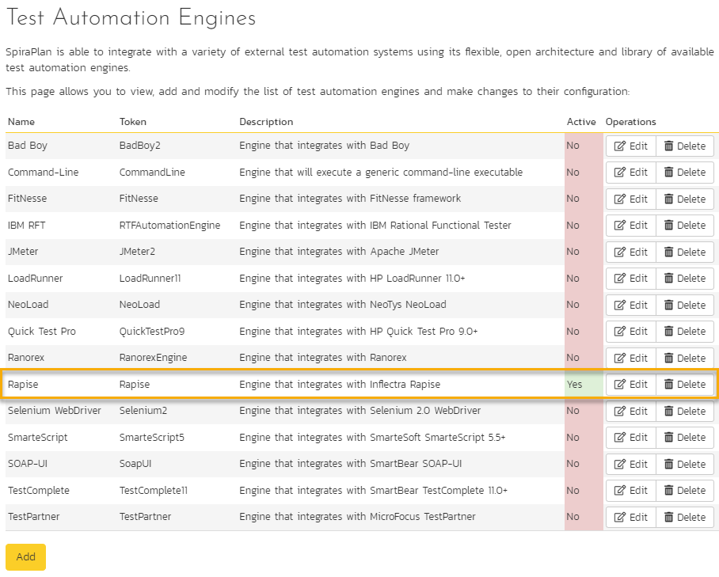
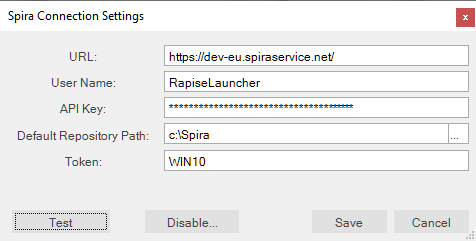
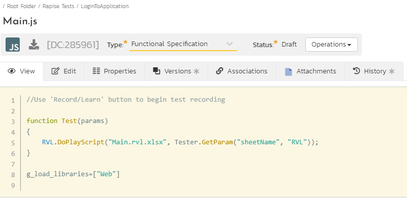
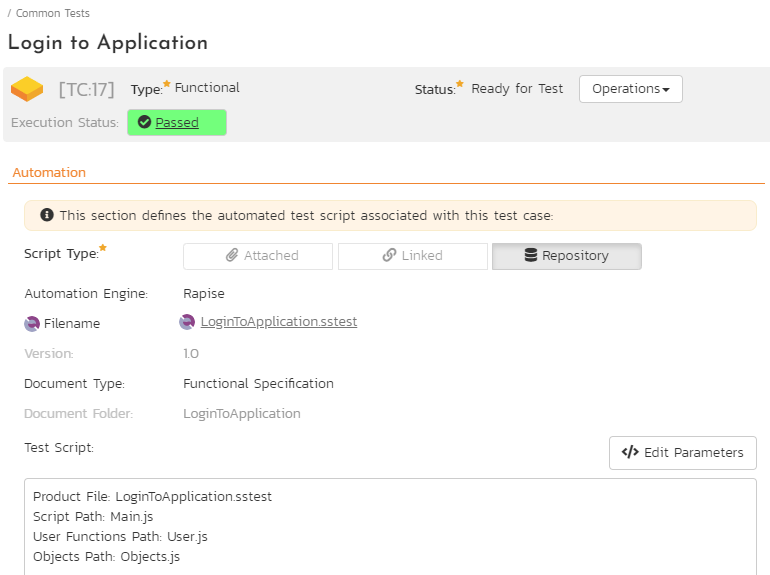
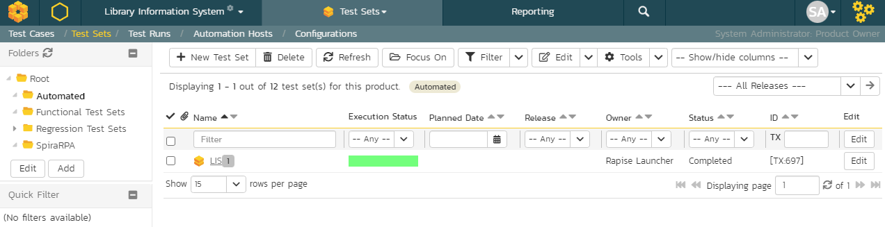

# SpiraTest Integration

## Overview

[SpiraTest](https://www.inflectra.com/SpiraTest/) is a web-based quality assurance and **test management system** with integrated release scheduling and defect tracking. SpiraTest includes the ability to handle manual, exploratory and automated tests, record the results and log any associated defects.

When you use SpiraTest with Rapise you get the ability to store your Rapise automated tests inside the central SpiraTest document repository with full version control and test scheduling capabilities:


You can record and create your test cases using Rapise, upload them to SpiraTest and then schedule the tests to be executed on multiple remote computers to execute the tests immediately or according to a predefined schedule. The results are then reported back to SpiraTest where they are archived as part of the project. Also the test results can be used to update requirements' **test coverage** and other key metrics in real-time.

In addition, you can also create exploratory manual tests, save them to SpiraTest and then execute them from within Rapise. This gives you access to more powerful screen capture and annotation functionality than is possible solely using SpiraTest.

!!! note
    [SpiraTeam](https://www.inflectra.com/SpiraTeam/) and [SpiraPlan](https://www.inflectra.com/SpiraPlan/) include **SpiraTest** as part of its functionality, so wherever you see references to **SpiraTest** in this section, it applies equally to **SpiraTeam** and **SpiraPlan**.

## Configuring SpiraTest

Before you can use SpiraTest to manage your Rapise automated tests you need to perform some initial configuration. This section assumes that you already have a working installation of SpiraTest or SpiraTeam v4.2 or later. If not, please refer to the [SpiraTest Installation and Administration Guide](https://spiradoc.inflectra.com/Spira-Administration-Guide/Installing-SpiraPlan/) for details on how to install SpiraTest.

## Configuring the Rapise Automation Engine

Log in to SpiraTest as a system administrator and go into SpiraTest main Administration page


 and click on the `Test Automation` link under **Integration**.


!!! important 
    Depending on when you first installed SpiraTest, you may already have an entry for Rapise, since versions 3.2 and later of SpiraTest automatically ship with a default entry for Rapise.

If **Rapise** is missing in the list of automation engines, click the `Add` button to enter the new test automation engine details page. The fields required are as follows:


- **Name**: This is the short display name of the automation engine. It can be anything that is meaningful to your users.
- **Description**: This is the long description of the automation engine. It can be anything that is meaningful to your users. (Optional)
- **Active**: If checked, the engine is active and able to be used for any project.
- **Token**: This needs to be the assigned unique token for the automation engine and is used to tell SpiraTest which engine to actually use for a given test case. For Rapise this should always be set to **Rapise**.

Once you have finished, click the `Insert` button and you will be taken back to the Automation Engine list page, with Rapise listed as an available automation engine:



## Connecting to SpiraTest

!!! important
    SpiraTest connection settings are shared between Rapise and [RapiseLauncher](./#client-configuration).

The first thing you need to do is to configure the connection to SpiraTest. Click `Settings > SpiraTest` menu:


This brings up the dialog box that lets you configure the connection to SpiraTest:



### Credentials

Enter the 

- SpiraTest **URL**,  e.g. https://my-company.spiraservice.net/
- **User Name**, login name you use to access SpiraTest or dedicated account for running Rapise tests.
- **[API Key](https://spiradoc.inflectra.com/HowTo-Guides/Users-profile-management/#how-to-get-or-make-your-rss-token-or-api-key)** 
  
and then click the `Test` button to verify that the connection information is correct.

!!! note
    If you are with Rapise 6 or older then use password instead of the API key. 

### Repository and Token

Additionally enter

- **Default Repository Path**, a folder to use for local copies of SpiraTest repositories.

- **Token**, the identifier of the current machine that Rapise is installed on. It needs to match the `Token` name of the corresponding [Automation Host](https://spiradoc.inflectra.com/Spira-User-Manual/Automation-Host-Management/) in SpiraTest.

!!! note
    You need to be running SpiraTest / SpiraTeam v4.0 or later to use the integration with Rapise.

## Creating a Rapise Test From a SpiraTest Test Case

!!! important
    In this section we describe a simplified process to give a basic understanding of SpiraTest integration. Once you are ready to start implementing a set of tests for your application we recommend to review the [Frameworks section](./Frameworks/frameworks.md) first. 

To create a new Rapise test linked to a SpiraTest test case, go to `File > Create New > New Test`. This will bring up the following dialog box:


1. Select the project that contains the test case. The list of test case folders will be displayed.

2. You can create a new folder by clicking the `New Folder` button

3. Expand the folders until you can see the desired test case:

    

Now either create a new test case by using the `New Test Case` button or simply click on a test case that you previously created in SpiraTest.


Once you are satisfied that this is the correct test case, choose the desired **methodology** (Basic, Manual-only, Mobile or Web), choose browser profile if it is a Web test and choose scripting mode (RVL or JavaScript). Rapise will now create a local test folder and files inside [Default Repository Path](#repository-and-token) based on this Spira test case.

!!! important
    At this point the new test is stored locally only. To put it's files into SpiraTest you need to save it, see next section.

## Saving a Test to SpiraTest

!!! important
    In this section we describe a simplified process to give a basic understanding of SpiraTest integration. Once you are ready to start implementing a set of tests for your application we recommend to review the [Frameworks section](./Frameworks/frameworks.md) first. 

You may need to save a test into SpiraTest in 3 cases:

1. You just created the test like described in the previous section.
2. You made changes to the test you saved into SpiraTest earlier.
3. You want to link existing Rapise test (not saved into SpiraTest and not linked to a SpiraTest test case) to a test case in SpiraTest.

To save a Rapise test into SpiraTest you need to make sure that the following has been setup first:

1. You have a project created in SpiraTest to store the Rapise tests in. The Rapise tests will be stored in a repository located inside the **Planning > Documents** section of the project.
2. The user you will be connecting to SpiraTest with has the permissions to **create new document folders**.
3. You have created the Test Case in SpiraTest that the Rapise test will be associated with. This is important because without being associated to a SpiraTest Test Case, you will not be able to schedule and execute the tests using SpiraTest and [RapiseLauncher](#using-rapiselauncher).
4. You have [created an AutomationEngine in SpiraTest](#configuring-the-rapise-automation-engine) that has the token name **Rapise**. This will be used to identify Rapise automation scripts inside SpiraTest.

Once you have setup SpiraTest accordingly, click `File > Sync with Spira`.

If the test is not linked to a SpiraTest Test Case, it will bring up the `Save Test to Spira` dialog box:


The first thing you will need to do is choose the SpiraTest project from the dropdown list. This will then update the list of test case folders displayed in the top pane of the dialog box.

Once you have chosen the desired project, you need to expand the test case folders in SpiraTest and choose the existing Test Case that you want to attach the Rapise test to:


You can also create a new folder by clicking the `New Folder` button.

When you expand the folders to display the list of contained test cases, it will display the Name and ID of each test case together with an icon that indicates the type of a test case:

1.  - Manual test case that has no automation script attached. (Repository Path will also be blank)
2.  - Test case that has an existing Rapise test attached.
3.  - Test case that has a non-Rapise automation script attached.

You can create a new test case by using the `New Test Case` button or simply click on a test case that you previously created in Spira. Choose a test case that has icon (1) and doesn't have an associated Repository path.

!!! note
    Test cases with icon type (3) cannot be used with Rapise for adding or updating scripts.

Once you have chosen the appropriate test case, click the `Save` button. That will bring up the **Create File Repository in Spira** dialog box:


This dialog box will let you know where the Rapise script will be stored in SpiraTest and also the location of the repository local directory used to store the `working copy` of the Rapise test. Click `Create` to confirm.


A dialog box will be displayed that lists all the files in the local working directory and shows which ones will be checked-in to SpiraTest. The system will filter out result and report files that shouldn't be uploaded. You can change which files are filtered out and also selectively include/exclude files. Once you are happy with the list of files being checked-in, click the `OK` button:

Rapise will display the progress dialog while the files are being uploaded to the server:


If an error occurs during the save, a message box will be displayed, otherwise the dialog box will simply close and the confirmation appear.


## Loading a Test from SpiraTest

!!! important
    In this section we describe a simplified process to give a basic understanding of SpiraTest integration. Once you are ready to start implementing a set of tests for your application we recommend to review the [Frameworks section](./Frameworks/frameworks.md) first. 

!!! important
    If you already loaded the test from SpiraTest earlier and wish to update the local copy with changes saved into SpiraTest by a team member then proceed to [Synchronizing](#synchronizing) section.

To load a Rapise test from SpiraTest you need to make sure that the following has been setup first:

1. You have already configured the [connection to the SpiraTest service](#connecting-to-spiratest).
2. The user you will be connecting to SpiraTest with has the permission to view the project that the tests are being stored in.

Once you have setup SpiraTest accordingly, click on the `File > Load from Spira` menu.

That will bring up the `Load Test from Spira` dialog box:


The first thing you will need to do is choose the SpiraTest project from the dropdown list. Once you have done that, the system will display the list of test case folders in this project.

Once you have chosen the project, you need to expand the test case folders in SpiraTest and choose the existing Test Case that you want to load:


When you expand the folders to display the list of contained test cases, it will display the Name, ID and Repository Path for each test case that has associated Rapise test.

!!! note
    Only test cases that have an attached/linked Rapise test script will be displayed in this view.

Notice `To Folder` edit field. By default a test is loaded into [Default Repository Path](#repository-and-token), but you may load a test into any folder (requires Rapise 8.0+).

Once you have chosen the appropriate test case, click the `Load` button to load the test case:


A dialog box will be displayed that lists all the files on the server which will be downloaded from SpiraTest. You can change which files are to be downloaded. Once you are happy with the list of files being checked-out, click the `OK` button:

The system will display the progress dialog while the files are being downloaded from the server.


If an error occurs during the download, a message box will be displayed, otherwise the dialog box will simply close and Rapise will open the loaded test.

## Synchronizing

!!! important
    In this section we describe a simplified process to give a basic understanding of SpiraTest integration. Once you are ready to start implementing a set of tests for your application we recommend to review the [Frameworks section](./Frameworks/frameworks.md) first. 

When you have a Rapise test previously loaded from SpiraTest or saved to SpiraTest then continue to use `File > Sync with Spira` to upload local changes and/or download changes made by other team members. Suppose for example, you have some files modified locally and want to update them in the SpiraTest repository. When you initiate `Sync with Spira`, Rapise will show you which files have been modified locally and which have been modified in the SpiraTest repository. The synchronization dialog allows you to choose a desired action for each file: upload, download or keep intact the local version (uncheck the file).


Since Rapise 8.0 it is possible to view differences between server and local file versions, notice `Diff...` buttons.

## Viewing the SpiraTest Properties of a Test

To see which SpiraTest **project** and **test case**  the current Rapise test is associated with, chose `Test > Spira Properties` menu item. This will bring up the Spira Properties dialog box:


This will display the name of the current Rapise test together with the name of the SpiraTest project, test folder and test case that this test is associated with.

If you would to save the current Rapise test into a new SpiraTest project or if you want to save it against a new test case in the same project, you must first unlink the test. To do this click on the `Unlink from Test Case` button. This will tell Rapise to remove the stored SpiraTest information from the `.sstest` file so that it can be associated with a new project and/or test case in SpiraTest.

!!! warning
    This operation cannot be undone so please make sure you really want to unlink the current test.

## Using the Spira Dashboard

In addition to using the menu options described in this page, you can interact with SpiraTest using the [Spira Dashboard](spira_dashboard_2.md) that is available from the `View > Spira Dashboard` menu. This provides a convenient way of interacting with SpiraTest, allowing you to quickly create, save and open test cases from SpiraTest.

## Viewing the SpiraTest Repository

If you open up the project in SpiraTest and click on the `Planning > Documents` link, you will be taken to the central document repository that now includes your new Rapise test folders. Rapise tests are saved into `Root Folder > Rapise Tests`.


To see the different revisions of a file, simply click on the hyperlink for a repository item and a preview of the file is displayed:



If you click on the `Versions` tab, the list of previous revisions will be displayed:


If you click on the `Testing > Test Cases` tab and then click on the test case that was previously created, you will see that it has its Automation information populated:



This shows you that the `Login to Application` test case is linked to the corresponding Rapise test stored in the SpiraTest document repository (in the `LoginToApplication` folder). You can click on the `LoginToApplication.sstest` hyperlink and it will automatically take you to the corresponding `.sstest` file in the SpiraTest document repository:


## Using Parameterized Test Cases

!!! important
    This is a legacy approach to parameters passing. If you are just starting with Rapise please follow this [guide](./Frameworks/parameters.md).

Often you will have an automated test script that you want to run several times using:

- Different browsers (e.g. Chrome, Edge and Safari)
- Different test data

You can define the various test parameters for both these cases and have SpiraTest pass the values through to the Rapise automated test. For example, in the Automation (or Test Steps) section of a test case (you may learn how to create one from this [tutorial](./tutorial_record_and_playback.md)), click the `Edit Parameters` link 


and enter the following information:


We have defined four input parameters for this test case:

- **g_book_author** - the name of the author for the new book being created.
- **g_book_genre** - the name of the genre for the new book being created.
- **g_book_name** - the title/name of the new book being created.
- **g_browserLibrary** - the name of the [browser profile](./selenium_settings_dialog.md) we should use to run the test. The name of this parameter is reserved, while the first three may be different.

Now for these parameters to actually affect the Rapise test, you need to make sure that the Rapise test is expecting these variables and knows how to handle them. Conventionally in Rapise, all **global variables** are prefixed with `g_` which is why we have similarly named the SpiraTest parameter names.

If your test is implemented in RVL, you may define these variables right in RVL sheet using [Global Variables](../RVL/Variables.md#assigning). No need to define `g_browserLibrary` because it is built-in. Note, that to print this parameter value we use `g_browserProfile`.


In JavaScript mode declare parameters in `Main.js` like this.

```javascript
function TestInit()
{
	// Input variables - allows to configure parameters in SpiraTest.
	// Provide backup values if not defined.
	if ('undefined' == typeof(g_book_name))
	{
		g_book_name = 'The Restaurant at the end of the Universe';
	}
	
	if ('undefined' == typeof(g_book_author))
	{
		g_book_author = 'Agatha Christie';
	}
	
	if ('undefined' == typeof(g_book_genre))
	{
		g_book_genre = 'Science Fiction';
	}
}

function Test(params)
{
	Tester.Message(g_book_name);
	Tester.Message(g_book_author);
	Tester.Message(g_book_genre);
	Tester.Message(g_browserProfile);
	
	// test steps
}

g_load_libraries=["Web"]
```

This code will check to see if the variables are provided by SpiraTest and if not, it will use some defaults. This is useful when you want to be able to run the test directly from Rapise and from SpiraTest without having to make changes to the test script.

These global variables (`g_book_name`, `g_book_author`, `g_book_genre`) can now be used in the Rapise test script at the appropriate points in the playback.

!!! note
    Parameters in Rapise and SpiraTest are case-sensitive, so make sure that your parameter names in SpiraTest match those in Rapise exactly, including the specific case.

## Scheduling the Tests

Now that we have our Rapise automated test uploaded to SpiraTest and associated with a test case, we can now schedule the test to be executed. The first thing we need to do is setup the list of automation hosts.

### Configuring the Automation Hosts

When you execute Rapise automated tests from SpiraTest, you have the ability to specify which computer(s) it will be executed on. We call those different computers, the **automated hosts**. Each automation host needs to have a copy of Rapise installed on it.

Go to `Testing > Automation Hosts` in SpiraTest to display the list of automation hosts:


Make sure that you have created an Automation Host for each computer that is going to run an automated test case. The name and description can be set to anything you like, but the Token field must be set to a [unique name for each computer](#repository-and-token).

Once you have at least one Automation Host configured, we need to next create the test sets that will be scheduled to execute on these hosts.

### Creating and Scheduling the Test Sets

Inside SpiraTest, click on `Testing > Test Sets` to display the list of existing test sets:



Now click on **New Test Set** to create a new test set that will contain our automated test case:


!!! note
    Unlike manual test cases, automated test cases must be executed within a test set -- they cannot be executed directly from the test case.

Now click on the hyperlink of our new test set to display the test set details page:


Scroll down to the **Test Cases** section:


First, click on the `Add` button in the **Test Cases** tab to bring up the dialog box that lets us add new test cases to the set:


Click on `Root` to expand the tree of folders and choose a folder:


Choose [the parameterized test case](#using-parameterized-test-cases) and click the `Save` button.


The test case will now be added to the set. Perform the same action again so that we have the separate instances of our parameterized test case:


Since in this example we have parameterized test cases inside the automated test set, we need to set their values by right-clicking on each test case in turn and choose `Edit Parameters`:


Enter the parameter values and click `Save` to commit the change. This allows you to have the same test case in the test set multiple times with different data for each instance of the test case.


Now that we have the test case added to the set, we need schedule the test set for execution by filling in the following fields:


- **Automation Host** - the name of the automation host that will be running the automated test set.
- **Planned Date** - the date and time that you want the scenario to begin. Note that multiple test sets scheduled at the exact same time will be scheduled by Test Set ID order.
- **Status** - this needs to be set to **Not Started** for RapiseLauncher to pick up the scheduled test set. When you change the Planned Date, the status automatically switches back to **Not Started**.
- **Type** - this needs to be set to **Automated** for automated testing.

### Executing the Test Sets

Once you have set the various test set fields (as described above), the RapiseLauncher instance running on the assigned automation host will periodically poll SpiraTest for new test sets. Once it retrieves the new test set, it will add it to its list of test sets to be executed. Once execution begins it will change the status of the test set to **In Progress**, and once test execution is done, the status of the test set will change to either **Completed** (the automation engine has been  launched and the test has completed) -- or **Blocked** (RapiseLauncher was not able to execute the automated test).

If you want to immediately execute the test case on your local computer, instead of setting the **Automation Host**, **Status** and **Planned Date** fields, you can click the `Execute` icon on the test set itself. This will cause RapiseLauncher on the local computer to immediately start executing the current test set.

In either case, once all the test cases in the test set have been completed, the status of the test set will switch to **Completed** and the individual test cases in the set will display a status based on the results of the Rapise test:

- **Passed** - the Rapise automated test ran successfully and all the test conditions in the test script passed.
- **Failed** - the Rapise automated test ran successfully, but at least one test condition in the test script failed.
- **Blocked** - the Rapise automated test did not run successfully.

If you receive the **Blocked** status for either the test set or the test cases you should look into the [test run](https://spiradoc.inflectra.com/Spira-User-Manual/Test-Run-Management/) details in SpiraTest to find out the reason.

!!! note
    While the tests are executing you may see browser or application windows launch as Rapise executes the appropriate tests.

Once the tests have completed, you can log back into SpiraTest and see the execution status of your test sets:


If you click on a Test Run in that test set, you will see the following information:


If you have configured RapiseLauncher to capture screenshots during execution, they will be embedded into the report:


So, you now have a complete record of the automated test execution in SpiraTest, with the execution status of the appropriate test case and test steps updated, and a complete log of the testing activities.

The Attachments tab of a test run contains all the screenshots, the original report and log files:


#### Block Execution

!!! note
    This feature requires Rapise 6.6+.

If you have a test set that contains several test cases and failure of some test case makes further execution of the test set unwanted you may do this by returning exit code `-99` from the failed test. It can be done via `WScript.Quit(-99)` statement.

## Using RapiseLauncher

**RapiseLauncher** is a separate application that installs with Rapise. It allows you to remotely schedule the automated tests in SpiraTest and have RapiseLauncher automatically invoke the tests according to the schedule.

### Configuring RapiseLauncher

RapiseLauncher installs along with the main Rapise application. You may launch it from Rapise using [main menu](./menu_and_toolbars.md#tools) `Tools > Rapise Launcher`.

It can also be found in the `Start > Programs > Inflectra` program folder:


### Basic Unattended Operation

When run, the program will start minimized to the system tray and will start its polling of the server. Polling will occur every 'x' minutes (5 by default) for any automated test sets that are scheduled to be run. When time comes for a test to be launched, it will start Rapise to execute the test. Rapise will then perform the test activities and report the results back to SpiraTest.

At the end of the test, the program will go back and resume scanning for tests that need to be executed. Typically (unless there is a bug in the test or application being tested) no user input is ever needed from the application itself.

### Client Configuration

!!! important
    SpiraTest connection settings are shared between [Rapise](./#connecting-to-spiratest) and RapiseLauncher.

By right clicking on the system tray icon and selecting `Configuration`, the application's window will open to the configuration panel.

{width="658px"}

The panel has the following options:

#### SpiraTest Server Connection

- **URL** - the URL of the SpiraTest installation. Be sure to not put `/Login.aspx` or any other page in the string, this should be just the root URL of the application's install.
- **User Name** - the SpiraTest login id of the user that you want the tests reported as. Note that while the application is polling and updating test results, if the user is logged into a web browser session, they will get kicked out.
- **API Key**-  the [API Key](https://spiradoc.inflectra.com/HowTo-Guides/Users-profile-management/?_ga=2.209824854.2141741329.1643112840-308801923.1641378277#how-to-get-or-make-your-rss-token-or-api-key) for the User Name above.
- **Test** - clicking this will test the login to make sure the application can connect to the server properly.
- **Repository** - this is the Windows folder to store local copies of tests to execute.It is applicable when the next option is unchecked.
- **Use Temp Folder for Test Execution** - this is the default and recommended option, the Temp folder is located in `C:\ProgramData\Inflectra\Rapise\Temp`.

#### Server Polling

- **Automation Host Token** - this field is required, and uniquely identifies the local testing machine. Any scheduled tests assigned to the Automation Host on SpiraTest will get polled for this machine. Except in special circumstances, this ID should be unique among all testing machines.

    !!! important
		This field must match the string that is entered into the Automation Host Details screen in the **Token** field, or scheduled tests will not be recognized.

- **Polling Frequency** - how often in minutes the application will poll the SpiraTest server for updates to the automation host's schedule. The default is 5 minutes, and should be fine for most installations. Note that tests will still be executed on their scheduled time, this is simply how often the program will talk to the SpiraTest server to detect schedule changes. Updating the polling frequency will reset the currently running timers.
- **Read Ahead** - how far ahead in minutes the program should read the schedule for the Automation host. Tests that are scheduled further in advance will not show up as a pending test on the status screen.
- **Automatically run tests that are overdue** - when this is checked, any tests that are pulled from the SpiraTest server that has a scheduled date in the past will be marked as Overdue. Normally, overdue tests will not be executed. With this check, they will be executed as soon as the poll is finished.

#### Options

- **Capture screenshots during playback** - selecting this option will instruct RapiseLauncher to capture screenshots of the objects being recognized during testing and upload them to SpiraTest at the end of the execution. The screenshots will then be linked to the test run inside SpiraTest.
- **Continue test set execution if test case returns Blocked status** - by default Blocked test case stops execution of a test set, set this checkbox to run all test cases no matter what. This option requires Rapise 7.3+
- **Do not upload Test Run attachments** - if this option is set, RapiseLauncher does not upload screenshots and log files to SpiraTest to save database space. Use this option in exceptional cases if your SpiraTest instance is running out of space. Requires Rapise 8.0+.
- **RDP screen width & height** - when RDP session is disconnected via [RapiseLauncher tray icon menu](#tray-icon-menu) set screen resolution to specified width and height.
- **Start at logon** -- set this checkbox to let Windows automatically launch Rapise Launcher at user logon. Useful when your server is rebooted regularly. This option requires Rapise 6.3+

Since Rapise 7.2 one may use `Open Log` button to quickly open the RapiseLauncher log in the default text viewer.

### Status Screen

The status screen is usually hidden, but can be brought up for display by double-clicking on the system tray icon:


The top of the screen shows the current status, whether it's running a test or waiting to poll the server for an update. It will also show any errors present on the application, like a registration error or configuration issue. Under the status bar is a list of any pending or executing tests that are scheduled for this testing machine. The list will get cleared at every poll, so tests that have executed since the previous poll will still be on the list, and will show their execution status:

- **Green Arrow** - a green arrow indicates that the test is still running, or RapiseLauncher is waiting for a reply from Rapise.
- **Blue Checkbox** - a blue checkbox indicates that the test is completed, regardless of status of the individual test steps in the scheduled test set.
- **Red Error** - a red error indicator indicates that Rapise ran into an issue (outside of test results). In this case, any further tests will be marked as blocked, as the issue needs to be corrected within Rapise or the Rapise test script.
- **No Indication** - no indication means that the test is currently awaiting for its scheduled date to start. Note that only one test will be launched at a time, so that if two tests are scheduled at the same time, the one with the lower TestSet ID will be executed first, then as soon as it's finished, the second scheduled test will be run.

#### Buttons

By highlighting a test that has not been executed yet, you can click the `Force Execute` button. This will cause the selected test to have its scheduled date to the current time, causing it to be immediately executed (or, if another test is already running, next in line for execution).

At any time the `Force Poll` button can be clicked, causing RapiseLauncher to initiate an immediate poll of the SpiraTest server to check for pending runs. The timers for the next server poll will be reset when the button is clicked.

To stop of execution of a running Test Set, select it in the list and click `Cancel Execution` button.

### Tray Icon Menu

Instead of operating from the application window, all functions exist on the tray icon menu as well, as well as some additional commands:


- **Pause / Resume** - the Pause/Resume option pauses or resumes the timers for polling and executing tests. If a test or server poll is already in progress, it will not cancel these. However, after the are finished, no further polls or tests will be run.
- **Poll Now** - this will force a server poll for upcoming tests, and reset the poll timer.
- **Disconnect RDP Session** - this will disconnect current RDP session and will leave the system in a state ready for execution of UI tests. After disconnect RapiseLauncher will set screen resolution according to [configuration](#client-configuration) (width/height options). This feature is a convenient way to perform steps described in [KB325](https://www.inflectra.com/Support/KnowledgeBase/KB325.aspx).
- **Configuration** - opens the main window to the Configuration page.
- **Help > About** - opens the About window, which displays information about Rapise Launcher.
- **Help > View Help** - opens this help page.
- **Exit** - will completely exit the program. Doing this will cancel any tests currently running and shut down the program. Any tests that were waiting to be executed will not execute until the program is restarted and the polling is resumed.

You can double-click the tray icon to bring up the main window on the Status page.

### Running RapiseLauncher from a Build Script

Normally you schedule tests in SpiraTest using the **Planned Date** field of the test sets and let the various instances of RapiseLauncher poll SpiraTest for upcoming tests. In addition (as described in the *SpiraTest User Manual*) you can execute a test set on the local machine immediately by clicking the **Execute** button within SpiraTeam.

However there are situations where you want to be able to launch an automated Rapise test script from an external batch file or build script (e.g. as part of a continuous integration environment) and have those tests report their results back into SpiraTest. You can achieve this by using the special command-line argument `--testset` which is passed to RapiseLauncher. For more details on this parameter see the next section.

### Command line arguments

For debugging and additional options when running the program, the following command-line arguments are available:

- **-config:[Path to RepositoryConnection.xml]** allows defining path to custom RapiseLauncher configuration. It may be used when RapiseLauncher is executed in remote pipeline. You may create `RepositoryConnection.xml` on you dev host (by setting the configuration using standard settings dialog), and then copy the configured file from `C:\ProgramData\Inflectra\Rapise\RepositoryConnection.xml` to your source tree and pass it using this parameter.
- **-minimized** starts the application in minimized mode. Normal action is to show the list of pending runs.
- **-paused** starts the application with timers Paused instead of active.
- **-param:[name]=[value]** sets a global variable for every executed test. For example:

	```
	-param:g_enableVideoRecording=true
	```
  
	Param argument can be used multiple times:

	```
	-param:g_verboseLevel=3 -param:g_enableVideoRecording=true
	```
  
- **-poll** forces the program to do an initial poll upon startup. Normal action is to wait the pending time before doing the initial poll.
- **-project:[Project ID]** allows you to tell RapiseLauncher which project the test set specified with the **-testset** argument lives in. This speeds up the time it takes Rapise to locate and retrieve the test set (optional).
- **-testset:[Test Set ID]** allows you to tell RapiseLauncher to execute a specific test set on the remote computer (e.g. **-testset:45** runs test set `TX00045`). Since Rapise 6.7 one may pass a comma separated list of test set Ids (e.g. **-testset:45,46,47**). Listed test sets are executed sequentially.
- **-trace** enables tracelogging to the EventLog for debugging and watching tests execute.
- **-width:[width] -height:[height]** sets the screen resolution. Width must be in the range `[1024, 7680]`, height - `[768, 4320]`. Allowed width/height combinations are determined by the operating system where you run RapiseLauncher. Most typical resolutions are 

	```
	[1024, 768], [1280, 720], [1920, 1080]
	```
	
- **filename** must be the last item on the command line. This is a `TST` file downloaded from SpiraTest to start immediate execution on. Optional.

### Record Playback Videos

!!! note
    This feature requires Rapise 6.6+.

RapiseLauncher can record video of test playback. To enable video capture pass `g_enableVideoRecording=true` via a [Test Case parameter](#using-parameterized-test-cases). For video recording RapiseLauncher uses `Microsoft.TestPlatform` NuGet package.When this feature is used for the first time RapiseLauncher downloads `Microsoft.TestPlatform` using `nuget.exe` and puts it into `<Public Documents>\Rapise\VideoRecorder` folder.

By default the video recorder is executed with these parameters:

```
-noaudio -bitRate 512 -frameRate 2
```

You may change them by defining a Test Case parameter with name `g_videoRecorderArguments`.

Recorded video is attached to the test run as ScreenCapture.wmv.


### Using Test Set Attachments

You may attach some data to Test Set and use it during test execution. It is a convenient way to pass configuration and data files for the test set. It may be used as an alternative to defining Spira Configurations.

You may open test attachment using the `%ARTIFACTS%` environment variable. If this is a standalone test then `ARTIFACTS` resolves to `WORKDIR` (framework root). When executed from Spira it will be a separate temp folder where RapiseLauncher downloaded everything attached to the Test Set.

*Example Usage:*

```javascript
    Global.GetProperty("Url", "http://default/url", "%ARTIFACTS%/Config.xlsx");
```
 
So by default it would load `Config.xlsx`  from the test framework root, but in the RapiseLauncher mode it will open the config file from the temp location where everything is downloaded. And if Test Set has file `Config.xlsx` attached then will be used to read the `Url` property.

### Parameters Passed from RapiseLauncher to Rapise

When RapiseLauncher runs a test it passes a bunch of global variables to it. Those variables describe project, test set, test case and release scope of the test.

See this [KB](https://www.inflectra.com/Support/KnowledgeBase/KB543.aspx) article for details.

### Git for Windows

This feature requires Rapise 7.3+. By default Rapise is using LibGit2Sharp library to clone Git repositories. It is a great library and it works in 99% of cases. However if you are behind a proxy you may need to configure RapiseLauncher to use [Git for Windows](https://git-scm.com/download/win) instead of LibGit2Sharp. Configuration is simple. Just create  a file `c:\Users\Public\Documents\Rapise\GitClone.cmd` with the following content:

```
echo %GitUrlWithoutProtocol%
@echo off
git clone https://%GitUser%:%GitPassword%@%GitUrlWithoutProtocol% %GitTargetPath%
```

RapiseLauncher is using this CMD file to clone a Git repository. Environment variables `GitUrl`, `GitUrlWithoutProtocol`, `GitUser`, `GitPassword`, `GitBranch`, `GitTargetPath` are set by RapiseLauncher automatically and can be used inside the CMD file. `GitTargetPath` points to the folder where a repository must be cloned.

## See Also

- [Using Spira Dashboard](spira_dashboard_2.md) 
- [Using Rapise with SpiraTest (video)](https://youtu.be/5ybrBQOzez8)
- [Data Driven Testing with Test Configurations](https://www.inflectra.com/ideas/Entry/spotlight-on-spiratest-53--data-driven-testing-wit-495.aspx)
- [RapiseLauncher extension](vstest_rl.md) for Azure DevOps.
- [How test files are stored in SpiraTest](git_integration.md#how-it-is-stored-in-spira)
