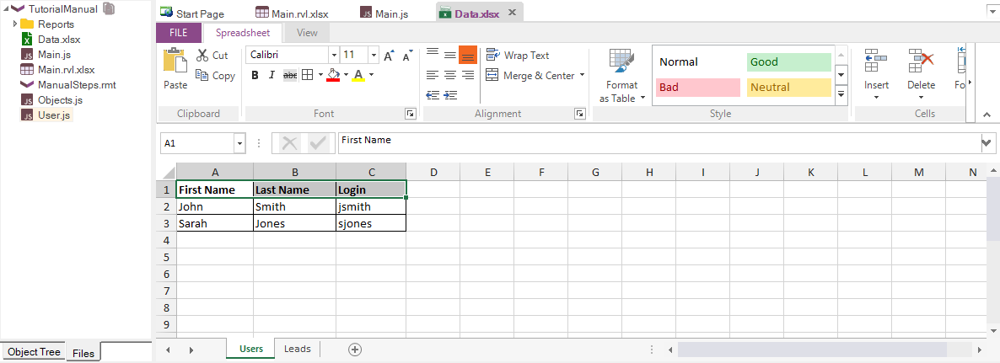
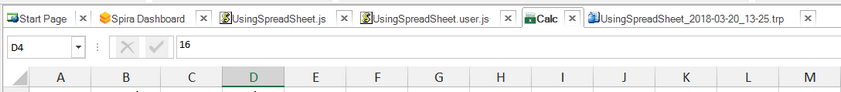

# Spreadsheet Editor

## Purpose
The Spreadsheet editor lets you view and edit Microsoft Excel spreadsheet files (.xls or .xlsx). This very convenient when you are doing [data-driven testing](data_driven_testing.md) and need to create or edit the test data directly inside Rapise.

## How to Open
Use the [Test Files View](test_files_dialog.md) to open an excel file.  The excel file will be opened in a **Spreadsheet Viewer,** in the [Content View](content_view.md).  The [Spreadsheet](toolbar_spreadsheet.md) tab of the Ribbon will also open.

## Forumula Bar
The formular bar lets you see/edit the contents of the currently selected cell as well as enter more complex Excel calculations/formulas:

## Spreadsheet Grid
The main spreadsheet grid lets you see the cells in the spreadsheet, select a range and use the [Speadsheet ribbon](toolbar_spreadsheet.md) to change the format:

