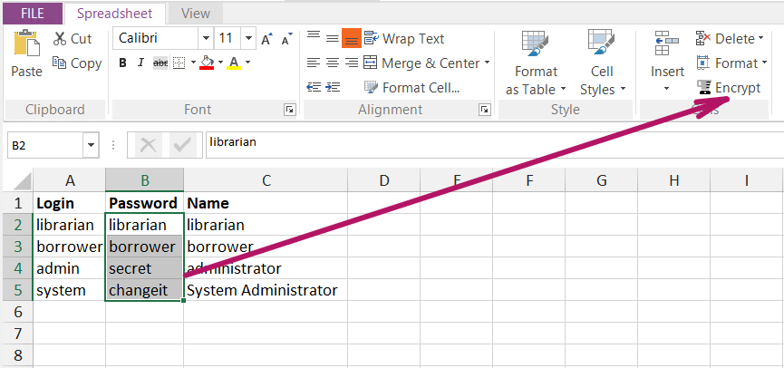

# Spreadsheet Editor

## Purpose

The Spreadsheet editor lets you view and edit Microsoft Excel spreadsheet files (.xls or .xlsx). This is very convenient when you are performing [data-driven testing](data_driven_testing.md) and need to create or edit the test data directly inside Rapise.

## How to Open

Use the [Test Files View](test_files_dialog.md) to open an Excel file. The Excel file will open in a **Spreadsheet Viewer** within the [Content View](content_view.md). The [Spreadsheet](toolbar_spreadsheet.md) tab of the Ribbon will also become active.

## Formula Bar

The formula bar lets you view and edit the contents of the currently selected cell, as well as enter more complex Excel formulas or calculations:

## Encrypting a Cell

Occasionally, your XLS files may need to store sensitive information (such as passwords). In such scenarios, you can conveniently encrypt these values. Later, you can decrypt them using [Global.DoDecrypt](../Libraries/Global.md#dodecrypt) before using them as function parameters.

## Spreadsheet Grid

The main spreadsheet grid lets you view the cells in the spreadsheet, select a range, and use the [Spreadsheet ribbon](toolbar_spreadsheet.md) to change the format:

## Cell Formatting

By default, all cells have the General format. This means that the format of a cell's value is determined automatically during the read operation. This may lead to undesired effects. For example, if a cell contains the date `5/1/2020`, the value read will be `43952`. If you want to get a cell's value in text format, you can change the format to Text using the **Format Cells** dialog.

Then you need to re-enter the date. After that, Rapise will read the date exactly as `5/1/2020`.