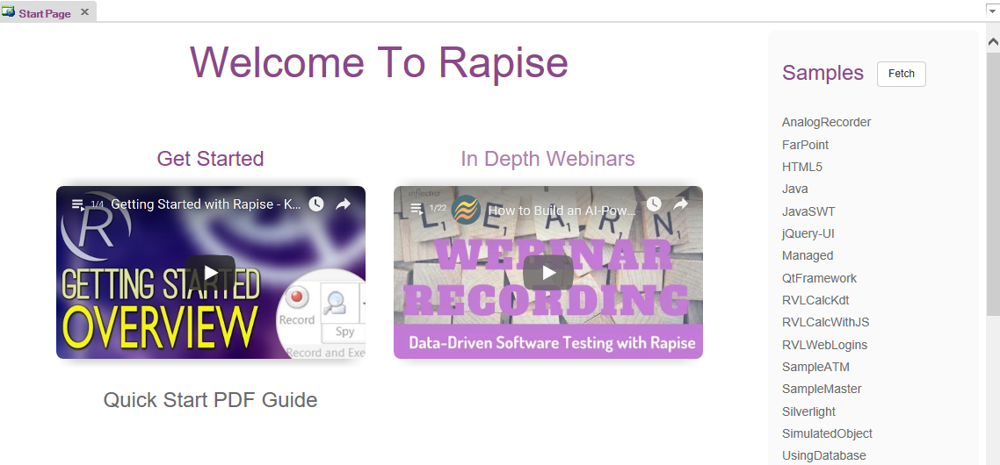

# Start Page

## Purpose

The Start Page is intended to be a convenient entry point for Rapise beginners.

The Start Page provides:

1. Links to tutorials and webinars.
2. Links to sample tests. This displays a list of available Rapise
samples. Some samples are shipped with Rapise while others are provided
from the online public repository.
    - The **Fetch Samples** button is used to download/update additional samples from online public repository.

## How to Open

The **Start Page** opens automatically with Rapise. This behavior can be modified in the [Options](options_dialog.md) dialog using the **ShowStartPageOnStartup** setting.
