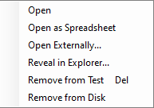
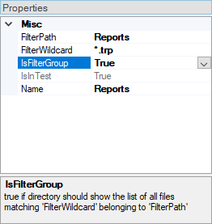
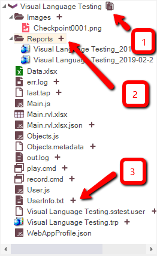

# Test Files View

## Purpose

The **Test Files** dialog allows you to navigate and alter the Test hierarchy, including the following:

* The main JavaScript script files (`*.js`)
* RVL Files (`*.rvl.xlsx`)
* The report files (`*.trp`)
* Images captured during execution using [Checkpoints](checkpoints.md)
* REST web services (`*.rest`)
* SOAP web services (`*.soap`)
* Analog recording files (`*.arf`)
* Excel spreadsheets (`*.xls` and `*.xlsx`)
* Applications to launch (`*.exe` or `*.bat`)
* Other data files (`*.txt`)

## How to Open

The **Test Files** dialog is part of the [Default Layout](restoring_the_default_layout.md).

## Context Menu (Folder)

Right click on a folder to see:

* **Create...**
    * **Text File...**: Create `.txt` file and add it to the test.
    * **JavaScript File...**: Create `.js` file and add it to the test.
    * **JSON File...**: Create `.json` file and add it to the test.
    * **Spreadsheet...**: Create new `.xlsx` or `.xls` file and add it to the test.
    * **File...**: Aks for name and extension and create an empty file.
    * **WebAppProfile.json**: Add new `WebAppProfile.json` to this test project.
    * **User Lib...**: Create shared user library for this test and sub-tests.
* **Add File(s)...**: Add an existing file to the test.
* **New Group...**:  Create a logical grouping of files in the test. This will **not** add a folder to the file system.
* **Reload**: Refresh group contents. Use it for [filter groups](../test_files_dialog/#filtergroup)  ('IsFilterGroup' is set to 'True' in group properties), e.g. for Report group.
* **Create Sub-Test...**: Launch Create Sub-Test dialog.
* **Remove from Test**: Remove the selected grouping from the test.  This does **not** delete included files from your hard disk.
* **Remove All from Disk**: Remove all files included into the selected grouping from your hard disk.

## Context Menu (File)

Right click on a file to see:

* **Open**: Open the file in Rapise.
* **Open Externally...**: Open the file using associated program. E.g. if a Notepad is registered in Windows to open TXT files, then TXT file will be opened by Notepad.
* **Open as Spreadsheet...**: Open this file using built in [Spreadsheet editor](./spreadsheet_editor.md). May be used to open `.rvl.xlsx` in spreadsheet editor if you, for example, need to add columns.
* **Reveal in Explorer...**: Open Windows File Explorer and show this file in it.
* **Remove from Test**: Remove the file from your test.  This does **not** delete the file from your hard disk.
* **Remove from Disk**: Remove the file from your test and hard drive.
* **Create Data Object...**: Only available for `.xls` and `.xlsx` files. Create Spreadsheet Data Object in the object tree.

## Context Menu (Sub-Test)

Right click on a sub-test to see:

See [menu item descriptions](/Guide/tests_and_sub_tests/#sub-test-context-menu)

## Filter Groups

Filter groups read its contents from disk according to specified path and wildcard. You may setup a filter group by editing group properties:

* **FilterPath**: Root path to find files via wildcard (valid only if 'IsFilterGorup' is 'True').
* **FilterWildcard**: Filter wildcard (valid only if 'IsFilterGorup' is 'True').
* **IsFilterGroupt**: 'True' if directory should show the list of all files matching 'FilterWildcard' belonging to 'FilterPath'.
* **Name**: Group name.

## Adding Files from Test Folder

1. Show files in folder triggers combined view where one can see files and folders on inside test folder both added and not yet added into the test project.

2. If folder is not yet added to the project then `+` icon is displayed. Pressing it adds filter group for this folder.

3. If file is not yet added to the project then `+` icon is displayed. Pressing it adds file into the test project.

## See Also

* [Data Driven Testing](data_driven_testing.md)
* [KB 371](https://www.inflectra.com/support/knowledgebase/kb371.aspx) Sample Spira-Friendly Framework with Multiple RVLs and Common Library.
* [KB 363](https://www.inflectra.com/Support/KnowledgeBase/KB363.aspx) How to define a profile for Web Application in Rapise.
