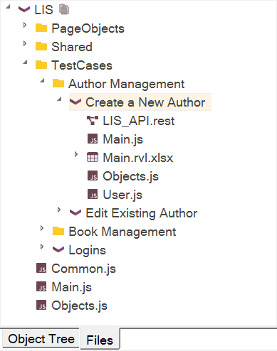
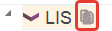
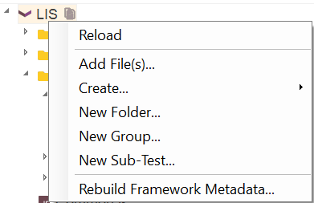
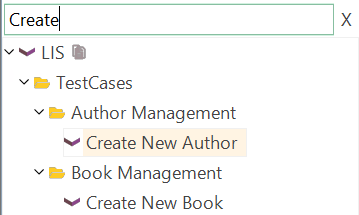
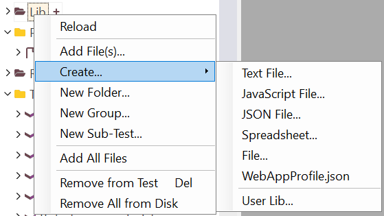
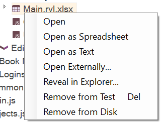
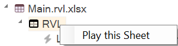
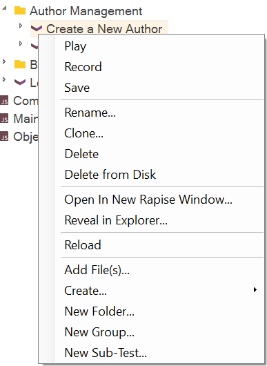
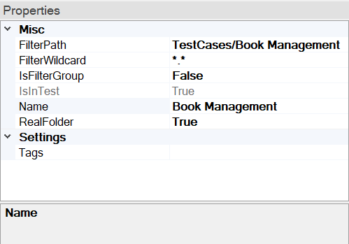

# Test Files View

## Purpose

The **Test Files** dialog allows you to navigate and manage the test hierarchy, including the following:

*   Main JavaScript script files (`*.js`)
*   RVL Files (`*.rvl.xlsx`)
*   Report files (`*.trp`)
*   Images captured during execution using [Checkpoints](checkpoints.md)
*   REST web services (`*.rest`)
*   SOAP web services (`*.soap`)
*   Analog recording files (`*.arf`)
*   Excel spreadsheets (`*.xls` and `*.xlsx`)
*   Applications to launch (`*.exe` or `*.bat`)
*   Other data files (`*.txt`)

## How to Open

Navigate to `View > Show > Test Files`.

## Root Node

Framework root (for [framework](./Frameworks/frameworks.md) mode) or test root (for single test mode).

### Show Files and Folders

The root node features a special button that facilitates adding files from disk:

See [Adding Files from Test Folder](#adding-files-from-test-folder).

### Root Context Menu

*   **Reload**: Refreshes objects and test cases.
*   ... Same as the context menu for [Folder Node](#folder-context-menu)
*   **Rebuild Framework Metadata...**: Forces the regeneration of metadata for the entire framework.

## Filtering

The Object Tree has built-in filtering and display mode switches.

{width="241px"}

-   *Filter* - A quick filter to narrow down the range displayed in the object tree. Updates the tree while you type. To cancel filtering, simply remove everything from this input box, press the `X` icon, or press ++esc++ on your keyboard.

## Folder Node

Shows the contents of a [Folder or Filter Group](#folders-and-filter-groups).

### Folder Context Menu

Right-click on a folder to see:

*   **Reload**: Refreshes group contents. Use for [filter groups](../test_files_dialog/#filtergroup) ('IsFilterGroup' is set to 'True' in group properties), e.g., for the Report group.
*   **Add File(s)**: Adds an existing file to the test.
*   **Create**
    *   **Text File**: Creates a `.txt` file and adds it to the test.
    *   **JavaScript File**: Creates a `.js` file and adds it to the test.
    *   **JSON File**: Creates a `.json` file and adds it to the test.
    *   **Spreadsheet**: Creates a new `.xlsx` or `.xls` file and adds it to the test.
    *   **File**: Asks for a name and extension, then creates an empty file.
    *   **WebAppProfile.json**: Adds a new `WebAppProfile.json` to this test project.
    *   **User Lib**: Creates a shared user library for this test and sub-tests.
*   **New Group**: Creates a logical grouping of files in the test. This does **not** add a folder to the file system.
*   **New Folder**: Creates a real folder in the test. This adds a folder to the file system.
*   **New Sub-Test**: Launches the Create Sub-Test dialog.
*   **Add All Files**: In [Show Files and Folders](#show-files-and-folders) mode, you may add all external files at once using this menu item.
*   **Remove from Test**: Removes the selected grouping from the test. This does **not** delete its included files from your hard disk.
*   **Remove All from Disk**: Removes all files within the selected grouping from your hard disk.

## File Node

Shows all files actually added to the test or framework.

### Context Menu (File)

Right-click on a file to see:

*   **Open**: Opens the file in Rapise.
*   **Open as Spreadsheet**: Opens this file using the built-in [Spreadsheet editor](./spreadsheet_editor.md). Can be used to open `.rvl.xlsx` in the spreadsheet editor if, for example, you need to add columns.
*   **Open as Text**: Opens this file using the built-in [Text Editor](source_editor.md). Can be used to open `.csv` in the source editor if, for example, you need to add columns.
*   **Open Externally**: Opens the file using the associated program. For example, if Notepad is registered in Windows to open TXT files, a TXT file will be opened by Notepad.
*   **Reveal in Explorer**: Opens Windows File Explorer and displays this file within it.
*   **Remove from Test**: Removes the file from your test. This does **not** delete the file from your hard disk.
*   **Remove from Disk**: Removes the file from your test and hard disk.
*   **Create Data Object**: Only available for `.xls` and `.xlsx` files. Creates a Spreadsheet Data Object in the object tree.

## RVL Sheet

An `rvl.xlsx` file node automatically expands to show available sheets and their contents.

### Context Menu for RVL Sheet

*   **Play this Sheet**: Executes the given RVL sheet.

## Sub-Test Node

Sub-test nodes represent various types of sub-tests such as Test Cases, Page Objects, and other supplementary sub-tests.

### Context Menu for Sub-Test

Right-click on a sub-test to see:

See [menu item descriptions](tests_and_sub_tests.md#sub-test-context-menu)

## Folders and Filter Groups

A **Group** is a virtual folder that may or may not have a physical representation on disk. **Filter groups** retrieve their contents from disk based on a specified path and wildcard. A **RealFolder** is an actual folder that has the same name as the group and whose path matches the group's **FilterPath**.

### Folder Properties

You can configure a filter group or real folder by editing the group properties:

*   **FilterPath**: The root path used to locate files based on the wildcard (only valid if **IsFilterGroup** is `True` or if it is a **RealFolder**).
*   **FilterWildcard**: The wildcard filter used to match files (only valid if **IsFilterGroup** is `True`).
*   **IsFilterGroup**: Set to `True` if the directory should display a list of files that match the **FilterWildcard** within the **FilterPath**, or if it is a **RealFolder**.
*   **Name**: The name of the group/folder.
*   **RealFolder**: Represents a physical folder that actually exists on the disk.

## Adding Files from Test Folder

1.  **Show files in folder**: This option enables a combined view where you can see both the files and folders inside the test folder, including both those already added to the test project and those not yet added.

2.  If a folder has not been added to the project, a `+` icon is displayed. Clicking on it adds a filter group for that folder.

3.  If a file has not been added to the project, a `+` icon is displayed. Clicking on it adds the file to the test project.

## See Also

*   [Data Driven Testing](data_driven_testing.md)
*   [KB 371](https://www.inflectra.com/support/knowledgebase/kb371.aspx) Sample Spira-Friendly Framework with Multiple RVLs and Common Library.
*   [KB 363](https://www.inflectra.com/Support/KnowledgeBase/KB363.aspx) How to define a profile for Web Application in Rapise.