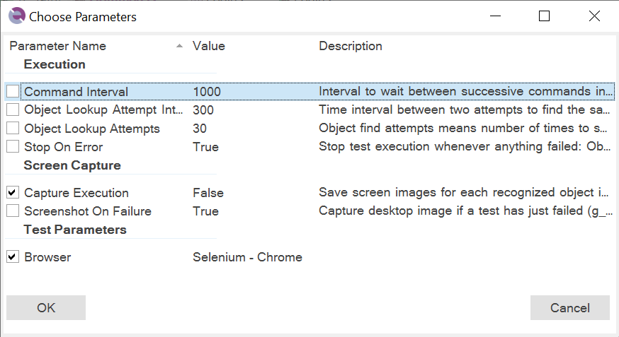

# Choose Parameters

The parameter selection dialog is used to select built-in test parameters when running a [test case](Frameworks/frameworks.md#test-cases). It allows you to select the specific parameters required for the test execution.

The parameters displayed in the dialog are a subset of those defined in the overall [test](settings_dialog.md#advanced) configuration.

## Usage

The *Parameters...* button in the [Choose Test Case Dialog](test_to_play_selector.md) opens this dialog.

## See Also

- [Testing Frameworks](Frameworks/frameworks.md)
- [Playback](playback.md)