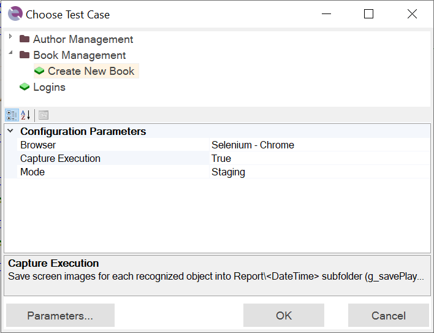

# Choose Test Case Dialog

## Usage

### Recording and Playback

To perform playback or recording within the testing framework, you must have a test case or a [Module / Page Object](Frameworks/pageobjects.md) as the target for execution or recording, respectively. If Rapise detects an active test case or Page Object, it will be automatically selected, and you just need to click the *OK* button.

Since Rapise 8.1 it is possible to **select multiple test cases for playback**. After execution Rapise displays a combined report. Status of each test case execution is reflected with icon colors in the Object Tree view. Also you may use `Last Report` menu item of the popup menu for a test case to view individual reports. <a class="headerlink" href="#execute-multiple-test-cases" title="Permanent link">¶</a>

### Parameters

The bottom section of the dialog allows you to set test parameters. If you need to modify standard parameters related to test execution, you can add missing ones by clicking the *Parameters...* button, which opens the [Choose Parameters](test_param_chooser.md) dialog.

If you want to specify additional framework-specific parameters, you can do so in the Spira Dashboard [Parameters Editor](spira_dashboard_2.md).

### Configurations

Expand *Configurations...* to apply one of defined [Configurations](./Frameworks/parameters.md#configurations). Requires Rapise 8.1+.

## See Also

- [Testing Frameworks](Frameworks/frameworks.md)
- [Playback](playback.md)
- [Recording](recording.md)
- [Spira Dashboard](spira_dashboard_2.md)
