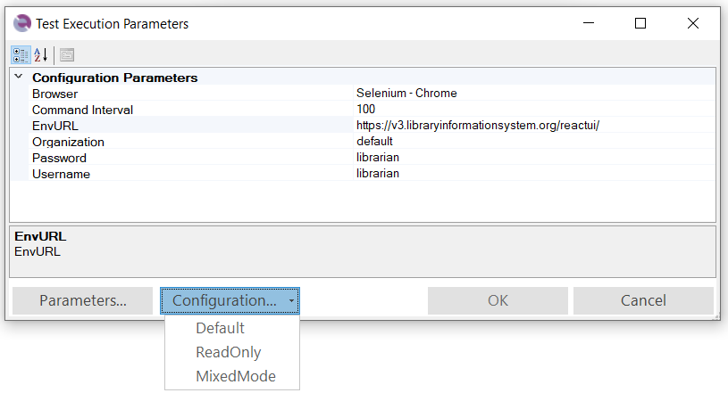

# Choose Test Case Dialog

## Usage

### Recording and Playback

To perform playback or recording within the testing framework, you must specify a test case or a [Module / Page Object](Frameworks/pageobjects.md) as the target for execution or recording, respectively. If Rapise detects an active test case or Page Object, it will be automatically selected, and you simply need to click the *OK* button.

Starting with Rapise 8.1, it is possible to **select multiple test cases for playback**. After execution, Rapise displays a combined report. The status of each test case execution is reflected by icon colors in the Object Tree view. You can also use the `Last Report` menu item from the popup menu for a test case to view individual reports. <a class="headerlink" href="#execute-multiple-test-cases" title="Permanent link">¶</a>

### Test Execution Parameters

This section can also be accessed independently by selecting the `Test > Playback Settings` menu item (requires Rapise 8.2+).

#### Parameters

The bottom section of the dialog allows you to set test parameters. If you need to modify standard test execution parameters, or add new ones, click the *Parameters...* button to open the [Choose Parameters](test_param_chooser.md) dialog.

To specify additional framework-specific parameters, use the Spira Dashboard [Parameters Editor](spira_dashboard_2.md).

#### Configurations

Expand *Configurations...* to apply one of the defined [Configurations](./Frameworks/parameters.md#configurations). Requires Rapise 8.1+.

## See Also

- [Testing Frameworks](Frameworks/frameworks.md)
- [Playback](playback.md)
- [Recording](recording.md)
- [Spira Dashboard](spira_dashboard_2.md)