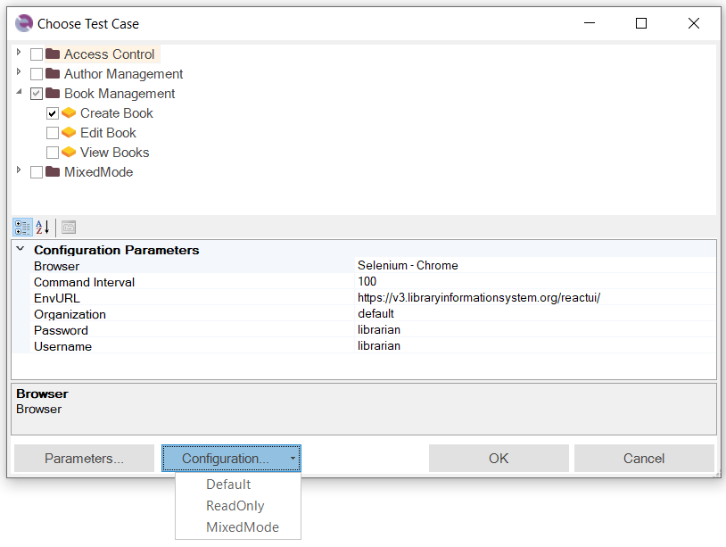

# Choose Test Case Dialog

## Usage

To perform playback or recording within the testing framework, you must have a test case or a [Module / Page Object](Frameworks/pageobjects.md) as the target for execution or recording, respectively. If Rapise detects an active test case or Page Object, it will be automatically selected, and you just need to click the *OK* button.

The bottom section of the dialog allows you to set test parameters. If you need to modify standard parameters related to test execution, you can add missing ones by clicking the *Parameters...* button, which opens the [Choose Parameters](test_param_chooser.md) dialog.

If you want to specify additional framework-specific parameters, you can do so in the Spira Dashboard [Parameters Editor](spira_dashboard_2.md).

## See Also

- [Testing Frameworks](Frameworks/frameworks.md)
- [Playback](playback.md)
- [Recording](recording.md)
- [Spira Dashboard](spira_dashboard_2.md)
