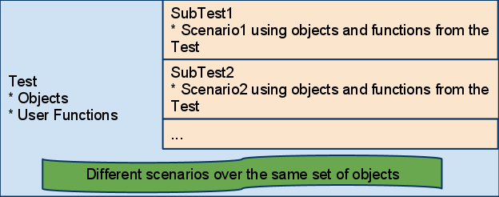
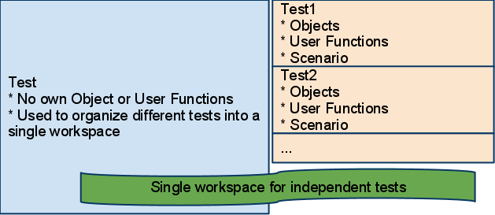
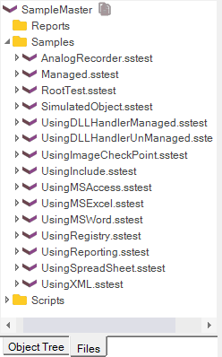
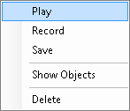

# Tests and Sub-Tests

> Please note that the concept of Sub-Tests has been deprecated since Rapise 8. We recommend using [Testing Frameworks](/Guide/Frameworks/frameworks) as a seamless and natural approach to organizing your tests.

The concept of Sub-Test provides a flexible and organized approach to working with tests. By utilizing sub-tests, you can achieve the following objectives:

1. Create multiple test scenarios that operate on the same set of objects and functions.
2. Organize different test scenarios within a single workspace.
3. Utilize sub-tests for conducting cross-browser tests.

We will consider each of described goals separately. The test containing the sub-test(s) we will call **base** or **parent** test.

## Shared Object Repository and Shared Functions

In this case **parent** test contains all learned objects and user-defined functions.



For example, the parent test may have objects `User Name`, `Password`, `Sign On`. And function

```javascript
function Login(username, password)
{
   ...
}
```

**SubTest1** may be used to check login with valid credentials, `Main.js` from **SubTest1** looks like:

```javascript
function Test(params)
{
   Login("validuser", "validpassword");

   // Now check that login is successful
   Tester.Assert("Login leads to welcome message: ", Global.DoWaitFor('Welcome_User'));
}
```

**SubTest2** may be used to check login with invalid Credentials (i.e. it is a fail-test). `Main.js` from **SubTest2** looks like:

```javascript
function Test(params)
{
   Login("invaliduser", "invvalidpassword");

   // Now check that login is successful
   Tester.Assert("Login leads to invalid user object: ", Global.DoWaitFor('Invalid_User'));
}
```

Function `Login` and objects `Welcome_User` and `Invalid_User` are defined in the **parent** test. The sub-tests are just implementing various scenarios for the same set of objects.

## Local Object Repository and Local Functions

Each test has its own objects, functions and scenarios.



The usage of such an approach is well demonstrated by example. We created a test called **SampleMaster** and put all Rapise samples into it by using **Add File** context menu in the the [Test Tree](test_files_dialog.md) dialog. Finally the Files tree looks like:



All tests in this tree are independent. We use the Sample Master to manage all the tests from a single environment.

## Nested Sub-Tests

Sub-test may have its own nested sub-tests. In this example the parent test contains reference to `CreateNewBook` sub-test having `Login` and `Logout` sub-tests inside:


## Sub-Test Properties

Sub-test properties are available from the `Tag` property in the **Properties** pane:


## Sub-Test Context Menu

The following options are available in the context menu for each of the sub-tests:



- **Play**: Execute selected sub-test
- **Record**: Start recording into selected sub-test
- **Save**: Save options of a sub-test
- **Show Objects**: Show objects form a sub-test in the Object Tree
- **Rename**: Rename this sub-test
- **Clone**: Make a copy of the sub-test
- **Delete**: Remove reference to a sub-test from its parent test 
- **Create Sub-Test...**: Create nested sub-test. It is typical for larger [frameworks](../Intro/framework.md) to have several nested levels of tests for convenience.
- **Open in New Rapise Window...**: By default double-click on the sub-test opens it in the current Rapise window. In the case that you need to have both current test and sub-test open simultaneously you may use this option.

## %WORKDIR% and Frameworks

Test and sub-tests is a recommended way to set up test frameworks with Rapise. `%WORKDIR%` is set to the root test path and it is recommended to use it to refer to other tests or data files.

See sample framework <https://github.com/Inflectra/rapise-framework-examples/tree/master/SpiraFriendlyWithRvlAndUserLib>