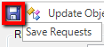
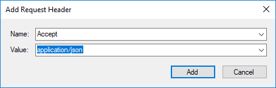
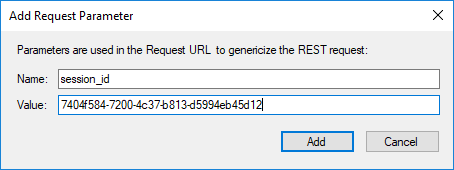

# Toolbar: REST

## Screenshot

## Purpose

The **REST** toolbar is for use with editing [REST web service](rest_web_service.md) definition files.

## How to Open

The **REST** toolbar is available anytime you have a REST definition file (`.rest`) file visible in the [Content View](content_view.md).

## Toolbar Buttons

* `Save Requests` - Saves the current REST request definitions to the `.rest` file.

    

* `Update Object Tree` - Updates the main Rapise [Object Tree](object_tree.md) with the current REST definitions. This turns each of your REST requests into Rapise learned objects that can be scripted against.

* `Add Header` - Allows you to add a standard or custom HTTP header to the current REST request:

    

* `Add Parameter` - Allows you to add a parameter name/value to the current REST request. This is useful when you want your test script to be able to pass through different values (e.g. get book \#1 vs. book \#2):

    

* `Add Credentials` - Allows you to add an HTTP basic authentication credential (username and password) to the request. Saves you having to add the header manually (which would require base64 encoding the username and password):

    
