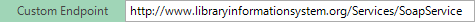

# Toolbar: SOAP

## Screenshot

## Purpose

The **SOAP** tab is for use with editing [SOAP web service](soap_web_services.md) definition files (also known as **W**eb **S**ervice **D**efinition **L**anguage (WSDL) files).

## How to Open

The **SOAP** tab is available anytime you have a SOAP definition file (`.soap`) file visible in the [Content View](content_view.md).

You may also open it from the `View > SOAP` menu items. This will open 1st `.soap` file in the project (if any). Otherwise it does nothing.

If there is no `.soap` file yet in the project, you should use the [Add Web Service Dialog](dialog_add_web_service.md).

## Toolbar Controls

* `Save`  - Saves the current set of SOAP operations to the `.soap` file being edited.

    

* `Endpoint` The Endpoint section lets you enter in the URL to the SOAP Web Service Definition Language (WSDL) file that contains a definition of all the SOAP operations exposed by the web service.

    You enter in the URL in the top box and then click the `Get WSDL` button.

    

* `Get WSDL` - Update service definition based on the current `Endpoint` value. 

*  `Custom Endpoint` - you can click on this button to toggle the display of the custom endpoint text box. This lets you override the default URL returned by the WSDL file and can be useful if you want to use the WSDL from one instance and invoke the operations against a different instance.

    

* `Add Credentials` - Allows you to add an HTTP basic authentication credential (username and password) to the SOAP operation. This is useful for SOAP operations that use HTTP basic authentication.
    
    
    
    

