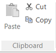
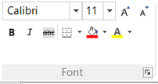
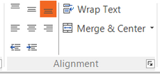
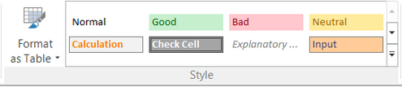
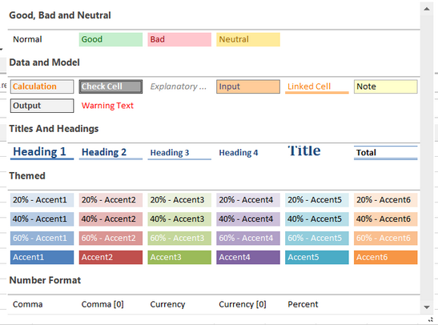
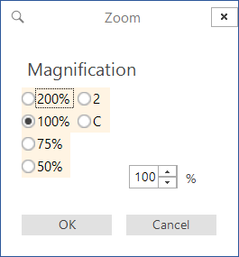
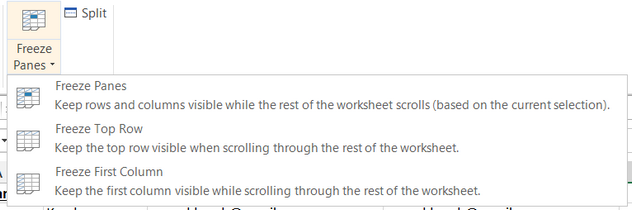

# Toolbar: SpreadSheet Editor
## Ribbon Tab: Spreadsheet

### Screenshot

### Purpose

The **Spreadsheet** tab lets you [edit Microsoft Excel spreadsheet files](spreadsheet_editor.md) from within Rapise. This is useful when you want to be able to edit the test data used in [data-driven automated testing](data_driven_testing.md).

### How to Open

The **Spreadsheet** tab is available anytime you have an excel (xls or xlsx) file visible in the [Content View](content_view.md).

### Clipboard

 

The Clipboard section provides the following options:

* **Paste** - this will paste the spreadsheet cells from the clipboard to the current selection

* **Cut** - this will cut the current selection and put into the clipboard for pasting

* **Copy** - this will copy the current selection and put into the clipboard for pasting

 

### Font

The Font section provides the following options:

* **Font Name** - this lets you change the font typeface used in the
selected cells

* **Font Size** - this lets you specify the exact font size to use

* **Increase Font Size** - this lets you increase the current font size by 1pt

* **Decrease Font Size** - this lets you decrease the current font size by 1pt

* **Bold** - this lets you make the selected text bold

* **Italic** - this lets you make the selected text italics

* **Strikethrough** - this lets you mark the text as deleted
(strikethrough)

* **Borders** - this lets you change the borders for the selected cells

* **Fill Color** - this lets you change the background color of the selected cells

* **Text Color** - this lets you change the foreground color of the selected cells

 

### Alignment

The Alignment section provides the following options:

* **Top Align** - This aligns the cell text vertically to the top

* **Middle Align** - This aligns the cell text vertically to the middle

* **Bottom Align** - This aligns the cell text vertically to the bottom

* **Left Align -** This aligns the cell text horizontally to the left

* **Center Align** -This aligns the cell text horizontally to the center

* **Right Align** -This aligns the cell text horizontally to the right

* **Outdent** - This reduces the indentation of the text by one position

* **Indent** - This increases the indentation of the text by one position

* **Wrap Text** - This turns on/off the wrapping of text inside the selected cells

* **Merge & Center** - This gives you options to merge and center multiple cells:

    

### Style

The Style section provides the following options:

* **Format as Table** - this lets you automatically format a range of cells as a predefined table style:

    

* **Prebuilt Styles** - this option displays a list of predefined styles that you can apply to the selected cells:

    

### Cells

The Cells section provides the following options:

* **Insert** - this menu option lets you insert new cells, rows, columns, or even a whole sheet.

* **Delete** -this menu option lets you delete specific cells, rows, columns, or even a whole sheet.

* **Format**:

* * **Cell Size** - this option lets you specify the row height and/or column width

* * **Visibility** - this option lets you show/hide specific rows or columns (they are not removed, unlike delete, just hidden)

* * **Organize Sheets** - this option lets you rename the name of the sheet.

## Ribbon Tab: View

### Screenshot

### Purpose

The **View** tab lets you change the display of Microsoft Excel spreadsheet files from within Rapise. This is useful when you want to be able to edit the test data used in [data-driven automated testing](data_driven_testing.md).

### How to Open

The **View** tab is available anytime you have an excel (xls or xlsx) file visible in the [Content View](content_view.md).

### Show
This section lets you choose whether to display the gridlines, formula bar and/or the headings in the [spreadsheet editor](spreadsheet_editor.md).

### Zoom
This section contains the following options:
*   **Zoom** - This lets you change the display zoom level:

*   **100%** - This quickly resets the zoom back to 100%
*   **Zoom to Selection** - This auto-zooms to display the current selection

### Window
This section contains the following options:
*   **Freeze Panes** - this lets you freeze specific rows/columns so that they don't scroll:

*   **Split** - this lets you split the display into multiple windows
