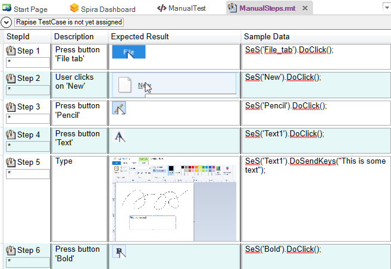
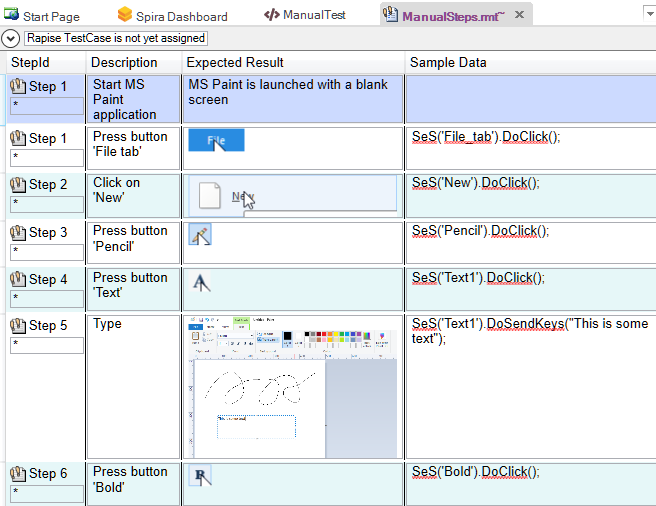
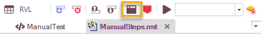
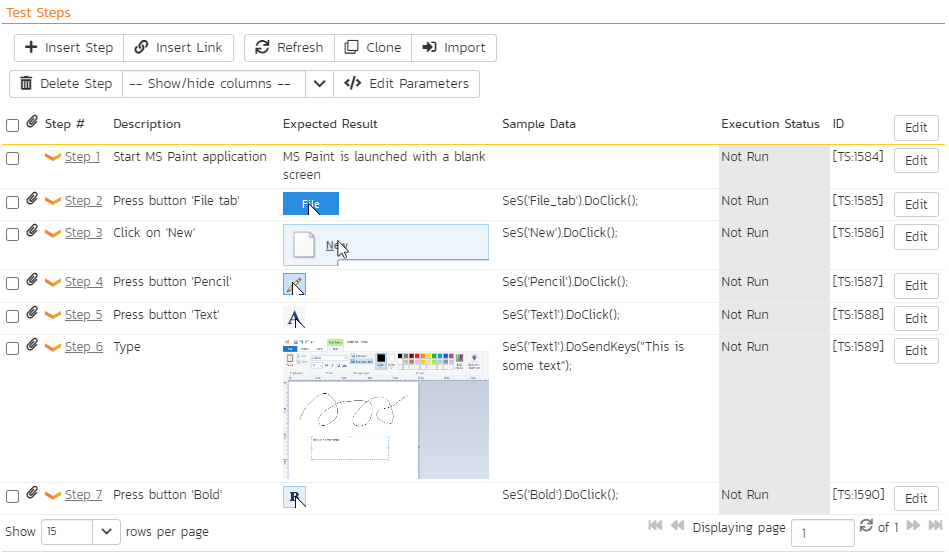
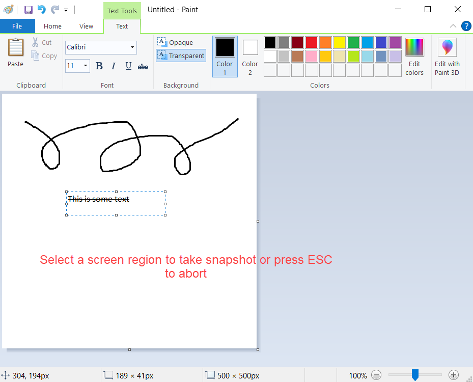
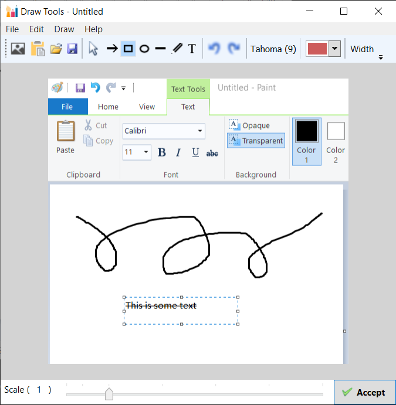
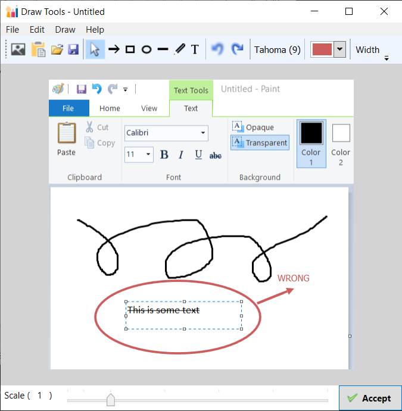
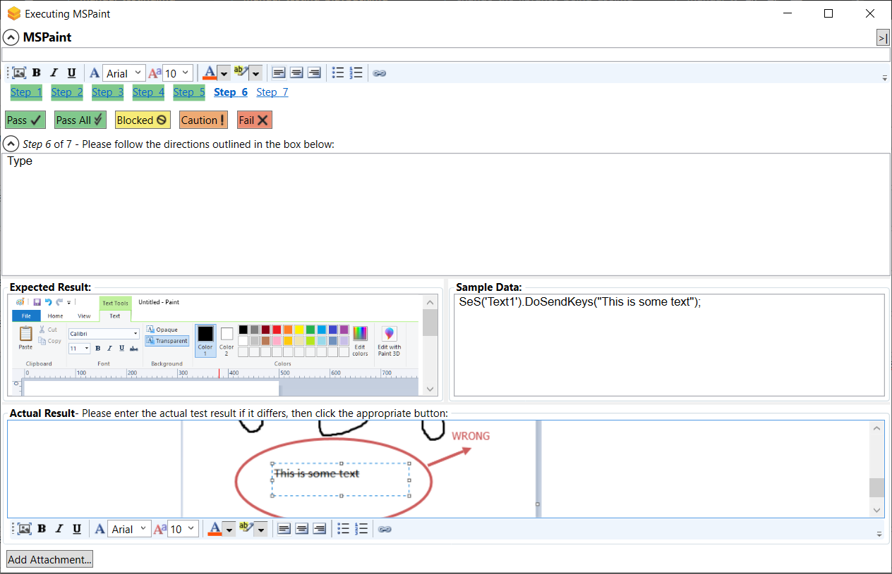
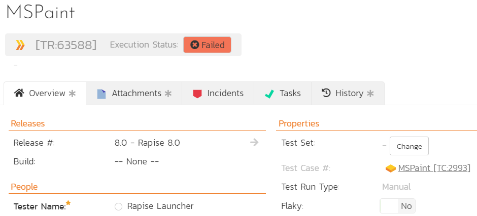
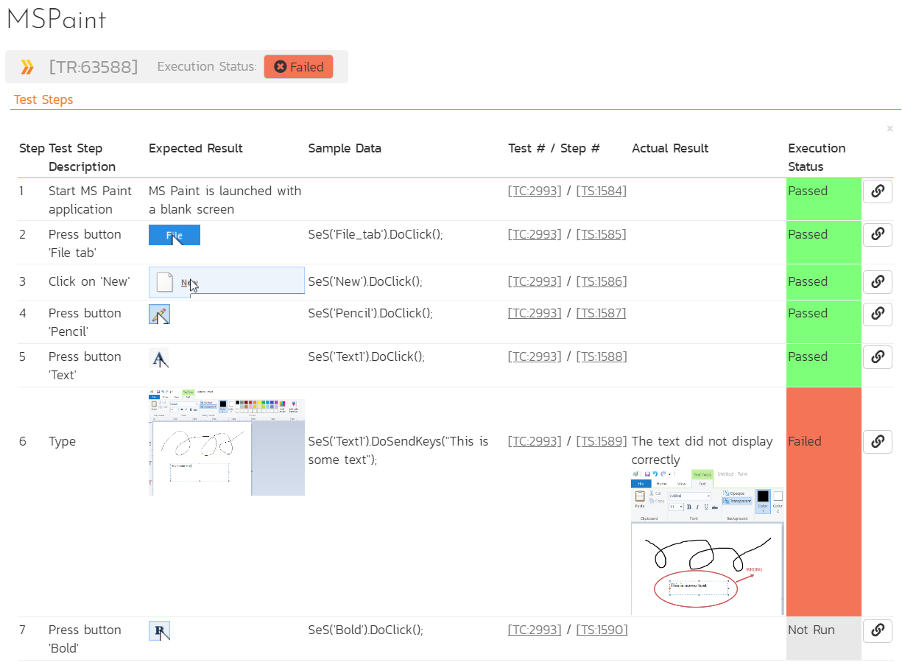

# Tutorial: Manual Testing

## Purpose

**Exploratory manual testing** is used for situations where you have a **new or changing application** and the user interface is still evolving. Traditional manual testing, where you create a test case ahead of time, define prescriptive test steps, and then assign them to a tester, is not practical in such cases. The solution is to perform **exploratory testing**, where you explore the application while simultaneously creating the test script. The created test script can then be published to your test management system (i.e., [SpiraTest](spiratest_integration.md)) for future regression testing.

Rapise can help **accelerate and optimize** exploratory manual testing. Rapise lets you walk through the application, capturing your interactions as you use the application, and recording screenshots of the objects and screens you interact with. Based on this, Rapise will create a fully formed test script ready for use.

## Step 1 - Creating a New Test

To start manual testing, simply create your test as normal using the [New Test](create_a_new_test.md) dialog box and choose **Manual** methodology:

Once the test has been created, click the `Tools > Manual Steps` menu item to be taken to the [Manual Editor](manual_test_editor.md), with the [Manual Toolbar](menu_and_toolbars.md#manual-toolbar) visible.

The test step list will initially be empty:

## Step 2 - Recording Some Steps

Now, open the application you want to record. In this example, we will be testing the built-in **Microsoft Paint** application. This is a good candidate for manual testing, as much of its functionality is difficult to test automatically due to its simple drawing canvas, rather than discrete buttons and data elements.

To ensure that screenshots are recorded, while keeping their size reasonable, use the following recording options:

Now click the **Record Manual** button (or menu `Test > Record Manual`) and choose MS Paint from the list of running applications in the [Select Application to Record](select_an_application_to_record_dialog.md) dialog, then click **'Select'** to start recording.

As you click through the application, the recording will display the list of steps and actions being captured:

In this example, we created a new canvas, chose the Pencil tool, drew a design using the pencil, entered some text, and then made it bold:

When you click **Finish** to complete the recording, Rapise will display the list of populated manual test steps, complete with embedded screen captures:

Notice that each recorded test step already has a `Description` and an `Expected Result`, along with a screenshot of the user's actions. In addition, the `Sample Data` contains the equivalent Rapise automation code for reference. This can be useful later if you decide to automate this test.

## Step 3 - Editing the Steps

Typically, you may want to **add some additional steps** (e.g., we added a line to describe the process of starting MS Paint), **delete any duplicate or unnecessary steps**, and **reword them** to make the most sense to the tester. In our example, we used the [manual editing](manual_test_editor.md) screen to update the steps as follows:

Click **Save** to ensure all updates are saved locally. Before you can [execute these tests](manual_testing_playback.md), you will need to save them to [Spira](spiratest_integration.md) (our web-based test management system).

## Step 4 - Saving to Spira

Click the **Save to Spira** option. You will be asked to confirm the creation of the document folder in Spira that will hold the test files:

Click **Create**, and then click **OK** in the `Synchronize Files` dialog. The manual test will be saved to Spira. You will see that this process adds unique Spira test step IDs to each step. They are displayed using the format [TS:xxx]. This special token [TS:xxx] can be used in `Tester.Assert` commands to relate specific [verification points](checkpoints.md) with test steps during automated testing.

Now that the test has been saved in Spira, you can click the **View Manual Test in Spira** toolbar button to see how the test steps appear within Spira.

Now that we have finished the recording, we can play back this manual test.

## Step 5 - Executing the Manual Test

Choose the Release from the list of available releases in the project:

{width="232px"}

Then, click the **Execute** icon to start manual test execution. This will bring up the [manual playback](manual_playback.md) screen:

On this screen, we will follow the steps listed in the test case. This involves opening MS Paint, creating a new canvas, adding some lines using the pencil, and then adding some text using the text tool. As you perform these steps, click the `Pass` button to indicate that each step has passed. You can also minimize the manual playback screen by clicking the `>|` button.

Once you reach Step 6, we will pretend that MS Paint failed to display the text correctly. Enter a message to that effect in the Actual Result field:

Next, we will attach a screenshot of what actually happened and log a test failure.

## Step 6 - Capturing and Annotating a Screenshot

Click the **Image icon** in the rich text editor associated with the **Actual Result** text box. This will bring up the [Drawing Tools](image_capture.md) screen, which prompts you to draw a rectangle to select a portion of the current screen for capture:

If the MS Paint application is not in the foreground, simply press ++esc++ on your keyboard to abort, rearrange your windows, and then try again.
Once you have selected the rectangle, the drawing tools will display your selected image in the image editor:

{width="540px"}

You can now use the annotation tools to add labels, text, and other items to explain the issue you found:

{width="540px"}

In the example above, we added a red ellipse, arrow, and text to mark the issue observed in MS Paint. Once you are satisfied with your image, click **Accept**, and the image will be included in the test's Actual Result:

Finally, **Fail** Step 6 and click the **Finish** button.

{width="453px"}

The results will be posted to [Spira](spiratest_integration.md).

## Step 7 - Viewing the Results

To view the results in Spira, click the [View > View Manual Test in Spira](spira_dashboard.md) menu. This will bring up the test case in Spira. Now, click the `Failed` hyperlink in Spira, and the new test run will be displayed:

{width="752px"}

If you scroll down, you can see the individual test steps that were executed, along with the associated actual result (including the captured screenshot):

Congratulations! You have now successfully executed a manual test using Rapise.

## See Also

- [Manual Testing](manual_testing.md)
- [Manual Recording](manual_testing_recording.md)
- [Manual Playback](manual_testing_playback.md)