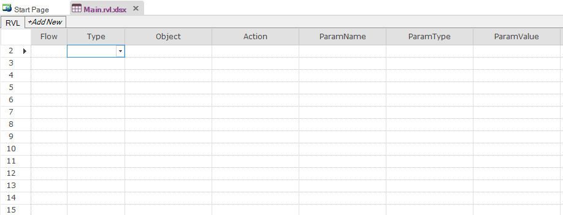
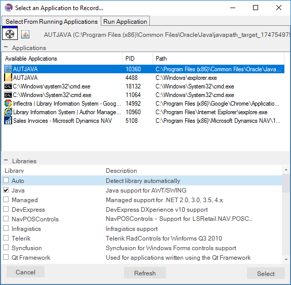
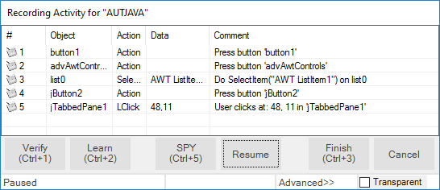
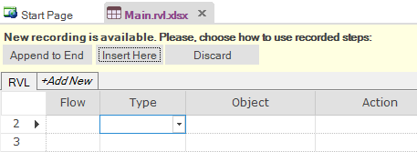
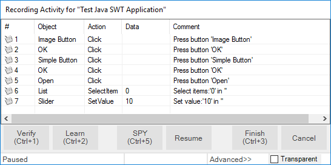
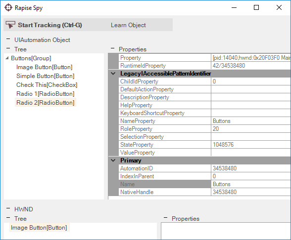

# Tutorial: Java Testing (RVL)

In this section, you will learn how to record and execute a Rapise script against a Java applications. We will show you have to test the following three different types of Java application:

- Java AWT Apps
- Java Swing Apps
- Java SWT Apps

This version of the tutorial uses the **Rapise Visual Language (RVL) scriptless** mode. If you're interested in the [JavaScript version](tutorial_java_using_javascript.md), we have a separate tutorial.

## Example 1 - Launching the Sample AWT/Swing Application

On the [Start Page](start_page.md) of Rapise, click on the **Fetch Samples** button to make sure you have all of the latest samples available.

Then go to

    C:\Users\Public\Documents\Rapise\Samples\Java\AUTJAVA

and right-click on the `x86run.cmd` file and choose **Run as Administrator**.

If you have Java configured correctly, you will see:

If the application doesn't start correctly, make sure you have Java SE and the [Rapise Java Bridge](java_awt_swing_testing.md) installed and the JAVA_HOME environment variable correctly set to your Java Runtime (JRE). For more details on this, please refer to: [Java AWT/Swing Testing](java_awt_swing_testing.md).

Once the application is started, open up Rapise and click `File > New Test`:

Enter the name `Java Test 1` as the name and choose **Basic: Windows Desktop Application** as the methodology.

On the next page, choose **Rapise Visual Language (RVL)** as the choice of Scripting language:

Once the test is created, you will see:

Click on the **Record** button to display the ["Select an Application to Record"](select_an_application_to_record_dialog.md) dialog:

Choose the **AUT JAVA** process from the list of running applications, change the library selection from Auto to **Java** and click **Select**.

Now in the sample application click on some of the AWT and/or Swing controls. Rapise will record the actions:

When you click **Finish**, Rapise will prompt you to confirm where you want the recorded test steps to be placed:

Select the first row in the test grid and click **Insert Here**. You will see the recorded test script and learned objects in Rapise:

When you click **Play**, Rapise will play back your test script against the application:

You can add steps to your script using any of the learned objects from the left-hand page (or any of the standard Global utility objects).
To do this, click on the blank row at the end of the recording and choose the following options from the dropdown lists in that row, for example:

- Type = Action
- Object = button1
- Action = DoAction

This process is illustrated below:

Sometimes you need to learn objects that are not visible or are obscured by other objects. To help with this, Rapise has the Object Spy tool. The Spy tool lets you see the objects in the application in a hierarchy that you can learn. When you are in the middle of recording, click on the **Spy** button and Rapise will display the [Java Spy](object_spy_java.md):

You can then use the [Java Spy](object_spy_java.md) to track and find objects in the application hierarchy. You can navigate to parent objects by right-clicking on them and choosing **Parent**. Once you have found the desired object, click on the **Learn Object** in the Spy toolbar and Rapise will add the object in the Spy to the list of learned objects that you can test against.

## Example 2 - Launching the Sample SWT Application

On the [Start Page](start_page.md) of Rapise, click on the **Fetch Samples** button to make sure you have all of the latest samples available.

Then go to

    C:\Users\Public\Documents\Rapise\Samples\JavaSWT\AUTJavaSWT

and double-click on the `JavaSWTAUT.bat` file to start the sample application.

If you have Java configured correctly, you will see:

If the application doesn't start correctly, make sure you have Java SE installed and the JAVA_HOME environment variable correctly set to your Java Runtime (JRE). For more details on this, please refer to: [Java SWT Testing](java_swt.md).

Once the application is started, open up Rapise and click the menu `FIle > New Test`:

Enter the name "Java Test 2" as the name and choose **Basic: Windows Desktop Application** as the methodology.
On the next page, choose **Rapise Visual Language (RVL)** as the choice of Scripting language:

Once the test is created, you will see:

Click on the **Record** button to display the [Select an Application to Record](select_an_application_to_record_dialog.md) dialog:

Choose the **Test Java SWT Application** from the list of running applications, change the library selection from Auto to **UI Automation** and **SWT** and click **Select**.

Now in the sample application click on some of the SWT controls. Rapise will record the actions:

When you click **Finish**, Rapise will prompt you to confirm where you want the recorded test steps to be placed:

Select the first row in the test grid and click **Insert Here**. You will see the recorded test script and learned objects in Rapise:

When you click **Play**, Rapise will play back your test script against the application:

You can add steps to your script using any of the learned objects from the left-hand page (or any of the standard Global utility objects).
To do this, click on the blank row at the end of the recording and choose the following options from the dropdown lists in that row, for example:

- Type = Action
- Object = Image_Button
- Action = DoAction

This process is illustrated below:

You can drag and drop any of the learned objects from the left-hand pane into the main test script.

When you click **Play**, Rapise will play back your test script against the application.

Sometimes you need to learn objects that are not visible or are obscured by other objects. To help with this, Rapise has the Object Spy tool. The Spy tool lets you see the objects in the application in a hierarchy that you can learn. When you are in the middle of recording, click on the **Spy** button and Rapise will display the [UIAutomation Spy](object_spy_uiautomation.md):

You can then use the [UIAutomation Spy](object_spy_uiautomation.md) to track and find objects in the application hierarchy. You can navigate to parent objects by right-clicking on them and choosing **Parent**. Once you have found the desired object, click on the **Learn Object** in the Spy toolbar and Rapise will add the object in the Spy to the list of learned objects that you can test against.

## See Also

- [Java AWT/Swing Testing](java_awt_swing_testing.md)
- [Java SWT Testing](java_swt.md)
