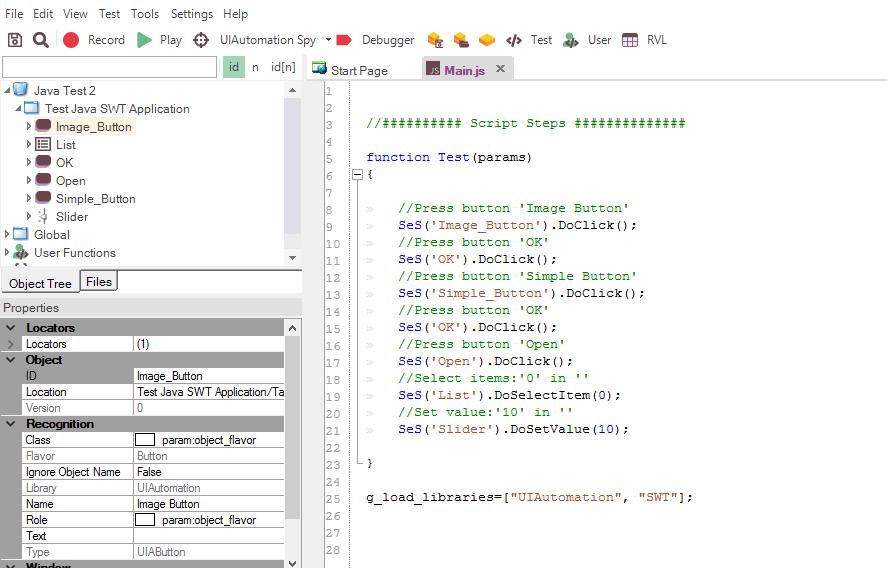
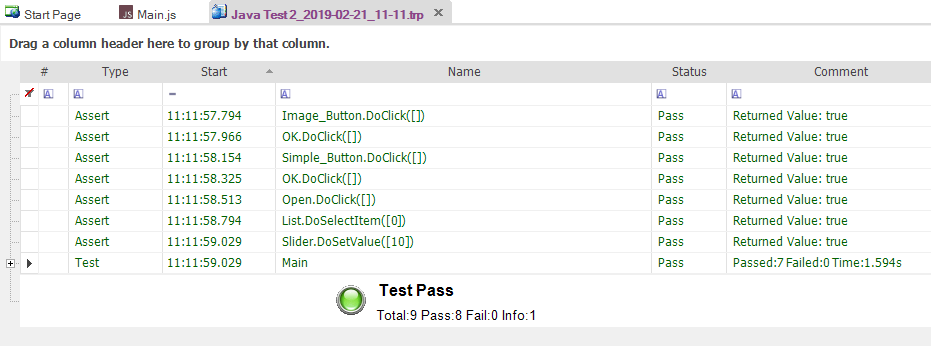

# Tutorial: Java Testing (JavaScript)

In this section, you will learn how to record and execute a Rapise script against Java applications. We will show you how to test the following three different types of Java applications:

- Java AWT Apps
- Java Swing Apps
- Java SWT Apps

This version of the tutorial uses the JavaScript test editor option in Rapise. If you'd prefer to use the [Rapise Visual Language (RVL)](visual_language.md), please refer to the main [Tutorial](tutorial_java_testing.md) instead.

## Example 1 - Launching the Sample AWT/Swing Application

On the [Start Page](start_page.md) of Rapise, click the **Fetch Samples** button to ensure you have all the latest samples available.

Then, navigate to

    C:\Users\Public\Documents\Rapise\Samples\Java\AUTJAVA

and right-click the `x86run.cmd` file and choose **Run as Administrator**.

If Java is configured correctly, you will see:

If the application doesn't start correctly, ensure Java SE and the [Rapise Java Bridge](java_awt_swing_testing.md) are installed, and the `JAVA_HOME` environment variable is correctly set to your Java Runtime (JRE). For more details, please refer to: [Java AWT/Swing Testing](java_awt_swing_testing.md).

Once the application is started, open Rapise and click `File > New Test`:

Enter `Java Test 1` as the name and choose **Basic: Windows Desktop Application** as the methodology.

Choose the **JavaScript** option during test creation, instead of RVL.

Once the test is created, you will see:

Click the **Record** button to display the ["Select an Application to Record"](select_an_application_to_record_dialog.md) dialog:

Choose the **AUT JAVA** process from the list of running applications, change the library selection from `Auto` to **Java**, and click **Select**.

Now, in the sample application, click some of the AWT and/or Swing controls. Rapise will record your actions:

When you click **Finish**, you will see the recorded test script and learned objects:

You can drag and drop any learned objects from the left-hand pane into the main test script. You can also simply type `SeS("button1")` (for example), and Rapise will display the list of available functions.

When you click **Play**, Rapise will play back your test script against the application:

Sometimes, you need to learn objects that are not visible or are obscured by other objects. To assist with this, Rapise provides the Object Spy tool. The Spy tool allows you to view the objects in the application within a hierarchy that you can learn. While recording, click the **Spy** button, and Rapise will display the [Java Spy](object_spy_java.md):

You can then use the [Java Spy](object_spy_java.md) to track and find objects within the application hierarchy. You can navigate to parent objects by right-clicking them and choosing **Parent**. Once you have found the desired object, click the **Learn Object** button in the Spy toolbar, and Rapise will add the object from the Spy to the list of learned objects that you can test against.

## Example 2 - Launching the Sample SWT Application

On the [Start Page](start_page.md) of Rapise, click the **Fetch Samples** button to ensure you have all the latest samples available.

Then, navigate to

    C:\Users\Public\Documents\Rapise\Samples\JavaSWT\AUTJavaSWT

and double-click the `JavaSWTAUT.bat` file to start the sample application.

If Java is configured correctly, you will see:

If the application doesn't start correctly, ensure Java SE is installed and the `JAVA_HOME` environment variable is correctly set to your Java Runtime (JRE). For more details, please refer to: [Java SWT Testing](java_swt.md).

Once the application is started, open Rapise and click `File > New Test`:

Enter `Java Test 2` as the name and choose **Basic: Windows Desktop Application** as the methodology.

Choose the **JavaScript** option during test creation, instead of RVL.

Once the test is created, you will see:

Click the **Record** button to display the [Select an Application to Record](select_an_application_to_record_dialog.md) dialog:

Choose **Test Java SWT Application** from the list of running applications, change the library selection from `Auto` to **UI Automation** and **SWT**, and click **Select**.

Now, in the sample application, click some of the SWT controls. Rapise will record your actions:

When you click **Finish**, you will see the recorded test script and learned objects:

You can drag and drop any learned objects from the left-hand pane into the main test script. You can also simply type `SeS("OK")` (for example), and Rapise will display the list of available functions.

When you click **Play**, Rapise will play back your test script against the application:

Sometimes, you need to learn objects that are not visible or are obscured by other objects. To assist with this, Rapise provides the Object Spy tool. The Spy tool allows you to view the objects in the application within a hierarchy that you can learn. While recording, click the **Spy** button, and Rapise will display the [UIAutomation Spy](object_spy_uiautomation.md):

You can then use the [UIAutomation Spy](object_spy_uiautomation.md) to track and find objects within the application hierarchy. You can navigate to parent objects by right-clicking them and choosing **Parent**. Once you have found the desired object, click the **Learn Object** button in the Spy toolbar, and Rapise will add the object from the Spy to the list of learned objects that you can test against.

## See Also

- [Java AWT/Swing Testing](java_awt_swing_testing.md)
- [Java SWT Testing](java_swt.md)