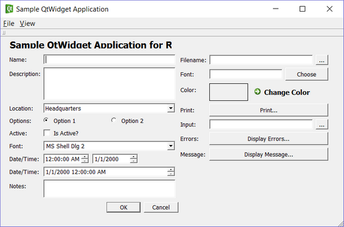
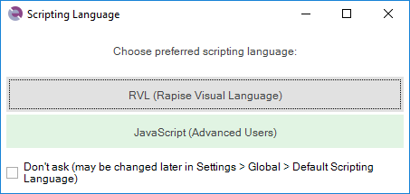
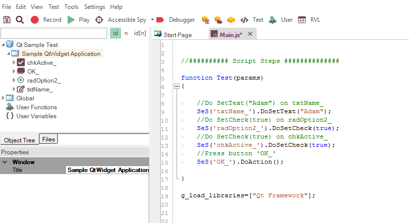

# Using JavaScript

Rapise includes support for testing applications written using the Qt Framework and QWidget controls.

To ensure Rapise can access the UI elements and properties within the Qt application under test, [MSAA (Microsoft Active Accessibility) support must be enabled for your Qt application](qt_framework_testing.md). This provides additional information about Qt UI elements to automation software like Rapise and can be accomplished by shipping and loading the "Accessible Plug-in," included in the Qt SDK (Software Development Kit), along with the Qt application under test (see below).

This tutorial illustrates Rapise's ability to test such Qt applications using a sample application that already includes MSAA support.

This version of the tutorial uses the JavaScript test editor option in Rapise. If you'd prefer to use the [Rapise Visual Language (RVL)](visual_language.md), please go to the main [Tutorial](tutorial_qt_framework.md) instead.

## Testing the Sample Qt Application

On Rapise's [Start Page](start_page.md), click the **Fetch Samples** button to ensure you have the latest samples available.

Then go to
    
    C:\Users\Public\Documents\Rapise\Samples\QtFramework
    
and double-click the `QtWidgetApp.exe` file to start the sample application.

If you have everything configured correctly, you will see:

Once the application is started, open Rapise and click `File > New Test` from the menu:

Enter **Qt Sample Test** as the name and choose **Basic: Windows Desktop Application** as the methodology.
Then choose JavaScript as the scripting choice:

Once the test is created, you will see:

Click the **Record** button to display the ["Select an Application to Record"](select_an_application_to_record_dialog.md) dialog:

Choose the **Sample QtWidget Application** from the list of running applications, change the library selection from **Auto** to **Qt Framework**, and click `Select`.

Now, in the sample application, click some of the Qt controls. Rapise will record the actions:

When you click **Finish**, you will see the recorded test script and learned objects:

You can drag and drop any of the learned objects from the left-hand pane onto the main test script. You can also simply type `SeS("OK_")` (for example), and Rapise will display a list of available functions.

When you click **Play**, Rapise will play back your test script against the application:

Sometimes, you need to learn objects that are not visible or are obscured by other objects. To help with this, Rapise includes the Object Spy tool.

The Spy tool allows you to view objects in the application within a hierarchy that you can learn.

During recording, click the **Spy** button, and Rapise will display the [Accessible Spy](object_spy_accessible.md):

You can then use the [Accessible Spy](object_spy_accessible.md) to track and locate objects within the application hierarchy. You can navigate to parent objects by right-clicking them and choosing **Parent**. Once you have found the desired object, click the **Learn Object** button in the Spy toolbar, and Rapise will add the object from the Spy to the list of learned objects that you can use for testing.

## See Also

- [Testing Qt Framework Applications](qt_framework_testing.md)