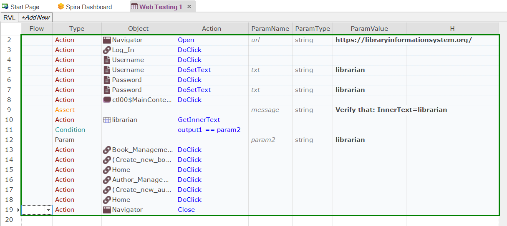
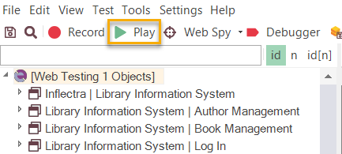
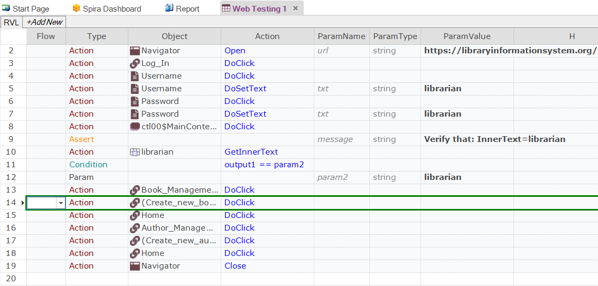

# Tutorial: Web Testing (RVL)

In this section, you will learn how to record and execute a Rapise script against a web application. We will be using a demo application called [**Library Information System**](http://libraryinformationsystem.org/). Our test will be simple: it will log on to the library catalog, navigate to the main menu, and click on all of the menu options to ensure the links are working.

You are viewing the **codeless** version of the tutorial. It demonstrates usage of [Rapise Visual Language](/RVL/Overview/). To view the JavaScript-based tutorial, click [here](tutorial_web_using_javascript.md).

## Open Rapise and Create New Test

Go to **Start** &gt; **All Programs** &gt; **Inflectra** &gt; **Rapise**. The following window should appear.

Select `File > Create New > New Test` in the main menu.

{width="480px"}

If this is your first time using Rapise on this computer, you may see the following dialog box:

{width="508px"}

If you see this, it means Rapise is trying to [connect to a SpiraTest server](spiratest_integration.md). **SpiraTest** is our web-based [test management system](spiratest_integration.md). It is a powerful tool that can store your Rapise tests and deploy them to remote machines for automated regression testing. For now, however, just click the **\[Cancel\]** button, and you will see the [new test dialog](create_new_test_dialog.md):

{width="633px"}

Now, enter the name of your new test **‘Web Testing 1’**, and click **Web**. Since you chose a web test, you will now need to choose the initial [web browser profile](selenium_settings_dialog.md) (don’t worry, you can easily change it later):

{width="469px"}

Choose **Selenium - Chrome** from the list of options.

Next, you will be asked if you want to create your tests using the scriptless **Rapise Visual Language (RVL)** technology or JavaScript. For this example, we will use the RVL scriptless approach. If you’re interested in creating the test using JavaScript instead, please refer to the section: [Tutorial: Web Testing (JavaScript)](tutorial_web_using_javascript.md).

{width="483px"}

Rapise will create the new test, and you will see the empty recording grid:

{width="907px"}

You are now ready to record your first test.

## Record Test Steps

In the Rapise window, press the **Record** button on the toolbar.

The `Browser URL` dialog will appear. Type the initial URL <https://www.libraryinformationsystem.org> and click `OK`.

{width="696px"}

The browser will navigate to the following page:

{width="805px"}

The [Recording Activity Dialog](recording_activity_dialog.md) (RA dialog) will appear:

{width="572px"}

The **RA dialog** has a grid. As you interact with the sample Library Information System program, the grid will automatically populate with your actions.

Let's begin creating the test. On the Library Information System login page, click the **Log In** link in the top-right corner of the screen.

In the **Username** text box, type `librarian`.

Next, click the **Password** text box. You'll notice that the **RA dialog** has changed. Your actions (clicking Log-In and entering a username) are listed in the grid:

{width="571px"}

The password for user `librarian` is also `librarian`. Type the password, and then press the **Log-In** button.

Three more rows should appear in the **RA dialog**: two rows to represent clicking the password field and entering the password, and one to represent the button click:

{width="639px"}

You should now be on the main menu of the `Library Information System` with the user's name listed in the top-right corner:

{width="956px"}

Hover the mouse over the "Welcome **librarian**" username label in the top-right corner and press ++ctrl+1++ to bring up the Verify dialog box:

{width="498px"}

This box lets you add a checkpoint to verify the properties of an object on the screen.

Select the `Inner Text` option and click the `OK` button to close the dialog. This will add the verification check to your list of recorded actions:

{width="639px"}

Click the **Book Management** button. It is highlighted in the next screenshot:

You should now be on the Book Management page (see image below).

Click the **Create new book** link:

You should now be on the Create New Book page (see image below). Click the **HOME** button to go back to the main menu.

Now, click the **Author Management** button:

You should now be on the Author Management page (see image below):

Click the **Create New Author** link:

You should now be on the Create New Author page (see image below). Click the **Home** button to go back to the main menu.

At this point, there should be 14 rows in the **RA dialog** grid.

You are now back on the Main Menu. Click **Log Out** (top-right) and close the browser.

To end the recording session, either press `CTRL+3` or click the `Finish` button on the **RA dialog**.

Rapise will ask you whether you want to use this recording or discard it:

Click the `Append to End` button, and Rapise will insert the recorded steps into the test grid:

{width="972px"}

Let's save our test. Press the `Save` button at the top left of the Rapise window.

{width="346px"}

## Playback

To execute the script, press the `Play` button on the toolbar.

{width="346px"}

Rapise will open a new instance of Chrome to the correct URL (<https://libraryinformationsystem.org>) when the test begins.

After execution, a screen like the one below will appear. Each row represents a step in the test. Rows with green text indicate steps that passed, whereas rows with red text indicate steps that failed.

{width="708px"}

For more information on the report, see [Automated Reporting](automated_reporting.md).

## Playback in Other Browsers

Now that we have recorded our test in Chrome, we want to play the same script back in other browsers. This is very easy to do. Find the **web browser dropdown** in the top-right corner of the Rapise window, select a different browser (e.g., Selenium - Edge, Selenium - Firefox, etc.), and click the `Play` button.

{width="233px"}

## Track and Learn Object Using the Web Spy

This section will demonstrate how you can use Rapise to inspect objects on a web page and learn them for testing. This is useful when testing more complex applications where you need to pick specific objects. For example, you may want to select one of the books in the grid based on its name rather than its row number (which may change if you add books).

On the toolbar, expand the dropdown list for the **Spy** tool and make sure that `Web` is selected:

{width="218px"}

Now, click the main `Spy` tool icon, and Rapise will start the [Web Spy](web_spy.md):

{width="912px"}

Go back to the web page and log in to the **Library Information System** with the same **login/password (librarian/librarian)**, and click the `Book Management` menu item so that the list of books is displayed:

Now, back in the [Web Spy](web_spy.md), click the `Get Snapshot` button to refresh the Web Spy and display the HTML elements (called the DOM tree) that make up this page:

{width="912px"}

Once it has loaded the DOM tree, you can expand or collapse the elements to see how the web page is constructed. This is useful when testing an application, since many of the HTML elements on a page may be used for layout purposes and will not be visible in the browser. In the example page, we have expanded some of the nodes to display the main section of the page and the table that contains the list of books.

Additionally, you can use the `Track (Ctrl+T)` tool to select an item on the web page and have it highlighted in the DOM tree. For example, if we want to find the cell that contains the book title `Amsterdam`, simply press ++ctrl+t++ on the keyboard, move the mouse over the cell on the webpage, wait for the red highlighting rectangle to appear, and then click ++ctrl+t++ again. Rapise will now automatically highlight that item in the DOM Tree:

{width="910px"}

You can see all the properties of this HTML element displayed on the right, specifically:

- **tagName** of the element (td),
- **text** of the element (Amsterdam),
- HTML attributes in the **Properties** section,
- CSS and XPath expressions for locating this element in **Selectors** section.

If you want to use this object in a Rapise test script, you can simply double-click it in the DOM tree. This action will populate the edit field on the toolbar. Then, click the `Learn` button, and the HTML element will be added to the Recording Activity Dialog:

{width="572px"}

Click `Finish`, and the object will be added to your test’s Object Tree:

{width="349px"}

To use this new object in our test script, simply use the test editor to add the appropriate command. For example, if you wanted to get the textual value of the cell in your test, click the row in the grid after **Book Management – DoClick**:

{width="906px"}

Now, click the `Insert Row Before` button in the main Test ribbon to add a new row:

{width="478px"}

This will insert a new row into the test. In this new row, left-click each of the cells (as illustrated below) and pick the following values from the dropdown lists:

{width="546px"}

Then choose the following:

- **Type** = Action
- **Object** = Amsterdam
- **Action** = GetInnerText

You should now have the following:

{width="560px"}

## Test XPATH and Learn Object Using the Web Spy

In addition to letting Rapise automatically learn the object from the Web Spy, you can manually enter **XPATH** or **CSS** queries to find matching elements on the page and then learn those for use in your test.

For example, suppose we want to dynamically find the row that has the cell containing `Amsterdam` and then click its **Edit** hyperlink.

Open up the Web Spy as before:

{width="912px"}

On the toolbar, enter the following to locate the table:

    //table[@id='MainContent_grdBooks']

{width="718px"}

Now, click the `Test` button to display the matching results:

{width="594px"}

Now that we have matched the table, we need to add dynamic XPath to find any row that has the cell containing `Amsterdam` and then click its **Edit** hyperlink. You can expand the table and visually see the rows and cells, which will help create the XPATH:

    //table[@id='MainContent_grdBooks']//tr/td[text()='Amsterdam']/../td[5]/a

This XPath consists of the following elements:

1. Find the table with the specified ID.
2. Find any row inside that table that contains a cell with the text `Amsterdam`.
3. For any matching cell, get its parent row, and inside the fifth cell, get any hyperlink.

In this case, that will correctly locate the Edit link for the book `Amsterdam`. Now that we have the correct item identified, click the `Learn` button to the right of the `Test` button. This will now learn a new object that corresponds to the `Edit Amsterdam` object:

{width="572px"}

Click `Finish`, and the object will be added to the Object Tree of the current test:

{width="341px"}

## Modify the Test

To click this object, simply click the row in the grid where you want this action to occur and choose **Insert Row Before** from the toolbar:

{width="562px"}

In this new row, right-click each of the cells and pick the following values from the dropdown lists:

- **Type** = Action
- **Object** = Edit
- **Action** = DoClick

So your test will now look like:

{width="567px"}

Since clicking the Edit link will take you to a different page than where the `Create New Book` link is available, we need to add another row and add:

- **Type** = Action
- **Object** = Book_Management
- **Action** = DoClick

so that Rapise goes back to the main book list page before executing the Create New Book step. If we didn't do this, the test would have failed.

This means the test will now look like:

{width="579px"}

Now the line:

{width="570px"}

by itself does nothing; it just gets the text.

So, to make the test more useful, we can use the **Assert** command to turn this into a test for the correct value. To make the change, simply delete this entire row using the **Delete Current Row** option on the toolbar and add a new blank row in its place.

Now, choose the Type as **Assert** and press **TAB** on the keyboard. You will now have the following:

{width="830px"}

This is a generic placeholder for any type of assertion. We first need to change the value of the message `TBD` to something meaningful (e.g., `Check that the name matches`):

{width="876px"}

This is the message that will be displayed in the report.

Now, we need to replace the first parameter with the output from the result of the `Amsterdam` check. To do this, change the **Condition** on the second row from **param1 == param2** to **output1 == param2** and press **TAB** to move away from the condition cell:

{width="880px"}

Notice how Rapise automatically changed the second row from **Param** to **Action**.

Now, in the TBD cell next to the Action type, choose the **Amsterdam** object name and the **GetInnerText** action from the dropdown lists. Finally, change the **param2** string from `TBD` to the expected value `Amsterdam`.

You will now have:

{width="880px"}

Now, close the browser and click **Play** to play back the new test:

{width="747px"}

The test should now pass successfully.

## See Also

- [Tutorial: Web Testing (JavaScript)](tutorial_web_using_javascript.md)
- [Browser Profiles](selenium_settings_dialog.md)