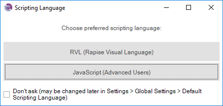
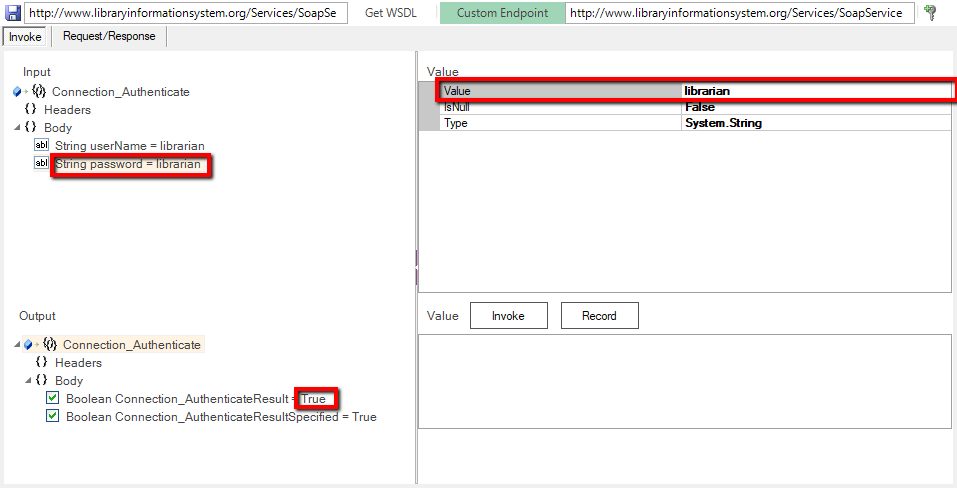
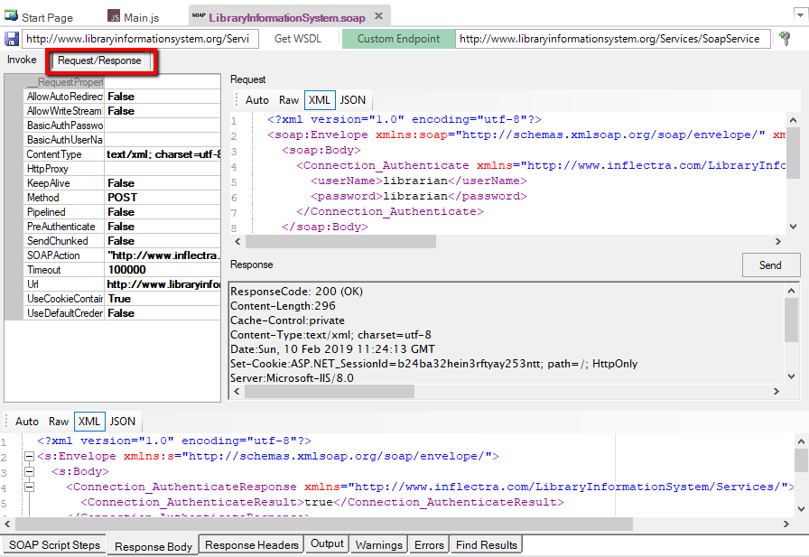
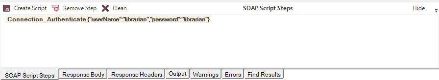
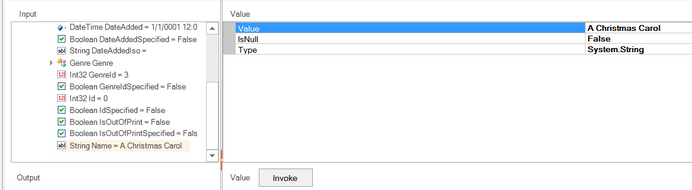
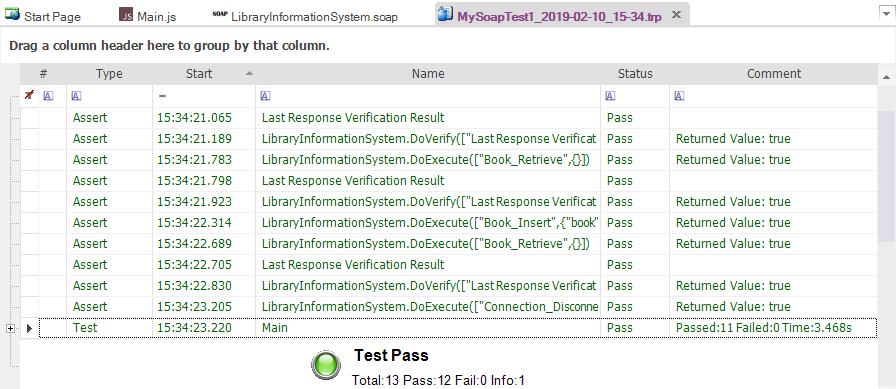

# Tutorial: SOAP Web Services

In this section, you will learn how to test a SOAP web services API using Rapise. We will be using a demo application called **Library Information System** that has a dummy SOAP web service API available for learning purposes. You can access this sample application at <http://www.libraryinformationsystem.org>, and its SOAP web service API can be found at:

<http://www.libraryinformationsystem.org/Services/SoapService.aspx>

## What is SOAP and what is a SOAP web service?
<!-- /* cSpell:disable */ -->
> SOAP is the **S**imple **O**bject **A**ccess **P**rotocol, which allows you to make API calls over HTTP/HTTPS using specially formatted XML. SOAP web services make use of the Web Service Definition Language (WSDL) and communicate using HTTP POST requests. They are essentially a serialization of RPC object calls into XML that can then be passed to the web service. The XML passed to SOAP web services needs to match the format specified in the WSDL.
<!-- /* cSpell:enable */ -->
> SOAP web services are fully self-describing, so most clients do not directly work with the SOAP XML language. Instead, they use a client-side proxy generator that creates client object representations of the web service (e.g., Java, .NET objects). Web service consumers interact with these language-specific representations of the SOAP web service. However, when these SOAP calls fail, you need a way to test them that includes inspecting the raw SOAP XML that is actually being sent.

## Overview

Creating a SOAP web service test in Rapise consists of the following steps:

1. Using the SOAP web services studio to inspect the SOAP WSDL.

2. Invoking the various SOAP operations and verifying that they return the expected data in the expected format.

3. Generating the test script in JavaScript that uses the learned Rapise web service objects based on the WSDL.

We will discuss each of these steps in turn.

### 1. Inspecting the SOAP WSDL Endpoint

Create a new test in Rapise called `MySoapTest1.sstest`. For methodology, choose **Basic: Windows Desktop Application (Windows Native, .NET, Java, WPF, etc.)**, and Rapise will create a new blank test project.


A language selection prompt is shown. For Web Services, it is recommended to use `JavaScript`. 



Once you have created it, choose the `Tools > Web Services` menu to add a new web service definition to your test project:


This will display the Add New Web Service dialog box:


Choose **SOAP** as the type of web service you want to create.

Then, enter the name of the web service you are going to add; in this case, enter **"LibraryInformationSystem.soap"** and click `Create`.

This will add the SOAP web service definition file to your test project:


In the **Endpoint** section of the [SOAP toolbar](toolbar_soap.md), enter the following URL for the sample application's WSDL file:

    http://www.libraryinformationsystem.org/Services/SoapService.svc?wsdl

Then click `Get WSDL` to load the list of SOAP operations:


Now, click on the **Connection_Authenticate** operation in the SOAP explorer:


This is the first operation we will need to invoke, as it is used to authenticate with the online library system before calling other functions.

You can click on each of the different SOAP operations (e.g., for inserting, retrieving, deleting, or updating a book), and the SOAP studio will display the expected input and output parameters, as well as any headers.

In the next section, we will be performing the following actions:


* Authenticating as a specific user.

* Viewing the list of books.

* Inserting a new book.

* Viewing the updated list of books.

* Disconnecting.

Each one will involve calling a specific SOAP operation with some input parameters, viewing the data returned, and adding a verification step if appropriate.


## 2. Invoking the SOAP Actions

Starting with the **Connection_Authenticate** operation that we selected, click on the two input parameters in turn and enter values:

* **userName** = librarian
* **password** = librarian

Then click the `Invoke` button underneath.



You can see that the response to our invoked operation was a simple boolean value of **True**. This indicated that authentication was successful. If you try entering an incorrect login/password, you will get back **False** instead.

If you have a SOAP web service that doesn't behave as expected, you may want to view the raw SOAP XML that is being sent to or from the web service. To view this, click on the **Request/Response** tab of the SOAP studio editor, and the following will be displayed:



This view lets you see the Request and Response HTTP headers and body, with the body displayed in a friendly, easy-to-read, color-coded XML format. That way, you can easily invoke the SOAP operations using the Rapise SOAP studio GUI and view the raw SOAP XML being sent to or from the server. This is invaluable when debugging a failing SOAP web service.

In the case of our **Connection_Authenticate** test, we can now click the `Record` button (next to `Send`) to add this operation to our list of recorded test steps:


Once you have added the operation to the list of recorded steps, you can go one step further and ask Rapise to verify the data returned. To do that, click the `Verify` button that is displayed next to the `Record` button. The step will now switch to **bold** to indicate that a verification step is also included.



Now we need to repeat this process for the following additional operations:

* **Book_Retrieve**

* * No input parameters.

* * Press `Invoke` to test the retrieval.

* * Press `Record` to record the test script.

* * Click `Verify` to add a verification step.

* **Book_Insert**

* * Populate the **Book** input object with these values:

* * AuthorId = 2

* * AuthorIdSpecified = True

* * GenreId = 3

* * GenreIdSpecified = True

* * Name = `A Christmas Carol`

* * DateAdded = (pick a date using the date picker)

* * DateAddedSpecified = True

* * DateAddedIso = 2017-01-04T07:46:36

* * Press `Invoke` to test the insertion.

* * Press `Record` to record the test script.

    

* **Book_Retrieve**

* * No input parameters.

* * Press `Invoke` to test the retrieval.

* * Press `Record` to record the test script.

* * Click `Verify` to add a verification step.

* **Connection_Disconnect**

* * No input parameters.

* * Press `Invoke` to test the disconnection.

* * Press `Record` to record the test script.

Once you have completed all these steps, you will see the following recorded in the **SOAP Script Steps** box:


Now that we have recorded the operations and verifications, we can proceed to generate the test script in Rapise that will regression test the web service.

## 3. Generating the Rapise Test Script

In the SOAP Script Steps toolbar, click the `Create Script` button to generate the initial test script:


Click the `Test` shortcut in the main toolbar, and Rapise will display the `Main.js` file.

In the main Rapise test script file, you will see the following generated:


```javascript
function Test()
{
    var LibraryInformationSystem=SeS('LibraryInformationSystem');

    LibraryInformationSystem.DoExecute('Connection_Authenticate',{"userName":"librarian","password":"librarian"});

    Tester.Assert('Connection_Authenticate Response', LibraryInformationSystem.GetResponseObject(), {"Body":{"Connection_AuthenticateResult":true,"Connection_AuthenticateResultSpecified":true},"Headers":{}});

    LibraryInformationSystem.DoExecute('Book_Retrieve', {});

    Tester.Assert('Book_Retrieve Response', LibraryInformationSystem.GetResponseObject(), {...}\]},"Headers":{}});

    LibraryInformationSystem.DoExecute('Book_Insert', {"book":{"Author":{"Name":""},"DateAdded":"2017-01-04T07:46:36","DateAddedSpecified":true,"DateAddedIso":"2017-01-04T07:46:36","Genre":{"Name":""},"Name":"A Christmas Carol"}});

    LibraryInformationSystem.DoExecute('Book_Retrieve', {});

    Tester.Assert('Book_Retrieve Response',LibraryInformationSystem.GetResponseObject(), {...},"Headers":{}});

    LibraryInformationSystem.DoExecute('Connection_Disconnect', {});

}
```

You will see each of the SOAP functions called in turn, with verification code automatically added.


We can add some comments to make it easier to read:

```javascript
    //Authenticate

    var LibraryInformationSystem=SeS('LibraryInformationSystem');

    LibraryInformationSystem.DoExecute('Connection_Authenticate',{"userName":"librarian","password":"librarian"});

    Tester.Assert('Connection_Authenticate Response',LibraryInformationSystem.GetResponseObject(), {"Body":{"Connection_AuthenticateResult":true,"Connection_AuthenticateResultSpecified":true},"Headers":{}});


    //Verify the initial list of books

    LibraryInformationSystem.DoExecute('Book_Retrieve', {});

    Tester.Assert('Book_Retrieve Response', LibraryInformationSystem.GetResponseObject(), {...}\]},"Headers":{}});

    LibraryInformationSystem.DoExecute('Book_Insert', {"book":{"Author":{"Name":""},"DateAdded":"2017-01-04T07:46:36","DateAddedSpecified":true,"DateAddedIso":"2017-01-04T07:46:36","Genre":{"Name":""},"Name":"A Christmas Carol"}});


    //Verify the updated list of books and disconnect

    LibraryInformationSystem.DoExecute('Book_Retrieve', {});

    Tester.Assert('Book_Retrieve Response',LibraryInformationSystem.GetResponseObject(), {...},"Headers":{}});

    LibraryInformationSystem.DoExecute('Connection_Disconnect', {});
```


When you click the `Play` button in the main toolbar, you will see the following result:




Congratulations! You have recorded and executed a [SOAP web service test](soap_web_services.md).
