# Tutorial: REST Web Services

In this section you shall learn how to test a RESTful web services API using Rapise. We shall be using a demo application called **Library Information System** that has a dummy RESTful web service API available for learning purposes. You can access this sample application at
<http://www.libraryinformationsystem.org>, and its RESTful web service
API can be found at:
[www.libraryinformationsystem.org/Services/RestService.aspx](http://www.libraryinformationsystem.org/Services/RestService.aspx).

### What is REST and what is a RESTful web service?
<!-- /* cSpell:disable */ -->
**RE**presentational **S**tate **T**ransfer (**REST**) is a style of software architecture for distributed systems such as the World Wide Web. REST has emerged as a web API design model that offers greater simplicity over other web service protocols such as SOAP and XML-RPC.
<!-- /* cSpell:enable */ -->
A RESTful web API (also called a RESTful web service) is a web API implemented using HTTP and REST principles. Unlike SOAP-based web services, there is no "official" standard for RESTful web APIs. This is because REST is an architectural style, unlike SOAP, which is a protocol.

## Overview

Creating a REST web service test in Rapise consists of the following
steps:

1. Using the REST query builder to create the various REST web service requests and verify that they return the expected data in the expected format.

2. Parameterizing these REST web service requests into reusable templates and saving as Rapise learned objects.

3. Generating the test script in Javascript that uses the learned Rapise web service objects.

We shall discuss each of these steps in turn.


## 1. Using the REST Query Builder

Create a new test in Rapise called `MyRestTest1.sstest`. For methodology, choose **Basic: Windows Desktop Application (Windows Native, .NET, Java, WPF etc)** and Rapise will create a new blank test project.


Language selection prompt is shown. For Web Services it is recommended to use `JavaScript`. 


Once you have created it, choose  `Tools > Web Services` menu to add a new web service definition to your test project:


This will display the Add New Web Service dialog box:


Choose `REST` as the type of web service you want to create.

Then, enter the name of the web service that you're going to add, in this case enter `LibraryInformationSystem.rest` and click `Create`.

This will add the REST web services definition file to your test project:


You will see on the right hand side, there is a new document editor for the `.rest` file. This is the REST web services query form. It lets you send test HTTP requests to the web service under test and inspect the output being returned.

If you open up API documentation for our sample application
([www.libraryinformationsystem.org/Services/RestService.aspx](http://www.libraryinformationsystem.org/Services/RestService.aspx)) you will see that it exposes several operations for retrieving, adding, updating and deleting books and authors in the system. For this tutorial we shall perform the following operations:

1. Get the special SessionID to identify our test session

2. Get a list of books in the system

3. Add a new book to the system and verify that it was added

According to the documentation that means we will need to send the following requests:

- ### (i) Get a Unique Session
* * **URL:** http://www.libraryinformationsystem.org/Services/RestService.svc/session

* * **Method:** GET

* * **Returns:** Unique session ID that is passed to other requests to keep data separate for different demo users

- ### (ii) Get this list of books

* * **URL:** http://www.libraryinformationsystem.org/Services/RestService.svc/book?session_id={session_id}

* * **Method:** GET

* * **Returns:** Array of book objects

- ### (iii) Add a new book to the list

* * **URL:**
http://www.libraryinformationsystem.org/Services/RestService.svc/book?session_id={session_id}

* * **Method:** POST

* * **Body:** Pass a populated book object:
```javascript
    {
        "Name": "Book Name",
        "AuthorId": 1,
        "GenreId": 1
    }
```

* * **Returns:** Single book object that has its BookId populated

***

The first request will be to get the unique session ID that we will need to pass to the other requests. This is needed by our sample application to prevent testing by different users interfering with each other. To create this request, simply enter the following information on the REST Request form:

* **Name:** Get_Session

* **Method:** GET

* **URL:**
http://www.libraryinformationsystem.org/Services/RestService.svc/session

You should now have it populated as illustrated below:

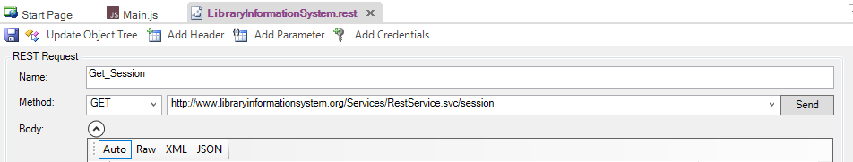

This web service request requires that we pass credentials by means of HTTP Basic authentication. So click on the `Add Credentials` button in the toolbar.


This will display the `Add Credentials` dialog box:


Enter **librarian** as both the username and password and click `Add`.

Now click the `Send` button and the request will get sent to the web service:

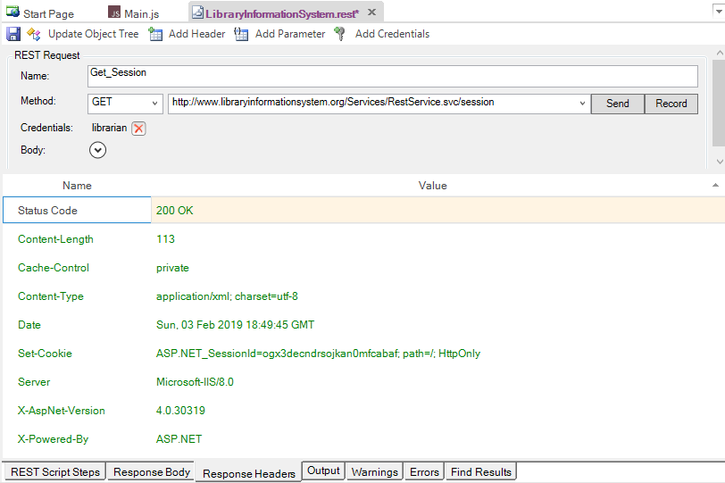

The `Response Header` tab will display the headers coming back from the web service. The Status Code **200 OK** means that the request succeeded and that data was returned. If you click on the "**Response Body - XML**" tab, you will see the XML serialized data returned from the web service:

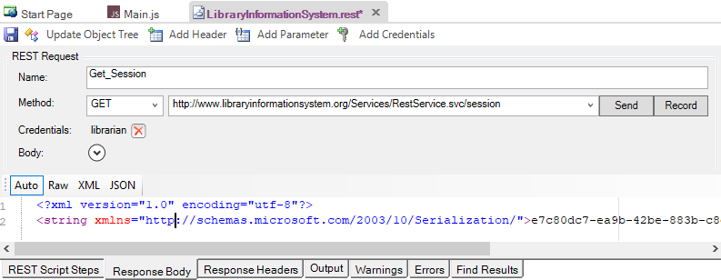
<!-- /* cSpell:disable */ -->
Since Rapise uses JavaScript as its scripting language, it is usually easier to work with **JSON** (**J**ava**S**cript **O**bject **N**otation) serialized data rather than XML. In the case of the sample Library Information System web service, you can change the format that it accepts and retrieves by sending two special HTTP headers:
<!-- /* cSpell:enable */ -->
* **Content-Type**: `application/json`

* **Accept**: `application/json`

To add these headers to the request, simply click on the `Add Header` button in toolbar:


This will display the following dialog box:


Choose the HTTP Header **"Accept"** from the list and enter
`application/json` as the value. Repeat for the **"Content-Type"** header. You should now have the following populated request:

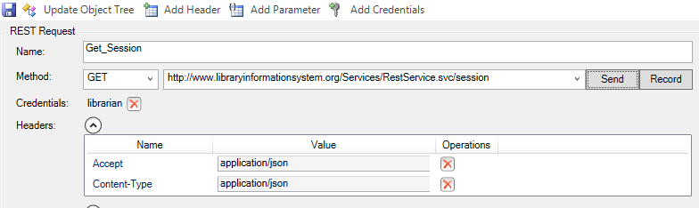

Now click the `Send` button and the request will get sent to the web service:


The Response Header tab will display the headers coming back from the web service. Note that the returned Content-Type is listed as `application/json` as requested. If you click on `Response Body - JSON` tab, you will see the JSON serialized data returned from the web service:


We have now completed the creation of our first test operation. Click on the "Save Requests" button in the Rapise REST Ribbon to make sure our changes have been saved.

Now click on the `Clone request` icon in the REST request explorer in the left-hand side of the screen:


This will display the Clone Request dialog box. This lets us create a new REST request that contains the headers and authentication already defined on our existing request. This will save time over creating a new REST request from scratch:


Enter the name **"Get_Books"** in the dialog box and click the `Clone` button. This will create a new REST request with this name:


For this request we need to pass through the SessionID in the
query string. Rather than hardcoding it in the URL, we can make use of the parameterization feature of Rapise. Click on the `Add Parameter` button in the toolbar. This will display the `Add Request Parameter` dialog box:


Enter in the following:

* **Name:** `session_id`

* **Value:** `7404f584-7200-4c37-b813-d5994eb45d12` (you can also copy and paste the value returned by the `Get_Session`
command)

Click the `Add` button and the parameter will be added to the request. Now change the URL to:

* **URL:** http://www.libraryinformationsystem.org/Services/RestService.svc/book?session_id=

Then position the caret at the end of this URL and click the `Insert in URL` button. This will insert the parameter token in the URL at the specified point:

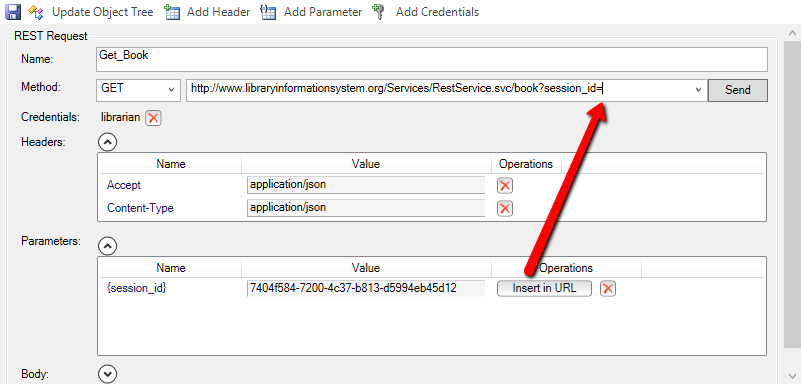

Now click the `Send` button and the request will get sent to the web service. This will return the list of books serialized as a JSON array of objects:


We have now completed the creation of our second test operation. Click on the `Save Requests` toolbar button to make sure our changes have been saved:


Now click on the `Clone request` icon in the REST request explorer in the right-hand side of the screen. Enter the name **"Add_Book"** in the dialog box and click the `Clone` button. This will create a new REST request with this name:

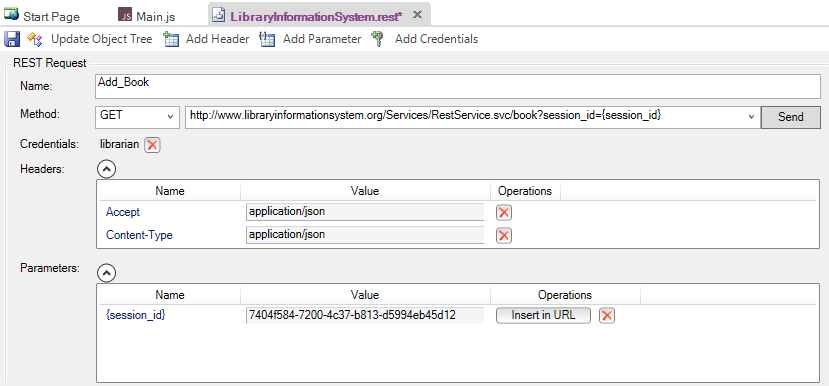

This operation will add a new book to the system, so it's a POST request. Change the Method type in the dropdown list from **"GET"** to **"POST"**.

Expand the "Body" field on the form. This is where you can enter in an XML or JSON serialized Book record that will get added to the system. For now we'll leave this blank and let Rapise serialize the body for us later on when we actually write our test script. So we should now have:

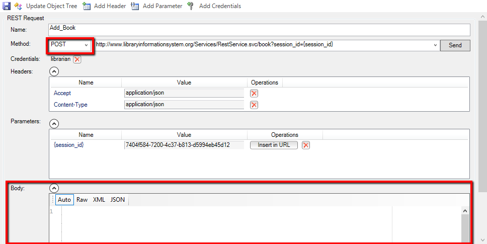

We have now completed the creation of our third test operation. Click on the `Save Requests` toolbar button.

## 2. Saving the REST Requests as Objects

Now that we have created our three REST requests, the next step is to actually create the Rapise objects that we can use in our JavaScript test scripts. Click on the `Update Object Tree` button in the toolbar to update the Object Tree with our new requests:

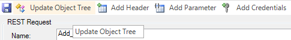

Rapise will now take you REST requests and use that to update the main [Object tree](object_tree.md). Click on the `Object` tab of the main Rapise explorer, click the `Refresh` icon and you will see the "LibraryInformationSystem" heading displayed, with the three saved REST request listed underneath:


If you expand one of the REST requests (e.g. `Add_Book`), you'll see that it has a single operation **"DoExecute"** that executes the web services and a series of properties available for inspecting or updating any part of the REST request prior to it being sent to the server.

In the next section we shall illustrate how you can write a test script using these learned objects.

a. You can either have Rapise **generate test scripts** and verification points automatically (described in section 3a), or

b. You can manually **write the test scripts** using the objects and the Rapise code editor (described in section 3b)


## 3a. Generating REST Test Scripts

Inside the REST request explorer, double-click on the **Get_Session**
function to open up the request:

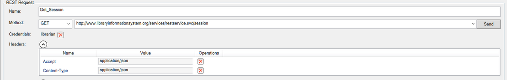

Click on the **Send** button to send the sample request. Once that has succeeded, you will see the **Record** button appear to the right:


Click that button and the request will get added to the list of recorded steps:

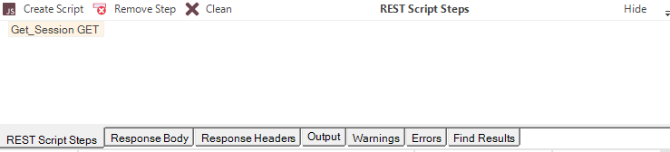

Now open up the **Get_Book** request and follow the same procedure:

1. Click on the `Send` button to execute the request

2. Click on the `Record` button to record the action as a script step


This time we also want to verify the result. You will see a list of books returned in the **Verify** box underneath the Body section:


If you select the overall array **response\[14\]** and click the main `Verify` button next to the `Record` button, the system will automatically add a verification step that verifies all of the values. To try this, click the `Verify` button. This will add a bold verification step to the recorded script:


You will see a script step recorded with a verification test added (it's shown in bold with an asterisk `*`):

However, in many cases you only want to verify certain properties. For example, we might want to just verify that 14 books are returned, and that the first book has the right name.

To do this, right-click on the **response\[14\]** entry to display the verification content menu:


Choose the option ‘**Verify Response length=14’**. This adds the following step to the recorded script:

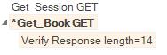

Now we want to verify the name of the first book returned. To do that, expand the “0” index entry and then right-click on the “Name” property returned:


Choose the option to **Verify Response\[0\].Name = Hound of the Baskervilles**. This will add a verification step for this specific property:


Now we add the last two requests - adding a book and verifying that it was added. To do that open up the two requests and click `Send` then `Record`:

* **Add_Book** (POST)

* **Get_Book** (GET)

The **Add_Book** won't actually work at this point because we've not populated the body, but it will be good enough to create the test script. For the second instance of **Get_Book** don't use the Verify option since we will want to code that by hand to match the book we actually added.

Once you are done, you should have:


Now click on the `Create Script` button and Rapise will generate the following code for you:

```javascript
function Test()
{
	var LibraryInformationSystem_Get_Session=SeS('LibraryInformationSystem_Get_Session');
	LibraryInformationSystem_Get_Session.SetRequestHeaders([{"Name":"Accept","Value":"application/json"},{"Name":"Content-Type","Value":"application/json"}]);
	LibraryInformationSystem_Get_Session.DoExecute();

	var LibraryInformationSystem_Get_Book=SeS('LibraryInformationSystem_Get_Book');
	LibraryInformationSystem_Get_Book.SetRequestHeaders([{"Name":"Accept","Value":"application/json"},{"Name":"Content-Type","Value":"application/json"}]);
	LibraryInformationSystem_Get_Book.DoExecute();

	Tester.AssertEqual('http://www.libraryinformationsystem.org/Services/RestService.svc/book?session_id={session_id} Response Body Text Comparison Result', LibraryInformationSystem_Get_Book.GetResponseBodyText(), "...long response body...");
	LibraryInformationSystem_Get_Book.DoVerify('LibraryInformationSystem_Get_Book Response', "length", 14);
	LibraryInformationSystem_Get_Book.DoVerify('LibraryInformationSystem_Get_Book Response', "[0].Name", "Hound of the Baskervilles");
	var LibraryInformationSystem_Add_Book=SeS('LibraryInformationSystem_Add_Book');
	LibraryInformationSystem_Add_Book.SetRequestHeaders([{"Name":"Accept","Value":"application/json"},{"Name":"Content-Type","Value":"application/json"}]);
	LibraryInformationSystem_Add_Book.DoExecute();

	LibraryInformationSystem_Get_Book.SetRequestHeaders([{"Name":"Accept","Value":"application/json"},{"Name":"Content-Type","Value":"application/json"}]);
	LibraryInformationSystem_Get_Book.DoExecute();
}
```

If you click `Play` on this script as written, you will see that the tests to retrieve the books work correctly, but the test of adding a new book fails:


This is as we'd expect since we've not populated the new book yet!

To make the template test script more useful, we should make the following changes:

* Add comments to each of the sections to describe the purpose

* Add code to get the **session ID** from the first call and pass to the subsequent calls

* Create a JavaScript object to contain the new book information, and pass that to the **Add Book** function

* Get the new book ID from the result of the **Add Book** function and use it later on.

* Change the `Tester.Assert` code to check just specific properties rather than the entire object list.

The complete updated test script looks like the following. We have highlighted the new/changed lines in yellow:

```javascript m=1
function Test(params)
{
	//First get the session
	var LibraryInformationSystem_Get_Session=SeS('LibraryInformationSystem_Get_Session');
	LibraryInformationSystem_Get_Session.SetRequestHeaders([{"Name":"Accept","Value":"application/json"},{"Name":"Content-Type","Value":"application/json"}]);
	LibraryInformationSystem_Get_Session.DoExecute();

//  CODE: READ SESSIONID
	var sessionId = LibraryInformationSystem_Get_Session.GetResponseBodyObject();
	Tester.Message('Session ID: ' + sessionId);
//  /CODE

	var LibraryInformationSystem_Get_Book=SeS('LibraryInformationSystem_Get_Book');
	LibraryInformationSystem_Get_Book.SetRequestHeaders([{"Name":"Accept","Value":"application/json"},{"Name":"Content-Type","Value":"application/json"}]);
	LibraryInformationSystem_Get_Book.DoExecute({ "session_id": sessionId });
//  CODE/                                         ^^^^^^^^^^^^^^^^^^^^^^^

	LibraryInformationSystem_Get_Book.DoVerify('LibraryInformationSystem_Get_Book Response', "length", 14);
	LibraryInformationSystem_Get_Book.DoVerify('LibraryInformationSystem_Get_Book Response', "[0].Name", "Hound of the Baskervilles");
	
// CODE: Define new book
	//Add a book
	var newBook = {
		Name: "A Christmas Carol",
		AuthorId: 2,
		GenreId: 3
	};
// /CODE
	
	var LibraryInformationSystem_Add_Book=SeS('LibraryInformationSystem_Add_Book');
	LibraryInformationSystem_Add_Book.SetRequestHeaders([{"Name":"Accept","Value":"application/json"},{"Name":"Content-Type","Value":"application/json"}]);

// CODE: Supply newBook as a POST method body
	LibraryInformationSystem_Add_Book.SetRequestBodyObject(newBook)
// /CODE
	LibraryInformationSystem_Add_Book.DoExecute({ "session_id": sessionId });
//  CODE/                                         ^^^^^^^^^^^^^^^^^^^^^^^
	
// CODE: Read added book
	//Get the ID of the new book
	newBook = LibraryInformationSystem_Add_Book.GetResponseBodyObject();
	Tester.Message("New Book ID: " + newBook.Id);
// /CODE

	LibraryInformationSystem_Get_Book.SetRequestHeaders([{"Name":"Accept","Value":"application/json"},{"Name":"Content-Type","Value":"application/json"}]);
	LibraryInformationSystem_Get_Book.DoExecute({ "session_id": sessionId });
//  CODE/                                         ^^^^^^^^^^^^^^^^^^^^^^^
// CODE: Check book count increased
	Tester.AssertEqual("Book Count", 15, LibraryInformationSystem_Get_Book.GetResponseBodyObject().length);
// /CODE
}
```

## 3b. Writing REST Test Scripts

Open up the main `Main.js` file in the Rapise editor. It will initially consist of a single empty function `Test()`:


The first task is to get a new SessionId from the server using the **Get_Session** operation. To do this, drag the **"DoExecute"** operation from under the **"LibraryInformationSystem_Get_Session"** object into the script editor, in between the opening and closing braces of the `Test()` function:

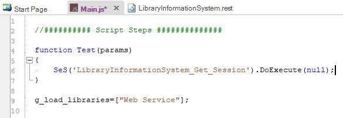

This will execute the web serviced and return the SessionId. To actually access the retrieved value, you need to drag the **"GetResponseBodyObject"** property to the script editor, under the previous line. Then add the JavaScript code 

```javascript
var sessionId =
```

to actually store the value. We will also add a 

```javascript
Tester.Message(sessionId);
```

line afterwards to write out the value of the sessionId to the test report. This will help us make sure we are getting back a valid response from the web service. You should now have the following code:


Save this test and click `Play` to execute the test. You should now see a report similar to the following:


Now we need to add the code to get the list of books. To do that, simply drag the **"DoExecute"** operation from under the **"LibraryInformationSystem_Get_Book"** object into the script editor. Then change the (`null`) argument to instead provide the session id as a JavaScript dictionary:

```javascript
SeS('LibraryInformationSystem_Get_Book').DoExecute({"session_id":sessionId});
```

To get the list of books as a JavaScript array, drag the **"GetResponseBodyObject"** property to the script editor, under the previous line. Then assign the value of this property to a variable such as "books":

```javascript
var books = SeS('LibraryInformationSystem_Get_Book').GetResponseBodyObject();
```

Now we can add code to test that the number of books returned matches the expected value. Type in the following code:

```javascript
Tester.AssertEqual('Book count matches', 14, books.length);
```

You should now have the following code:


Finally we need to add the code to add a new book to the system. To do that, simply drag the **"DoExecute"** operation from under the **"Add_Book"** object into the script editor. Then change the (`null`) argument to instead provide the session id as a Javascript dictionary:

```javascript
SeS('LibraryInformationSystem_Add_Book').DoExecute({"session_id":sessionId});
```

To provide the data for a new book, we will need to drag the **"SetRequestBodyObject"** property of the **"Add_Book"** object to the line **above** the DoExecute and pass in a populated JavaScript object:

```javascript
var newBook = {};
newBook.Name = 'A Christmas Carol';
newBook.AuthorId = 2;
newBook.GenreId = 3;

SeS('LibraryInformationSystem_Add_Book').SetRequestBodyObject(newBook);
```

Finally Add code to test that our new book was added correctly and the count has increased by one:

```javascript
SeS('LibraryInformationSystem_Get_Books').DoExecute({"session_id":sessionId});
books = SeS('LibraryInformationSystem_Get_Books').GetResponseBodyObject();
Tester.AssertEqual('Book count matches', 15, books.length);
```

You should now have the following code:

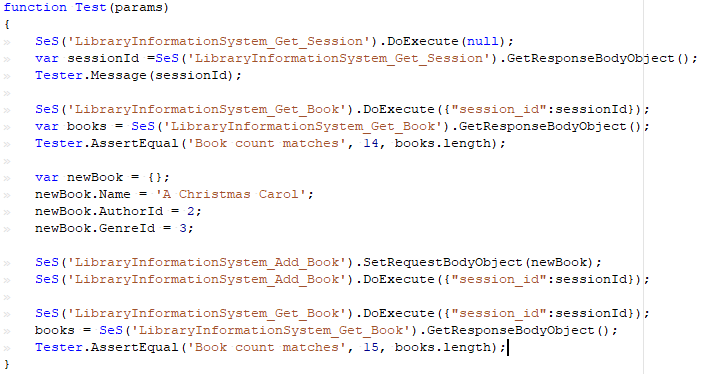

Save this test and click "Play" to execute the test. You should now see a report similar to the following:


Congratulations! You have just created your first test script that tests a RESTful web service.