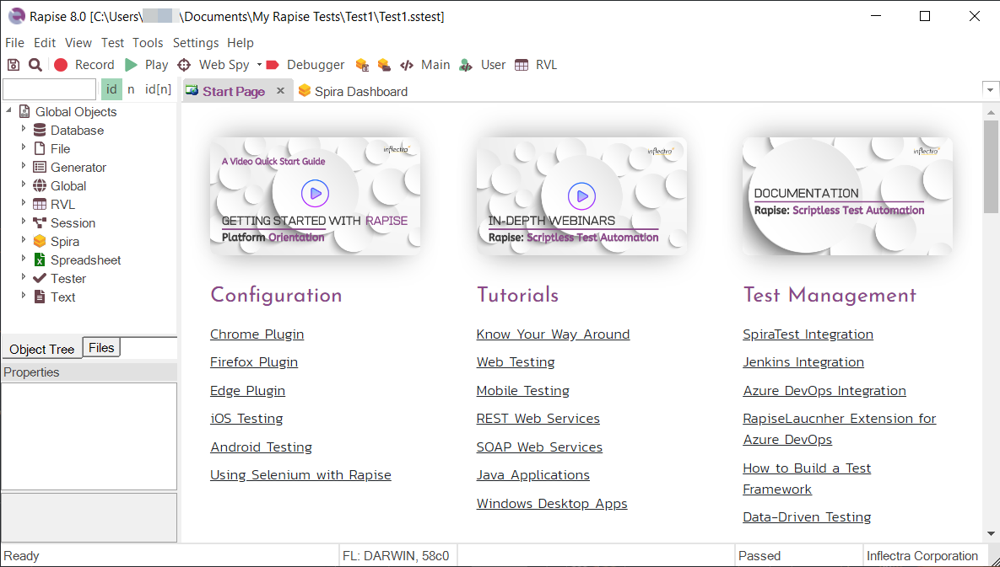
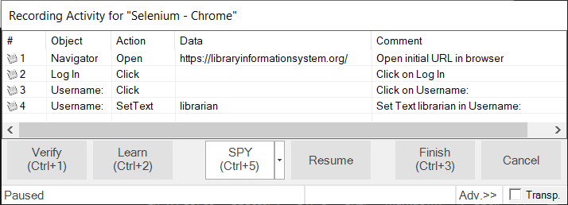
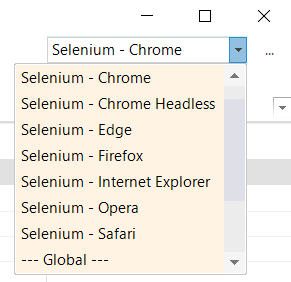
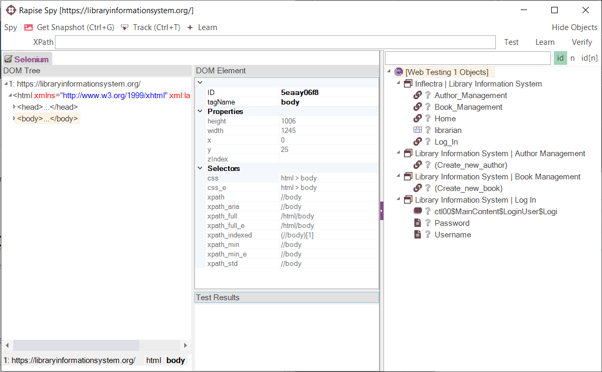
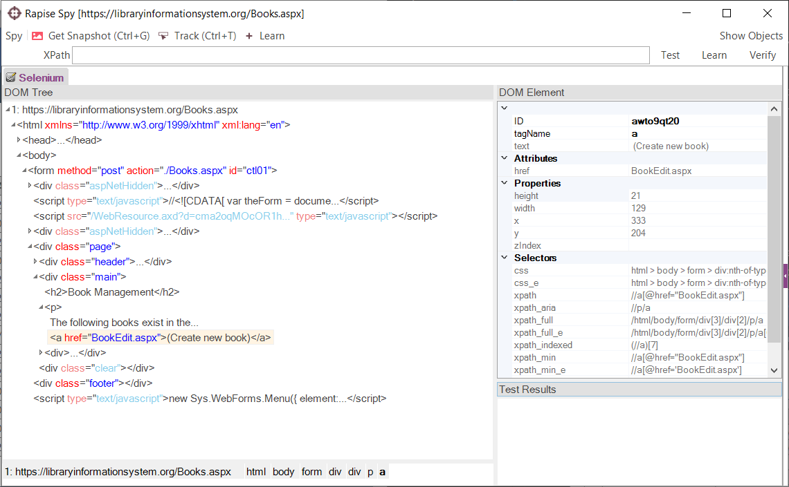
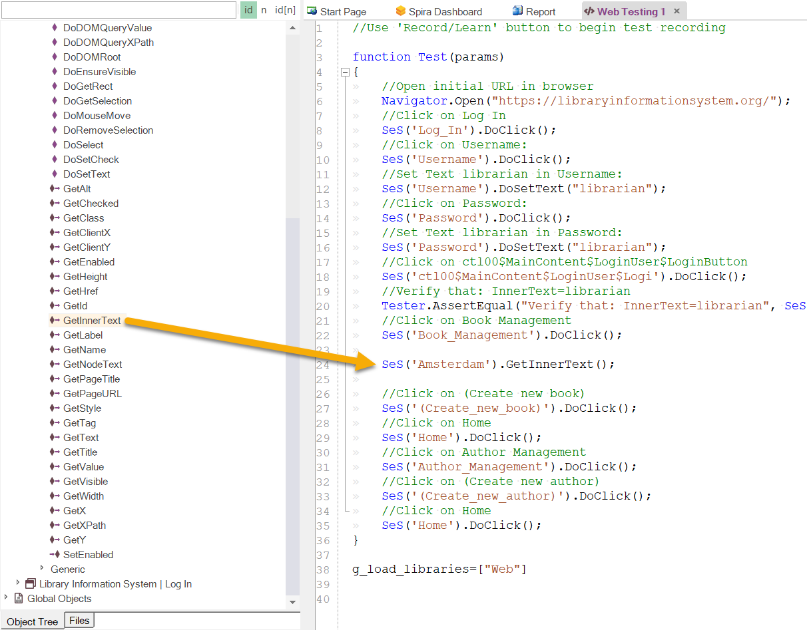
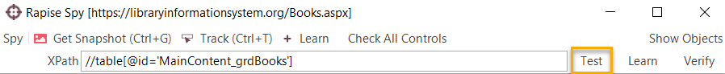
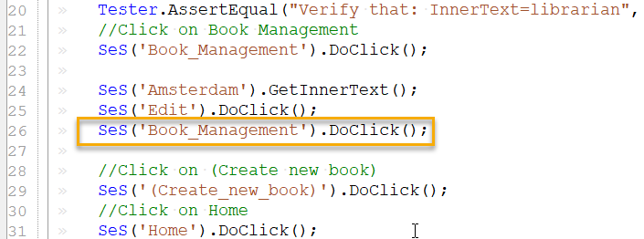
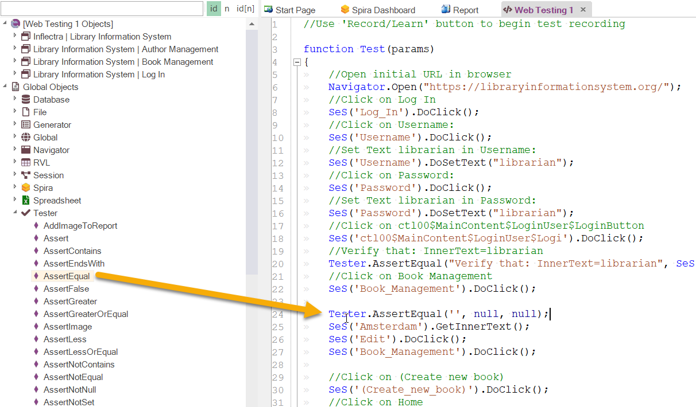

# Tutorial: Web Testing (JavaScript)

This section will demonstrate how you can use Rapise to inspect the objects in a web page and Learn them for testing using the **JavaScript test script language** instead of the **Rapise Visual Language (RVL)** that was illustrated in the main [Tutorial: Web Testing (RVL)](tutorial_record_and_playback.md).

This is useful in cases where you have more complex applications to test and you want to be able to use the power of a full programming language such as JavaScript to process data, perform calculations and implement complex flow of control.

## Open Rapise and Create New Test

Go to **Start** &gt; **All Programs** &gt; **Inflectra** &gt; **Rapise**.  The following window should appear.



Select `File > New Test` in the main menu.


If this is your first time using Rapise on this computer, you may see the following dialog box:


If you see this, it means that Rapise is trying to [connect to a SpiraTest server](spiratest_integration.md). **SpiraTest** is our web based [test management system](spiratest_integration.md). It is a powerful tool that can store your Rapise tests and deploy them onto remote machines for automated regression testing. However, for now just click on the `Cancel` button and you will see the [new test dialog](create_new_test_dialog.md):


Now enter the name of your new test **‘Web Testing 1’**, and click **Web: Cross-Browser Testing Support**. Since you chose a web test, you will now need to choose the initial [web browser profile](browser_settings.md) (don’t worry you can easily change it later):


Choose **‘Internet Explorer HTML’** from the list of options.

Next you will be asked if you want to create your tests using the scriptless **Rapise Visual Language (RVL)** technology or using JavaScript. For this example we will use the JavaScript approach. If you’re interested in creating the test using RVL instead, please refer to the section - [Tutorial: Web Testing (RVL)](tutorial_record_and_playback.md).


Rapise will create the new test and you will see the main function of the test:


You are now ready to record your first test.

## Open the Application Under Test

Open up Internet Explorer.  You will find it in **Start** &gt; **All Programs** &gt; **Internet Explorer**. In Internet Explorer, navigate to: <http://www.libraryinformationsystem.org>:


## Record Test Steps

In the Rapise window, press the **Record** button on the toolbar.


The [Recording Activity Dialog](recording_activity_dialog.md) (RA dialog) will appear:


The **RA dialog** has a grid.  As you interact with the sample Library Information System program, the grid will automatically populate with your actions.

Let's begin creating the test.  On the library information system login page, click on the **Log In** link in the top-right of the screen.


In the **Username** text box, type *librarian*

Click on the **Password** text box next.  You'll notice that the **RA dialog** has changed.  Your actions, clicking Log-In and entering a username, are listed in the grid:



The password for user librarian is also *librarian*.  Type the password in and then press the **Log-In** button.

Two more rows should appear in the **RA dialog**: one to represent the password entry, and one to represent the button click:


You should now be on the main menu of the Library Information System with the user's name listed in the top-right:


Hover the mouse over the “Welcome **librarian**” username label on the top-right and press `CTRL+1` to bring up the Verify dialog box:


This box lets you add a checkpoint to verify the properties of an object on the screen.

Select the `Inner Text` option and click `OK` button to close the dialog. That will add the verification check to your list of recorded actions:


Click the **Book Management** button.  It is highlighted in the next screenshot:


You should now be on the Book Management page (see the below image).


Click the **Create new book** link:


You should now be on the Create New Book page (see image below).  Click the **HOME** button to go back to the main menu.


Now, click the **Author Management** button:


You should now be on the Author Management page (see image below):


Click the **Create New Author** link:


You should now be on the Create New Author page (see below). Click the **Home** button to go back to the main menu.


At this point, there should be 11 rows in the **RA dialog** grid.

You are now back on the Main Menu.  Click **Log Out** (top-right).


To end the recording session either press `CTRL+3` or click `Finish` button on the **RA dialog**.

Rapise will generate the code.


Let's save our test.  Press the `Save` button at the top left of the Rapise window.


## Playback

Let's execute the test we just created.  First, close Internet explorer. Rapise will open a new instance of Internet Explorer to the correct url (www.libraryinformationsystem.org) when the test begins.

To execute the script, press the Play button on the toolbar.


After execution, a screen like the one below will appear.  Each row represents a step in the test. The rows with green text are steps which passed, whereas the rows with red text are the steps which failed.


For more information on the report, see [Automated Reporting](automated_reporting.md).

## Playback in Other Browsers

Now that we have recorded our test in Internet Explorer, we want to play the same script back in other browsers. That is very easy to do. Find **web browser dropdown** in the top right corner of the Rapise window and select a different browser (e.g. Firefox, Chrome, Selenium - \*, etc.) and click the `Play` button.



Before the playback in other browsers will work correctly, you will need to make sure you have [configured the web browsers](setting_up_web_browsers.md) appropriately. In the case of the Selenium options, you will need to make sure you have installed the [Selenium WebDriver binaries](setting_up_selenium.md) correctly.

## Track and Learn Object Using the  Web Spy

In the main toolbar of Rapise, expand the dropdown list for the **Spy** tool and make sure that `Web` is selected:


Now, click on the main `Spy` tool icon and Rapise will start the [Web Spy](web_spy.md):



Go back to the web page and login to the **library information system** with the same **login/password (librarian/librarian)** and click on the **Book Management** menu item so that the list of books is displayed:


Now back in the [Web Spy](web_spy.md), click on the `Get Snapshot` option to refresh the Web Spy and display the HTML elements (called the DOM tree) that make up this page:



Once it has loaded the DOM tree, you can expand/collapse the elements to see how the web page is constructed. This is useful when testing an application since many of the HTML elements on a page may be used for layout purposes and will not be visible in the browser. In the example page, we have expanded some of the nodes to display the main section of the page and the table that contains the list of books.

In addition, you can use the `Track (Ctrl+T)` tool to select an item in the web page and then have it be highlighted in the DOM tree. For example if we want to find the cell that contains the book title
“Amsterdam”, simply press `CTRL+T` on the keyboard, move the mouse over the cell in the webpage**, wait until the red highlighting rectangle appears** and then click `CTRL+T` again. Rapise will now highlight that
item in the DOM Tree automatically:


You can see all of the properties of this HTML element displayed on the right, specifically:

- **tagName** of the element (td),
- **text** of the element (Amsterdam),
- HTML attributes in the **Properties** section,
- CSS and XPath expressions for locating this element in **Selectors** section.

If you want to use this object in a Rapise test script, you can simply click the `Learn` button and the HTML element will be added to the Recording Activity Dialog:


Click `Finish` and the object will have been added to your test’s Object Tree:


You can now expand this object and drag a test function to your test script. For example if you wanted to get the textual value of the cell in your test, drag the `GetInnerText` function into your test script:



## Test XPATH and Learn Object Using the Web Spy

In addition to letting Rapise automatically learn the object from the Web Spy, you can manually enter in **XPATH** or **CSS** queries to find matching elements on the page and then learn those for use in your test.

For example, suppose we want to dynamically find the row that has the cell containing Amsterdam and then click on its **Edit** hyperlink.

Open up the Web Spy as before:


One the toolbar enter in the following to locate the table:

    //table[@id='MainContent_grdBooks']



Now click on the `Test` button to display the matching results:


Now that we have matched the table, we need to add dynamic XPath to find any row that has the cell containing 'Amsterdam' and find the edit link. You can expand the table and see the rows and cells visually and that will help us create the XPATH:

    //table[@id='MainContent_grdBooks']//tr/td[text()='Amsterdam']/../td[5]/a

This XPath consists of the following elements:

1. Find the table with the specified ID.
2. Find any row inside that table that contains a cell with the text 'Amsterdam'.
3. For any matching cell, get its parent row and inside the fifth cell, get any hyperlink.

In this case that will correctly locate the Edit link for the book 'Amsterdam'. Now that we have the correct item identified, click on the `Learn` button to the right of the `Test` button. That will now learn a new object that corresponds to the `Edit Amsterdam` object:


Click `Finish` and the object will have been added to the Object Tree of the current test:


## Modify the Test

To click on this object, simply drag the ‘DoClick’ function for the new object from the Object Tree into the test script. This will cause the book details page for Amsterdam to be displayed during test playback:


Since clicking on the Edit link will take you to a different page than where the **Create New Book** link is available, in the example we have added a second instance of the:

```javascript
SeS('Book_Management').DoClick();
```
command, so that Rapise goes back to the main book list page before executing the Create New Book step. If we did not do this, the test
would have failed.



Now the line:

```javascript
SeS('Amsterdam').GetInnerText();
```

by itself does not do anything, it just gets the text.

So to make the test more useful, we can use the global **Tester** object to add a step to verify this value. Drag the `AssertEqual` function from the `Tester` object to your test script just above the `SeS(“Amsterdam”)` line:



Now we need to just consolidate these two lines into the actual test. Using the script editor, change the two lines from:

```javascript
Tester.AssertEqual('', null, null);
SeS('Amsterdam').GetInnerText();
```

to

```javascript
Tester.AssertEqual('The values match', 'Amsterdam', SeS('Amsterdam').GetInnerText());
```

Now click **Play** to playback the new test:


The test should now pass successfully.

## See Also

- [Tutorial: Web Testing (RVL)](tutorial_record_and_playback.md)
- [Browser Profiles](browser_settings.md)