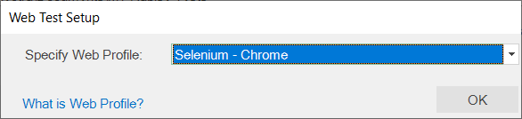
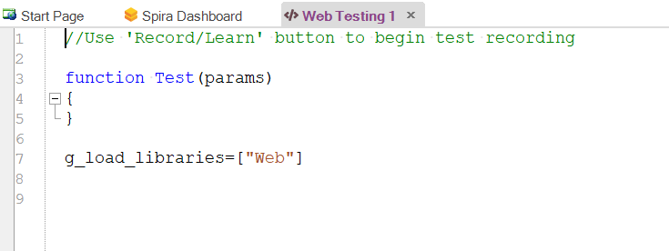
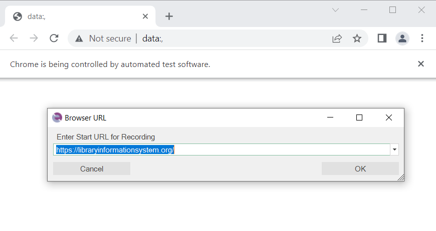
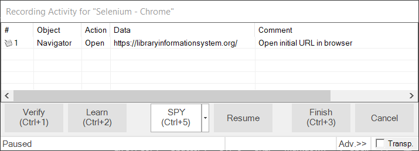
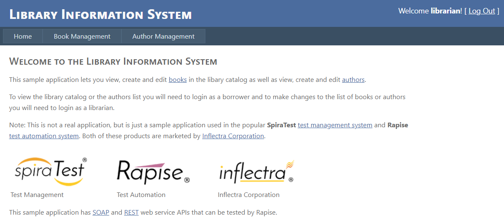
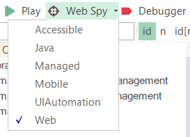
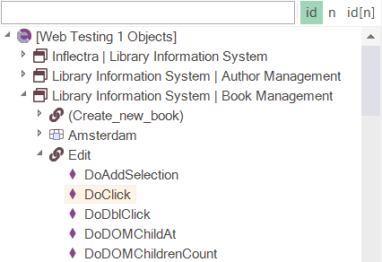

# Tutorial: Web Testing (JavaScript)

This section will demonstrate how you can use Rapise to inspect the objects on a web page and learn them for testing using the **JavaScript test script language** instead of the **Rapise Visual Language (RVL)** that was illustrated in the main tutorial, [Tutorial: Web Testing (RVL)](tutorial_record_and_playback.md).

This is useful in cases where you have more complex applications to test and you want to be able to use the power of a full programming language such as JavaScript to process data, perform calculations, and implement complex flow control.

## Open Rapise and Create New Test

Go to **Start** &gt; **All Programs** &gt; **Inflectra** &gt; **Rapise**. The following window appears:


Select `File > Create New > New Test` from the main menu.

{width="480px"}

If this is your first time using Rapise on this computer, you may see the following dialog box:

{width="508px"}

If you see this, it means that Rapise is trying to [connect to a SpiraTest server](spiratest_integration.md). **SpiraTest** is our web-based [test management system](spiratest_integration.md). It is a powerful tool that can store your Rapise tests and deploy them onto remote machines for automated regression testing. However, for now, simply click the `Cancel` button. You will then see the [New Test dialog](create_new_test_dialog.md):

{width="633px"}

Now, enter `Web Testing 1` as the name of your new test, and click **Web**. Since you chose a web test, you will now need to choose the initial [web browser profile](selenium_settings_dialog.md) (don't worry; you can easily change it later):

{width="469px"}

Choose **Selenium - Chrome** from the list of options.

Next, you will be asked whether you want to create your tests using the scriptless Rapise Visual Language (RVL) technology or **JavaScript**. For this example, we will use the JavaScript approach. If you're interested in creating the test using RVL instead, please refer to [Tutorial: Web Testing (RVL)](tutorial_record_and_playback.md).


Rapise will create the new test, and you will see its main function:

{width="588px"}

You are now ready to record your first test.

## Record Test Steps

In the Rapise window, press the **Record** button on the toolbar.


The `Browser URL` dialog appears. Type the initial URL <https://www.libraryinformationsystem.org> and click `OK`.

{width="696px"}

The browser navigates to:

{width="805px"}

The [Recording Activity Dialog](recording_activity_dialog.md) (RA dialog) appears:

{width="572px"}

The **RA dialog** features a grid. As you interact with the sample Library Information System program, the grid automatically populates with your actions.

Let's begin creating the test. On the Library Information System login page, click the **Log In** link in the top-right corner of the screen.


In the **Username** text box, type *librarian*.

Next, click the **Password** text box. You'll notice that the **RA dialog** has changed. Your actions, clicking **Log In** and entering a username, are listed in the grid:

{width="571px"}

The password for the user `librarian` is also *librarian*. Type the password and then press the **Log In** button.

Three more rows appear in the **RA dialog**: two rows representing the click on the password field and the password entry, and one representing the button click:

{width="639px"}

You should now be on the main menu of the Library Information System with the user's name listed in the top-right corner:

{width="956px"}

Hover the mouse over the "Welcome **librarian**" username label in the top-right corner and press ++ctrl+1++ to bring up the Verify dialog box:

{width="498px"}

This box lets you add a checkpoint to verify the properties of an object on the screen.

Select the `Inner Text` option and click the `OK` button to close the dialog. This adds the verification check to your list of recorded actions:

{width="639px"}

Click the **Book Management** button. It is highlighted in the next screenshot:


You should now be on the Book Management page (see the image below).


Click the **Create new book** link:


You should now be on the Create New Book page (see the image below). Click the **HOME** button to go back to the main menu.


Now, click the **Author Management** button:


You should now be on the Author Management page (see the image below):


Click the **Create New Author** link:


You should now be on the Create New Author page (see the image below). Click the **HOME** button to go back to the main menu.


At this point, there are 14 rows in the **RA dialog** grid.

You are now back on the main menu. Click **Log Out** (in the top-right corner) and close the browser.

To end the recording session, either press `CTRL+3` or click the `Finish` button in the **RA dialog**.

Rapise will generate the code.

{width="981px"}

Now, save your test. Press the `Save` button in the top-left corner of the Rapise window.

{width="346px"}

## Playback

To execute the script, press the `Play` button on the toolbar.

{width="346px"}

Rapise will open a new instance of Chrome to the correct URL (<https://libraryinformationsystem.org>) when the test begins.

After execution, a screen like the one below appears. Each row represents a step in the test. The rows with green text are steps that passed, whereas the rows with red text are the steps that failed.

{width="929px"}

For more information on the report, see [Automated Reporting](automated_reporting.md).

## Playback in Other Browsers

Now that we have recorded our test in Chrome, we can play the same script back in other browsers. This is very easy to do. Locate the **web browser dropdown** in the top-right corner of the Rapise window, select a different browser (e.g., Selenium - Edge, Selenium - Firefox, etc.), and then click the `Play` button.

{width="233px"}

## Track and Learn Object Using the Web Spy

This section will demonstrate how you can use Rapise to inspect the objects on a web page and learn them for testing. This is useful in cases where you have more complex applications to test and you need to pick specific objects. For example, you may want to select one of the books in the grid based on its name rather than its row number (which may change if you add books).

On the toolbar, expand the **Spy** tool's dropdown list and ensure `Web` is selected:

{width="218px"}

Now, click the main `Spy` tool icon and Rapise starts the [Web Spy](web_spy.md):

{width="912px"}

Go back to the web page and log in to the **Library Information System** with the same login/password (`librarian`/`librarian`) and click the `Book Management` menu item so the list of books is displayed:


Now back in the [Web Spy](web_spy.md), click the `Get Snapshot` button to refresh the Web Spy and display the HTML elements (also known as the DOM tree) that make up this page:

{width="912px"}

Once the DOM tree has loaded, you can expand/collapse the elements to see how the web page is constructed. This is useful when testing an application as many HTML elements on a page may be used for layout purposes and might not be visible in the browser. In the example page, we've expanded some of the nodes to display the main section of the page and the table that contains the list of books.

In addition, you can use the `Track (Ctrl+T)` tool to select an item on the web page and then have it highlighted in the DOM tree. For example, if you want to find the cell that contains the book title `Amsterdam`, simply press ++ctrl+t++ on the keyboard, move the mouse over the cell in the webpage, wait until the red highlighting rectangle appears, and then click ++ctrl+t++ again. Rapise now highlights that item in the DOM tree automatically:

{width="910px"}

You can see all the properties of this HTML element displayed on the right, specifically:

-   **tagName** of the element (td),
-   **text** of the element (Amsterdam),
-   HTML attributes in the **Properties** section,
-   CSS and XPath expressions for locating this element in **Selectors** section.

If you want to use this object in a Rapise test script, you can simply double-click it in the DOM tree. This action populates the edit field on the toolbar, then click the `Learn` button, and the HTML element is added to the Recording Activity Dialog:

{width="572px"}

Click `Finish`, and the object is added to your test's Object Tree:

{width="349px"}

You can now expand this object and drag a test function to your test script. For example, if you wanted to get the textual value of the cell in your test, drag the `GetInnerText` function into your test script:

{width="970px"}

## Test XPath and Learn Object Using the Web Spy

In addition to letting Rapise automatically learn the object from the Web Spy, you can manually enter **XPath** or **CSS** queries to find matching elements on the page and then learn them for use in your test.

For example, suppose we want to dynamically find the row that has the cell containing `Amsterdam` and then click its **Edit** hyperlink.

Open the Web Spy as before:

{width="912px"}

On the toolbar, enter the following to locate the table:

    //table[@id='MainContent_grdBooks']

{width="718px"}

Now, click the `Test` button to display the matching results:

{width="594px"}

Now that we have matched the table, we need to add dynamic XPath to find any row that has the cell containing `Amsterdam` and then find the Edit link. You can expand the table and see the rows and cells visually; this will help you create the XPath:

    //table[@id='MainContent_grdBooks']//tr/td[text()='Amsterdam']/../td[5]/a

This XPath consists of the following elements:

1.  Find the table with the specified ID.
2.  Find any row inside that table that contains a cell with the text `Amsterdam`.
3.  For any matching cell, get its parent row, and inside the fifth cell, retrieve any hyperlink.

In this case, this will correctly locate the Edit link for the book `Amsterdam`. Now that we have the correct item identified, click the `Learn` button to the right of the `Test` button. This now learns a new object that corresponds to the `Edit Amsterdam` object:

{width="572px"}

Click `Finish`, and the object is added to the Object Tree of the current test:

{width="341px"}

## Modify the Test

To click this object, simply drag the `DoClick` function for the new object from the Object Tree into the test script. This causes the book details page for `Amsterdam` to be displayed during test playback:

{width="970px"}

Since clicking the Edit link will take you to a different page than the one where the **Create New Book** link is available, in this example, we have added a second instance of the:

```javascript
SeS('Book_Management').DoClick();
```
command so Rapise goes back to the main book list page before executing the Create New Book step. Without this, the test would fail.

{width="564px"}

Now the line:

```javascript
SeS('Amsterdam').GetInnerText();
```

by itself does nothing; it merely gets the text.

To make the test more useful, we can use the global **Tester** object to add a step to verify this value. Drag the `AssertEqual` function from the `Tester` object to your test script just above the `SeS('Amsterdam')` line:

{width="970px"}

Now, consolidate these two lines into the test script. Using the script editor, change the two lines from:

```javascript
Tester.AssertEqual('', null, null);
SeS('Amsterdam').GetInnerText();
```

to

```javascript
Tester.AssertEqual('The values match', 'Amsterdam', SeS('Amsterdam').GetInnerText());
```

Now, click **Play** to play back the new test:

{width="934px"}

The test now passes successfully.

## See Also

-   [Tutorial: Web Testing (RVL)](tutorial_record_and_playback.md)
-   [Browser Profiles](selenium_settings_dialog.md)