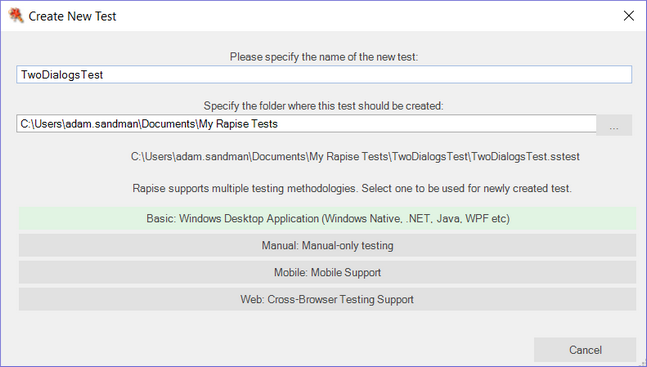
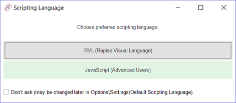
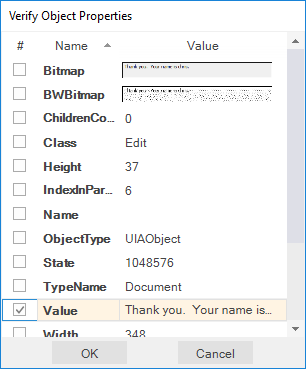
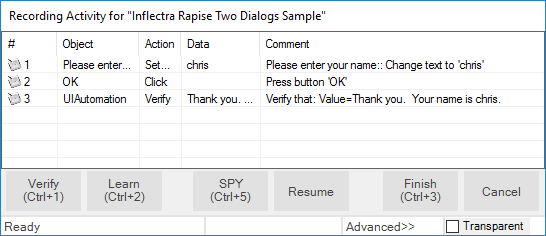
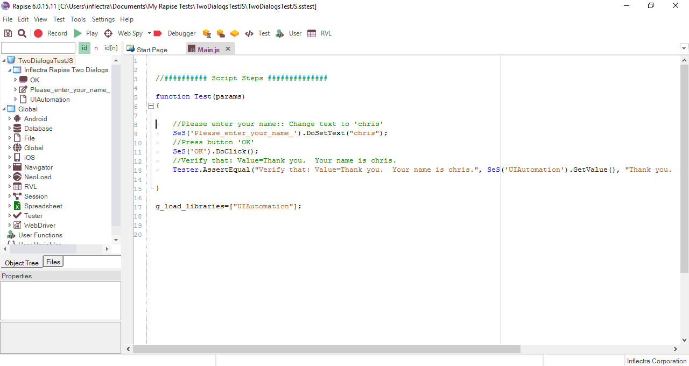
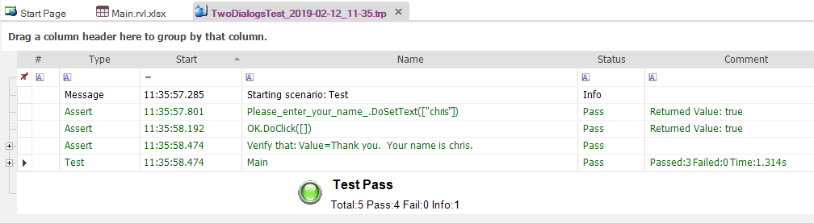
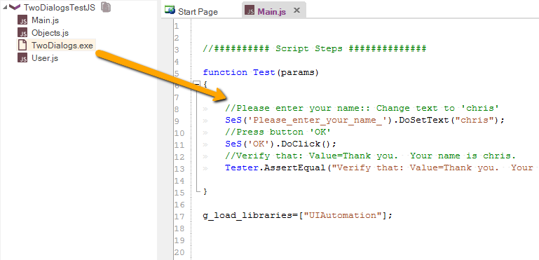
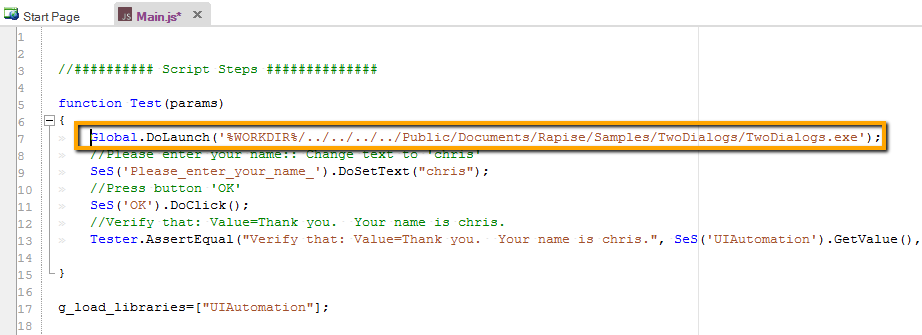
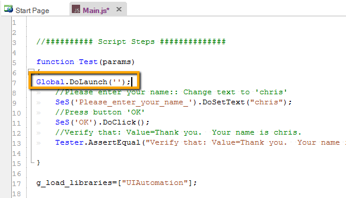

# Tutorial: Windows Testing (Using JavaScript)

This section outlines how to use Rapise to test a simple Windows Desktop [Application Under Test (AUT)](glossary.md). This version of the tutorial uses the JavaScript test editor option in Rapise. If you'd prefer to use the [Rapise Visual Language (RVL)](visual_language.md), please go to the main [Tutorial](twodialogs_sample.md) instead.

Run the application now. You will find it in the samples directory where you installed Rapise. By default, the path is:

`C:\\Users\\Public\\Documents\\Rapise\\Samples\\TwoDialogs\\TwoDialogs.exe`.

You will see the following:


Run the application a few times and observe its behavior.

- If you press the `OK` button with the first edit box empty, the application will display an error message and return you to the dialog box.
- If you enter text in the first edit box but not the second, the application will display a single line of text in a read-only edit box.
- If you enter text in both the first and second edit boxes, pressing `OK` will display two lines of summary information in the read-only edit box.

An adequate testing strategy for this simple application might be to:

1.  Enter data in the first text box but not the second, and verify that the summary information is correct.
2.  Press the `OK` button with no data in either text box, and verify that a message box is displayed.
3.  Verify that if the success "Thank You" message is displayed, the edit box input fields are cleared (but not the summary information).

If you do not understand what the application is supposed to do at this point, or if the application is not behaving as described, please contact Support to clarify the details before proceeding.

Now let's use Rapise to implement the first of these tests.

## Step 1. Run the Application

Run the TwoDialogs application and leave it in its default starting state. Once you execute the TwoDialogs.exe application, it will be displayed on the screen:


## Step 2. Start Rapise

Start Rapise and resize the window to a convenient size. Click the `File` menu (top left), then choose the first option, "New Test."


## Step 3. Create New Test

Navigate to the desired path using the `...` button on the **Create New Test** dialog. Enter the name of the new test script (e.g., "TwoDialogsTest"). Click the **Basic: Windows Desktop Application** methodology. This should always be used for testing Windows desktop applications:



The following dialog will be displayed:



Click the **JavaScript (Advanced Users)** button. You will now see the following:


## Step 4. Start Recording

Press the "**Record**" button on the toolbar. It has an icon like this:


You will see an application selection dialog like the following:


-   Select the "Inflectra Rapise Two Dialogs Sample" entry.
-   Leave the library selection as "Auto."
-   Press the "Select" button at the bottom right.

## Step 5. Recording Guidelines

Rapise will pause while it starts the necessary background processes and hooks into the running AUT. Once those tasks are complete, you will see the "Recording Activity" dialog for "Inflectra Rapise Two Dialogs Sample":


The AUT will be brought to the foreground and Rapise will be minimized.

You will achieve the best results when recording if you observe the following guidelines:

1.  Work slowly while recording.
2.  Perform one action and wait for the results to be recorded as a new grid line item in the Recording Activity dialog before proceeding to the next item.
3.  Use the mouse to select controls and operate them.
4.  Avoid using keyboard shortcuts and keyboard commands.

## Step 6. Record the Activity in the Application

-   Click inside the first edit box in the TwoDialogs application.
-   Type a name into this first edit box.
-   Place your mouse cursor over the Summary field with the 'Thank you' text and press ++ctrl+1++

Rapise will open the [Verify Object Properties](verify_object_properties.md) dialog.



Check the box for the `Value` property and click the `OK` button.

Watch the Recording Activity dialog as you operate the AUT interface. As you press a button or fill a field, notice that entries are added to the grid in the Recording Activity dialog.


As you take these actions, you will see the Recording Activity grid update accordingly:



For a full explanation of the controls on this dialog, refer to the [Recording Activity Dialog](recording_activity_dialog.md) reference.

When you have finished recording the activity for the AUT, press the `Finish` button or ++ctrl+3++.

**Note**: Do not terminate the TwoDialogs application.

When you do this, the **Recording Activity** dialog will be closed and the AUT will lose focus.

Rapise will change the view to display the newly recorded script. It will look something like the following:



Notice that the test's two steps are automatically documented as Action commands in the test grid, and they correspond precisely and in the same order as they appeared in the Recording Activity dialog during recording. In addition, the Verify checkpoint is recorded as an Assert…Condition set of steps in the grid.

## Step 7: Execute The Test

Press the "Play" button on the ribbon or toolbar.


As the script runs, the Rapise window will be minimized to the taskbar, and you will see the script's activities reflected on the TwoDialogs application window.

At the end of script execution, the Rapise window will be restored, and the view will show the report for the test:



## Step 8: A Refinement on the Launching of TwoDialogs.exe.

To date, we have operated on the assumption that the TwoDialogs sample program (application) is already running. If this situation remained, the test script would require the AUT to be running before the script started. This would require the person running the test to remember where it resided. To overcome this, Rapise provides a way for the script to launch the program (AUT) before beginning the test.

Rapise has an underlying scripting language based on JavaScript (see [Scripting](scripting.md)). This help system covers available scripting objects in detail from a practical perspective. For the moment, we will simply take the shortest path to starting the application before attempting to run the test.

There are at least three ways to add application launch code to your test:

**Way 1**: Drag The File from the Test Files view

First, switch to the [Test Files](test_files_dialog.md) view. Right-click the `Test` folder and choose the "Add File(s)..." menu item:


Then, select the location of the TwoDialogs.exe. Typically, it is located at:

```
C:\Program Files\Inflectra\Rapise\Samples\TwoDialogs\TwoDialogs.exe
```


Now you have the executable as part of your test file set:


If you wish to launch TwoDialogs.exe only once, then just double-click it in the tree. If you wish it to be launched every time the test starts, simply drag it from the tree into the source code:



The appropriate launch statement will be inserted:



**Way 2**: Type the Code

The `Global` object contains methods that are available to all scripts. Select the `Main.js` file in the [Test Files](test_files_dialog.md) view within the Rapise main page. Double-click the file name to open it in Rapise's main (editing) window. You will see the script generated from the recording session in earlier steps of this sample.

Place the cursor in the main editing window and click the first line after:

```javascript
function Test()
{
```

Now type `Global`. As soon as you type the `.`, Rapise will display a drop-down list of all available methods within the `Global` object:


Select the `DoLaunch(cmdLine, wrkD)` member and press the `Enter` key.

Now your script contains the line:

```javascript
Global.DoLaunch('')
```

You need to correct the command line reference:

```javascript
Global.DoLaunch('"C:\\Program Files\\Inflectra\\Rapise\\Samples\\TwoDialogs\\TwoDialogs.exe"');
```

**Way 3**: Drag the Action from the Objects Tree

You can drag the method template from the [Object Tree](object_tree.md) view. Expand the **Global** node and select the `DoLaunch` action within it. Drag the node into the appropriate position within the script source:


The template call is inserted:



Now you need to correct the command line reference:

```javascript
Global.DoLaunch('"C:\\Program Files\\Inflectra\\Rapise\\Samples\\TwoDialogs\\TwoDialogs.exe"');
```

## Advanced Testing using the Object Spy

Sometimes you need to learn objects that are not visible or are obscured by other objects. To help with this, Rapise includes the Object Spy tool. The Spy tool lets you view the objects in the application within a hierarchy that you can learn.

When you are in the middle of recording, click the **Spy** button, and Rapise will display the [UIAutomation Spy](object_spy_uiautomation.md):


Press ++ctrl+g++ on your keyboard to start tracking. Hover your mouse over one of the text boxes in the TwoDialogs application and press ++ctrl+g++ again to stop tracking:


This shows the object you selected, along with its various Windows attributes. If you want to see its place in the application's hierarchy, right-click **Edit** in the top-left pane and choose **Parent**. This will display its parent objects:


For example, in this view you can see all text boxes, labels, and some of the Windows standard objects (e.g., the window title bar, `OK` and `Cancel` buttons). Each of these can be expanded to show their children, and any of the objects can be learned by clicking the **Learn Object** button at the top of the Spy. Once learned, you can use one of the options described above to write a test using it.