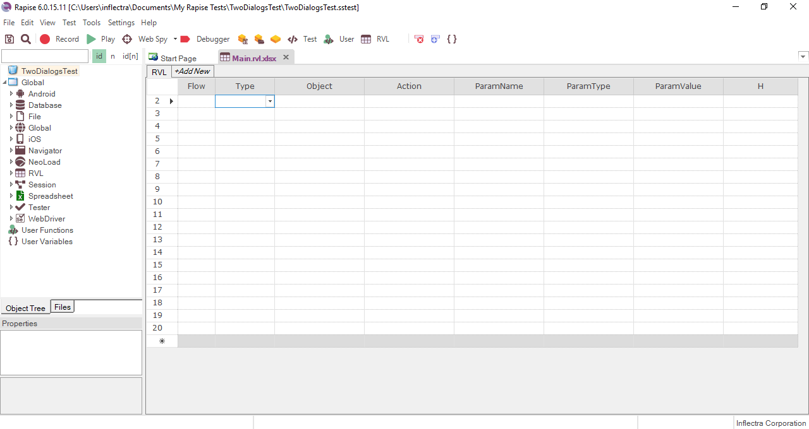
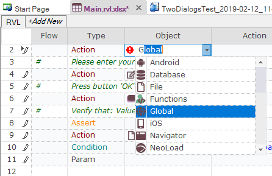
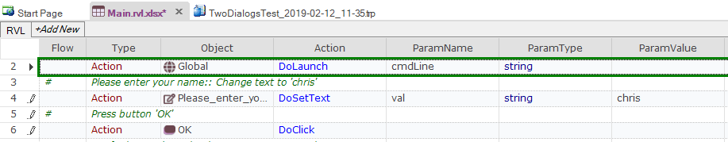
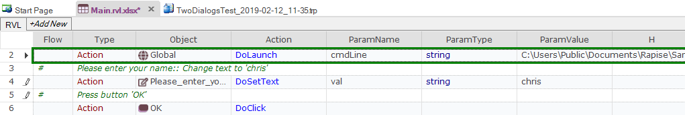

# Tutorial: Windows Testing (RVL)

This section outlines the usage of Rapise for testing a simple Windows Desktop [Application Under Test (AUT)](glossary.md). This version of the tutorial uses the **Rapise Visual Language (RVL) scriptless** mode. If you're interested in the [JavaScript version](tutorial_windows_using_javascript.md), we have a separate tutorial.

Please run the application now. You will find it in the samples directory where you installed Rapise. By default, that will be

    C:\Users\Public\Documents\Rapise\Samples\TwoDialogs\TwoDialogs.exe

You will see the following:


Please run the application a few times and observe its behaviour.  

- If you press the `OK` button with the first edit box empty, the application will complain and return you to the dialog box.
- If you put text in the first edit box but not the second, you will be shown a single line of text in a read-only edit box.
- If you enter text in the second edit box as well as the first, pressing OK will put two lines of summary information in the read-only edit box.

An adequate testing strategy for this over-simple application might be to:

1. Put data in the first text box but not the second, and verify that the summary information is correct.
2. Press the OK button with no data in either text box, and verify that a message box is displayed.
3. Verify that if the success "Thank You" message is displayed the edit box input fields are cleared (but not the summary information).

If at this point you do not understand what the application is supposed to do, or the application is not behaving as described here, please contact Support and clarify the details before proceeding.

Now, let's use Rapise to implement the first of these tests.

## Step 1. Run the Application

Run the TwoDialogs application and leave it in its default start state. Once you execute the TwoDialogs.exe application it will be displayed on the screen:


## Step 2. Start Rapise

Start Rapise and make the window a conveniently large size.  Click on the `File` menu (top left).  Choose the first option there, "New Test."


## Step 3. Create New Test

Navigate to the desired path using the `...` button on the **Create New Test** dialog. Enter the name of the new test script we're going to write (e.g. "TwoDialogsTest"). Click on the **Basic: Windows Desktop Application** methodology. This should always be used for testing Windows desktop applications:


The following dialog will be displayed:


Click on the **RVL (Rapise Visual Language)** button.  You will now see the following:



## Step 4. Start Recording

Press the "**Record**" button on the toolbar.  It has an icon like this:


You will see an application selection dialog like the following.


- Select the "Inflectra Rapise Two Dialogs Sample" entry.
- Leave the library selection as "Auto."
- Press the "Select" button at the bottom right.

## Step 5. Recording Guidelines

Rapise will pause while it starts the necessary background processes and hooks into the running AUT. Once those tasks are complete, you will see the following "Recording Activity" for "Inflectra Rapise Two Dialogs Sample" dialog:


The AUT will be brought to the foreground and Rapise will be minimized.

You will achieve best results in recording if you observe the following guidelines:

1. Work slowly while recording.  Perform one action and wait for the results to be recorded in the Recording Activity dialog as a new grid line-item before going to the next item.
2. Use the mouse to select controls and operate them.  Avoid using keyboard shortcuts and keyboard commands.

## Step 6. Record the Activity in the Application

- Click in the first edit box in the TwoDialogs application.
- Type a name in this first edit box.
- Place mouse over the Summary field with 'Thank you' text and press ++ctrl+1++

Rapise will open [Verify Object Properties](verify_object_properties.md) dialog.


Set checkbox on `Value` property and click `OK` button.

Watch the Recording activity dialog as you operate the AUT interface. As you press a button or fill a field, notice that the grid in the Recording activity has entries added to it.


As you take these actions, you will see the Recording Activity grid update accordingly:


For a full explanation of the controls on this dialog, refer to the reference for [Recording Activity Dialog](recording_activity_dialog.md).

When you have finished recording the activity for the AUT, press the `Finish` button or ++ctrl+3++.

**Note**: Do not terminate the TwoDialogs application.

When you do this, the **Recording Activity** dialog will be closed and the AUT will lose focus.

Rapise will now ask you to confirm that you want to add the recorded steps to the current location in the test grid:


Click `Append to End`, then Rapise will change the view to display the newly recorded test steps.  It will look something like the following:


Notice that the two steps of the test are automatically documented as Action commands in the test grid, and that they correspond precisely and in the same order as the way they appeared in the Recording Activity dialog during recording. In addition, the Verify checkpoint has been recorded as an Assert…Condition set of steps in the grid.

## Step 7: Execute The Test

Press the "Play" button on the ribbon or the toolbar.


As the script runs, the Rapise window will be minimized to the taskbar and you will see the results of the script's activities on the TwoDialogs application window.

At the end of the script execution, the Rapise window will be restored and the view will be of the report for the test:


## Step 8: A Refinement on the Launching of TwoDialogs.exe.

To date, we have operated on the assumption that the TwoDialogs sample program (application) is running.  If this situation remained, the test script would require that the AUT be running before the script started.  That would require that the person running the test remembered where it resided.  To overcome this, Rapise provides a way to have the script run the program (AUT) before beginning the test.

Rapise comes with a series of useful Global utility objects that can do things such as start applications, kill processes, access the file system, etc. To launch the TwoDialogs application at the start of the test, go to the first row in the test grid and click `Insert Row Before` icon on the toolbar:


Now in the new row that was created, choose **Action** as the **Type** column:


Then in the next cell, choose **Global** as the object:



Then in the next cell, choose **DoLaunch** and press `ENTER` on the keyboard:



Now you just need to enter in the location of the TwoDialogs application in the final cell (ParamValue):

```
C:\Users\Public\Documents\Rapise\Samples\TwoDialogs\TwoDialogs.exe
```



Now if you click **Play**, Rapise will launch the application and then complete the recorded test steps.

## Advanced Testing using the Object Spy

Sometimes you need to learn objects that are not visible or are obscured by other objects. To help with this, Rapise has the Object Spy tool. The Spy tool lets you see the objects in the application in a hierarchy that you can learn.

When you are in the middle of recording, click on the **Spy** button and Rapise will display the [UIAutomation Spy](object_spy_uiautomation.md):


Press ++ctrl+g++ on the keyboard to start tracking. Hover the mouse over one of the text boxes in the TwoDialogs application and press ++ctrl+g++ again to stop tracking:


This shows you the object you selected, together with its various Windows attributes. If you want to see its place in the hierarchy of the application, right click on **Edit** in the top-left pane and choose **Parent**. That will display its parent objects:


For example in this view you can see all text boxes, the labels and some of the Windows standard objects (the Window title bar, OK and Cancel buttons, etc.). Each of these can be expanded to show their children, and any of the objects can be Learned by clicking the **Learn Object** button in the top of the Spy. Once learned, you can use one of the options described above to write a test using it.
