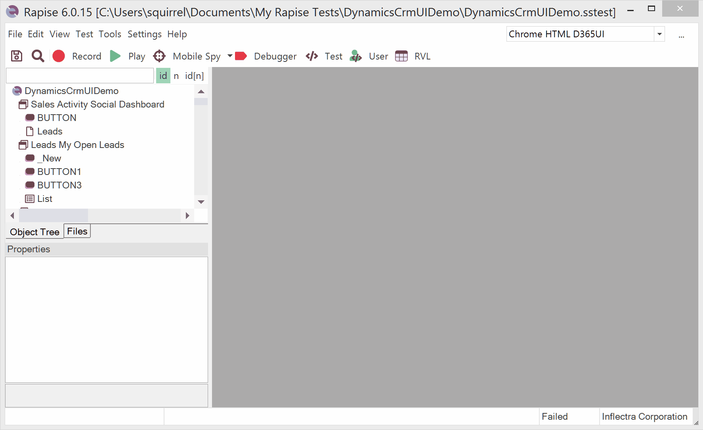
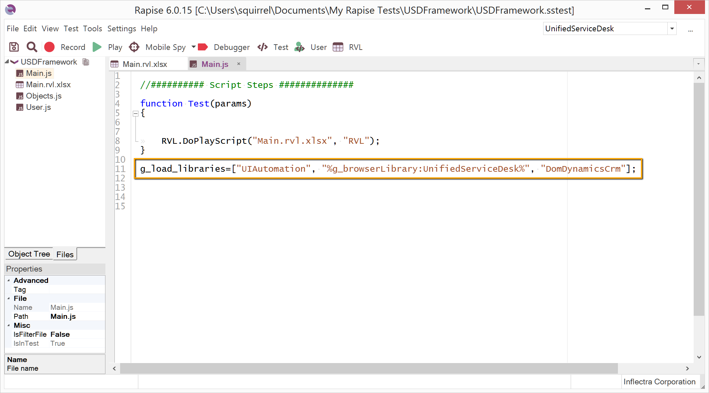
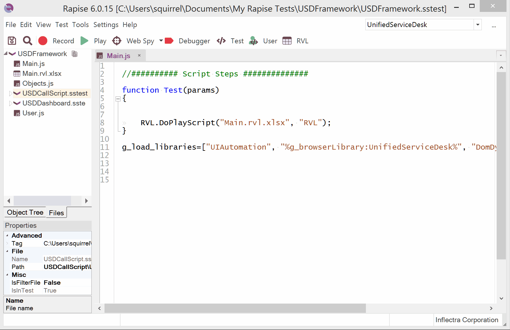
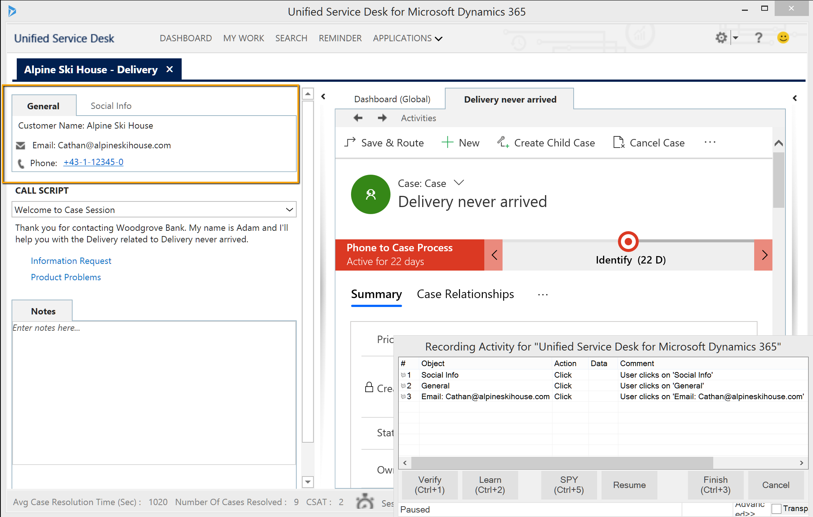
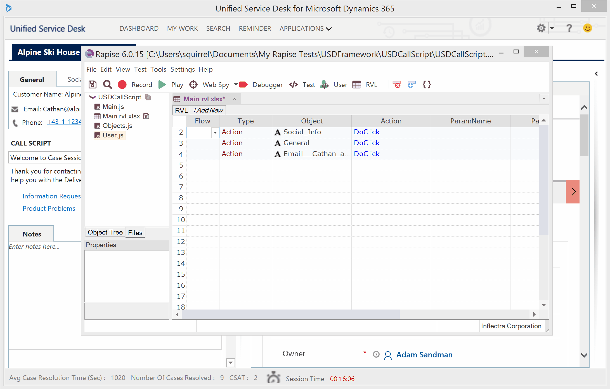

# Microsoft Dynamics 365 Unified Service Desk

Unified Service Desk (USD) is a hybrid application. It is a Windows desktop application with embedded browser components. Follow this guide to set up a test automation framework for USD.

## Hybrid Application

Most panels in USD are web views (highlighted in red), and some parts are pure desktop areas (highlighted in orange). Rapise can interact with web content in USD just as it interacts with pure web applications loaded into browsers. Desktop parts of USD are controlled through the **UIAutomation** library.


## Browser Profile

To interact with web content in USD, a browser profile must be configured. Rapise will use this profile to connect to embedded browser components.

1.  In the main menu, select `Settings > Browser`.
2.  Select the Internet Explorer HTML profile and click Duplicate.
3.  Specify a name for the new profile: UnifiedServiceDesk.
4.  Set the Browser Path to `C:\Program Files (x86)\Microsoft Dynamics CRM USD\USD\UnifiedServiceDesk.exe`
5.  Set the `Default Click Mode` to **click**.
6.  Save the profile.


## Test Framework

### Root Test

The suggested approach for building a test framework for USD is to create a root, empty test that will serve as a container for test scenarios and building blocks.

Let's create the USDFramework test. Choose Web methodology, the `UnifiedServiceDesk` browser profile, and RVL options during the setup process.



In the test's main file (`Main.js`), specify the list of libraries to load:

```javascript
g_load_libraries=["UIAutomation", "Web", "DomDynamicsCrm"];
```



## Browser Automation Sub-Test

To record web content-related actions, create a sub-test inside USDFramework. Let's name it USDDashboard. Choose Web methodology and the UnifiedServiceDesk browser profile during the setup process.


Double-click the USDDashboard test to open it in another instance of Rapise. Append `DomDynamicsCrm` to the list of loaded libraries.


Also, in USDDashboard's `User.js` file, insert the following line:

```javascript
g_webPluginsAutoDetect = false;
```

You can now record web steps into USDDashboard.


## Desktop Automation Sub-Test

To record desktop content-related actions, create a sub-test inside USDFramework. Let's name it USDCallScript. Choose Desktop methodology during the setup process.


Double-click the USDCallScript test to open it in another instance of Rapise. Insert the following snippet into `Main.js`:

```javascript
function TestPrepare()
{
    if (g_recording)
    {
        g_UIAutomationWrapper.DeepPointTracking(true);
    }
}
```

The `DeepPointTracking` flag fixes a bug in USD's UI Automation tree that prevents automation tools from tracking elements located under the cursor.



Let's record steps into USDCallScript. After pressing Record, choose Unified Service Desk from the list of applications.


> **Note:** The recording part is missing from the video above because screen capturing software interferes with Rapise's desktop recording.



Here is the test playback.



## Assembling Blocks

You can now execute USDDashboard and USDCallScript from USDFramework. Open the USDFramework test and drag-and-drop the sub-tests onto the RVL sheet.


The test framework created during this session is [available on GitHub](https://github.com/Inflectra/rapise-framework-examples/tree/master/USDFramework).

## See Also

-   [Microsoft Dynamics](microsoft_dynamics.md)
-   [Get the framework for testing Unified Service Desk (github)](https://github.com/Inflectra/rapise-unified-service-desk)
-   [Advanced example of testing USD on GitHub](https://github.com/Inflectra/rapise-dynamics365-samples/tree/master/UnifiedServiceDesk)
-   [Testing Dynamics 365 for Sales](dynamics_crm.md)