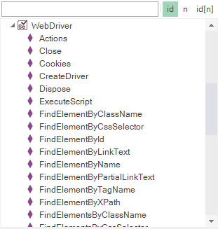
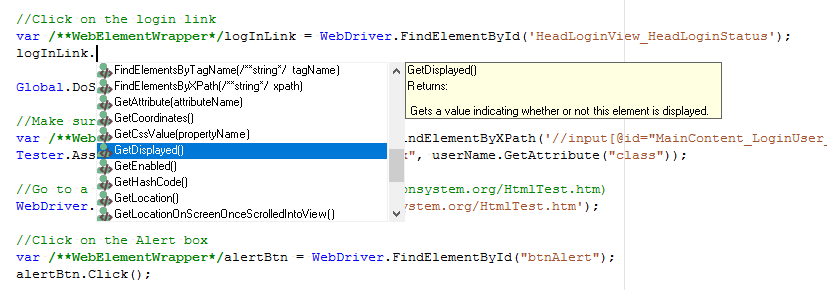

# Using Native Selenium Code

When using the standard Rapise [Record, Learn](recording.md), and [Web Spy](web_spy.md) tools you can create your web tests using the Rapise built-in [Object Tree](object_tree.md). This lets you design your tests using a higher level of abstraction than working
directly with [Selenium WebDriver](selenium_webdriver.md).

For example you can learn an object `SeS("EditButton")` that points to a dynamic [XPATH](xpath.md) or [CSS](css.md) query that the automation engineer knows will be accurate even if the data on the page changes (for example). The QA analyst can then simply drag and drop these Rapise objects from the [Object Tree](object_tree.md) into the test script (e.g. `SeS("EditButton").DoClick()`) to perform the desired action.

Sometimes however you will want to be able to run standard Selenium raw WebDriver code inside Rapise using the standard [Selenium WebDriver API functions](http://www.seleniumhq.org/docs/03_webdriver.jsp). Rapise allows you to do this using the special **WebDriver** global object:



The **WebDriver** object implements the various standard Selenium WebDriver API calls for automating the web browser. There is a sample
available for Rapise called **UsingSelenium** (you can open it from the `View > Start Page`) that illustrates using the WebDriver code directly, but for completeness, here is a sample that uses the [**www.libraryinformationsystem.org**](http://libraryinformationsystem.org) web site and performs some simple actions:

```javascript
// Open and connect the browser
WebDriver.CreateDriver();

//Open the URL for the www.libraryinformationsystem.org website:
WebDriver.SetUrl('https://www.libraryinformationsystem.org');

//Find the body element and verify the text in it
var el = WebDriver.FindElementByXPath("//body");
Tester.Assert("Text found in BODY", el.GetText().indexOf("Library Information System") != -1);

//Click on the login link
var logInLink = WebDriver.FindElementById('HeadLoginView\_HeadLoginStatus');
logInLink.Click();

//Make sure the input textbox is as expected

var userName = WebDriver.FindElementByCssSelector("html > body > form > div:nth-of-type(3) > div:nth-of-type(2) > div:nth-of-type(2) > fieldset > p:first-of-type > input");
Tester.AssertEqual("class is 'textbox'", "textbox", userName.GetAttribute("class"));

//Go to a different URL (https://libraryinformationsystem.org/HtmlTest.htm)
WebDriver.SetUrl('https://www.libraryinformationsystem.org/HtmlTest.htm');

//Click on the Alert box
var alertBtn = WebDriver.FindElementById("btnAlert");
alertBtn.Click();

//Switch to this alert box and close
var alertElement = WebDriver.SwitchToAlert();
alertElement.Accept();

//Shut down Selenium
WebDriver.Quit()
```

**More sophisticated sample** is available in [rapise-samples repository](https://github.com/Inflectra/rapise-samples/tree/master/SeleniumAPI).

When you click `Play` to playback your Selenium script, make sure you have selected one of the Selenium web browser profiles. If you have
selected a native browser profile (e.g. “Firefox HTML” instead of “Selenium – Firefox”) you will get the error message “WebDriver” is not
defined.

## Code Completion for the Selenium WebElement Objects

When you are using functions such as `FindElementsById()` in your code, the returned object will be a Selenium [Web Element](../Libraries/WebElementWrapper.md).

Assign `WebElement` to a variable and benefit from intellisense and code-completion feature.

```javascript
var logInLink = WebDriver.FindElementById("HeadLoginView_HeadLoginStatus");
```



## Interoperability with Rapise Objects

In addition to being able to use raw Selenium code on its own, you can also use a mixture of Rapise object-based code and raw Selenium WebDriver code.

For example, you are using the standard Rapise approach (using learned `SeS('object')` objects) for testing but at some point want to switch to Selenium API to call a couple of WebElement functions on a learned object, you can use the special **element** property:

```javascript
var /**WebElementWrapper*/ webElement = SeS('MyObject').element;
```

Prefixing the variable with `/**WebElementWrapper*/` enables code completion for it.

If you want to do the reverse and be able to create a Rapise `SeS('object')` on the fly from a physical object on the web page, you can do the `Navigator.SeSFind(xpath)` function that returns a Rapise **SeSObject**, in the same way that `SeS('id')` does normally:

```javascript
var sesObj = Navigator.SeSFind("//body//div[@id='logArea']");
```
