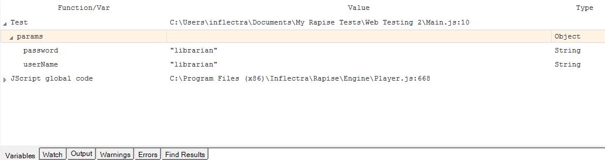

# Variable/Call Stack View

## Purpose

Lists the functions in the current call stack.  Beneath each function, variables/objects local to that function are listed with their value and type.

## How to Open

Begin [debugging](internal_debugger.md) a script.  The **Variable/Call Stack View** will open automatically.

## Go to a Function Definition

Double click on a function to go to its definition.

## See Also

- [Internal Debugger](internal_debugger.md)
