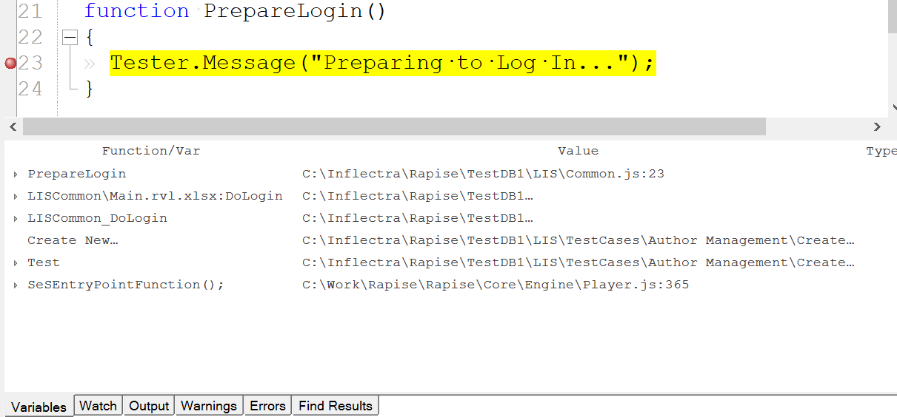
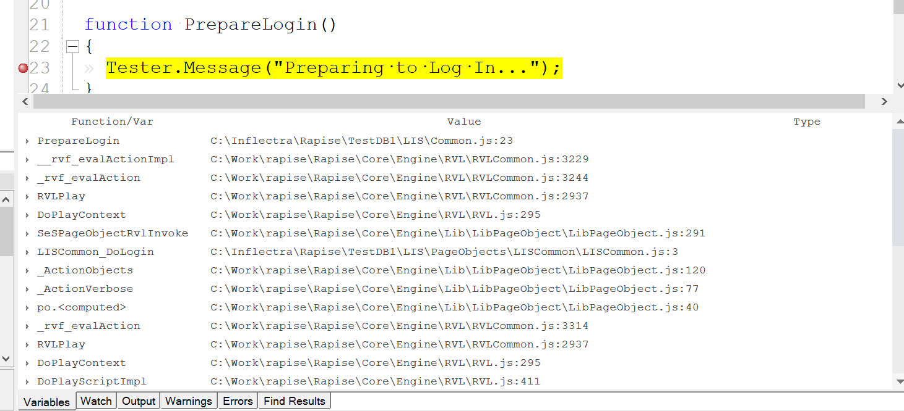

# Variable/Call Stack View

## Purpose

Lists the functions in the current call stack. For each function, its local variables and objects are listed with their values and types.

## How to Open

Begin [debugging](internal_debugger.md) a script. The **Variable/Call Stack View** will open automatically.

## Go to a Function Definition

Double-click a function to go to its definition.

## Call Stack View Optimization

The view of the call stack depends on the value of the [Optimize Call Stack](options_dialog.md#debugger) setting. When set to **True**, internal calls used by the Rapise runtime are skipped, resulting in a shorter call stack:

When set to **False**, the full call stack is shown, including all internal calls:

## See Also

- [Internal Debugger](internal_debugger.md)