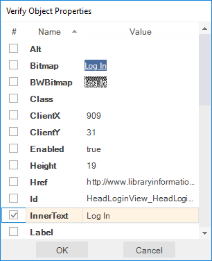
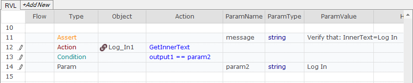

# Verify Object Properties Dialog


## Purpose

Use the **Verify Object Properties** dialog during [recording](recording.md) to add [checkpoints](checkpoints.md).

## How to Open

1. Open the [Recording Activity Dialog](recording_activity_dialog.md).
2. Position the mouse over an object and press `Ctrl+1`, or
3. Press the `Verify` button and then click the target object with the mouse cursor.

## Create a Checkpoint

Your checkpoint will be associated with a particular object. The object's properties will be listed in the **Verify Object Properties** dialog. Select the properties you wish to verify during [playback](playback.md). Enter expected values for the selected properties in the **Value** column. 

> Note: The **Bitmap** and **BWBitmap** properties are images of the object.



Press the `OK` button. The **Verify Object Properties** dialog will close, and the [Recording Activity](recording_activity_dialog.md) dialog will display a new **Verify** action:


The generated script will have a corresponding [assert statement](assertions.md):


Or, in JavaScript mode:

```javascript
   Tester.Assert("Verify that: InnerText=Log In", SeS('Log_In1').GetInnerText() == "Log In" );
```

## Check Object Exists

Starting with Rapise 6.6, the **Verify Object Properties** dialog includes the `Exists` property. It adds a [Global.DoWaitFor](../Libraries/Global.md#dowaitfor) action to the recording.

## Check Object Visible

Starting with Rapise 6.6, the **Verify Object Properties** dialog includes the `Visible` property. This verifies that the object is visible on screen.

## See Also

* [Recording](recording.md)
* [Assert Statements](assertions.md)