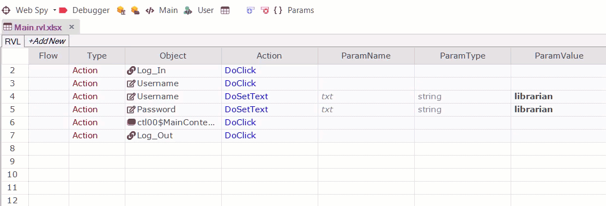

# Rapise Visual Language (RVL)

Rapise includes a **scriptless** approach to writing automated tests as well as the option to use the built-in [JavaScript IDE](javascript_ide.md).

This section gives an overview of the **Rapise Visual Language (RVL)** option and why you would use it.

!!! info
    For more information on RVL's syntax and constructs, please refer to the separate [RVL section](rvl_editor.md) of this user manual.

## What is Scriptless Testing

Let's imagine we're recording a simple automated web test against the sample [http://www.libraryinformationsystem.org](http://www.libraryinformationsystem.org) website that comes with Rapise:

Now in this script, we'll perform the following actions to verify that you can login correctly (the happy path):

1. Click on the login button

2. Enter your username and password

3. Click on the submit button

4. Once the home page loads, verify the name of the logged in user at the top-right

If you use the JavaScript [scripting option](scripting_choice_dialog.md), what will be recorded is a JavaScript test script that looks something like the following:

You can drag and drop objects and actions from the object tree on the left-hand side into the test script, but for automation engineers that are not programmers, we found that in many cases the resulting scripts are not easy to understand and the syntax can be fiddly to get right. All Java, JavaScript, C#, C++, C programmers out there know that you need curly braces, semi-colons at the end of each line, etc. but for others, it's not so obvious.

So to make automated testing and the power of Rapise's object based testing **easier and more accessible**, you can use the alternative RVL methodology.

### RVL

Let's imagine that we perform the exact same set of steps, recording the test script using the Rapise Visual Language approach. As a result we get:

What you'll notice is that each of the recorded actions has now become a series of rows in the grid.

The **Type** column sets the type of a row (perform an action, comment, make an assertion that a value matches what was expected, set a variable, be a parameter or output to the current test report):

The **Object** column is used to select the object from the object
tree:

!!! note
    This dropdown shows all the objects from the object tree, [global utility objects](/Libraries/ses_lib_global/) as well as `Functions` object which you can use to call custom functions (written in JavaScript).

The **Action** column defines what to do with the selected object.

Finally, the remaining columns (**ParamName**, **ParamType**, **ParamValue**) contain any parameter values, with subsequent rows being used if necessary:

This means that once you have learned the objects during testing, anyone can compose the test just by adding rows to the grid and then just picking the appropriate objects and actions.

### Power of Dropdowns

RVL dropdowns help you spend less time on editing test steps. When you expand the Object dropdown you see available objects. When an object is selected the Action dropdown shows applicable actions. If a selected action accepts parameters then parameter names and types are generated automatically.

