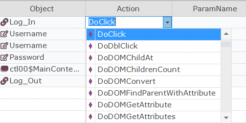

# Rapise Visual Language (RVL)

Rapise offers a **scriptless** approach to writing automated tests, as well as the option to use the built-in [JavaScript IDE](javascript_ide.md).

This section provides an overview of the **Rapise Visual Language (RVL)** option and its purpose and advantages.

!!! info
    For more information on RVL's syntax and constructs, please refer to the separate [RVL section](rvl_editor.md) of this user manual.

## What is Scriptless Testing

Imagine recording a simple automated web test against the sample [http://www.libraryinformationsystem.org](http://www.libraryinformationsystem.org) website included with Rapise:

For this script, we will perform the following actions to verify a successful login (the happy path):

1.  Click the login button
2.  Enter the username and password
3.  Click the submit button
4.  Once the home page loads, verify the logged-in user's name in the top-right corner

If you use the JavaScript [scripting option](scripting_choice_dialog.md), Rapise records a JavaScript test script similar to the following:

You can drag and drop objects and actions from the object tree on the left into the test script. However, for automation engineers who are not programmers, we found that the resulting scripts are often difficult to understand, and the syntax can be tricky to get right. While programmers familiar with Java, JavaScript, C#, C++, or C understand the need for curly braces, semicolons at the end of each line, and other syntax rules, these conventions are not as intuitive for others.

To make automated testing and the power of Rapise's object-based testing **easier and more accessible**, Rapise offers the alternative RVL methodology.

### RVL

Imagine performing the exact same set of steps, recording the test script using the Rapise Visual Language approach. The result is:

Each recorded action becomes a series of rows in the grid.

The **Type** column specifies the row's type (e.g., performing an action, adding a comment, asserting that a value matches expectations, setting a variable, defining a parameter, or capturing output for the current test report):

The **Object** column is used to select an object from the object tree:

!!! note
    This dropdown displays all objects from the object tree, [global utility objects](/Libraries/ses_lib_global/), as well as the `Functions` object, which allows you to call custom functions (written in JavaScript).

The **Action** column defines the action to perform on the selected object.

Finally, the remaining columns (**ParamName**, **ParamType**, **ParamValue**) contain parameter values, with subsequent rows used as needed:

This means that once the objects have been learned during testing, anyone can compose a test by adding rows to the grid and selecting the appropriate objects and actions.

### The Power of Dropdowns

RVL dropdowns help reduce the time spent on editing test steps. When the Object dropdown is expanded, available objects are displayed. When an object is selected, the Action dropdown displays applicable actions. If a selected action accepts parameters, then parameter names and types are automatically generated.

