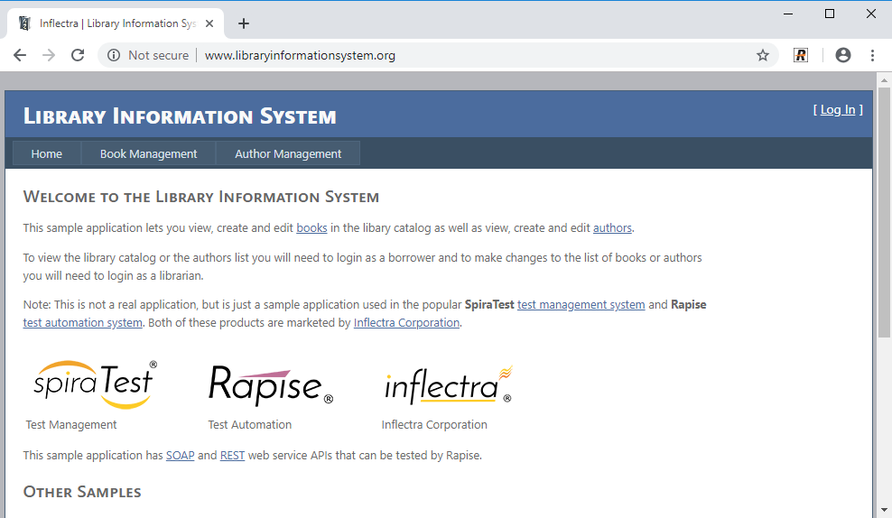
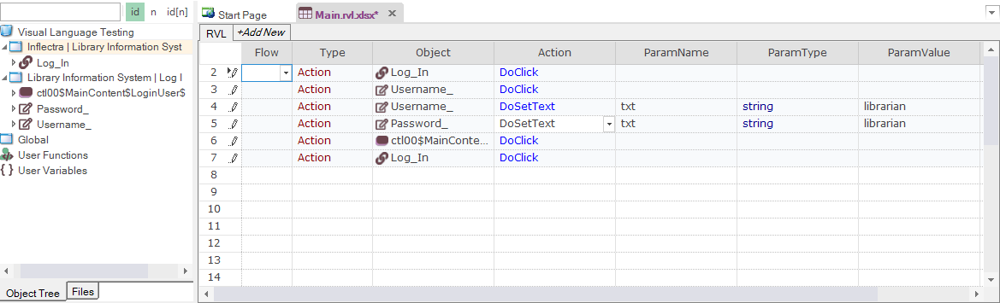
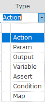
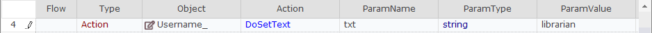

# Rapise Visual Language (RVL)

Rapise includes a scriptless approach to writing automated tests as well as the option to use the built-in [JavaScript IDE](javascript_ide.md).

This section gives an overview of the **Rapise Visual Language (RVL)**
option and why you would use it.

For more information on RVL's syntax and constructs, please refer to the separate [RVL section](rvl_editor.md) of this user manual.

## What is Scriptless Testing

Let's imagine we're recording a simple automated web test against the sample [http://www.libraryinformationsystem.org](http://www.libraryinformationsystem.org) website that comes with Rapise:

Now in this script, we'll perform the following actions to verify that you can login correctly (the happy path):

1. Click on the login button

2. Enter your username and password

3. Click on the submit button

4. Once the home page loads, verify the name of the logged in user at
the top-right

If you use the JavaScript [scripting option](scripting_choice_dialog.md), what will be recorded is a JavaScript test script that looks something like the following:

Now you know that you can drag and drop objects and actions from the object tree on the left-hand side into the test script, but for automation engineers that are not programmers, we found that in many cases the resulting scripts are not easy to understand and the syntax can be fiddly to get right. All you Java, JavaScript, C#, C++, C programmers out there know that you need curly braces, semi-colons at the end of each line, etc. but for others, it's not so obvious.

So to make automated testing and the power of Rapise's object based testing **easier and more accessible**, you can use the alternative RVL methodology.

## How Does RVL Compare?

Let's imagine that we perform the exact same set of steps, recording the test script using the Rapise Visual Language approach:

What you'll notice is that each of the recorded actions has now become a series of rows in the grid, with the first column being the type (perform an action, comment, make an assertion that a value matches what was expected, set a variable, be a parameter or output to the current test report):

The second column is then used to select the object from the object
tree:

Note that you can call custom functions (written in JavaScript), global utility objects as well as any of the recorded objects from the application being tested.

Finally, the remaining columns contain any parameter values, with subsequent rows being used if necessary:

This means that once you have learned the objects during testing, anyone can compose the test just by adding rows to the grid and then just picking the appropriate objects and actions.

## Unleash the Power of Excel

Now one the really exciting things about RVL is that it's ultimately
stored as an actual Microsoft Excel file (XLSX) file inside the Rapise
project. So in addition to doing simple editing within the Rapise visual
editor, you also have the option to open the file in Excel natively:

This opens up many exciting possibilities of being able to use Excel formulas to auto-generate test data from another worksheet, perform validation tests by doing calculations in Excel and comparing them with the results returned from the application. You can now use Excel and Rapise to have a powerful, easy to use, yet incredibly extensive test automation framework.
