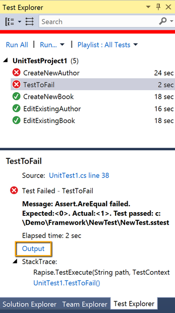
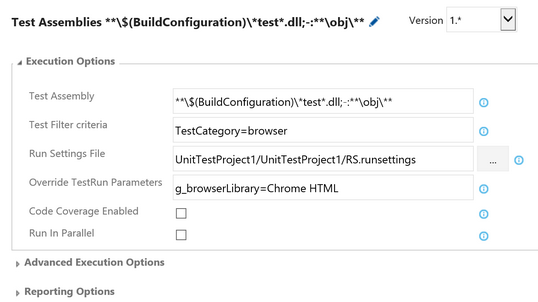
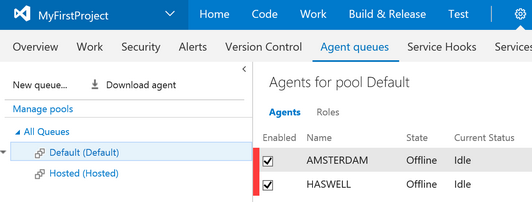
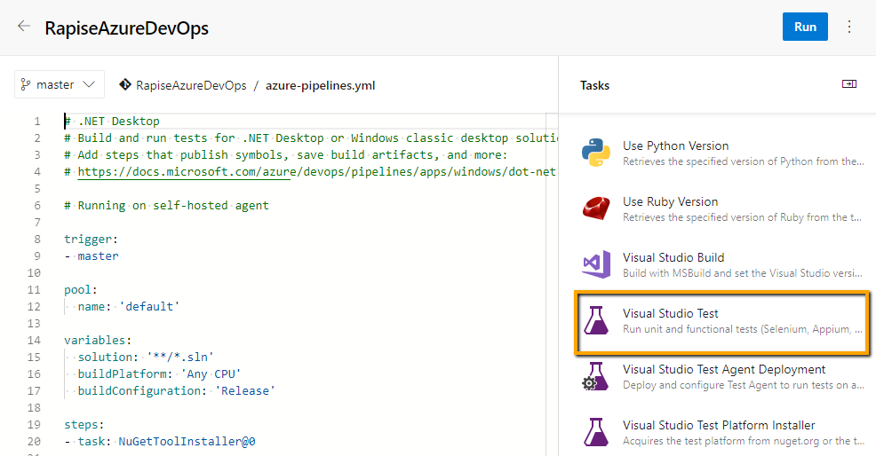
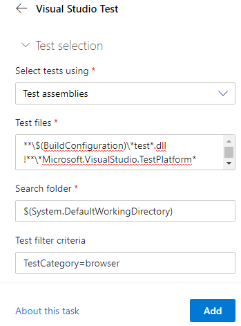
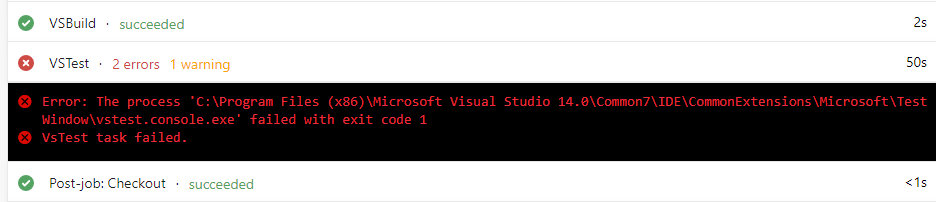

# Visual Studio

This section describes how to execute Rapise tests using the [Microsoft Test Framework](https://github.com/microsoft/testfx).

You can execute tests with

- [Visual Studio Test Explorer](https://docs.microsoft.com/en-us/visualstudio/test/getting-started-with-unit-testing)
- [Visual Studio Team Services / Team Foundation Server](https://en.wikipedia.org/wiki/Team_Foundation_Server)
- [Azure DevOps](https://azure.microsoft.com/en-us/services/devops/)

## Unit Test Mapping

Rapise integrates with Visual Studio at [Unit Test](https://www.visualstudio.com/en-us/docs/test/developer-testing/getting-started/getting-started-with-developer-testing) level.

Create a Unit Test project in Visual Studio, add a unit test and a test method. In the References section add the DLL:

    c:\\Program Files (x86)\Inflectra\Rapise\Extensions\UnitTesting\VSUnit\SeSVSUnit\Bin\Release\SeSVSUnit.dll

In a test method specify absolute path to a Rapise test and pass `TextContext` parameter to `Rapise.TestExecute` function:

```C#
namespace UnitTestProject1
{
    [TestClass] 
    public class UnitTest1
    {
        public TestContext TestContext { get; set; }

        [TestMethod, TestCategory("browser")]
        public void CreateNewBook()
        {
            Rapise.TestExecute(@"c:\\Demo\\Framework\\CreateNewBook\\CreateNewBook.sstest", TestContext);
        }
    }
}
```

## Parameters

To pass parameters to Rapise test create [.runsettings](https://msdn.microsoft.com/en-us/library/jj635153.aspx) file. Each parameter with name starting with `g_` will be passed to Rapise via command line.

Here is an example of selecting a browser to use for execution of cross-browser tests:

```xml
<?xml version="1.0" encoding="utf-8"?>
<RunSettings>
  <!-- Parameters used by tests at runtime -->
  <TestRunParameters>
    <Parameter name="g_browserLibrary" value="Chrome HTML" />
  </TestRunParameters>
</RunSettings>
```

## Visual Studio Test Explorer

Once Rapise tests are mapped to unit tests one can use Visual Studio Test Explorer to run tests and analyze results.



Press Output link (highlighted) to view test run results.


- last.tap - is a test report in [Test Anything Protocol](https://testanything.org/) format (human readable). Click to open in any Text Viewer/Editor.
- last.trp - is a test report in Rapise format. Click to open in Rapise.

One can apply `.runsettings` file to use for execution:


## VSTS / TFS

In Visual Studio Team Services one can [run unit tests after making a build](https://www.visualstudio.com/en-us/docs/test/continuous-testing/test-build).


Build definition contains predefined steps:


Here is an example configuration of the Test Assemblies step:



- **Test Assembly** field contains a wildcard mask that selects unit tests from matching DLLs only
- In **Test Filter criteria** one can select tests by TestCategory which is an attribute of a Test Method:

```C#
[TestMethod, TestCategory("browser")]
public void CreateNewBook() 
{
    Rapise.TestExecute(@"c:\\Demo\\Framework\\CreateNewBook\\CreateNewBook.sstest", TestContext); 
}
```

- **Run Settings File** is a link to [.runsettings](https://msdn.microsoft.com/en-us/library/jj635153.aspx) file.
- In **Override TestRun Parameters** one can override values of the parameters in `.runsettings` file.

### Windows Agent for Test Execution

VSTS can run tests in a hosted environment, but it does not contain Rapise. So most likely you will need to run tests inside your computer network. Download and connect [Windows Agent](https://www.visualstudio.com/en-us/docs/build/admin/agents/v2-windows).
One can configure several agent pools to run tests in different environments:



## Azure DevOps

On September 10, 2018, Microsoft [renamed](https://docs.microsoft.com/en-us/azure/devops/user-guide/what-is-azure-devops) Visual Studio Team Services (VSTS) to Azure DevOps Services.

Execution of Rapise tests in Azure DevOps looks a bit different from former versions of VSTS, though most of the concepts are still the same.

Trigger execution using a [Visual Studio Test task](https://docs.microsoft.com/en-us/azure/devops/pipelines/tasks/test/vstest?view=azure-devops). You can add it to a build or release pipeline.

Here is an example configuration of a build pipeline.

```yaml
# .NET Desktop
# Build and run tests for .NET Desktop or Windows classic desktop solutions.
# Add steps that publish symbols, save build artifacts, and more:
# https://docs.microsoft.com/azure/devops/pipelines/apps/windows/dot-net

# Running on a self-hosted agent

trigger:
- master

pool:
  name: 'default'

variables:
  solution: '**/*.sln'
  buildPlatform: 'Any CPU'
  buildConfiguration: 'Release'

steps:
- task: NuGetToolInstaller@0

- task: NuGetCommand@2
  inputs:
    restoreSolution: '$(solution)'

- task: VSBuild@1
  inputs:
    solution: '$(solution)'
    platform: '$(buildPlatform)'
    configuration: '$(buildConfiguration)'

- task: VSTest@2
  inputs:
    testSelector: 'testAssemblies'
    testAssemblyVer2: |
     **\$(BuildConfiguration)\*test*.dll
     !**\*Microsoft.VisualStudio.TestPlatform*
     !**\obj\**
    searchFolder: '$(System.DefaultWorkingDirectory)'
    testFiltercriteria: 'TestCategory=browser'
    runSettingsFile: 'UnitTestProject1\UnitTestProject1\RS.runsettings'
```

While configuring the pipeline you can add a Visual Studio Test task via the left panel.



Here is an example configuration of the Test Studio Test task:




- **Test files** field contains a wildcard mask that selects unit tests from matching DLLs only
- In **Test filter criteria** one can select tests by TestCategory which is an attribute of a Test Method:

```C#
[TestMethod, TestCategory("browser")]
public void CreateNewBook() 
{
    Rapise.TestExecute(@"c:\\Demo\\Framework\\CreateNewBook\\CreateNewBook.sstest", TestContext); 
}
```

- **Settings File** is a link to [.runsettings](https://msdn.microsoft.com/en-us/library/jj635153.aspx) file.

### Self-hosted Windows Agents

Azure DevOps can run tests in a hosted environment, but it does not contain Rapise. So most likely you will need to run tests inside your computer network. Download and connect [Self-hosted Windows Agent](https://docs.microsoft.com/en-us/azure/devops/pipelines/agents/v2-windows).

Reference the agent pool with self-hosted agents in your `azure-pipelines.yml` via [pool tag](https://docs.microsoft.com/en-us/azure/devops/pipelines/yaml-schema?view=azure-devops&tabs=schema#pool).

### Logs and Reports

After every execution of the Visual Studio Test task you will get logs and reports.




You can also see an individual report of a failed test.


## See Also

- [Visual Studio Test Explorer](https://docs.microsoft.com/en-us/visualstudio/test/getting-started-with-unit-testing)
- [Visual Studio Team System / Team Foundation Server](https://en.wikipedia.org/wiki/Team_Foundation_Server)
- [Azure DevOps](https://azure.microsoft.com/en-us/services/devops/)
