# Azure DevOps Integration v3

This section describes how to execute Rapise tests in [Azure DevOps pipelines](https://docs.microsoft.com/en-us/azure/devops/pipelines/?view=azure-devops) or locally with [Microsoft.TestPlatform](https://www.nuget.org/packages/Microsoft.TestPlatform).

## Azure DevOps

We assume that Rapise tests are stored in a Git repository and Azure DevOps pipeline is connected to it. You may run Rapise tests both on [self-hosted Windows Agents](https://docs.microsoft.com/en-us/azure/devops/pipelines/agents/v2-windows) and [Microsoft-hosted Windows Agents](https://docs.microsoft.com/en-us/azure/devops/pipelines/agents/hosted?view=azure-devops&tabs=yaml).

### Rapise Test Adapter Task

To run Rapise tests with a [Visual Studio Test](https://docs.microsoft.com/en-us/azure/devops/pipelines/tasks/test/vstest?view=azure-devops) task you need to install Rapise and Rapise Test Adapter for VSTest. The best way to do it is to use [Rapise Test Adapter Extension](https://marketplace.visualstudio.com/items?itemName=EvilDauphin.inflectra-rapisetestadapter-azure) from Azure Marketplace. After this extension is installed add the Rapise Test Adapter task yo your pipelline.

 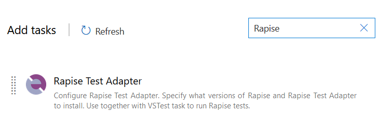

 In the task settings you may choose what versions of Rapise and Rapise Test Adapter to install.

 

 Proceed to the [next step](#visual-studio-test-platform-installer-task).

### Rapise Installation Task

!!! important
    Skip this section if you are using [Rapise Test Adapter Task](#rapise-test-adapter-task)

In order to run Rapise tests on a Microsoft-hosted Windows Agent you need to configure Rapise Installation task. If you are running on a self-hosted Windows Agent you may install Rapise manually once and use it in every pipeline run.

Download and place this PowerShell script to your Git repository:

[RapiseInstall.ps1](https://github.com/Inflectra/rapise-testadapter/blob/master/RapiseInstall.ps1)

This script downloads and installs Rapise. It also installs Rapise extension into Chrome browser. In your pipeline add a PowerShell task to execute this script. Pass Rapise version to install as a parameter.

??? example "Classic UI"
    

??? example "YAML"

    ```yaml
    steps:
    - task: PowerShell@2
    displayName: 'Install Rapise'
    inputs:
        targetType: filePath
        filePath: ./RapiseInstall.ps1
        arguments: '-RapiseVersion "6.5.20.21"'
    ```

### Rapise.TestAdapter

!!! important
    Skip this section if you are using [Rapise Test Adapter Task](#rapise-test-adapter-task)

To run Rapise tests with a [Visual Studio Test](https://docs.microsoft.com/en-us/azure/devops/pipelines/tasks/test/vstest?view=azure-devops) task install [Rapise.TestAdapter NuGet package](https://www.nuget.org/packages/Rapise.TestAdapter/).

#### NuGet Tool Installer

First you need to install NuGet itself. Add [NuGet tool installer](https://docs.microsoft.com/en-us/azure/devops/pipelines/tasks/tool/nuget?view=azure-devops) task.

??? example "Classic UI"
    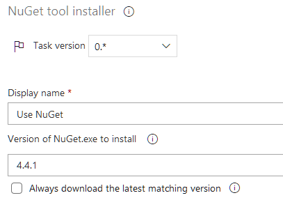

??? example "YAML"

    ```yaml
    steps:
    - task: NuGetToolInstaller@0
    displayName: 'Use NuGet'
    inputs:
        versionSpec: 4.4.1
    ```

#### Rapise.TestAdapter NuGet Package

 Then add [NuGet](https://docs.microsoft.com/en-us/azure/devops/pipelines/tasks/package/nuget?view=azure-devops) task. Set **command** to `custom` and specify the command line:

```
install Rapise.TestAdapter -Version $(RapiseTestAdapterVersion)
```

??? example "Classic UI"
    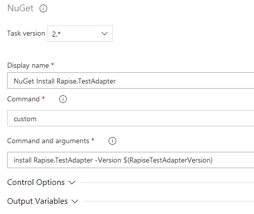

??? example "YAML"

    ```yaml
    steps:
    - task: NuGetCommand@2
      displayName: 'NuGet Install Rapise.TestAdapter'
      inputs:
        command: custom
        arguments: 'install Rapise.TestAdapter -Version $(RapiseTestAdapterVersion)'
    ```    

In the pipeline settings set **RapiseTestAdapterVersion** variable to the Rapise.TestAdapter version you want to install (e.g. 1.0.11).

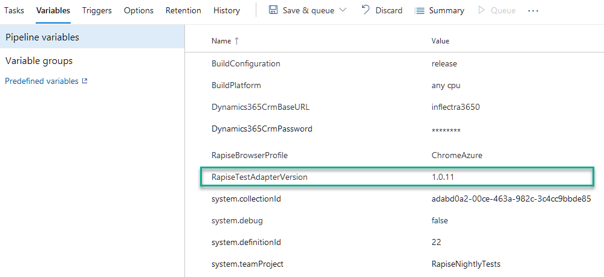

The task will install Rapise.TestAdapter into
    
```
$(Build.Repository.LocalPath)\Rapise.TestAdapter.$(RapiseTestAdapterVersion)\lib\net472
```

### Visual Studio Test Platform Installer Task

If you plan to run tests on a [Self-hosted Windows Agent](https://docs.microsoft.com/en-us/azure/devops/pipelines/agents/v2-windows) that does not have Visual Studio installed you need to add [Visual Studio Test Platform Installer](https://docs.microsoft.com/en-us/azure/devops/pipelines/tasks/tool/vstest-platform-tool-installer?view=azure-devops) task.

??? example "Classic UI"
    

??? example "YAML"

    ```yaml
    steps:
    - task: VisualStudioTestPlatformInstaller@1
    displayName: 'Visual Studio Test Platform Installer'
    inputs:
        versionSelector: latestStable
    ```

### Visual Studio Test Task

To run tests you need [Visual Studio Test](https://docs.microsoft.com/en-us/azure/devops/pipelines/tasks/test/vstest?view=azure-devops) task.

??? example "Classic UI"
    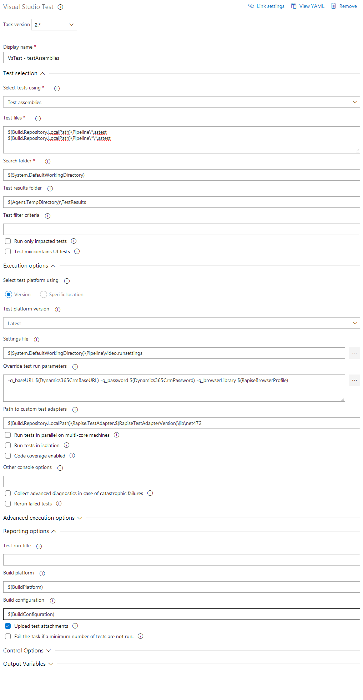

??? example "YAML"

    ```yaml
    steps:
    - task: VSTest@2
      displayName: 'VsTest - Run Rapise Tests'
      inputs:
        testAssemblyVer2: |
         $(Build.Repository.LocalPath)\Tests\*.sstest
         $(Build.Repository.LocalPath)\Tests\*\*.sstest
        runSettingsFile: '$(System.DefaultWorkingDirectory)\Pipeline\azure.runsettings'
        overrideTestrunParameters: '-g_baseURL $(Dynamics365CrmBaseURL) -g_password $(Dynamics365CrmPassword) -g_browserLibrary $(RapiseBrowserProfile)'
        pathtoCustomTestAdapters: '$(Build.Repository.LocalPath)\Rapise.TestAdapter.$(RapiseTestAdapterVersion)\lib\net472'
        platform: '$(BuildPlatform)'
        configuration: '$(BuildConfiguration)'
    ```

Make sure that path to custom test set adapters is set to

```
$(Build.Repository.LocalPath)\Rapise.TestAdapter.$(RapiseTestAdapterVersion)\lib\net472
```

Specify patterns to search for `*.sstest` files in the **test files** section (`testAssemblyVer2` in YAML).

If you added Visual Studio Test Platform Installer task on the previous step do not forget to set **Test platform version** to `Installed by Tools Installer` (`vsTestVersion: toolsInstaller` in YAML).


!!! tip
    Rapise.TestAdapter also supports filtering, parameters and .runsettings files (specified via Visual Studio Test task options).
   
#### Test Filter Cirteria

Rapise.TestAdapter supports [filter criteria](https://github.com/Microsoft/vstest-docs/blob/master/docs/filter.md) based on FullyQualifiedName test property (equals to  *.sstest file name). To specify a filter set `testFiltercriteria` in YAML or `Test filter criteria` in the Classic UI task editor.

Example:

```
FullyQualifiedName~LIS
```

#### Parameters

Parameters can be set via

- .runsettings file,
- `overrideTestrunParameters` YAML option or
- **Override test run parameters** field in the Classic UI task editor.

!!! note
    Parameter names must be prefixed with **g_**.

Example:

```
-g_baseURL $(Dynamics365CrmBaseURL) -g_password $(Dynamics365CrmPassword) -g_browserLibrary $(RapiseBrowserProfile)
```

!!! note
    $(name) - references a pipeline variable

#### .runsettings

[.runsettings file](https://docs.microsoft.com/en-us/visualstudio/test/configure-unit-tests-by-using-a-dot-runsettings-file) is used to pass parameters and to enable [video recorder](https://docs.microsoft.com/en-us/visualstudio/test/configure-unit-tests-by-using-a-dot-runsettings-file?view=vs-2019#videorecorder-data-collector).

Example:

```xml
<?xml version="1.0" encoding="utf-8"?>
<RunSettings>
  <!-- Parameters used by tests at runtime -->
  <TestRunParameters>
    <Parameter name="g_browserLibrary" value="Chrome" />
  </TestRunParameters>

  <DataCollectionRunSettings>
    <DataCollectors>
      <DataCollector uri="datacollector://microsoft/VideoRecorder/1.0" assemblyQualifiedName="Microsoft.VisualStudio.TestTools.DataCollection.VideoRecorder.VideoRecorderDataCollector, Microsoft.VisualStudio.TestTools.DataCollection.VideoRecorder, Version=15.0.0.0, Culture=neutral, PublicKeyToken=b03f5f7f11d50a3a" friendlyName="video" enabled="True">
        <Configuration>
          <MediaRecorder sendRecordedMediaForPassedTestCase="true"  xmlns="">           
            <ScreenCaptureVideo bitRate="512" frameRate="2" quality="20" />
          </MediaRecorder>
        </Configuration>
      </DataCollector>
    </DataCollectors>
  </DataCollectionRunSettings>  
  
</RunSettings>
```

### Publish Test Results

To publish test results (for later review and downloading) use [Publish Build Artifacts](https://docs.microsoft.com/en-us/azure/devops/pipelines/tasks/utility/publish-build-artifacts?view=azure-devops) task. Execution results are copied to `$(Agent.TempDirectory)\TestResults`.

??? example "Classic UI"
    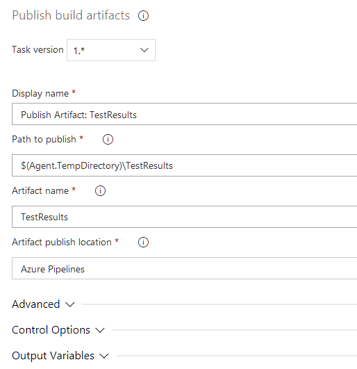

??? example "YAML"
   
    ```yaml
    steps:
    - task: PublishBuildArtifacts@1
      displayName: 'Publish Artifact: TestResults'
      inputs:
        PathtoPublish: '$(Agent.TempDirectory)\TestResults'
        ArtifactName: TestResults
    ```

### Pipeline Example

As a result of pipeline configuration you may end up with something like this:

??? example "Classic UI"
    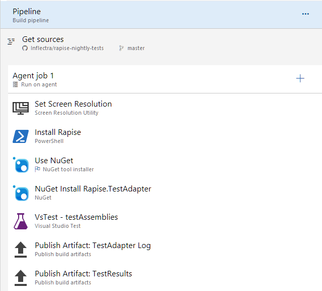

### Self-hosted Windows Agents

Azure DevOps can run tests in a hosted environment as well. If you plan to run tests inside your computer network download and connect [Self-hosted Windows Agent](https://docs.microsoft.com/en-us/azure/devops/pipelines/agents/v2-windows).

### Logs and Reports

After every execution of the Visual Studio Test task you will get logs and reports.

??? example "Log"
    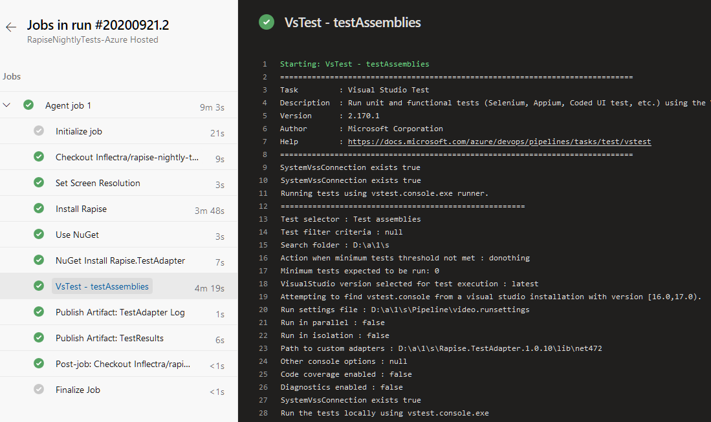

??? example "Summary"
    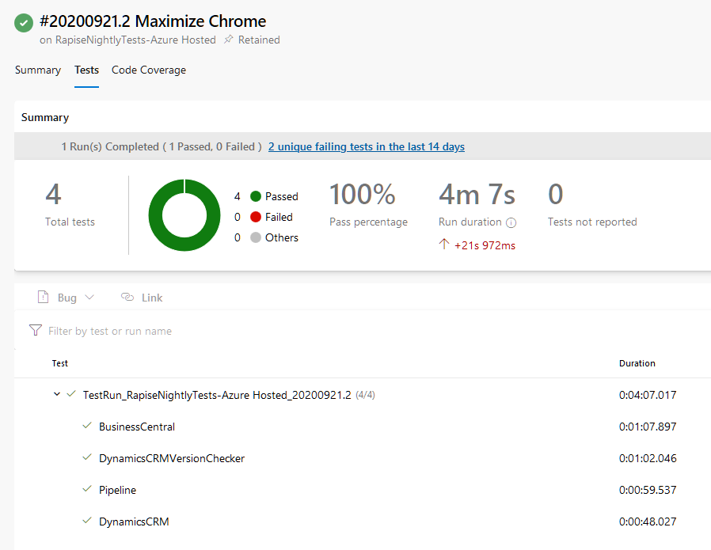

You can also see an individual report of a test (with attachments).

??? example "Attachments"
    

Attachments include reports in Test Anything Protocol (TAP) and Rapise (TRP) formats, output and error logs and video recording (if enabled in .runsettings).

## Run Tests with VSTest.Console.exe

It is also possible to run Rapise tests on a VM that has [VSTest.Console.exe](https://docs.microsoft.com/en-us/visualstudio/test/vstest-console-options?view=vs-2019) installed.

#### Setup Microsoft.TestPlatform on a VM

Let's assume that the working folder is `C:\Tools`.

1. Download and install [NuGet](https://www.nuget.org/downloads).
2. Install [Microsoft.TestPlatform](https://www.nuget.org/packages/Microsoft.TestPlatform) with a command
    ```
    nuget install Microsoft.TestPlatform
    ```
Find `VSTest.Console.exe` in `C:\Tools\Microsoft.TestPlatform.16.7.1\tools\net451\Common7\IDE\Extensions\TestPlatform`. Add this folder to the PATH environment variable.

3. Install Rapise.TestAdapter

    ```
    nuget install Rapise.TestAdapter
    ```
    
4. You may now create a .cmd file and put it near Rapise tests. E.g.

    ```
    vstest.console.exe /TestAdapterPath:C:\Tools\Rapise.TestAdapter.1.0.11\lib\net472 /Settings:local.runsettings /TestCaseFilter:FullyQualifiedName~LIS *\*.sstest
    ```

## Parallel Execution

Two levels of parallelism are possible. They may be used independently and combined together as well.

### Run Tests in Parallel

Visual Studio Test Platform can run tests in parallel. Users of vstest.console.exe will recognize this as the [/Parallel switch](https://docs.microsoft.com/en-us/visualstudio/test/vstest-console-options). It does so by launching a test host process on each available core, and handing it tests to execute.

Here is how to set this switch in an Azure Pipeline (Visual Studio Test task).

??? example "Classic UI"
    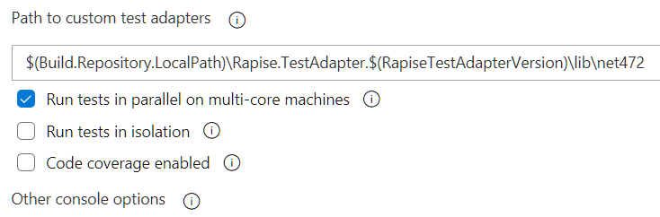

??? example "YAML"
    ```yaml
    steps:
    - task: VSTest@2
    displayName: 'VsTest - testAssemblies'
    inputs:
        testAssemblyVer2: '*\*.sstest'
        overrideTestrunParameters: '-g_browserLibrary "$(RapiseBrowserProfile)"'
        pathtoCustomTestAdapters: '$(Build.Repository.LocalPath)\Rapise.TestAdapter.$(RapiseTestAdapterVersion)\lib\net472'
        runInParallel: true
        platform: '$(BuildPlatform)'
        configuration: '$(BuildConfiguration)'
    ```

This way of parallel execution is good for running API tests and Web tests (provided that [Selenium profiles](selenium_settings_dialog.md) are used)

### Multi-Configuration Testing

The Visual Studio Test task supports running tests in parallel across multiple agents (or machines). To run multiple jobs using multi-configuration option, you identify variables named multipliers, and specify a list of values for each multiplier. A separate job is run for each value combination. Define one or more variables on the Variables tab of the pipeline or in a variable group. Each variable, known in this context as a multiplier variable, must be defined as a comma-delimited list of the values you want to pass individually to the agents.

Let's assume we want to run same set of tests on different versions of browsers. Here is the example.

??? example "Multiplier Configuration"
    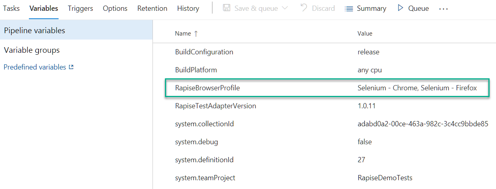
    

## Run Tests on Azure and Report to Spira

If you plan to use Azure VMs to run tests and want to see the results in Spira check out this section. In the pipeline you need at least three steps:

- Get tests from Git repository
- [Install Rapise](#rapise-installation-task)
- Run a Test Set defined in Spira (see below)

To run a test set you need a [Command line task](https://docs.microsoft.com/en-us/azure/devops/pipelines/tasks/utility/command-line). This task should run RapiseLauncher with parameters:

- -config:\[path to [RepositoryConnection.xml](/Guide/spiratest_integration/#command-line-arguments)\]
- -project:\[project id\]
- -testset: \[\test set id]
- -minimized

Also set a GITROOT environment variable. It should point to the root of the Git repository.

!!! note
    Tests must be [linked to Spira Test Cases](/Guide/git_integration/#linking-new-test-to-spira)

??? example "Classic UI"
    

??? example "YAML"
    ```yaml
    steps:
    - script: |
    echo Running  TX139

    "c:\Program Files (x86)\Inflectra\Rapise\bin\RapiseLauncher.exe" -config:.\GitDemo\RepositoryConnection.xml -project:90 -testset:139 -minimized
    
    echo Done
    
    displayName: 'Run TX139'
    env:
        GITROOT: $(Build.SourcesDirectory)
    ```

## See Also

- [Demo of Azure DevOps Integration (video)](https://www.youtube.com/watch?v=BIgOIxkZ5Hk&t=507s)
- [Azure DevOps](https://azure.microsoft.com/en-us/services/devops/)
- [Rapise.TestAdapter on GitHub](https://github.com/Inflectra/rapise-testadapter)
- [Rapise.TestAdapter NuGet package](https://www.nuget.org/packages/Rapise.TestAdapter/)
- [Run tests in parallel using the Visual Studio Test task](https://docs.microsoft.com/en-us/azure/devops/pipelines/test/parallel-testing-vstest?view=azure-devops)
- [Multi-configuration testing](https://docs.microsoft.com/en-us/azure/devops/pipelines/process/phases?view=azure-devops&tabs=classic#multi-job-configuration)