# RapiseLauncher Extension for Azure DevOps

This section explains how to execute Rapise Spira Test Sets in [Azure DevOps pipelines](https://docs.microsoft.com/en-us/azure/devops/pipelines/?view=azure-devops) using the [RapiseLauncher](spiratest_integration.md#using-rapiselauncher).

## Azure DevOps

We assume that Rapise tests are stored in a [SpiraTeams](http://spiradoc.inflectra.com/). Here we plan to configure a build pipeline for executing a SpiraTeam [Test Set](http://spiradoc.inflectra.com/Spira-User-Manual/Test-Set-Management/#test-set-details) on a [Microsoft-hosted](https://docs.microsoft.com/en-us/azure/devops/pipelines/agents/hosted?view=azure-devops&tabs=yaml) agent.

The benefit of the Microsoft-hosted agent is its configuration - it has latest version of web browsers, with relevant version of webdriver connectors. Everything is configured for the test run (updates and popups disabled, etc). RapiseLauncher may be used to execute Desktop UI tests, API tests, mobile tests and web tests. For web tests it is possible to use Rapise own Chrome extension, IE 11 or any [selenium webdriver](selenium_webdriver.md)-based target. 

The same extension may be used for launching tests in [self-hosted](https://docs.microsoft.com/en-us/azure/devops/pipelines/agents/v2-windows?view=azure-devops) Windows agents.

Although in minimal configuration just **RapiseLauncher** step is enough, the pipeline definition may also include build, deploy or download of the AUT before the test execution. The results of test execution are then stored into the SpiraTeam. 

Once configured and executed the extension does the following:

1. Automatically download and install the **RapiseLauncher**.
2. Downloads test files from the SpiraTeam.
3. Execute the test set.
4. Publish execution results, videos and logs back to SpiraTeam, so they are attached to the test run.

The whole configuration process contains the following steps:

1. Add Rapise extension to the organization using Visual Studio Marketplace.
2. Configure **SpiraTeam** connection Point for the project.
3. Define a pipeline.
4. Add **RapiseLauncher** task to the pipeline.
5. Configure a pipeline definition for executing tests via **RapiseLauncher**.

### Step 1: Install Marketplace Extension for the Organization

In Azure DevOps go to **Organization settings**:

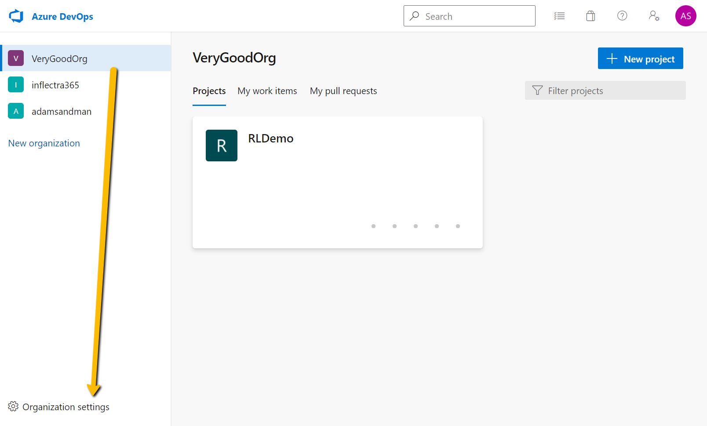

Choose **Extensions** and then **Browse Marketplace**:


Type `Rapise', choose 'RapiseLauncher' extension:


Get it:

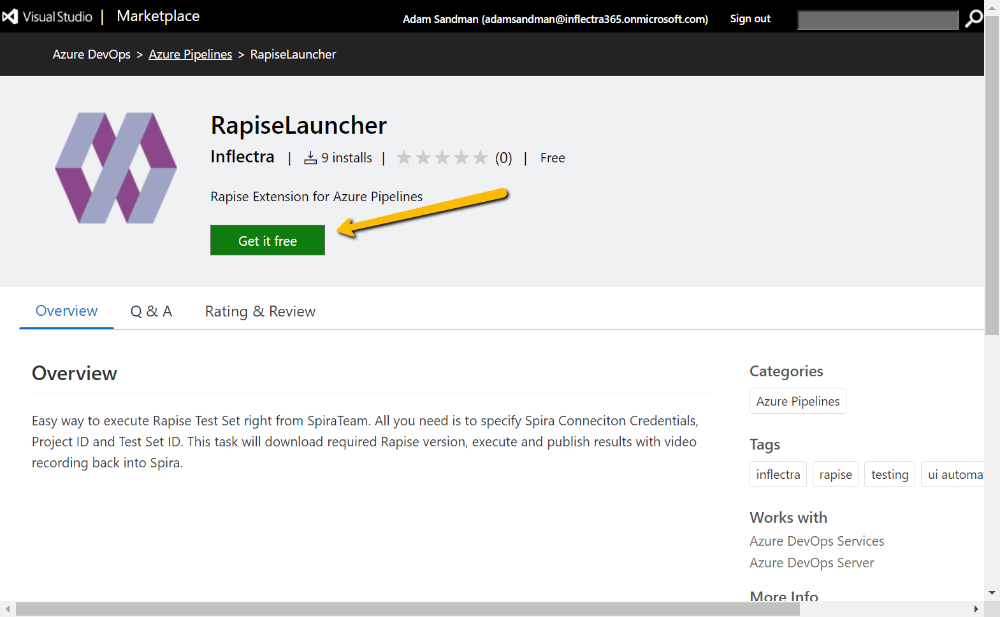

And install it:

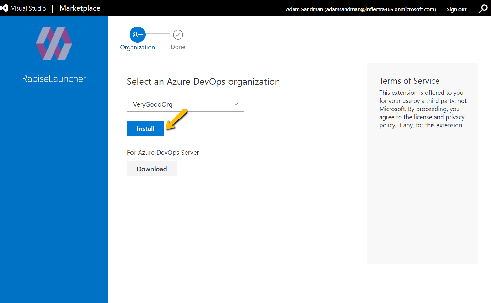

Finally it shows up in the list of installed extensions:

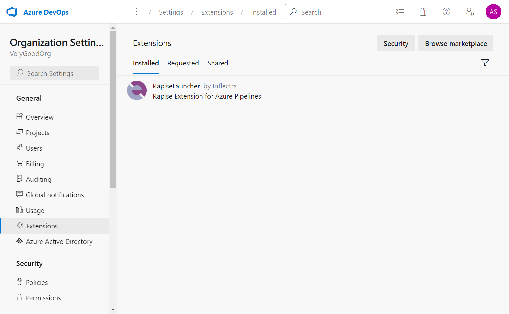

### Step 2: Connect Project to SpiraTeam

Now define a service connection. It is a connection details for **SpiraTeam** used later to gather test set information. So we need ot open **Project settings**:


Go to **Service Connections**:

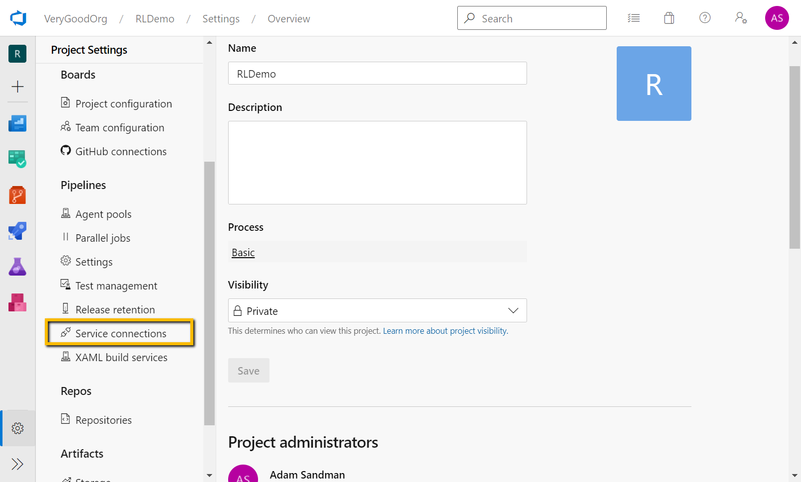

And **Create service connection**:

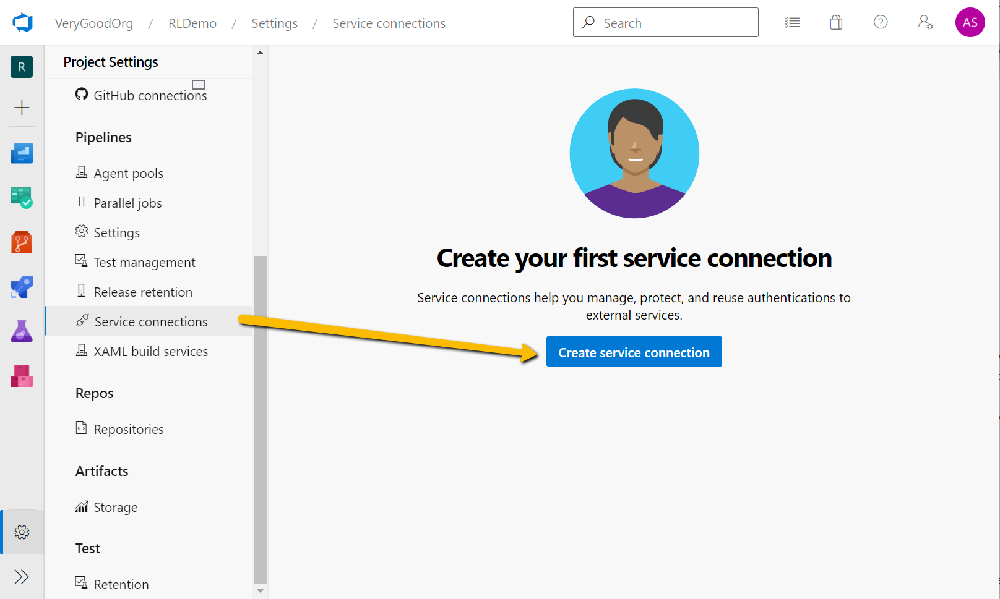

Choose **Spira service connection** connection type (this type is added by the installed marketplace extension) and press **Next**:


Now define connection details: SpiraTeam **Server Url**, **Username** and [API Key](http://spiradoc.inflectra.com/HowTo-Guides/Users-profile-management/#how-to-get-or-make-your-rss-token-or-api-key):
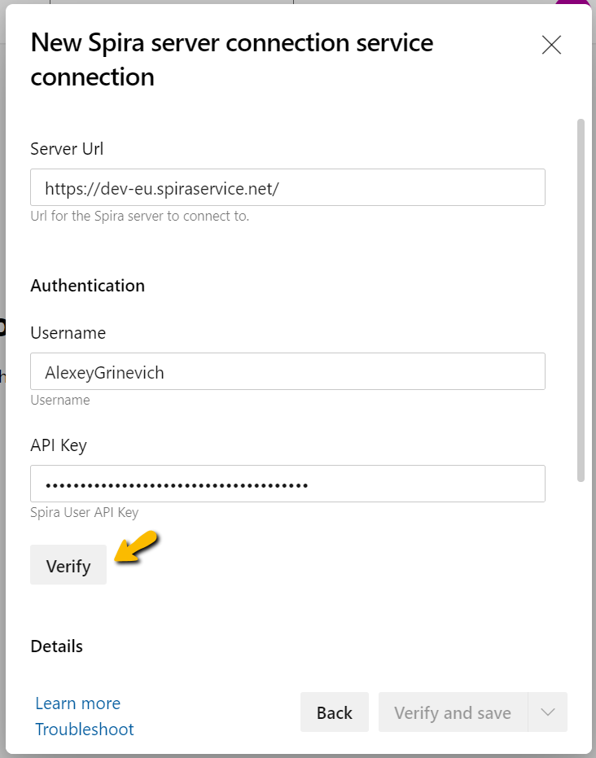

Then **Verify** it and give a **Service connection name**:


Finally, the connection shows up in the list:

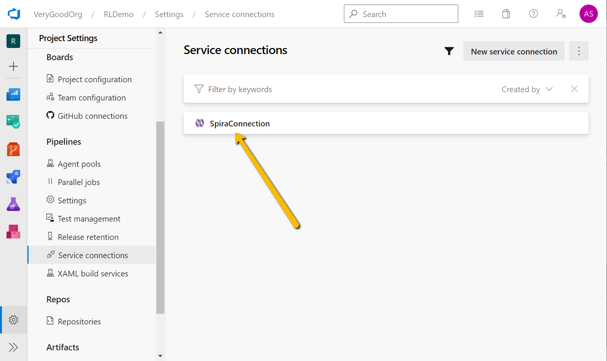

### Step 3: Define a Pipeline

Defining a pipeline means telling the DevOps where to store the pipeline definition, where get the tests, what VM to use for execution and what parameters to pass.

#### Define a Repository
In the case that you don't have a repository, just define one for the given project:
<!-- /* cSpell:disable */ -->

<!-- /* cSpell:enable */ -->
If you have a repo, then you may skip this step and use your repository connection on the next step.

#### Create a Pipeline Definition

Go to your project, expand **Pipelines** and choose **Create Pipeline**:

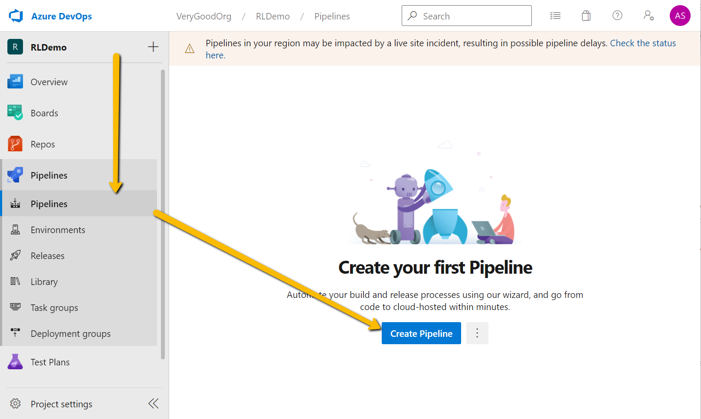

Select GIT repository type

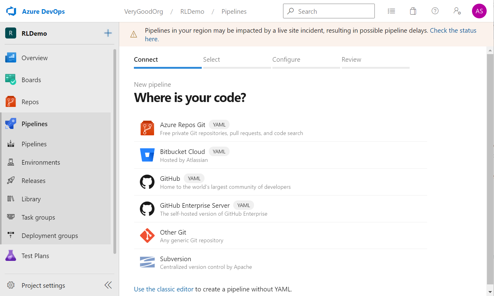

And repository itself:


Here we are creating new pipeline. But you may use existing one and just add test execution task to it.

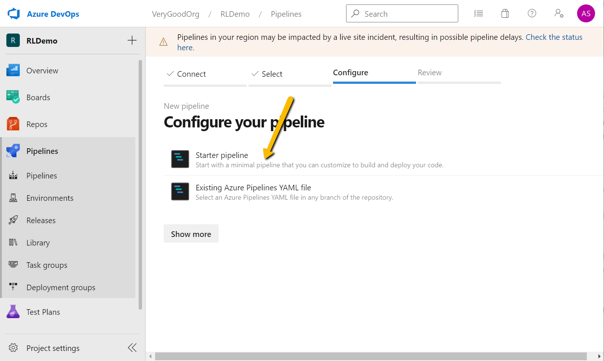

**RapiseLauncher** requires **Windows** host. You may use [Microsoft Hosted agent](https://docs.microsoft.com/en-us/azure/devops/pipelines/agents/hosted?view=azure-devops&tabs=yaml), or set an agent on your own VM or physical Windows machine. 


### Step 4: Add RapiseLauncher Task

Then you may use Assistant to configure the task.


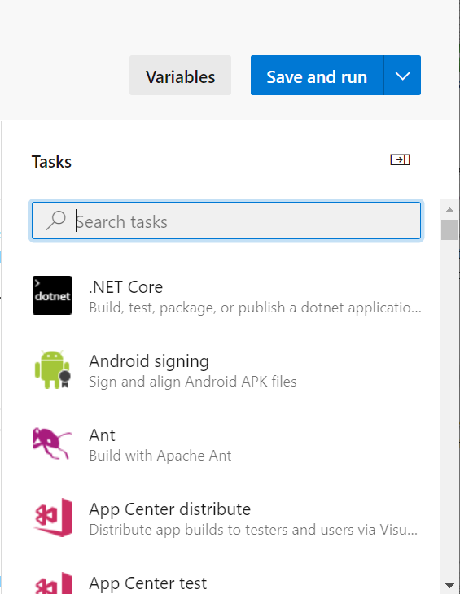

And filter by word 'Rapise'. We need a task **Run Rapise Test Set**:

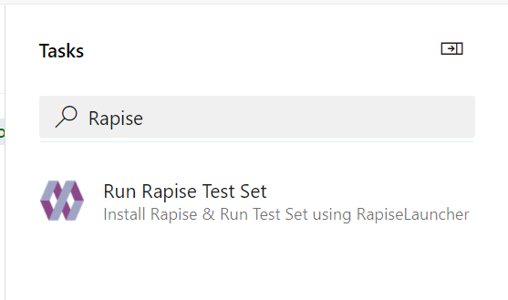

Now we need to fill task execution parameters as follows:

* **SpiraTeam** contains information for finding a test set
  * **Spira service/server end point** - choose spira connection defined earlier from the dropdown.
    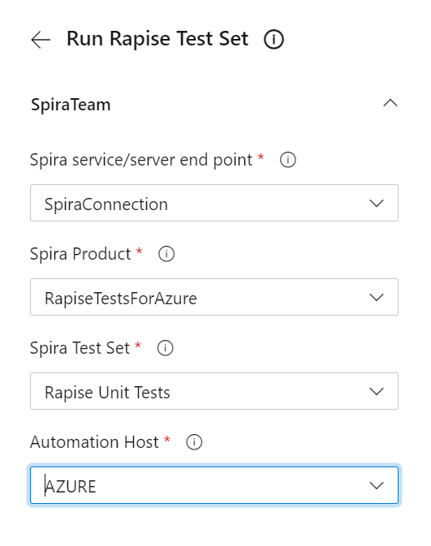
  * **Spira Product**
  
  * **Spira Test Set**
  
  * **Automation Host**

* **Execution Options**
  * **Rapise Needs to Be Installed** - if your VM is spawned for each test execution (i.e. you use *Microsoft-hosted Agent*), then the task may install it. You don't need to install Rapise if you use own agent and install in advance. Also you may have more than one **Run Rapise Test Set** tasks in your pipeline. In this case only the first one may need to install Rapise.
    * **Rapise Version** - we recommend to specify the same version that you used to create tests. I.e. 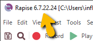

* **Advanced Execution Options** 

  * **Set Screen Resolution** specify one of standard screen resolutions for test execution. It should be one of standard values (i.e. 1024x768, 1920x1080, etc., supported by the current execution host). Bigger resolution - more details on screenshots and video and more space is consumed by the recordings. 
    * **Width**
    * **Height**

  * **Record Video of Execution** a `ScreenCapture.wmv` will be generated and saved as a [Test Run attachment](https://spiradoc.inflectra.com/Spira-User-Manual/Test-Run-Management/#attachments).
    * **Video Recording Options** set of [options](spiratest_integration.md#record-playback-videos) for `Microsoft.TestPlatform` video recorder.

  * **Publish RapiseLauncher Log** when enabled, RapiseLauncher log is attached to pipeline build log.

    

  * **GITROOT** is only needed when your tests are stored in GIT and you check them out [earlier](git_integration.md#checkout-externally) in the pipeline or even before launching the pipeline.


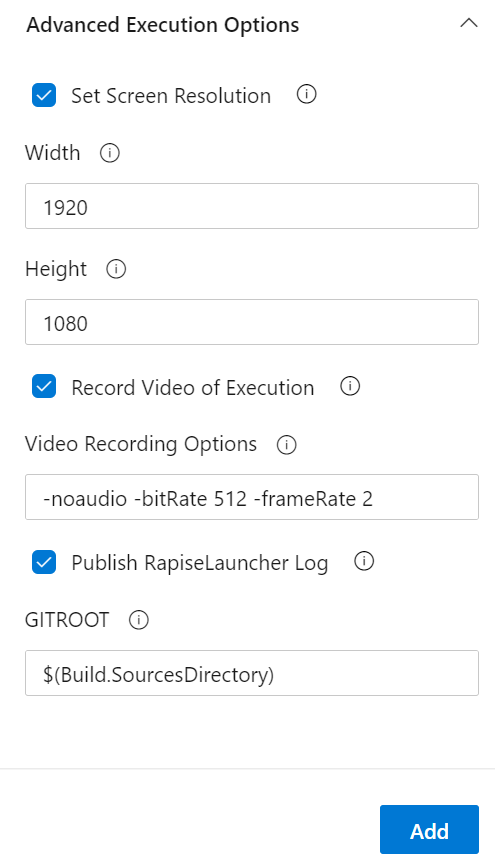

Finally press **Add**. The task should show up in the `steps:` section of the yaml description:

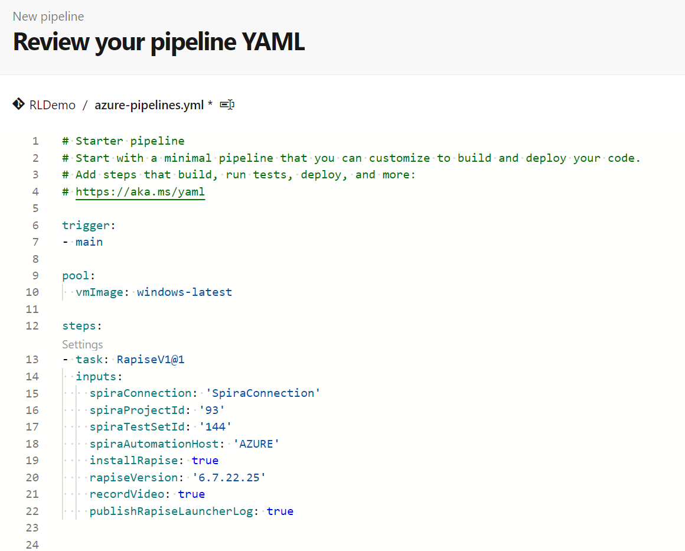

You may then tweak its configuration directly using the text editor.

```yaml
trigger:
- main

pool:
  vmImage: windows-latest

steps:
- task: RapiseLauncherTask@1
  inputs:
    spiraConnection: 'SpiraConnection'
    spiraProjectId: '93'
    spiraTestSetId: '145'
    spiraAutomationHost: 'AZURE'
    installRapise: true
    rapiseVersion: '6.7.22.25'
    setScreenSize: true
    screenWidth: 1920
    screenHeight: 1080
    recordVideo: true
```
And then execute.

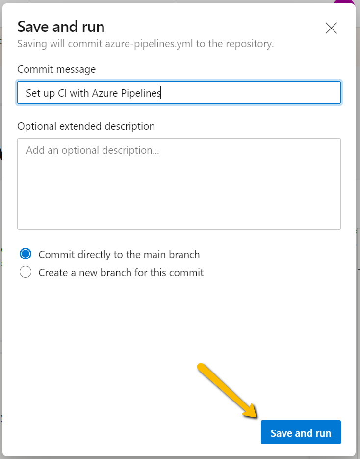


### Step 5: Pipeline Execution Results

You may see history of pipeline job runs and test execution logs.

From the pipeline runs history you may pick up any run:

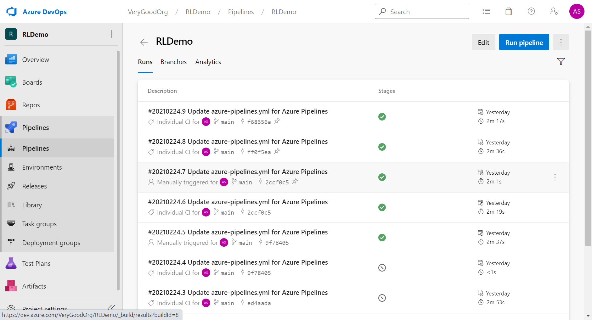

And select the Job:


The job run contains information of each pipeline step. **RapiseLauncher** is a step doing Rapise installation and test set launch.


Also you may find testing reports and videos in the **SpiraTeam**:

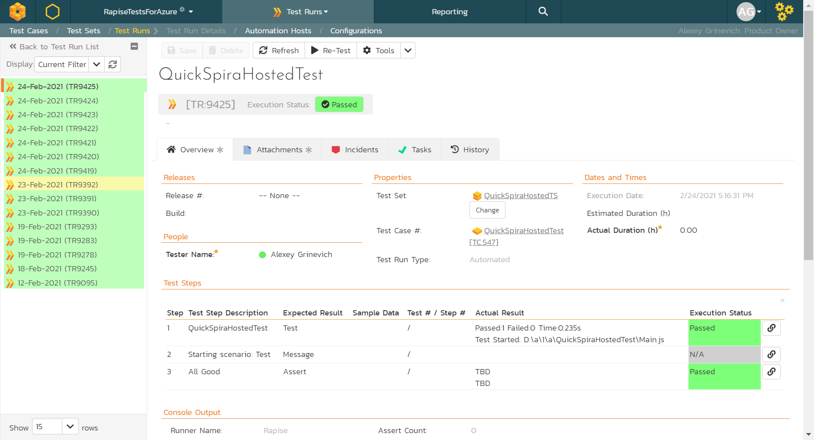

Log files and videos are in the Test Run **Attachments** tab:

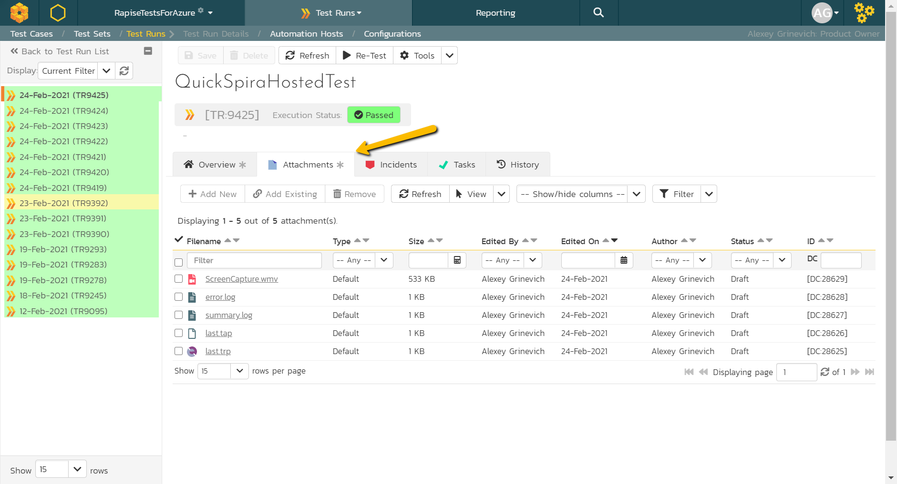


## See Also

- [Azure DevOps](https://azure.microsoft.com/en-us/services/devops/)
- [RapiseLauncher Extension in VisualStudio Marketplace](https://marketplace.visualstudio.com/items?itemName=EvilDauphin.inflectra-rapise-azure)
- [Rapise and Spira Integration](spiratest_integration.md)
- [Rapise and Git Integration](git_integration.md)
- [Rapise Test Adapter Task](vstest.md#rapise-test-adapter-task) for Azure DevOps.