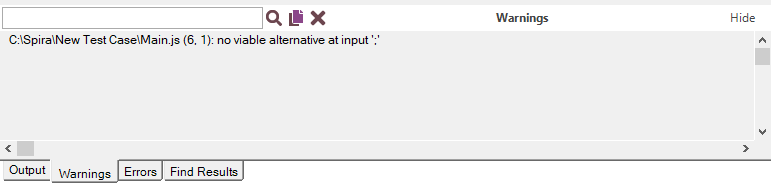
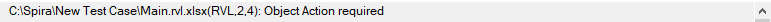

# Warning View

## Purpose

Displays syntax error messages as you edit JavaScript files.

## How to Open

The **Warning View** is hidden in the [Default Layout](restoring_the_default_layout.md). You can then show it using `View > Show > Output`.

The **Warning View** opens automatically when you are working with the source editor and a syntax error occurs. It also appears in RVL if you have an incomplete or invalid statement.

## Warning Message

Double-click an error message to navigate to the corresponding source line or RVL row.

## Widgets

*   The text box is a search box.
*   The icons from left to right are **Find Next Entry** 
, **Copy Selected** 
, **Clear All Text** .
*   The `Hide` tool on the right is used to collapse the entire bottom panel. You can then show it using `View > Show > Output`.

## See Also

*   [Syntax Checking](syntax_checking.md)