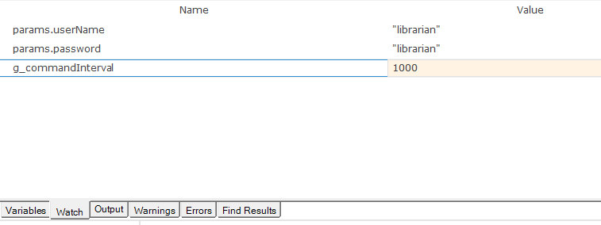

# Watch View

## Purpose

Used to input expressions and view their values as the script executes.

## How to Open

Begin [debugging](internal_debugger.md) a script. The **Watch View** opens automatically.

## Inputting an Expression

1. Click the blank line.

    

2. Enter the expression you wish to investigate, then press **Enter**.

    

## See Also

- [Internal Debugger](internal_debugger.md)