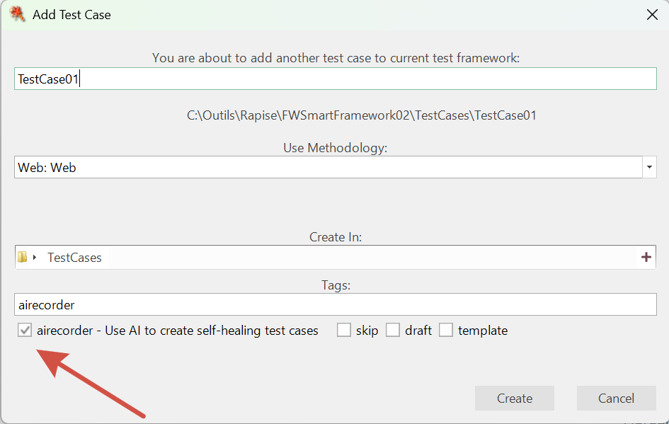

# Self-Healing

## Purpose

Self-Healing is a capability in Rapise that automatically recovers test execution when UI elements change or cannot be found using their original locators. Instead of failing immediately, tests attempt to locate objects using AI-based visual recognition and update the object repository with corrected locator information.

## How Self-Healing Works

When a test encounters an object that cannot be found:

1. **Initial Lookup Fails**: The standard locator does not match any element on screen.
2. **AI Recovery**: [SmartAction](./web_smart_action.md) uses the object's description to visually locate the element.
3. **Object Found**: If successful, the test continues and records the new locator.
4. **Patch Generation**: At test completion, a `.jspatch` file is created with all locator updates.
5. **Review and Apply**: The [JSON Patch Editor](./web_smart_action.md#applying-patches-with-the-json-patch-editor) allows you to review and apply changes to the repository.

## Enabling AI Recorder

The `airecorder` tag controls whether self-healing information is captured during recording. It can be enabled at the framework level or per test case.

### Framework Level

When creating a new testing framework, you can enable the Self-Healing AI Recorder by checking the corresponding option in the Web Test Setup dialog:


This sets the `airecorder` tag as the default for all new test cases added to the framework.

### Test Case Level

When adding a test case to the framework, the `airecorder` tag is shown in the Tags section. If it was enabled at the framework level, the tag is checked by default:



You can enable or disable the `airecorder` tag for each test case individually. The framework-level setting only affects the default state of the checkbox when creating a new test case. The tag can also be set or unset at any time after the test case is created.

## Recording with Self-Healing

When the `airecorder` tag is enabled, the recorder captures all interactions as usual and then post-processes each object, populating it with `smart_object_description` and `smart_actions` properties. These properties provide the AI with enough context to re-locate objects when their original locators fail.

The behavior of the recorded test depends on the recording mode.

### RVL Mode

When recording in RVL mode, the resulting test looks exactly the same as a regular RVL test. There are no visible changes to the test steps. Self-healing is invoked automatically at runtime: if an object cannot be located on the screen and it has `smart_*` properties in the repository, the RVL runtime calls [SmartAction](web_smart_action.md) behind the scenes to recover.

=== "Transcript"
    | Flow | Type   | Object    | Action    | ParamName | ParamType | ParamValue |
    | ---- | ------ | --------- | --------- | --------- | --------- | ---------- |
    |      | Action | Username  | DoSetText | txt       | string    | librarian  |
    |      | Action | Password  | DoSetText | txt       | string    | librarian  |
    |      | Action | LoginBtn  | DoClick   |           |           |            |

The test above is a standard RVL test. If `Username` cannot be found, the runtime checks for `smart_object_description` and `smart_actions` in the repository and uses them to locate the object via AI.

### JavaScript Mode

When recording in JavaScript mode, the recorded script uses `SmartAction` calls instead of the standard `SeS(...)` pattern:

```javascript
// Standard recording (without airecorder):
SeS('LoginBtn').DoClick();

// Recording with airecorder tag:
SmartAction('LoginBtn', 'DoClick', [],
    "The 'Log In' button located below the password field in the login form",
    "Click to submit login credentials"
);
```

The JavaScript mode has a distinct advantage: all information needed for self-healing is embedded directly in the script. Even if the object is completely missing from the repository, SmartAction can re-create it using the descriptions provided in the call. This makes JS-mode tests fully self-contained.

### Comparison

| Aspect | RVL Mode | JavaScript Mode |
| ------ | -------- | --------------- |
| Test appearance | Unchanged, standard RVL | Uses `SmartAction(...)` calls |
| Self-healing data | Stored in object repository (`smart_*` properties) | Embedded in the script itself |
| Object must exist in repository | Yes (with `smart_*` properties) | No, can be re-created from description |
| Suitable for AI test generation | No | Yes |

## AI-Assisted Test Generation

The JavaScript mode is particularly useful for automatic test generation. Because `SmartAction` calls are self-contained (object description and action description are inline), you can:

1. Record several test cases with the `airecorder` tag to build a set of examples.
2. Provide these examples to an AI chat or MCP tool.
3. Ask the AI to generate additional test cases based on your description of new scenarios.

The AI can produce valid `SmartAction` calls without needing access to the object repository, since all the context is present in the function arguments.

## Benefits

- **Reduced Maintenance**: Tests continue running despite minor UI changes.
- **Automatic Updates**: New locators are captured without manual re-recording.
- **Controlled Changes**: Review all updates before applying to the repository via the [JSON Patch Editor](./web_smart_action.md#applying-patches-with-the-json-patch-editor).
- **Detailed Logging**: Self-healing events are recorded in the test report.
- **Test Generation**: JS-mode SmartAction scripts serve as templates for AI-generated tests.

## See Also

- [SmartAction](./web_smart_action.md)
- [Object Learning](./object_learning.md)
- [Object Locator](./object_locator.md)
- [Recording](./recording.md)
