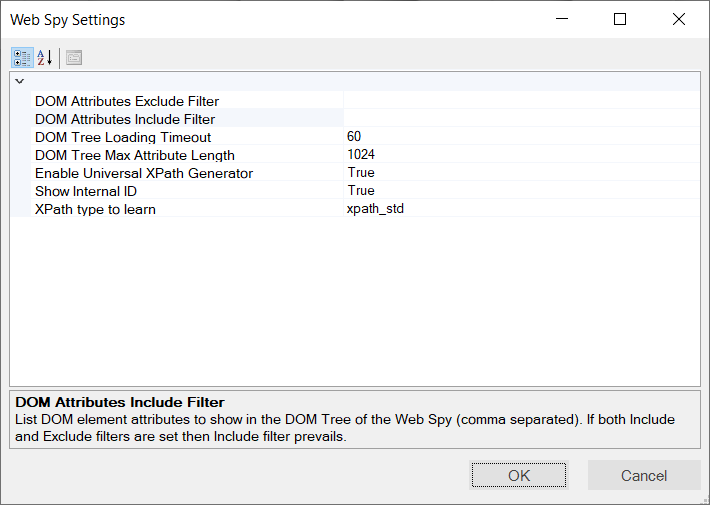

# Web Spy Settings Dialog

## Purpose

This dialog box displays the list of **Web Spy settings** and lets you change the behavior of the [Web Spy](../web-spy/) tool.

## How to Open

You can open this dialog box from two places:

- From the main Rapise menu `Settings > Web Spy`.
- From the [Web Spy](web_spy.md) tool when you click on the `Spy > Web Spy Settings` menu entry.

## General Settings

This dialog box has the following settings:

- **DOM Attributes Exclude Filter** - List the DOM element attributes to hide in the DOM Tree of the Web Spy (comma separated).
- **DOM Attributes Include Filter** - List the DOM element attributes to show in the DOM Tree of the Web Spy (comma separated). If both Include and Exclude filters are set then Include filter prevails.
- **DOM Tree Loading Timeout** - this lets you extend or reduce the amount of time (in seconds) that Rapise allows for loading the DOM Tree. This can be useful for slower web browsers and/or complex web sites with lots of nested frames. The default value is 10 seconds
- **DOM Tree Max Attribute Length** - this lets you specify the maximum length of the DOM attributes. The smaller the value, the fast the DOM tree will load. The default is 1024 characters.
- **Enable Universal XPath Generator** - If set to 'True' it creates the XPath and CSS selectors inside the Web Spy itself rather than relying on the web browser to do the generation. This is usually much faster (especially when using Internet Explorer).
- **Fast DOM Tree Build** - If set to 'True' then Rapise uses embedded code to get the DOM Tree when using either the Internet Explorer HTML library or any of the [Selenium libraries](../selenium-webdriver/).
- **Show Internal ID** - If 'True' then DOM Element pane shows internal ID of an element. This ID is purely internal to Rapise and is not part of the HTML web page or web application
- **XPath Type to Learn** - *This is described in the section below:*

## Different Types of XPath

The WebSpy has variety of options for XPath generation. Having a number of **different approaches for generating XPath** has its benefits. It gives Rapise incredible flexibility in getting the best results for different situations:

1. Sometimes we can recognize an element by its text. In such cases the simplest and most efficient XPath will use the node text.
2. Sometimes we have a regular structure (tables and grids) and it is better to have row and column indices inside the XPath.
3. Sometimes we deal with an application framework that uses custom attributes (e.g. aria, angular, bootstrap). So if we use them in our XPath then it will be cleaner and more robust.

The Web Spy currently supports the following different types of XPath:

- **xpath_full** - generates a fully featured XPath path using elements without attributes. This XPath starts with /html and goes through body and other elements towards the required node.
- **xpath_min** - generated with the attributes defined in the **DOM Attributes Include Filter**. If the include filter is empty, then it is produced with all attributes except those defined in the **DOM Attributes Exclude Filter**. For example, if the include filter contains the `widgetid` custom attribute then the generated XPath would be:

        //div[@widgetid="dojox_grid__View_1"]

- **xpath_indexed** - considers the node as nth of the same kind. For example, the page may contain 250 <a href=…> links across the
page, and we want to learn the link somewhere in the middle. In this case indexed XPath will be of the form `(//a)[123]`
- **xpath_std** - generated and minimized with use of pre-selected set of attributes:
    - align
    - class
    - style
    - size
    - tabindex
    - value
    - width
    - height
    - colspan
    - rowspan
    - cellspacing
    - cellpadding
    - border
    - on* (i.e. onclick, onblur and so on)

    Usually *it contains most common attributes: id, name, for, role.*

- **xpath_aria** - generated with the use of just the core `id/name` attributes plus the special aria attributes:
    - id
    - name
    - for
    - role
    - aria-*
- **xpath_text** - if possible, generated to match an HTML node simply by its text. For example, `<button>Refresh</button>` is
found by: `//button[normalize-space(text())="Refresh"]`. *In many cases this value is empty. This means that there are more than one node with such text.*
